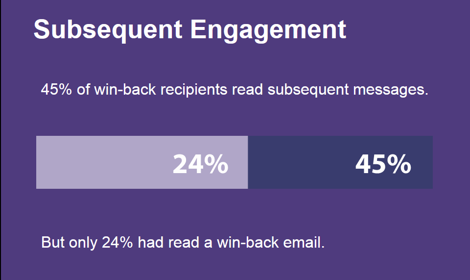
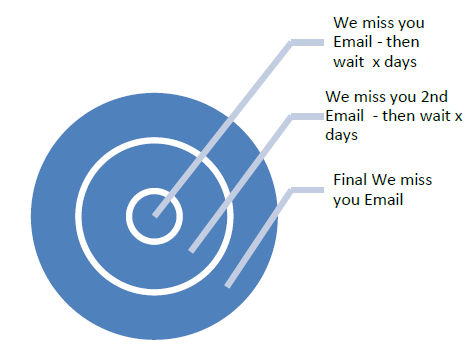
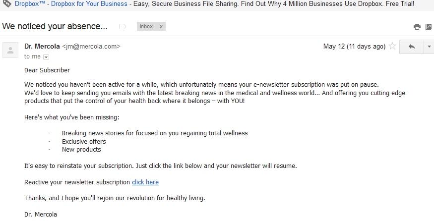
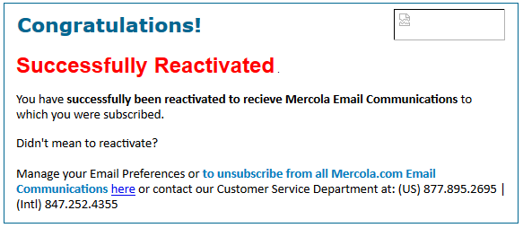

# Implementation{#implementation}

>[!CAUTION]
>
>This section is intended for deliverability experts only, to provide them with a global view of the implementation process and its main steps.
>
>Do not try, by any means, to perform any of these implementations yourselves. It is strictly reserved to the Adobe Campaign consultants.

This section presents the general guidelines and steps that should be followed while implementing deliverability. We will see how to maintain a healthy subscriber base and improve deliverability through re-engagement strategies. Maintaining a healthy subscriber base is one of the major aspects to ensure good and consistent delivery. Many deliverability issues arise from poor data practices and maintenance. One of the most common issues that marketers face today is inactive subscriber activity (also referred to as low or non-engagement) which can adversely affect delivery of email and low ROI.

>[!NOTE]
>
>For more information on re-engagement campaign strategies and Adobe’s Deliverability services, please contact your Deliverability Consultant, or speak with your Adobe Sales Agent.

## How do ISPs view non-engagement activity? {#how-do-isps-view-non-engagement-activity-}

For years, ISPs have used engagement feedback metrics from their users to decide where to place messages, or whether at all they should deliver them. User engagement consists of both positive and negative feedback and ISPs monitor both on a constant basis. Having no engagement is perhaps one of the main contributors of negative engagement. From a deliverability perspective, consistently sending campaigns to users who show no engagement can also lower the overall reputation of your IP address and domains.

ISPs such as AOL, Gmail, Microsoft and Yahoo! view non-engagement as unwanted email and start redirecting messages to the spam folder. Additionally, these subscribers may no longer own the email account and this can be used as a "recycled" spam trap. This means the address was invalid for some time and all messages are rejected. If your subscriber management system is not removing "hard bounced" addresses, it's very likely are mailing spam traps that lead to significant delivery issues.

## How should you approach inactivity? {#how-should-you-approach-inactivity-}

Fortunately, customers who use the Adobe Campaign platform can view inactivity within their instance by reviewing the open and click data according to the segment. Since non-engagement can hinder delivery, the first thought can be to just remove subscribers from the database. However, this may prove to be a wrong option in some cases. Therefore, a re-engagement (also known as a win back) strategy is the best recommendation to retain the subscribers that are interested in receiving mail, and gradually phase out those who no longer show activity.

## Do re-engagement campaigns really work? {#do-re-engagement-campaigns-really-work-}

According to a Return Path study, re-engagement campaigns came out with a result of 12% open rate compared to an average 14% for normal campaigns. Although only 24% of subscribers had read the re-engagement campaign, around 45% of them read the subsequent messages. 

## How do you create a re-engagement campaign? {#how-do-you-create-a-re-engagement-campaign-}

### Phase 1 {#phase-1}

* The first step is to identify subscribers who have very little to no open or click activity, and accordingly segment this group based on a set time frame. The thumb rule is to review subscribers who have not opened or clicked an email within the last 90 days. However, this varies according to the nature of the business (for example, seasonal sending).
* Another point to keep in mind while defining timeframes is that ISPs and blacklist companies consider engagement to be anywhere between 1.5 and 1.8 years. Additionally, behavioral activities such as purchases and website activity, or other touch points, such as preferences during the sign-up phase or first point of contact.

### Phase 2 {#phase-2}

* Once a segment is defined, the next step is to create a re-engagement campaign that caters to the subscriber according to the metrics that have been identified. Creating a subject line will help increase the interest of the subscriber. According to a Return Path study, subject lines and content that state "We miss you" generate higher response rates than "We want you back".
* An incentive can also be offered for re-engaging with the email. When considering offers with discounts, it is best to use dollar amounts versus percentages. Return Path also suggests doing this as it will incur higher response rates. Finally, performing A/B split tests to review response and success rates is also am useful option.

### Phase 3 {#phase-3}

The next step is to determine the frequency of the re-engagement campaign. Unlike reconfirmation messages, re-engagement campaigns are meant to win the subscriber back with a series of emails over time. The following example provides an example of the frequency.

Subscribers that engage with the campaign by following the open or click activity are added back to the engaged list of subscribers.

### Phase 4 {#phase-4}

* The next phase is to identify subscribers who continually show no activity and gradually reduce sending emails to them over a period of time. If there is no activity within the past year, it is good to put the subscribers email subscription on hold. Although they have showed no interest in the email content, there is always a last chance to have them re-activate their subscription by sending a one-time re-confirmation campaign.
* Re-confirmation campaigns are a good way to ask subscribers who are inactive for a long time if they want to remain on the subscription list. When creating the campaign, it is preferable to add a "click here" link so they can confirm the action and verify their address. This way, the action can be recorded in the database. Below is an example of a reconfirmation email:

  

  Once the subscriber has taken an action, a landing page with the confirmation of their re-subscription can be offered. Below is an example of the landing page:

  
