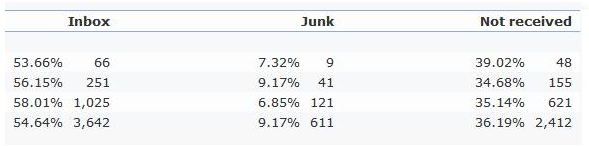

# Inbox monitoring{#inbox-monitoring}

This report is available from the **Supervision** universe, in the **Deliverability** section.

It gives an overview of the quality of emails sent over a given period of time. A benchmark comparison is also made with the other platforms that have subscribed to the deliverability service.

