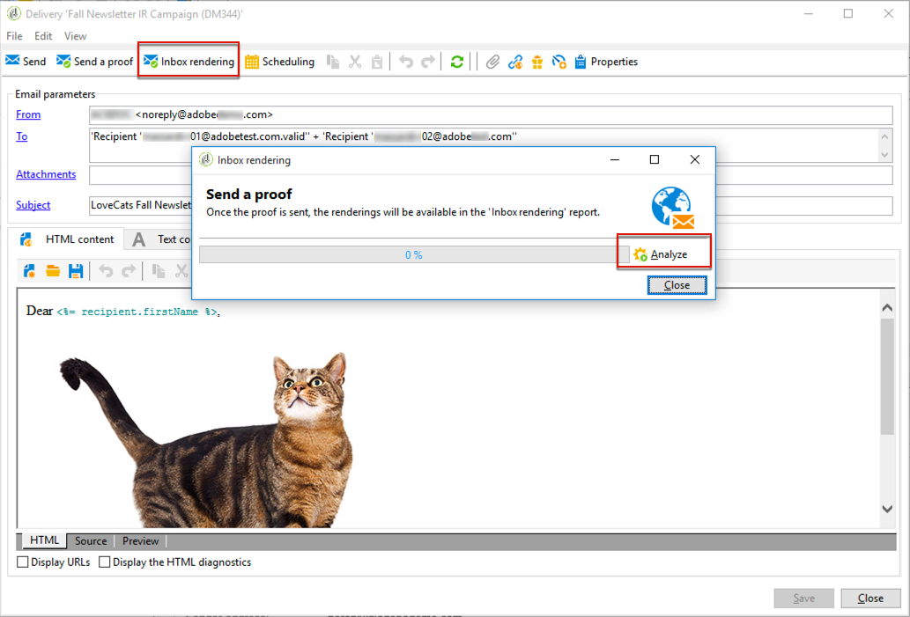
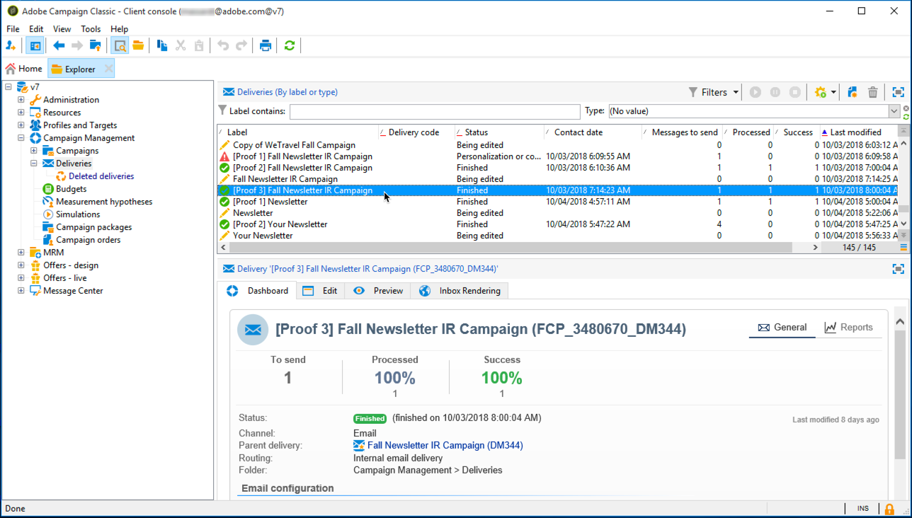
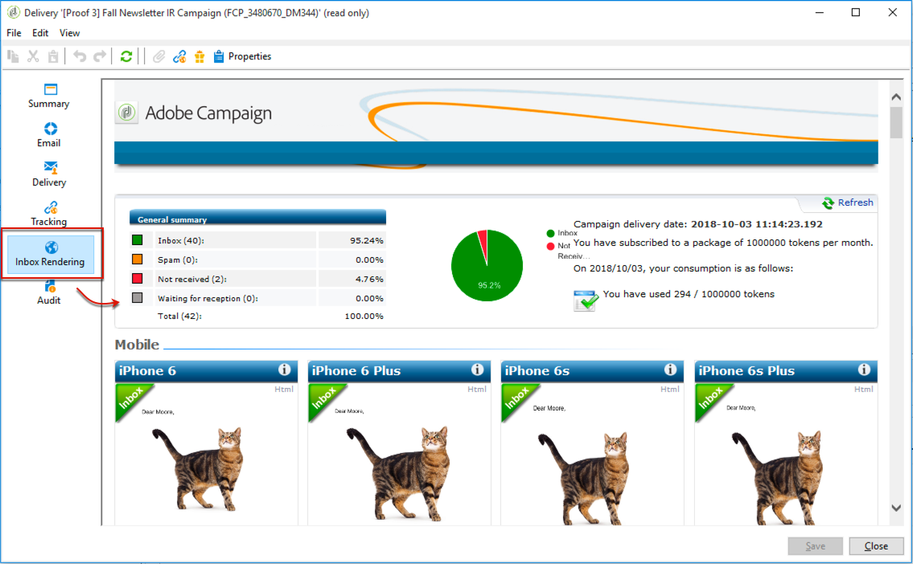
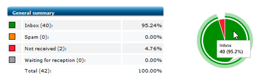
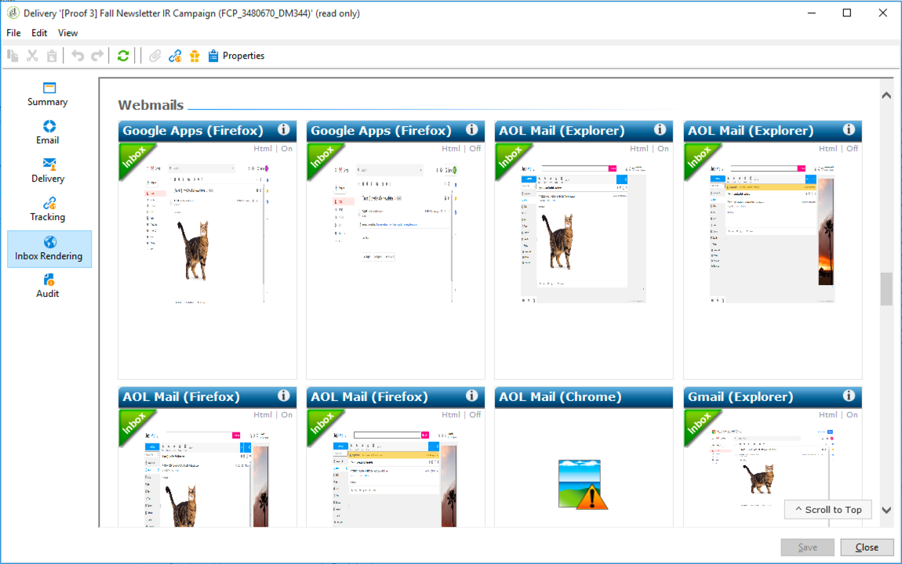
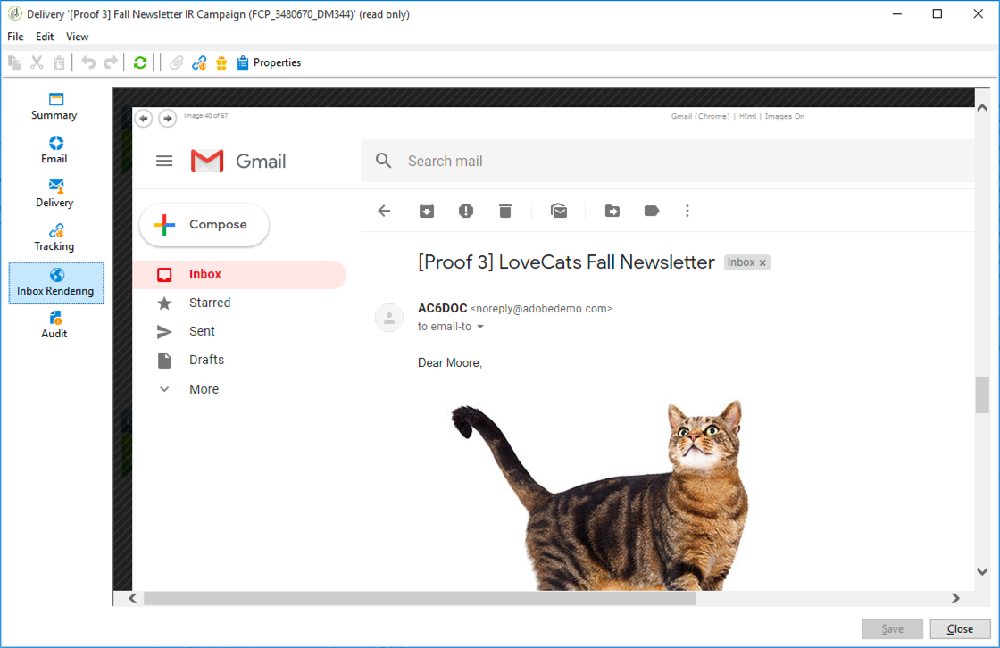

# Inbox rendering{#inbox-rendering}

## About inbox rendering {#about-inbox-rendering}

Before hitting the **Send** button, make sure that your message will be displayed to the recipients in an optimal way on a variety of web clients, web mails and devices.

To allow this, Adobe Campaign leverages the [Litmus](https://litmus.com/email-testing) web-based email testing solution to capture the renderings and make them available in a dedicated report. This enables you to preview the sent message in the different contexts in which it may be received and check the compatibility in major desktops and applications.

>[!NOTE]
>
>Inbox rendering is configured on your instance by Adobe technical support and consultants. For more information, contact your Adobe Account executive.

Litmus is a feature-rich email validation and previewing application. It allows email content creators to preview their message content in over 70 email renderers, such as the Gmail inbox or the Apple Mail client.

The mobile, messaging and webmail clients available for **Inbox rendering** in Adobe Campaign are listed on the [Litmus website](https://litmus.com/email-testing) (click **View all email clients**).

>[!NOTE]
>
>Inbox rendering is not necessary to test personalization in deliveries. Personalization can be checked with Adobe Campaign tools such as **[!UICONTROL Preview]** and [Proofs](../../delivery/using/key-steps-when-creating-a-delivery.md#sending-a-proof).

## About Litmus tokens {#about-litmus-tokens}

As Litmus is a third-party service, it works on a credit-per-usage model. Each time a user calls on the Litmus functionality, credit is deducted.

In Adobe Campaign, the credit corresponds to the number of available renderings (known as tokens).

>[!NOTE]
>
>The number of Litmus tokens available depends on the Campaign license that you purchased. Check your license agreement.

Each time you use the **[!UICONTROL Inbox rendering]** feature in a delivery, each rendering generated decreases your available tokens by one.

>[!CAUTION]
>
>Tokens account for each individual rendering and not for the whole Inbox rendering report, meaning that:  
>
>* Each time the Inbox rendering report is generated, one token per messaging client is deducted: one token for the Outlook 2000 rendering, one for the Outlook 2010 rendering, one for the Apple Mail 9 rendering, and so on.
>* For the same delivery, if you generate the Inbox rendering again, the number of available tokens is again decreased by the number of generated renderings.
>

The number of remaining available tokens is displayed in the **[!UICONTROL General summary]** of the [Inbox rendering report](../../delivery/using/inbox-rendering.md#inbox-rendering-report).

Typically, the Inbox rendering feature is used to test the HTML framework of a newly designed email. Each rendering requires approximately up to 70 tokens (depending on the number of environments generally tested on). However, in some cases you may require multiple inbox rendering reports to fully test your delivery. It could therefore take more tokens to complete several checks.

>[!NOTE]
>
>If you are a Litmus client, you can use your own Litmus account to provision and use Inbox rendering in Adobe Campaign. For more on this, contact your Adobe account executive.  
>Note that changing your Litmus credentials can cause authentication issues within Adobe Campaign.

## Accessing the inbox rendering report {#accessing-the-inbox-rendering-report}

Once you have created your email delivery and defined its content as well as the targeted population, follow the steps below.

For more on creating, designing and targeting a delivery, refer to [this section](../../delivery/using/about-email-channel.md).

1. On the top bar of the delivery, click the **[!UICONTROL Inbox rendering]** button.
1. Select **[!UICONTROL Analyze]** to start the capture process.

   

   A proof is sent. The rendering thumbnails can be accessed in that proof a few minutes after sending the emails. For more on sending proofs, refer to [this section](../../delivery/using/key-steps-when-creating-a-delivery.md#sending-a-proof).

1. After being sent, the proof appears in the delivery list. Double-click it.

   

1. Go to the **Inbox Rendering** tab of the proof.

   

   The Inbox rendering report is displayed.

## Inbox rendering report {#inbox-rendering-report}

This report displays the inbox renderings as they appear to the recipient. The renderings can differ based upon how the recipient opens the email delivery: in a browser, on a mobile device, or via an email application.

The **[!UICONTROL General summary]** presents the number of messages received, unwanted (spam), not received, or pending reception, as a list and through a graphical color-coded representation.

Hover over the chart to display the details for each color.

The body of the report is divided into three parts: **[!UICONTROL Mobile]** , **[!UICONTROL Messaging clients]** , and **[!UICONTROL Webmails]** . Scroll down the report to display all the renderings grouped into these three categories.

To get the details for each report, click the corresponding card. The rendering is displayed for the reception method selected.

