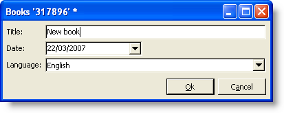
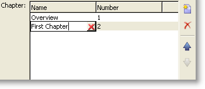
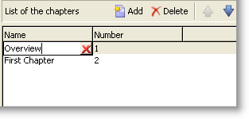
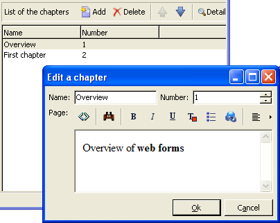
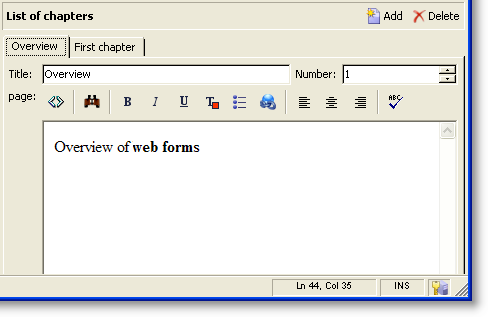
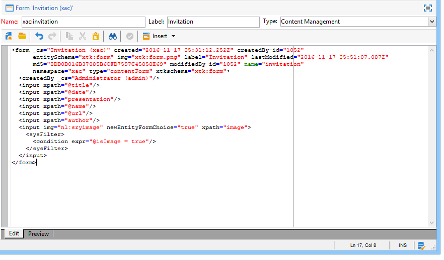
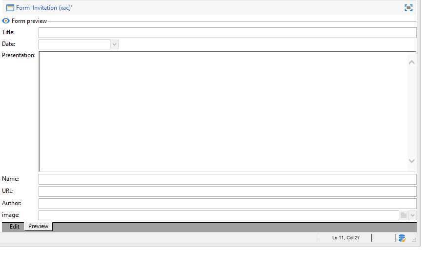

# Input forms{#input-forms}

Below are some general principles concerning the use of input forms in Adobe Campaign.

Forms are detailed in [this section](../../configuration/using/identifying-a-form.md).

## Form structure {#form-structure}

The XML document of an input form must contain the **`<form>`** root element with the **name** and **namespace** attributes to populate the form name and its namespace, respectively.

```
<form name="form_name" namespace="name_space">
...
</form>
```

By default, a form is associated with the data schema that has the same name and namespace. To associate a form with a different name, enter the schema key in the **entity-schema** attribute of the **`<form>`** element.

To illustrate the structure of an input form, we describe an interface based on our example schema "cus:book":



This is the corresponding input form:

```
<form name="book" namespace="cus" type="contentForm">
  <input xpath="@name"/>
  <input xpath="@date"/>
  <input xpath="@language"/>
</form>
```

The description of the edit elements begins with the **`<form>`** root element.

An edit control is entered in an **`<input>`** element with the **xpath** attribute containing the path of the field in its schema.

**Reminder concerning XPath syntax:**

The XPath language is used in Adobe Campaign to reference an element or attribute belonging to a data schema.

XPath is a syntax that lets you locate a node in the tree of an XML document.

Elements are designated by their name, and attributes are designated by the name preceded by the character "@".

Examples:

* **@date**: selects the attribute with the name "date"
* **chapter/@title**: selects the "title" attribute under the `<chapter>` element
* **../@date**: selects the date from the parent element of the current element

The edit control automatically adapts to the corresponding data type and uses the label defined in the schema.

By default, each field is displayed on one line and occupies all of the available space, depending on the type of data.

>[!CAUTION]
>
>The input form must reference a **type="contentForm"** attribute on the **`<form>`** element to automatically add the frame required for content to be input.

## Formatting {#formatting}

The arrangement of the controls relative to each other looks like the arrangement used in HTML tables, with the possibility of dividing a control into several columns, of interlacing elements, or of specifying the occupation of available space. Bear in mind, however, that formatting authorizes the distribution of proportions only; you cannot specify fixed dimensions for an object.

For more on this, refer to [this section](../../configuration/using/form-structure.md#formatting).

## List type controls {#list-type-controls}

To edit a collection element, you must use a list type control.

### Column list {#column-list}

This control displays an editable column list with a toolbar containing Add and Delete buttons.



```
<input xpath="chapter" type="list">
  <input xpath="@name"/>
  <input xpath="@number"/>
</input>
```

The list control must be filled in with the **type="list"** attribute, and the path of the list must refer to the collection element.

The columns are declared by the child **`<input>`** elements of the list.

>[!NOTE]
>
>The up and down ordering arrows are added automatically when the **ordered="true"** attribute is completed for the collection element in the data schema.

By default, the toolbar buttons are aligned vertically. They can also be aligned horizontally:



```
<input nolabel="true" toolbarCaption="List of chapters" type="list" xpath="chapter">
  <input xpath="@name"/>
  <input xpath="@number"/>
</input>
```

The **toolbarCaption** attribute forces horizontal alignment of the toolbar and fills in the title above the list.

>[!NOTE]
>
>For the collection element label not to be displayed to the left of the control, add the **nolabel="true"** attribute.

#### Zoom in a list {#zoom-in-a-list}

The insertion and editing of list data can be performed in a separate edit form.

Edit forms within lists are used in the following cases:

* For ease of information input,
* Presence of a multiple-line control,
* The columns in the list contain only the main fields and the form displays all the fields of the collection element.



```
<input nolabel="true" toolbarCaption="List of chapters" type="list" xpath="chapter" zoom="true" zoomOnAdd="true">
  <input xpath="@name"/>
  <input xpath="@number"/>

  <form colcount="2" label="Editing a chapter">
    <input xpath="@name"/>
    <input xpath="@number"/>
    <input colspan="2" xpath="page"/>
  </form>
</input>
```

The definition of the edit form is specified via the **`<form>`** element under the list element. Its structure is identical to the structure of an input form.

A **[!UICONTROL Detail]** button is automatically added when the **zoom="true"** attribute is entered in the list definition. This lets you open the edit form on the selected line.

>[!NOTE]
>
>Adding the **zoomOnAdd="true"** attribute forces the edit form to be called on insertion of an element of the list.

### Tab list {#tab-list}

This list presents the editing of collection elements in the form of tabs.



```
<container toolbarCaption="List of chapters" type="notebooklist" xpath="chapter" xpath-label="@name">
  <container colcount="2">
    <input xpath="@name"/>
    <input xpath="@number"/>
    <input colspan="2" xpath="page"/>
  </container>
</container>
```

The list control must be filled in with the **type="notebooklist"** attribute, and the path of the list must refer to the collection element.

The title of the tab contains the value of the data entered via the **xpath-label** attribute.

The edit controls must be declared under a **`<container>`** element that is a child of the list control.

Use the toolbar buttons to add or delete list elements.

>[!NOTE]
>
>The left and right ordering arrows are added automatically when the **ordered="true"** attribute is populated for the collection element in the data schema.

## Containers {#containers}

Containers let you group a set of controls. They exist via the **`<container>`** element. They have already been used to format controls in several columns and for the control of the tab list.

For more on containers and how to use them in input forms, refer to [this section](../../configuration/using/form-structure.md#containers).

## Editing forms {#editing-forms}

The editing zone lets you enter the XML content of the input form:



The **[!UICONTROL Preview]** tab lets you view the input form:


