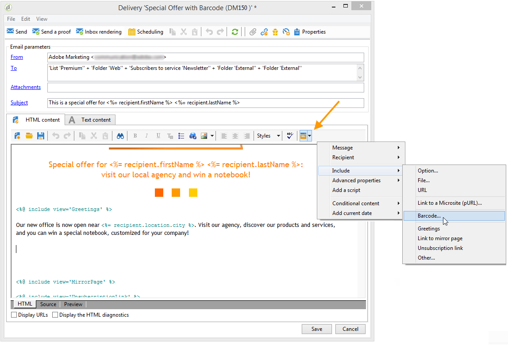
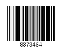
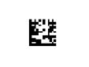
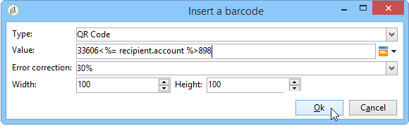
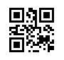
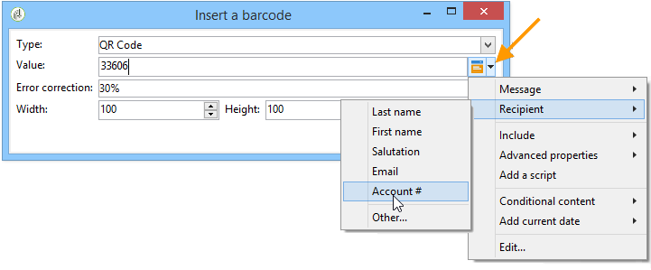
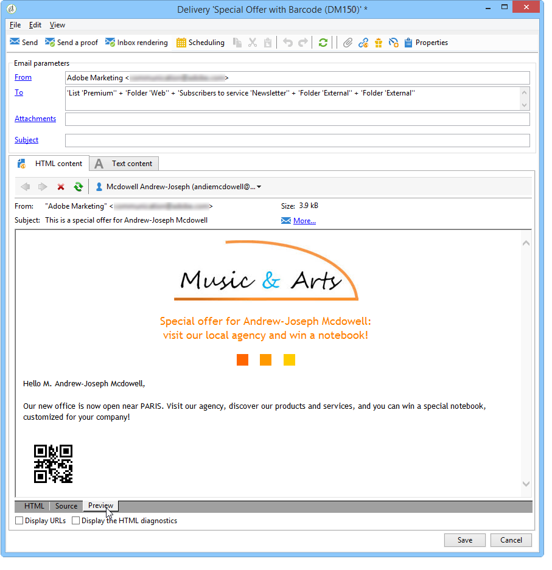
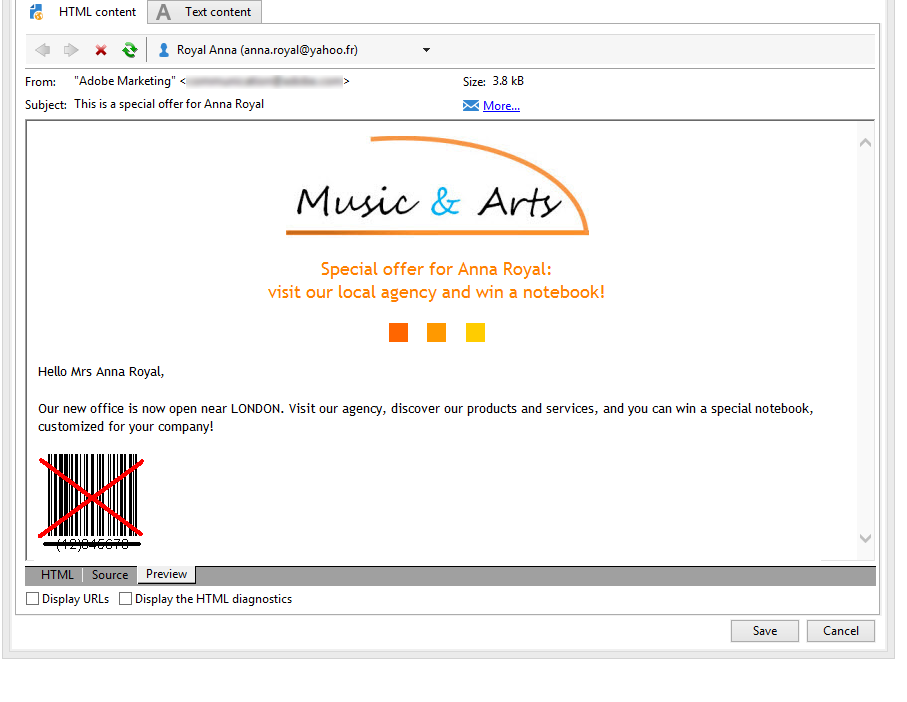

# Inserting a barcode in an email{#inserting-a-barcode-in-an-email}

The barcode generation module lets you create several types of barcodes that comply with many common standards, including 2D barcodes.

It is possible to dynamically generate a barcode as a bitmap using a value defined using customer criteria. Personalized barcodes can be included in email campaigns. The recipient can print the message and show it to the issuing company for scanning (when checking out for example).

To insert a barcode into an email, place the cursor in the content where you want to display it, then click the personalization button. Select **[!UICONTROL Include > Barcode...]**.

Then configure the following elements to suit your needs:

1. Select the type of barcode.

    * For 1D format, the following types are available in Adobe Campaign: Codabar, Code 128, GS1-128 (formerly EAN-128), UPC-A, UPC-E, ISBN, EAN-8, Code39, Interleaved 2 of 5, POSTNET and Royal Mail (RM4SCC).

      Example of a 1D barcode:

      

    * The DataMatrix and PDF417 types concern the 2D format.

      Example of a 2D barcode:

      

    * To insert a QR code, select this type and enter the error correction rate to apply. This rate defines the quantity of information repeated and the tolerance to deterioration.

      

      Example of a QR code:

      

1. Enter the size of the barcode that you want to insert into the email: configuring the scale lets you increase or reduce the size of the barcode, from x1 to x10.
1. The **[!UICONTROL Value]** field enables you to define the value of the barcode. A value can match a special offer and can be the function of a criteria, it can be the value of a database field linked to the customers.

   This example shows an EAN-8 type barcode, to which was added the account number of a recipient. To add this account number, click the personalization button to the right of the **[!UICONTROL Value]** field and select **[!UICONTROL Recipient > Account number]**.

   

1. The **[!UICONTROL Height]** field lets you configure the height of the barcode without changing its width, by altering the amount of space between each bar.

   There is no restrictive entry control depending on the type of barcode. If a barcode value is incorrect, it will only be visible in **Preview** mode where the barcode will be crossed out in red.

   >[!NOTE]
   >
   >The value assigned to a barcode depends on its type. For example, an EAN-8 type shall have exactly 8 numbers.
   >
   >The personalization button to the right of the **[!UICONTROL Value]** field lets you add data in addition to the value itself. This enriches the barcode, provided that the barcode standard accepts it.
   >
   >For example, if you are using a GS1-128 type barcode and want to enter the account number of a recipient in addition to the value, click the personalization button and select **[!UICONTROL Recipient > Account number]**. If the account number of the selected recipient is entered correctly, the barcode takes it into account.

Once these elements have been configured, you can finalize your email and send it. To avoid errors, always make sure your content is displayed correctly before performing a delivery by clicking the **[!UICONTROL Preview]** tab.

>[!NOTE]
>
>If the value of a barcode is incorrect, its bitmap is shown crossed out in red.

