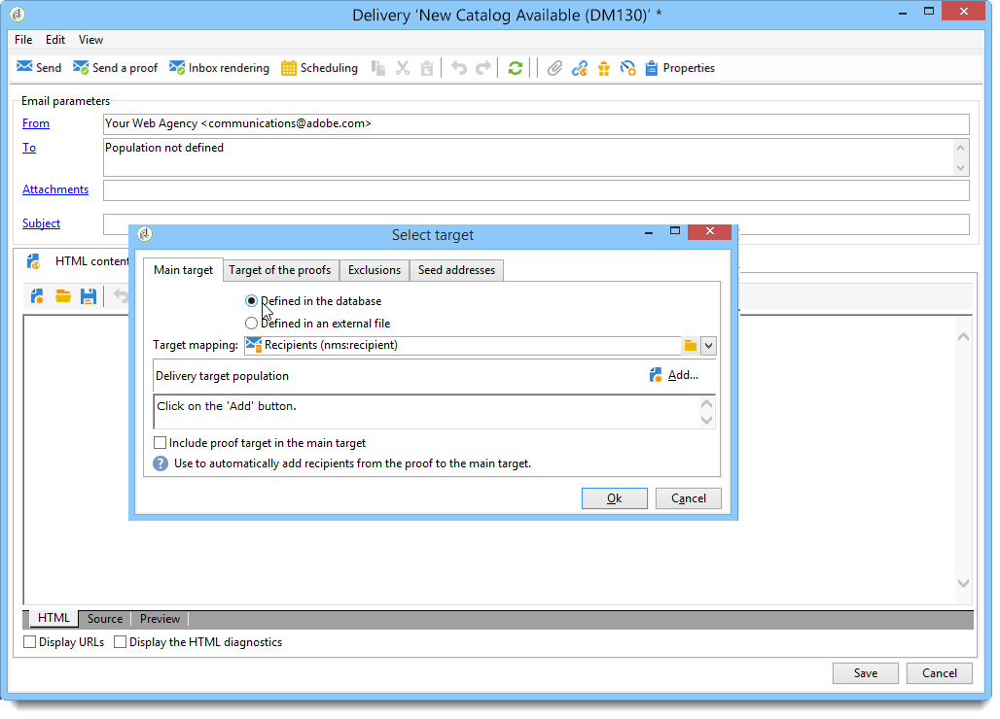
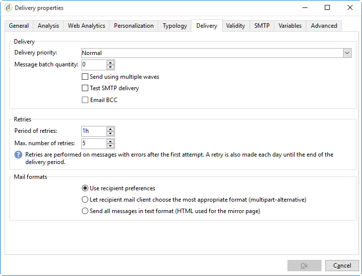

# Key steps when creating a delivery{#key-steps-when-creating-a-delivery}

The key steps when creating a delivery are as follows:

1. Selecting the delivery.

   For more on this, refer to [Creating an email delivery](../../delivery/using/creating-an-email-delivery.md).

1. Defining the delivery content.

   For more on this, refer to [Defining the email content](../../delivery/using/defining-the-email-content.md).

1. Defining the target population.

   For more on this, refer to [Identifying target populations](../../delivery/using/identifying-target-populations.md)

1. Sending the delivery.

   For more on this, refer to [Sending messages](../../delivery/using/sending-messages.md)

1. Monitoring the delivery (tracking, quarantine, reports, etc.).

   For more on this, refer to the [Monitoring deliveries](../../delivery/using/monitoring-a-delivery.md) and [Tracking deliveries](../../delivery/using/about-message-tracking.md) sections.

>[!NOTE]
>
>The steps described below assume that all target recipients and their profiles are stored in the database, except in the case of external delivery (see [Selecting external recipients](../../delivery/using/key-steps-when-creating-a-delivery.md#selecting-external-recipients)).

## Selecting the delivery template {#selecting-the-delivery-template}

You can create a delivery via the overview or via the **[!UICONTROL Create > Delivery]** menu.

To create a delivery, click **[!UICONTROL Create]** above the list of deliveries. When you create a new delivery, you must indicate the delivery channel used. To do this, select the appropriate delivery template from the drop-down list in the **[!UICONTROL Delivery template]** field.

A default template is provided for each channel you have installed: direct mail, email, fax, telephone, mobile channel (SMS), Facebook, Twitter, etc.

>[!NOTE]
>
>The channels offered in the list depend on your license agreement.

You can create new delivery templates in order to pre-configure specific parameters to suit your needs. For further information about templates, see [About direct mail channel](../../delivery/using/about-direct-mail-channel.md).

## Identifying the delivery {#identifying-the-delivery}

You need to complete parameters to identify the delivery. To do this:

1. Enter a name for the delivery in the **[!UICONTROL Label]** field.

   A delivery code can also be assigned to the delivery. The name of the delivery and its code appear in the list of deliveries but cannot be seen by the recipients.

1. Add a description in the **[!UICONTROL Description]** field.
1. Select the delivery nature in the relevant field. This information is useful for delivery tracking: you can filter based on this criterion in the delivery list or build queries using this selection criterion.

   

1. Click **[!UICONTROL Continue]** to confirm this information and display the message configuration window.

The delivery content is ready to be configured. For more on this, refer to [Defining the delivery content](../../delivery/using/key-steps-when-creating-a-delivery.md#defining-the-delivery-content).

For more details on selecting the delivery template for a specific channel, refer to the dedicated section:

* [About email channel](../../delivery/using/about-email-channel.md)
* [About direct mail channel](../../delivery/using/about-direct-mail-channel.md)
* [SMS channel](../../delivery/using/sms-channel.md)
* [Mobile app channel](../../delivery/using/about-mobile-app-channel.md)

## Defining the delivery content {#defining-the-delivery-content}

The delivery content definition is specific to each channel.

For more on this, refer to the dedicated section:

* [Defining the email content](../../delivery/using/defining-the-email-content.md)
* [Defining the SMS content](../../delivery/using/sms-channel.md#defining-the-sms-content)
* [Defining the direct mail content](../../delivery/using/defining-the-direct-mail-content.md)
* [Push notifications](../../delivery/using/about-mobile-app-channel.md)

## Defining the target population {#defining-the-target-population}

### About target populations {#about-target-populations}

For each delivery, you can define several types of target:

* Recipients of the delivery, see [Selecting the main target](../../delivery/using/key-steps-when-creating-a-delivery.md#selecting-the-main-target).
* Recipient of proof messages, in order to set up a validation cycle, see [Defining a specific proof target](../../delivery/using/key-steps-when-creating-a-delivery.md#defining-a-specific-proof-target).
* Seed addresses, see [About seed addresses](../../delivery/using/about-seed-addresses.md).
* Control group - when the delivery is included in a marketing campaign, see [this section](../../campaign/using/setting-up-marketing-campaigns.md#defining-a-control-group).

Once the population defined, you can define filtering criteria on the targeted recipients (see [Selecting the main target](../../delivery/using/key-steps-when-creating-a-delivery.md#selecting-the-main-target)) and on the proof recipients (see [Defining a specific proof target](../../delivery/using/key-steps-when-creating-a-delivery.md#defining-a-specific-proof-target)).

### Selecting the main target {#selecting-the-main-target}

In most cases, the main target is extracted from the Campaign database (default mode).

Recipients can also be stored in an external file. The configuration of this type of delivery is presented in [Selecting external recipients](../../delivery/using/key-steps-when-creating-a-delivery.md#selecting-external-recipients).

To select the recipients of the delivery being created, follow the steps below:

1. Click the **[!UICONTROL To]** link.
1. If the recipients are stored in the database, select the first option.

   

1. Select the target mapping in the **[!UICONTROL Target mapping]** drop-down list. Adobe Campaign default target mapping is **[!UICONTROL Recipients]**.

   Other target mappings are available, and some can be related to your specific configuration. For more on target mappings, refer to [Selecting a target mapping](../../delivery/using/selecting-a-target-mapping.md).

1. Click the **[!UICONTROL Add]** button to define restriction filters.

   You can then select the type of filtering to apply:

   

   You can select recipients using the types of targeting defined in the database. To use a target type, select it and click **[!UICONTROL Next]**. For each target, you can display the recipients concerned by clicking the **[!UICONTROL Preview]** tab. For certain types of target, the **[!UICONTROL Refine target]** button lets you combine several targeting criteria.

   The following target types are offered by default:

    * **[!UICONTROL Filtering conditions]** : this option lets you define a query and display the result. The method for defining queries is presented in [this section](../../platform/using/creating-filters.md#creating-an-advanced-filter).
    * **[!UICONTROL Subscribers of an information service]** : this option lets you select a newsletter to which the recipients must be subscribed to be targeted by the delivery being created.

      

    * **[!UICONTROL Recipients of a delivery]** : this option lets you define the recipients of an existing delivery as a targeting criterion. You must then select the delivery in the list:

      

    * **[!UICONTROL Delivery recipients belonging to a folder]** : this option lets you select a delivery folder and target the recipients of the deliveries in that folder.

      

      You can filter the behavior of recipients by selecting from the drop-down list:

      

      >[!NOTE]
      >
      >The **[!UICONTROL Include sub-folders]** option also lets you target the deliveries contained in folders located in the tree structure below the selected node.

    * **[!UICONTROL Recipients included in a folder]** : this option lets you target the profiles contained in a specific folder of the tree.
    * **[!UICONTROL A recipient]** : this option lets you select a specific recipient from the profiles in the database.
    * **[!UICONTROL A list of recipients]** : this option lets you target a list of recipients. Lists are presented in the [this section](../../platform/using/creating-and-managing-lists.md).
    * **[!UICONTROL User filters]** : this option lets you access the preconfigured filters to use them as filtering criteria for profiles in the database. Preconfigured filters are presented in [this section](../../platform/using/creating-filters.md#saving-a-filter).
    * The option **[!UICONTROL Exclude recipients corresponding to this segment]** lets you target on recipients who do not satisfy the defined target criteria. To use this option, select the appropriate box and then apply targeting, as defined earlier, to exclude the resulting profiles.

      

1. Enter a name for this targeting in the **[!UICONTROL Label]** field. By default, the label will be the label of the first targeting criterion. For a combination, it is better to use an explicit name.
1. Click **[!UICONTROL Finish]** to validate the configured targeting.

   The targeting criteria defined are summarized in the central section of the main target configuration tab. Click a criterion to view its contents (configuration and preview). To delete a criterion, click the cross located after its label.

   

### Customizing exclusion settings {#customizing-exclusion-settings}

Address errors and quality ratings are supplied by the service provider (IAP). This information is automatically updated in the recipient profile following delivery actions and with files returned by service providers. It can be viewed in the profile on a read-only basis.

You can choose to exclude addresses that have reached a certain number of consecutive errors, or whose quality rating is below a threshold specified in this window. You can also choose whether or not to authorize non-qualified addresses for which no data has been returned.

>[!NOTE]
>
>If two recipients have the same first name, last name, postcode and city in a direct mail delivery, a double error will occur and the duplicate will not be taken into account.

The **[!UICONTROL Exclusions]** tab is used to limit the number of messages.

>[!NOTE]
>
>Default parameters are recommended, but you can adapt settings depending on your needs. However, these options should only be changed by an expert user to avoid any misusage and errors.

Click the **[!UICONTROL Edit...]** link to modify the default configuration.

The following options are available:

* **[!UICONTROL Exclude duplicate addresses during delivery]**. This option is active by default: it lets you eliminate duplicate email addresses during delivery. The strategy applied can vary according to how Adobe Campaign is used and the type of data in the database.

  The default value of the option can be configured for each delivery template.

  For example:

  * Delivery of a newsletter or electronic document delivery. No exclusion of duplicates in some cases if the data has no native duplicates. A couple subscribing with the same email address can expect to receive two specific personalized email messages: one addressed to each individual by name. In this case, this option can be unselected.
  * Delivery of a marketing campaign: duplicate exclusion is essential to avoid sending too many messages to the same recipient. In this case, this option can be selected.

      If you unselect this option, you can access an additional option: **[!UICONTROL Keep duplicate records (same identifier)]**. It lets you authorize multiple deliveries to recipients who satisfy several targeting criteria.

    

* **[!UICONTROL Exclude recipients who no longer want to be contacted]** , i.e. recipients whose email addresses are on a blacklist ('opt out'). This option must remain selected in order to observe the professional ethics of e-marketing and the laws governing e-commerce.
* **[!UICONTROL Exclude quarantined recipients]**. This option lets you exclude from the target any profiles with an address that does not respond. We strongly recommend keeping this option selected.

  >[!NOTE]
  >
  >For further information about quarantine management, refer to [Understanding quarantine management](../../delivery/using/understanding-quarantine-management.md).

* **[!UICONTROL Limit delivery]** to a given number of messages. This option lets you enter the maximum number of messages to be sent. If the content of the target exceeds the number of messages indicated, a random selection is applied to the target.

### Selecting the proof target {#selecting-the-proof-target}

The proof is a special message that lets you test a delivery before sending it to the main target. Proof recipients are responsible for approving both the form and content of the message.

To select the target of the proofs, follow the steps below:

1. Click the **[!UICONTROL To]** link.
1. Click the **[!UICONTROL Target of the proofs]** tab.
1. Click the **[!UICONTROL Targeting mode]** field to choose the method to apply: **[!UICONTROL Definition of a specific proof target]** , **[!UICONTROL Substitution of the address]** , **[!UICONTROL Seed addresses]** or **[!UICONTROL Specific target and seed addresses]**.

>[!NOTE]
>
>Usually, the target for the proof can be added to the main target. To do this, select the appropriate option in the lower section of the **[!UICONTROL Main target]** tab.

### Defining a specific proof target {#defining-a-specific-proof-target}

When selecting the proof target, the **[!UICONTROL Definition of a specific proof target]** option lets you select the proof recipients from the profiles in the database.

Select this option to choose recipients using the **[!UICONTROL Add]** button, as in the case of defining the main target. See [Selecting the main target](../../delivery/using/key-steps-when-creating-a-delivery.md#selecting-the-main-target).

### Using address substitution in proof {#using-address-substitution-in-proof}

Instead of selecting dedicated recipients in the database, you can use the **[!UICONTROL Substitution of the address]** option.

This option lets you use the recipient profiles of the delivery and replace their email addresses with one or more other addresses that will receive the proof.

When this option is selected, the proof addresses will be filled in via a special editor that lets you configure the substitution(s). 

Configuration is performed as follows:

1. Click the **[!UICONTROL Add]** icon to define a substitution.
1. Enter the recipient address to be used, or select it from the list.
1. Select the profile to use in the proof: save the **[!UICONTROL Random]** value in the **[!UICONTROL Profile to use]** column to use the data of any profile of the target in the proof.

   

1. Click the **[!UICONTROL Detail]** icon to select a profile from the main target, as in the following example:

   

   You can define as many substitution addresses as necessary.

### Using seed addresses as proof {#using-seed-addresses-as-proof}

You can use **[!UICONTROL Seed addresses]** as target of the proofs: this option lets you use or import a list of existing seed addresses. 

>[!NOTE]
>
>Seed addresses are presented in [About seed addresses](../../delivery/using/about-seed-addresses.md).

You can combine the definition of a specific proof target and the use of seed addresses using the **[!UICONTROL Specific target and Seed addresses]** option. The related configurations are then defined in two separate sub-tabs.

### Selecting external recipients {#selecting-external-recipients}

You can launch a delivery on recipients who are not saved in the database, but stored in an external file. For example, we will send here a delivery to recipients imported from a text file.

To do this:

1. Click the **[!UICONTROL To]** link to select the recipients of your delivery.
1. Select the **[!UICONTROL Defined in an external file]** option.

   

1. By default, recipients are imported in the database. You must select the **[!UICONTROL Target mapping]**. For more on target mappings, refer to [Selecting a target mapping](../../delivery/using/selecting-a-target-mapping.md)

   You can also choose **[!UICONTROL Do not import the recipients into the database]**.

1. When importing the recipients, click the **[!UICONTROL File format definition...]** link to select and configure the external file.

   For more information on data import, refer to [this section](../../platform/using/importing-data.md#step-2---source-file-selection).

1. Click **[!UICONTROL Finish]** and configure your delivery as a standard delivery.

>[!CAUTION]
>
>When defining the content of the message for email delivery, do not include the link to the mirror page; it cannot be generated in this delivery mode.

### Reducing the size of the target population {#reducing-the-size-of-the-target-population}

You can reduce the size of the target population. To do this, specify the number of recipients to be exported in the **[!UICONTROL Quantity requested]** field.

## Validating the delivery {#validating-the-delivery}

When a delivery has been created and configured, you must validate it before sending it to the main target.

To do this:

1. Analyze the delivery: this step lets you prepare the messages to deliver. Refer to [Analyzing the delivery](../../delivery/using/key-steps-when-creating-a-delivery.md#analyzing-the-delivery).

   Available validation modes are detailed in [Changing the approval mode](../../delivery/using/key-steps-when-creating-a-delivery.md#changing-the-approval-mode).

1. Send proofs: this step lets you approve content, URLs, personalization fields, etc. Refer to [Sending a proof](../../delivery/using/key-steps-when-creating-a-delivery.md#sending-a-proof) and [Defining a specific proof target](../../delivery/using/key-steps-when-creating-a-delivery.md#defining-a-specific-proof-target).

>[!CAUTION]
>
>Both these steps must necessarily be carried out after each modification on the message content.

### Analyzing the delivery {#analyzing-the-delivery}

The analysis is the stage during which the target population is calculated and the delivery content prepared. Once it is complete, the delivery is ready to send. To launch the delivery analysis, click **[!UICONTROL Send]** and then select **[!UICONTROL Deliver as soon as possible]**.

The **[!UICONTROL Analyze]** button lets you launch the analysis manually. The progress bar shows the progress of the analysis. The lower section of the window displays the analysis result. Special icons display warnings.

>[!NOTE]
>
>The validation rules are described in [Validation process with typologies](../../delivery/using/key-steps-when-creating-a-delivery.md#validation-process-with-typologies).

You can stop this job at any time by clicking **[!UICONTROL Stop]**.

No messages are sent during the analysis phase. You can therefore start or cancel this job without risk.

>[!CAUTION]
>
>The analysis freezes the delivery (or the proof) at the moment of analysis. Any modification to the delivery (or the proof) must be followed by another analysis before becoming applicable.

The last log message displays any error messages and the number of errors. A special icon shows the error type: the yellow icon indicates a non-critical processing error, the red icon indicates a critical error that prevents the start of the delivery.

Click **[!UICONTROL Close]** to correct the errors. After making the changes, you must restart the analysis.

Check the result of the analysis before clicking **[!UICONTROL Confirm delivery]** to send the message to the specified target. A confirmation message lets you launch the delivery.

>[!NOTE]
>
>Click the **[!UICONTROL Change the main delivery target]** link if the number of messages to send does not match your configuration. This lets you change the definition of the target population and re-start the analysis.

The delivery parameters **[!UICONTROL Analysis]** tab lets you define a set of information concerning the preparation of messages during the analysis phase.

This tab gives access to the following options:

* **[!UICONTROL Label and code of the delivery]** : the options concerning this section of the screen are used to calculate the values of these fields during the delivery analysis phase. The **[!UICONTROL Calculate the execution folder during the delivery analysis]** field computes the name of the folder that will contain this delivery action during the analysis phase.
* **[!UICONTROL Approval mode]** : this field lets you select the type of delivery approval. The approval modes are presented in [Validation process with typologies](../../delivery/using/key-steps-when-creating-a-delivery.md#validation-process-with-typologies).
* **[!UICONTROL Prepare the personalization data with a workflow]** : this option allows to prepare the personalization data contained in your delivery in an automatic workflow. It allows to highly improve the delivery analysis performance when a lot of data are being processed, especially if the personalization data come from an external table through FDA. Refer to the [Accessing an external database (FDA)](../../platform/using/accessing-an-external-database.md#optimizing-email-personalization-with-external-data) section.
* **[!UICONTROL Start job in a detached process]** : This option lets you start the delivery analysis in a separate process. The analysis function uses the Adobe Campaign application server process (web nlserver) by default. By selecting this option, you ensure that the analysis will be completed even in the event of application server failure.
* **[!UICONTROL Log SQL queries generated during the analysis in the journal]** : this option adds the SQL query logs to the delivery journal during the analysis phase.
* **[!UICONTROL Ignore personalization scripts during sending]** : this option lets you bypass the interpretation of JavaScript directives found in HTML content. They will be displayed as is in the delivered contents. These directives are introduced with the **<%=** tag).

### Sending a proof {#sending-a-proof}

To detect possible errors in message configuration, Adobe highly recommend setting up a delivery validation cycle. Make sure content is approved as often as necessary by sending proofs to test recipients. A proof should be sent each time a change is made, to approve content.

>[!NOTE]
>
>* Available validation modes are detailed in [Changing the approval mode](../../delivery/using/key-steps-when-creating-a-delivery.md#changing-the-approval-mode).
>* Configuration of the proof target is explained in [Defining a specific proof target](../../delivery/using/key-steps-when-creating-a-delivery.md#defining-a-specific-proof-target).
>

To send a proof, follow the steps below:

1. Make sure the proof target has been configured as described in [Defining a specific proof target](../../delivery/using/key-steps-when-creating-a-delivery.md#defining-a-specific-proof-target).
1. Click **[!UICONTROL Send a proof]** on the top bar of the delivery wizard.

   

1. Start message analysis. See [Analyzing the delivery](../../delivery/using/key-steps-when-creating-a-delivery.md#analyzing-the-delivery).
1. Send the message.

   After being sent, the proof appears in the delivery list, it is automatically created and numbered. It can be edited if you wish to access its content and properties. Refer to this [page](../../delivery/using/monitoring-a-delivery.md#delivery-dashboard).

   

   >[!NOTE]
   >
   >If several formats were created for the delivery (HTML and Text), you can choose the format of the messages to be sent to the proof recipients in the lower section of the window.

   

You might wish to modify the content of the delivery as a result of any comments made by the validation group receiving the proof. After making your changes, you must relaunch the analysis and then send another proof. Each new proof is numbered and logged in the delivery journal.

Once the delivery has been analyzed, you can view the various proofs sent via the **[!UICONTROL Proofs]** sub-tab of the log (**[!UICONTROL Audit]** tab).

You must send as many proofs as necessary until the content of the delivery is finalized. After that, you can send the delivery to the main target and close the validation cycle.

The **[!UICONTROL Advanced]** tab of delivery properties lets you define the properties of the proof. When needed, you can override the recipient exclusion rules.

The following options are available:

* The first option lets you keep the proof doubles.
* Both of the following options let you keep blacklisted recipients and addresses in quarantine. See the description of these options for the main target in [Customizing exclusion settings](../../delivery/using/key-steps-when-creating-a-delivery.md#customizing-exclusion-settings). Unlike the target of a delivery, where these addresses are excluded by default, they are kept by default for the target of a proof.
* The **[!UICONTROL Keep the delivery code for the proof]** option lets you give the proof the same delivery code as the one defined for the delivery to which it relates. This code is specified in the first step of the delivery wizard.
* By default, the subject of the proof is prefixed by 'Proof #', where # is the number of the proof. You can change this prefix in the **[!UICONTROL Label prefix]** field.

### Validation process with typologies {#validation-process-with-typologies}

Before sending any messages, you should analyze the campaign to approve its contents and configuration. The checking rules applied during the analysis phase are defined in a **typology**. By default, for emails, the analysis covers the following points:

* Approving the object
* Approving the URLs and images
* Approving the URL labels
* Approving the unsubscription link
* Checking the size of proofs
* Checking the validity period
* Checking the scheduling of waves

The typology to be applied for each delivery is selected in the **[!UICONTROL Typologies]** tab in the delivery parameters.

You can view and edit the approval rules, their content, their order of execution, and their full description via the **[!UICONTROL Administration > Campaign execution > Typology management > Typology rules]** node.

You can create new rules and define new typologies from this node. These tasks are however reserved for expert users who know JavaScript.

To edit the current typology, click the **[!UICONTROL Edit link]** icon to the right of the **[!UICONTROL Typology]** field.

The **[!UICONTROL Rule]** tab gives a list of the typology rules to apply. Select a rule and click the **[!UICONTROL Detail...]** icon to view its configuration:

>[!NOTE]
>
>**[!UICONTROL Arbitration]** type typologies are used within the framework of sales pressure management. For more on this, refer to [this section](../../campaign/using/about-marketing-resource-management.md).

### Changing the approval mode {#changing-the-approval-mode}

The **[!UICONTROL Analysis]** tab for delivery properties lets you select the validation mode. If warnings are generated during the analysis (e.g., if certain characters are accentuated in the subject of the delivery, etc.), you can configure the delivery to define whether or not it should still be executed. By default, the user must confirm the sending of messages at the end of the analysis phase: this is **manual** validation.

Select another approval mode from the drop-down list in the appropriate field.

The following approval modes are available:

1. **[!UICONTROL Manual]**

   At the end of the analysis phase, the user must confirm delivery to start sending. To do this, click the **[!UICONTROL Start]** button to launch the delivery.

1. **[!UICONTROL Semi-automatic]**

   Sending begins automatically if the analysis phase generates no warning messages.

1. **[!UICONTROL Automatic]**

   Sending begins automatically at the end of the analysis phase irrespective of its result.

## Sending the delivery {#sending-the-delivery}

>[!NOTE]
>
>Only the delivery owner can start a delivery. In order for another operator (or operator group) to be able to start a delivery, you have to add them as reviewers in the **[!UICONTROL Delivery start:]** field.
>
>Refer to [this section](../../campaign/using/setting-up-marketing-campaigns.md#selecting-reviewers) for further information.

Before sending the delivery, you can define the sending parameters in the delivery properties, via the **[!UICONTROL Delivery]** tab.

* **[!UICONTROL Delivery priority]**

  This option allows you to influence the sending order for your deliveries by stating their priority level (normal, high or low). This lets you prioritize the order for certain, more urgent deliveries over others.

* **[!UICONTROL Message batch quantity]**

  This option allows you to define the number of messages grouped within the same XML delivery package.

  If the parameter is set for 0, the messages are automatically grouped. The package size is defined by the calculation `<delivery size>/1024`, with a minimum of 8 and a maximum of 256 messages by package.

  >[!CAUTION]
  >
  >When the delivery is duplicated, the parameter is reset.

* **[!UICONTROL Send using multiple waves]**

  For more on this, refer to the [Sending using multiple waves](../../delivery/using/key-steps-when-creating-a-delivery.md#sending-using-multiple-waves) section.

* **[!UICONTROL Test SMTP delivery]**

  This option allows you to test sending a delivery via SMTP. The delivery is processed up to connection to the SMTP server but is not sent.

  >[!NOTE]
  >
  >Using this option is not advised when installing using mid-sourcing as to not call mta.
  >
  >For more information on configuring an SMTP server, refer to [this section](../../installation/using/configuring-campaign-server.md#personalizing-delivery-parameters).

* **[!UICONTROL Archive emails]**

  This option lets you store emails on an external system through BCC by simply adding a BCC email address to your message target. For more on this, refer to [Archiving emails](../../delivery/using/sending-messages.md#archiving-emails).

Once your delivery is ready to be sent, you must first run the delivery analysis. This analysis checks the validity of the message content and corrects any errors before sending messages to the main target. for more on this, refer to [Analyzing the delivery](../../delivery/using/key-steps-when-creating-a-delivery.md#analyzing-the-delivery).

Once the analysis is complete, click **[!UICONTROL Confirm delivery]** to launch the delivery of messages.

You can then close the delivery wizard and track the execution of the delivery from the **[!UICONTROL Delivery]** tab, accessible via the detail of this delivery or via the list of deliveries.

After sending messages, you can monitor and track your deliveries. For more on this, refer to these sections:

* [Monitoring a delivery](../../delivery/using/monitoring-a-delivery.md)
* [Understanding delivery failures](../../delivery/using/understanding-delivery-failures.md)
* [About message tracking](../../delivery/using/about-message-tracking.md)

### Scheduling the delivery sending {#scheduling-the-delivery-sending}

You can defer the delivery of messages in order to schedule the delivery or to manage sales pressure and avoid over-soliciting a population.

To do this, click the **[!UICONTROL Send]** button and select the **[!UICONTROL Postpone delivery]** option.

Specify a start date in the **[!UICONTROL Contact date]** field.

You can then start the analysis (**[!UICONTROL Analyze]** button) and then delivery (**[!UICONTROL Confirm delivery]** button), but it will not start until the date given in the **[!UICONTROL Contact date]** field.

It will appear with **[!UICONTROL Pending]** status in the delivery list.

Scheduling can be configured upstream via the **[!UICONTROL Scheduling]** button of the delivery.

It lets you defer the delivery to a later date or save the delivery in the provisional calendar.

* The **[!UICONTROL Schedule delivery (no automatic execution)]** option lets you schedule a provisional analysis of the delivery.

  When this configuration is saved, the delivery changes to **[!UICONTROL Targeting pending]** status. The analysis will be launched on the specified date.

* The **[!UICONTROL Schedule delivery (automatic execution on planned date)]** option lets you specify the delivery date.

  Click **[!UICONTROL Send]** and select **[!UICONTROL Postpone delivery]** then launch the analysis and confirm delivery. When the analysis is complete, the delivery target is ready and messages will automatically be sent on the specified date.

>[!CAUTION]
>
>Once you have started the analysis, the contact date that you defined is fixed. If you modify this date, you will have to restart the analysis so that your modifications are taken into account.

Dates and times are expressed in the time zone of the current operator. The **[!UICONTROL Time zone]** drop-down list located below the contact date input field lets you automatically convert the entered date and time into the selected time zone.

For instance, if you schedule a delivery to be executed automatically at 8 o'clock London time, the time is automatically converted into the selected time zone:

### Sending using multiple waves {#sending-using-multiple-waves}

To balance the load, you can divide deliveries into several batches. Configure the number of batches and their proportion with respect to the entire delivery.

>[!NOTE]
>
>You can only define the size and the delay between two consecutive waves. The recipient selection criteria for each wave cannot be configured.

1. Open the delivery properties window and click the **[!UICONTROL Delivery]** tab.
1. Select the **[!UICONTROL Send using multiple waves]** option and click the **[!UICONTROL Define waves...]** link.

   

1. To configure waves, you can either:

    * Define the size for each wave. For example, if you enter **[!UICONTROL 30%]** in the corresponding field, each wave will represent 30% of the messages included in the delivery, except the last one, which will represent 10% of the messages.

      In the **[!UICONTROL Period]** field, specify the delay between the start of two consecutive waves. For example, if you enter **[!UICONTROL 2d]**, the first wave will start immediately, the second wave will start in two days, the third wave in four days, and so on.

      

    * Define a calendar for sending each wave.

      In the **[!UICONTROL Start]** column, specify the delay between the start of two consecutive waves. In the **[!UICONTROL Size]** column, enter a fixed number or a percentage.

      In the example below, the first wave represents 25% of the total number of messages included in the delivery and will start immediately. The next two waves complete the delivery and are set to begin at six-hour intervals.

      

   A specific typology rule, **[!UICONTROL Wave scheduling check]**, ensures that the last wave is planned before the delivery validity limit. Campaign typologies and their rules, configured in the **[!UICONTROL Typology]** tab of the delivery properties, are presented in [Validation process with typologies](../../delivery/using/key-steps-when-creating-a-delivery.md#validation-process-with-typologies).

   >[!CAUTION]
   >
   >Make sure the last waves do not exceed the delivery deadline, which is defined in the **[!UICONTROL Validity]** tab. Otherwise some messages might not be sent.  
   >
   >You must also allow enough time for retries when configuring the last waves. See [Additional delivery configurations](../../delivery/using/key-steps-when-creating-a-delivery.md#additional-delivery-configurations).

1. To monitor your sends, go to the delivery logs. See [this page](../../delivery/using/monitoring-a-delivery.md#delivery-logs-and-history).

   You can see the deliveries that were already sent in the processed waves (**[!UICONTROL Sent]** status) and the deliveries to be sent in the remaining waves (**[!UICONTROL Pending]** status).

The two examples below are the most common use cases for using multiple waves.

* **During ramp-up process**

  When emails are sent using a new platform, Internet service providers (ISPs) are suspicious of IP addresses that are not recognized. If large volumes of emails are suddenly sent, the ISPs often mark them as spam.

  To avoid being marked as spam, you can progressively increase the volume sent using waves. This should ensure smooth development of the start-up phase and enable you to reduce the overall rate of invalid addresses.

  To do so, use the **[!UICONTROL Schedule waves according to a calendar]** option. For example, set the first wave to 10%, the second to 15%, and so on.

  

* **Campaigns involving a call center**

  When managing a telephone loyalty campaign, your organization has a limited capacity to process the number of calls to contact subscribers.

  Using waves, you can restrict the number of messages to 20 per day, which is the daily processing capacity of a call center.

  To do this, select the **[!UICONTROL Schedule multiple waves of the same size]** option. Enter **[!UICONTROL 20]** as the wave's size and **[!UICONTROL 1d]** in the **[!UICONTROL Period]** field.

  

## Additional delivery configurations {#additional-delivery-configurations}

When delivery has been launched, various additional configurations can be used to manage its life cycle. You can access it from the delivery properties.

* The **[!UICONTROL Personalization]** tab lets you edit the **recipient profile loading** query. The result of this query can be viewed via the **[!UICONTROL Preview]** tab in the message contents editor. You can also add more script objects, which will be loaded during the analysis phase.
* The configuration and management of message tracking are presented in this [section](../../delivery/using/about-message-tracking.md).
* Campaign typologies and their rules, configured in the **[!UICONTROL Typology]** tab of the delivery properties, are presented in [Validation process with typologies](../../delivery/using/key-steps-when-creating-a-delivery.md#validation-process-with-typologies).

### Configuring retries {#configuring-retries}

Temporarily undelivered messages due to a **Soft** or **Ignored** error are subject to an automatic retry. The delivery failure types and reasons are presented in this [section](../../delivery/using/understanding-delivery-failures.md#delivery-failure-types-and-reasons).

The central section of the **[!UICONTROL Delivery]** tab for delivery parameters indicates how many retries should be performed the day after the delivery and the minimum delay between retries.

By default, five retries are scheduled for the first day of the delivery with a minimum interval of one hour spread out over the 24 hours of the day. One retry per day is programmed after that and until the delivery deadline, which is defined in the **[!UICONTROL Validity]** tab (see [Defining validity period](../../delivery/using/key-steps-when-creating-a-delivery.md#defining-validity-period)).

### Defining validity period {#defining-validity-period}

When the delivery has been launched, the messages (and any retries) can be sent until the delivery deadline. This is indicated in the delivery properties, via the **[!UICONTROL Validity]** tab.

* The **[!UICONTROL Delivery duration]** field lets you enter the limit for global delivery retries. This means that Adobe Campaign sends the messages beginning on the start date, and then, for messages returning an error only, regular, configurable retries are performed until the validity limit is reached.

  You can also choose to specify dates. To do this, select **[!UICONTROL Explicitly set validity dates]**. In this case, the delivery and validity limit dates also let you specify the time. The current time is used by default, but you can modify this directly in the input field.

* **Validity limit of resources**

  The **[!UICONTROL Validity limit]** field is used for uploaded resources, mainly for the mirror page and images. The resources on this page are valid for a limited time (to save disk space).

  The values in this field can be expressed in the units listed in [this section](../../platform/using/adobe-campaign-workspace.md#default-units).

## Analysis priority {#analysis-priority-}

When the delivery is part of a campaign, the **[!UICONTROL Advanced]** tab offers an additional option. This lets you organize the processing order for deliveries in the same campaign.

Before sending, each delivery is analyzed. The analysis duration depends on the delivery extraction file. The more significant the size of the file, the longer the analysis takes, making the following deliveries wait.

The options for the **[!UICONTROL Message preparation by the scheduler]** let you prioritize the delivery analysis in a campaign workflow.

If a delivery is too large, it is better to assign a low priority to it in order to avoid slowing down the analysis of other workflow deliveries.

>[!NOTE]
>
>To ensure that the larger delivery analyses do not slow down the progress of your workflows, you can schedule their executions by ticking the **[!UICONTROL Schedule execution for a time of low activity]**.
