# Create LINE deliveries{#line-channel}

LINE is an application for free instant messaging, voice and video calls, available on all smartphones (iPhone, Android, Windows Phone, Blackberry, Nokia) and on PC. Adobe Campaign allows you to send LINE messages.

LINE is only available for on-premise or managed services installations.

LINE can also be combined with the transactional message module to send real time messages on the LINE app installed in consumer mobile devices. For more on this, refer to this [page](../../message-center/using/transactional-messaging-architecture.md#transactional-messaging-and-line).

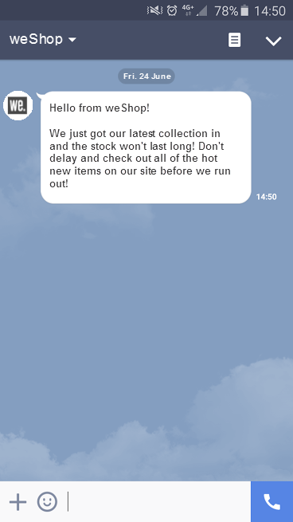

The sections below provide information that is specific to the LINE channel. For global information on how to create a delivery, refer to [this section](../../delivery/using/steps-about-delivery-creation-steps.md).

The steps for using the LINE channel are:

1. Creating a delivery
1. Configuring the message content
1. Selecting the target population
1. Sending the messages
1. Monitoring the delivery (tracking, quarantining, reports, etc.).

## Setting up LINE channel {#setting-up-line-channel}

### Creating a LINE account and an external account {#creating-a-line-account-and-an-external-account-}

>[!NOTE]
>
>Before creating a LINE account and external account, you first need to install the LINE package on your instance. For more information on this, consult the [LINE](../../installation/using/installing-campaign-standard-packages.md#line-package) section in the Installation guide.

You must first create a LINE account, so that you can then link it to Adobe Campaign. Then, you can send LINE messages to the users that have added your LINE account in their mobile application. External accounts and LINE account can only be managed by the functional administrator of the platform.

To create and configure a LINE account, see [https://developers.line.me/](https://developers.line.me/).

To create and configure a LINE service, see [Managing subscriptions](../../delivery/using/managing-subscriptions.md).

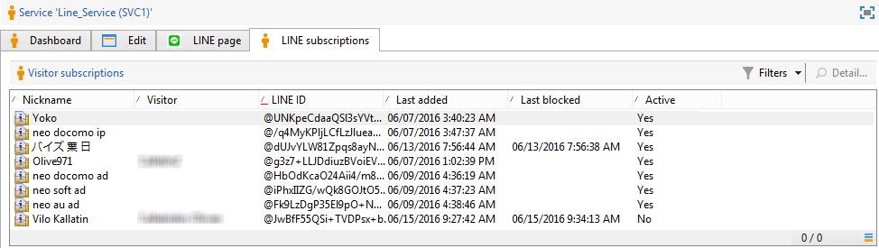

Finally, to create an external account on Adobe Campaign:

1. In the **Administration** > **Platform** tree structure, click the **External Accounts** tab.
1. Then click the **New** icon.

   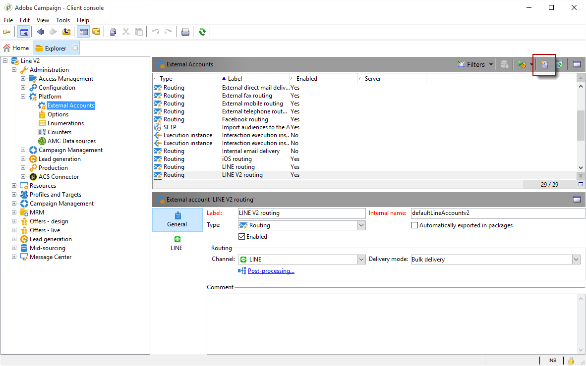

1. Complete the **Label** and **Internal name** fields.
1. In the **[!UICONTROL Type]** field, select Routing and in the **Channel** field, select LINE.
1. Click **[!UICONTROL Save]** to create your LINE external account.
1. A **LINE** personalization field then appears under the **General** icon, fill the following fields:

   

    * **Channel Alias**: is provided via your LINE account in the **[!UICONTROL Channels]** > **[!UICONTROL Technical configuration]** tab.
    * **Channel ID**: is provided via your LINE account in the **Channels** > **Basic Information panel** tab.
    * **Channel secret key**: is provided via your LINE account in the **Channels** > **Basic Information panel** tab.
    * **Access token**: is provided via your LINE account in the developer portal or by clicking the **[!UICONTROL Get access token]** button.
    * **Access token expiration date**: allows you to specify the expiration date of the Access token.
    * **LINE subscription service**: allows you to specify the services to which the users will be subscribed.

>[!NOTE]
>
>You must verify that the **[!UICONTROL LINE access token update (updateLineAccessToken)]** and **[!UICONTROL Delete blocked LINE users (deleteBlockedLineUsers)]** workflows have started. From the explorer, click **[!UICONTROL Administration > Production > Technical workflows > LINE workflows]** to check the status of the workflows.

## Creating the delivery {#creating-the-delivery}

To create a **LINE** delivery you have to follow these steps:

>[!NOTE]
>
>Global concepts on delivery creation are presented in [this section](../../delivery/using/steps-about-delivery-creation-steps.md).

1. From the **[!UICONTROL Campaigns]** tab, select **[!UICONTROL Deliveries]** then click the **[!UICONTROL Create]** button. 
1. In the window that appears, select **[!UICONTROL LINE V2 delivery]** delivery template.

   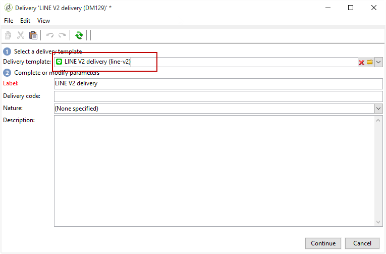

1. Identify your delivery with a label, code, and description. For more on this, refer to [this section](../../delivery/using/steps-create-and-identify-the-delivery.md#identifying-the-delivery).
1. Click **[!UICONTROL Continue]** to create your delivery.

## Defining the content {#defining-the-content}

To define the content of a LINE delivery, you first have to add message type to your delivery. Each LINE delivery can contain up to 5 messages.

You can choose between two message types:

* Text message
* Image and link

### Configuring a Text message delivery {#configuring-a-text-message-delivery}

A **Text message** LINE delivery is a message sent to recipients in text form. 

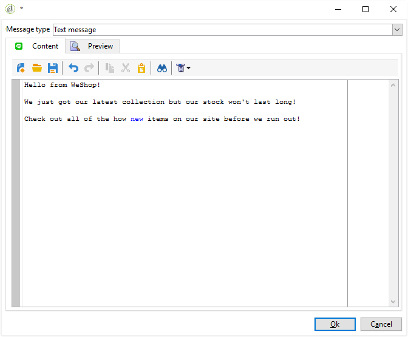

The configuration for this type of message is similar to the configuration of the **text** in an email. For more information, refer to this [page](../../delivery/using/defining-the-email-content.md#message-content).

### Configuring an Image and link delivery {#configuring-an-image-and-link-delivery}

An **Image and link** LINE delivery is a message sent to recipients in the form of an image that may contain one or multiple URLs.

You can use:

* a **Personalized image**,

  >[!NOTE]
  >
  >You can use the **%SIZE%** variable: this variable allows you to optimize the image display according to the screen size of the recipient's mobile device.

  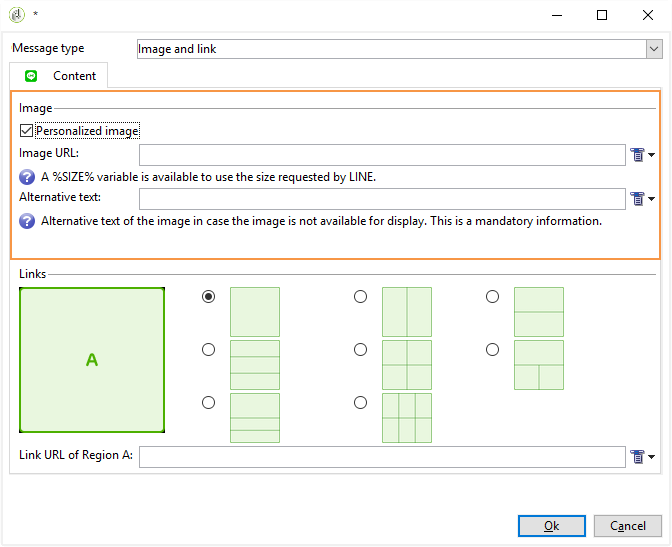

* an **Image URL**,

  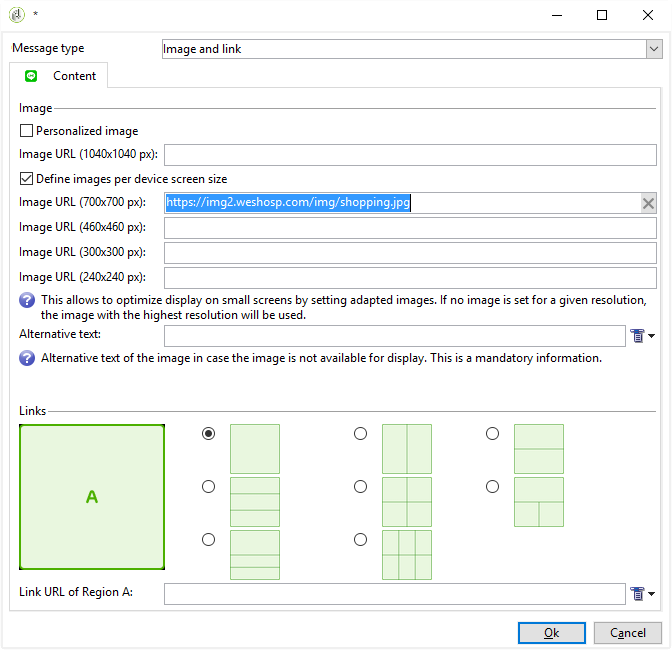

  The image URLs allow you to use different image resolutions to optimize delivery visibility on mobile devices. Only images with same height and width are supported.

  Images can be defined according to the screen size:

  * 1040px
  * 700px
  * 460px
  * 300px
  * 240px

  >[!NOTE]
  >
  >The 1040x1040 px size is mandatory for every LINE image with link.

  You then have to add alternative text that will pop up on the recipient's mobile device.

* and **[!UICONTROL Links]**.

  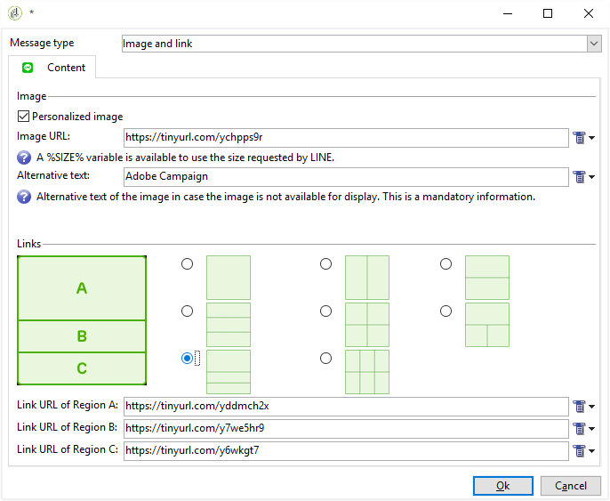

  The **[!UICONTROL Links]** section allows you to choose between different layouts that will divide your image in multiple clickable regions. You can then assign each of them a dedicated link.

>[!NOTE]
>
>The <%@ include option='NmsServer_URL' %>/webApp/APP3?id=<%=escapeUrl(cryptString(visitor.id))%> syntax allows you to include a link to a web app in a LINE message.

### Recommendations {#recommendations}

* When you send a LINE delivery to a new recipient for the first time, you must add the official LINE message regarding the terms of use and consent into the delivery. The official message is available at the following link: [https://terms.line.me/OA_privacy/](https://terms.line.me/OA_privacy/sp?lang=fr).

## Selecting the target population {#selecting-the-target-population}

Selecting recipients of a LINE delivery is similar to defining email delivery recipients. For more information, refer to [Identifying target populations](../../delivery/using/steps-defining-the-target-population.md).

Targeting is carried out on **visitors**.

## Sending messages {#sending-messages}

When your delivery is created and configured correctly, you can send it to the target defined earlier.

Sending LINE deliveries is similar to sending an email delivery. For more information on sending a delivery, refer to [Sending messages](../../delivery/using/sending-messages.md).

## Accessing reports {#accessing-reports}

You can view reports on the LINE service by clicking **[!UICONTROL Profiles and Targets > Services and Subscriptions > LINE]** in the explorer. Then click the **[!UICONTROL Reports]** icon in the LINE service.

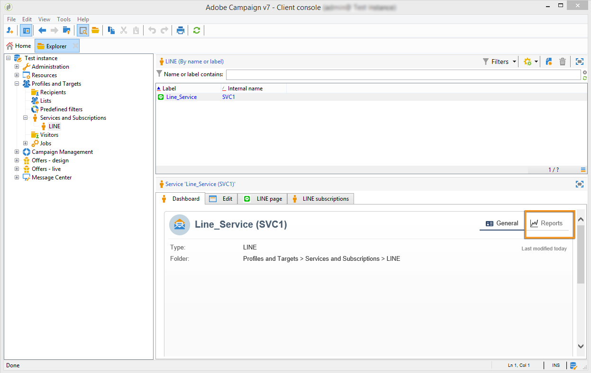

To view reports on LINE deliveries, click **[!UICONTROL Campaign Management > Deliveries]** then select the delivery you want. The tracking reports indicate the click-through rate. LINE does not take the open rate into account.

## Example: create and send a personalized LINE message {#example--create-and-send-a-personalized-line-message}

In this example, we are going to create and configure a text message and an image containing data that will be personalized according to the recipient.

1. Create your LINE delivery by clicking the **[!UICONTROL Create]** button from the **[!UICONTROL Campaign]** tab.

   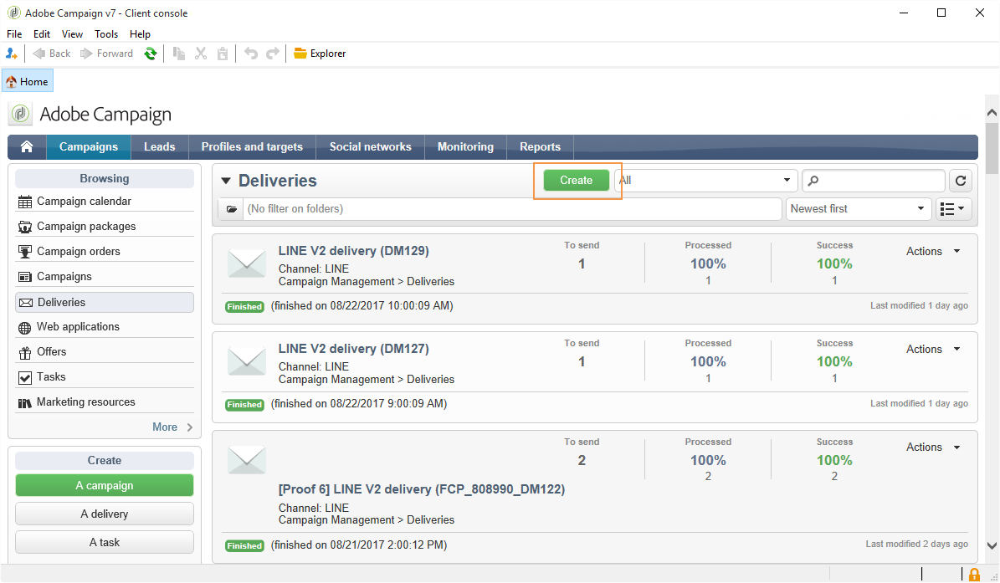

1. Select the **[!UICONTROL LINE V2 delivery]** delivery template and name your delivery.

   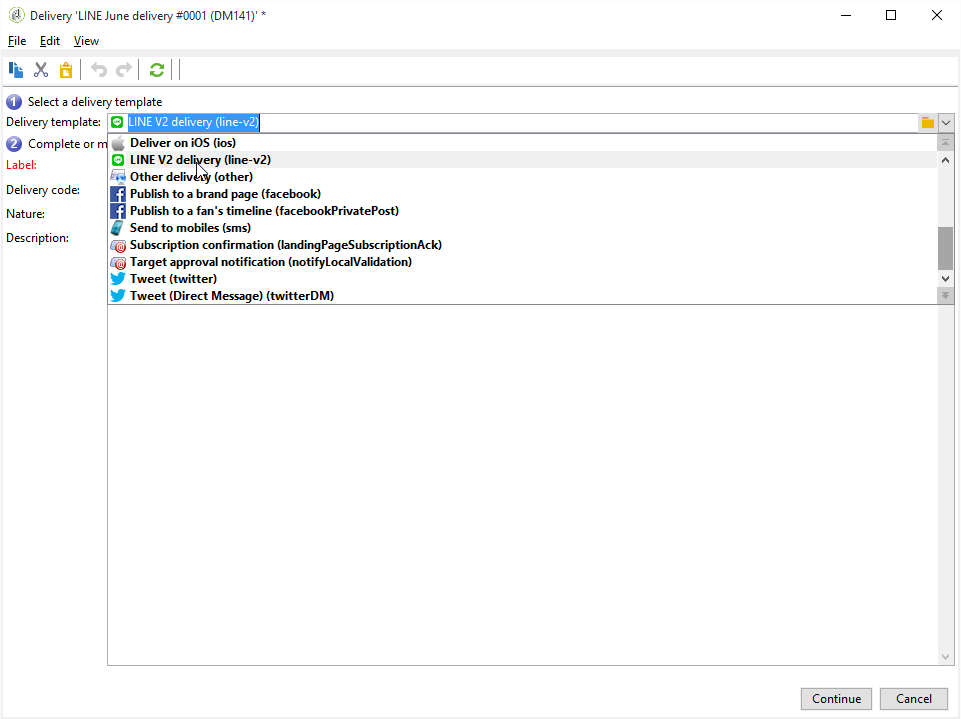

1. In the configuration window of your delivery, select your target population.

   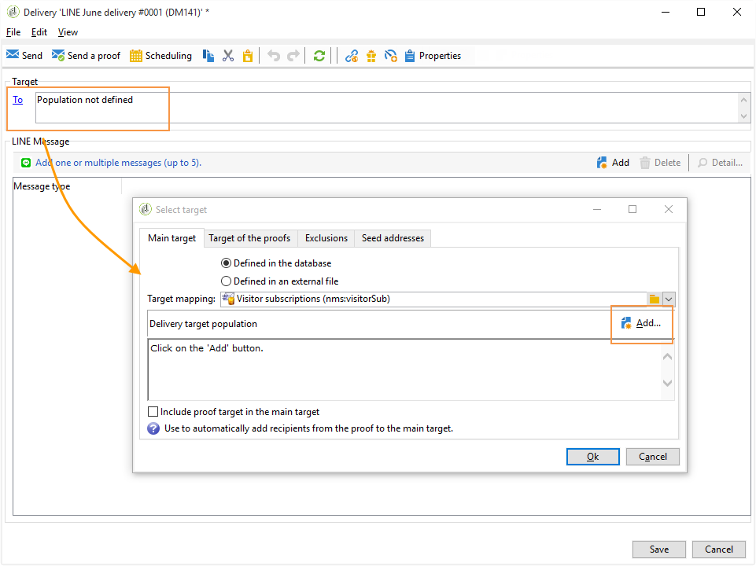

1. Click **[!UICONTROL Add]** to create your message and select the **[!UICONTROL Message type]**.

   Here, we first want to create a text message.

   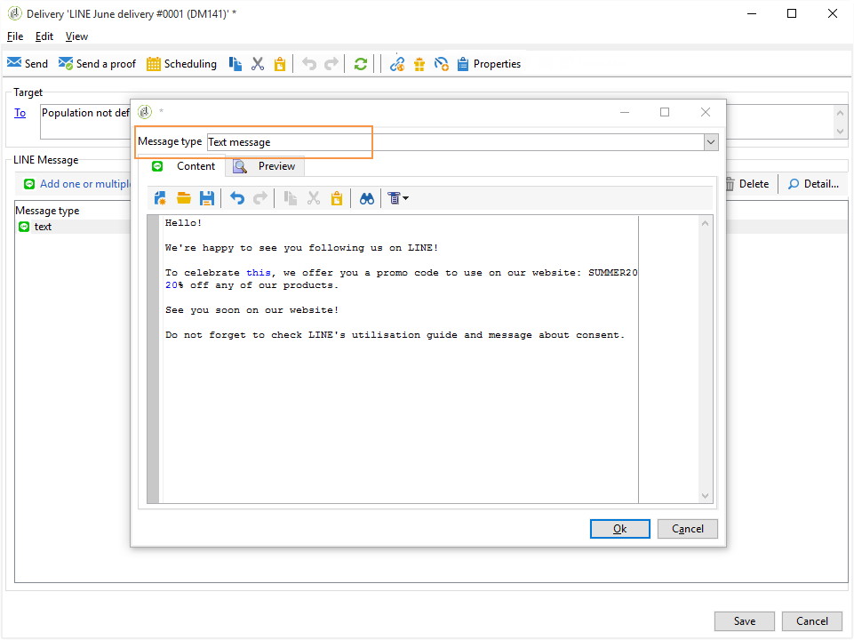

1. Place your cursor in the place where you want to insert the personalized text and click the drop-down icon then select **[!UICONTROL Visitor > First name]**.

   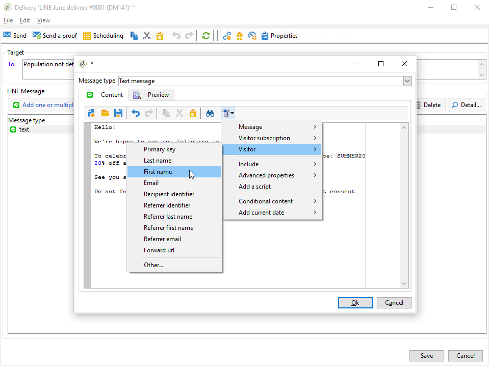

1. Follow the same procedure to add an image, selecting **[!UICONTROL Image and links]** in the **[!UICONTROL Message type]** drop-down.

   Add your image URL.

   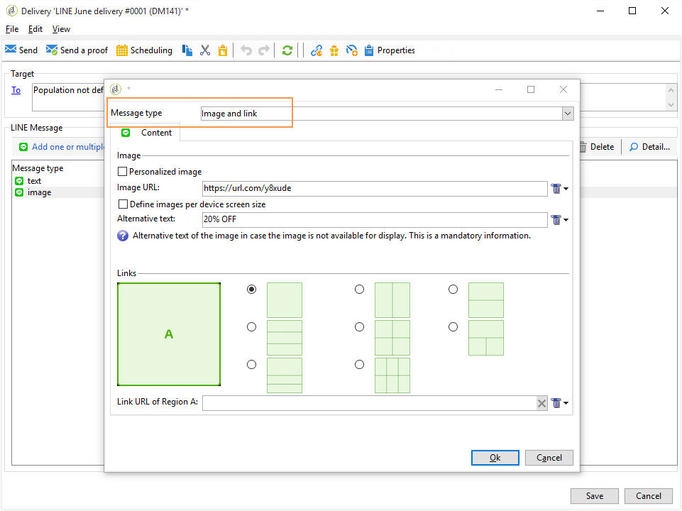

1. In the **[!UICONTROL Links]** section, select the layout that will divide your image in multiple clickable regions.
1. Assign an URL to each region of your image.

   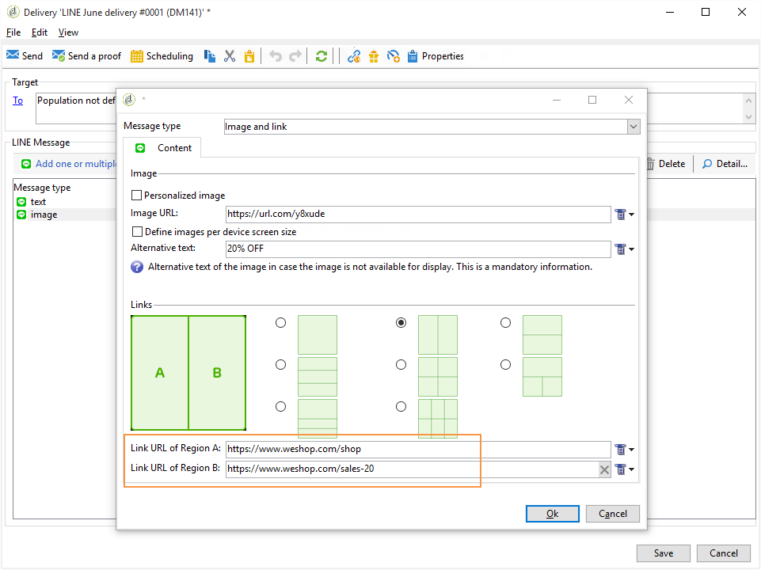

1. Save your delivery then click **[!UICONTROL Send]** to analyze and send it to the target.

   The delivery is sent to the target.

   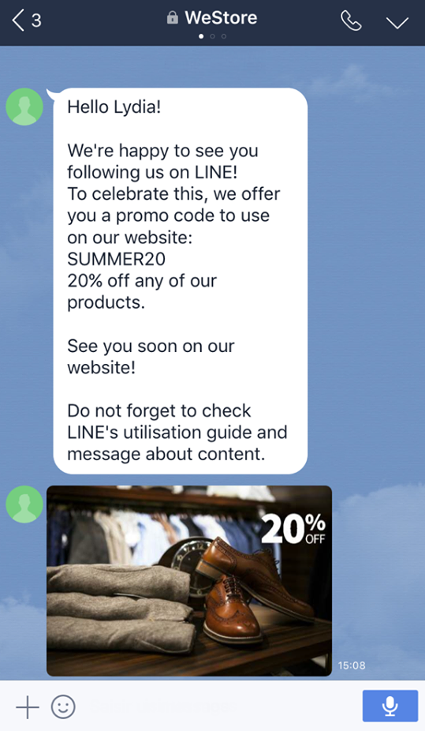
