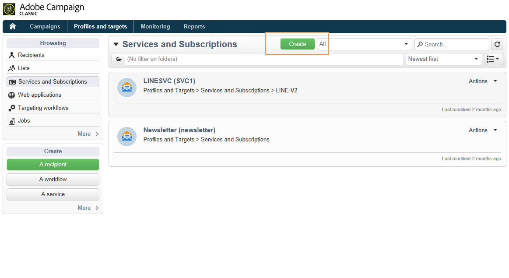
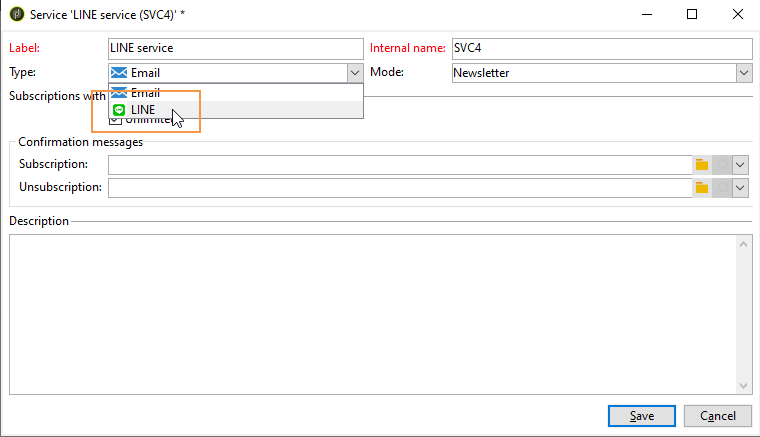
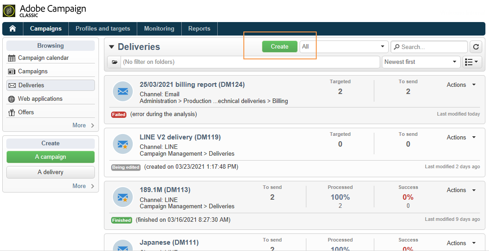
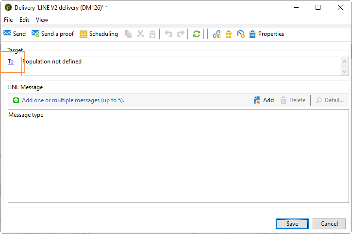
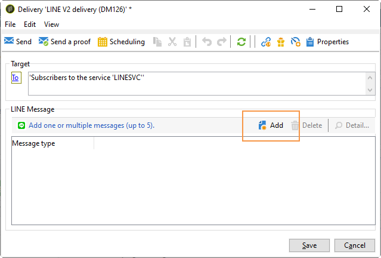
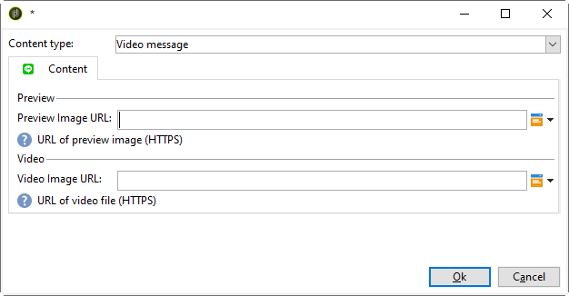

# Create LINE deliveries{#line-channel}

>[!NOTE]
>
>[!DNL LINE] is only available for on-premise or managed services installations.

[!DNL LINE] is an application for free instant messaging, voice and video calls, available on every mobile OS and on PC.

[!DNL LINE] can also be combined with the transactional message module to send real time messages on the [!DNL LINE] app installed in consumer mobile devices. For more on this, refer to this [page](../../message-center/using/transactional-messaging-architecture.md#transactional-messaging-and-line).

The steps for using the [!DNL LINE] channel are:

1. [Set up LINE channel](#setting-up-line-channel)
1. [Create a delivery](#creating-the-delivery)
1. [Configure the content type](#defining-the-content)
1. [Monitoring the delivery (tracking, quarantining, reports, etc.)](#accessing-reports)

## Set up LINE channel {#setting-up-line-channel}

Before creating a [!DNL LINE] account and external account, you first need to install the LINE package on your instance. For more information on this, consult the [LINE](../../installation/using/installing-campaign-standard-packages.md#line-package) section in the Installation guide.

You must first create a [!DNL LINE] account, so that you can then link it to Adobe Campaign. Then, you can send [!DNL LINE] messages to the users that have added your [!DNL LINE] account in their mobile application. External accounts and [!DNL LINE] account can only be managed by the functional administrator of the platform.

To create and configure a [!DNL LINE] account, see [LINE developers documentation](https://developers.line.me/).

### Create and configure LINE service {#configure-line-service}

To create your [!DNL LINE] service: 

1. From the Adobe Campaign Classic homepage, select the **[!UICONTROL Profiles and Targets]** tab.

1. In the left-hand menu, select **[!UICONTROL Services and Subscriptions]** and click **[!UICONTROL Create]**.

   

1. Add a **[!UICONTROL Label]** and **[!UICONTROL Internal name]** to your new service.

1. Select **[!UICONTROL LINE]** from the **[!UICONTROL Type]** drop-down.

   

1. Click **[!UICONTROL Save]**.

For more information on subscriptions and services, see [Managing subscriptions](managing-subscriptions.md).

### Configure LINE external account {#configure-line-external}

After creating your [!DNL LINE] service, you need to configure the [!DNL LINE] external account on Adobe Campaign:

1. In the **[!UICONTROL Administration]** > **[!UICONTROL Platform]** tree structure, click the **[!UICONTROL External Accounts]** tab.

1. Select the built-in **[!UICONTROL LINE V2 routing]** external account.

   

1. Click the **[!UICONTROL LINE]** tab from your external account to start configuring your external account. Fill the following fields:

   

    * **[!UICONTROL Channel Alias]**: is provided via your [!DNL LINE] account in the **[!UICONTROL Channels]** > **[!UICONTROL Technical configuration]** tab.
    * **[!UICONTROL Channel ID]**: is provided via your [!DNL LINE] account in the **[!UICONTROL Channels]** > **[!UICONTROL Basic Information panel]** tab.
    * **[!UICONTROL Channel secret key]**: is provided via your [!DNL LINE] account in the **[!UICONTROL Channels]** > **[!UICONTROL Basic Information panel]** tab.
    * **[!UICONTROL Access token]**: is provided via your [!DNL LINE] account in the developer portal or by clicking the **[!UICONTROL Get access token]** button.
    * **[!UICONTROL Access token expiration date]**: allows you to specify the expiration date of the Access token.
    * **[!UICONTROL LINE subscription service]**: allows you to specify the services to which the users will be subscribed.

1. Once your configuration is done, click **[!UICONTROL Save]**.

1. From the **[!UICONTROL Explorer]**, select **[!UICONTROL Administration]** > **[!UICONTROL Production]** > **[!UICONTROL Technical workflows]** > **[!UICONTROL LINE workflows]** to check if the **[!UICONTROL LINE V2 access token update (updateLineAccessToken)]** and **[!UICONTROL Delete blocked LINE users (deleteBlockedLineUsers)]** workflows have started.

The [!DNL LINE] is now configured in Adobe Campaign, you can start creating and sending LINE deliveries to subscribers.

## Create LINE delivery {#creating-the-delivery}

>[!NOTE]
>
>When sending a [!DNL LINE] delivery to a new recipient for the first time, you must add the official LINE message regarding the terms of use and consent into the delivery. The official message is available at the [following link](https://terms.line.me/OA_privacy/).

To create a [!DNL LINE] delivery you have to follow these steps:

1. From the **[!UICONTROL Campaigns]** tab, select **[!UICONTROL Deliveries]** then click the **[!UICONTROL Create]** button. 

   

1. Select **[!UICONTROL LINE V2 delivery]** delivery template.

   

1. Identify your delivery with a **[!UICONTROL Label]**, **[!UICONTROL Delivery code]**, and  **[!UICONTROL Description]**. For more on this, refer to [this section](steps-create-and-identify-the-delivery.md#identifying-the-delivery). 
   
1. Click **[!UICONTROL Continue]** to create your delivery.

1. In the delivery editor, select **[!UICONTROL To]** to target the recipients of your [!DNL LINE] delivery. Targeting is carried out on **[!UICONTROL Visitor subscriptions (nms:visitorSub)]**.
   
   For more information, refer to [Identifying target populations](steps-defining-the-target-population.md). 

   

1. Click **[!UICONTROL Add]** to select your **[!UICONTROL Delivery target population]**.

   

1. Choose if you want to target [!DNL LINE] subscribers directly or if you want to target users depending on their [!DNL LINE] subscription and click **[!UICONTROL Next]**. In this example, we selected **[!UICONTROL By LINE V2 subscription]**.

1. Select **[!UICONTROL Line-V2]** in the **[!UICONTROL Folder]** drop-down then your [!DNL LINE] service. Click **[!UICONTROL Finish]** then **[!UICONTROL Ok]** to start personalizing your delivery.

   

1. From your delivery editor, click **[!UICONTROL Add]** to add one or multiple message and select the **[!UICONTROL Content type]**. 

   For more information on the different **[!UICONTROL Content type]** available, refer to [Define the content type](#defining-the-content).

   

1. When your delivery is created and configured correctly, you can send it to the target defined earlier. 
   
   For more information on sending a delivery, refer to [Send messages](sending-messages.md).

1. After sending your message, access your report to measure the effectiveness of your delivery. 
   
   For more information on [!DNL LINE] reports, refer to [Access reports](#accessing-reports).

## Define the content type {#defining-the-content}

To define the content of a [!DNL LINE] delivery, you first have to add message type to your delivery. Each [!DNL LINE] delivery can contain up to 5 messages.

You can choose between three message types:

* [Text message](#configuring-a-text-message-delivery)
* [Image and link](#configuring-an-image-and-link-delivery)
* [Video message](#configuring-a-video-message-delivery)

### Configuring a Text message delivery {#configuring-a-text-message-delivery}

>[!NOTE]
>
>The `<%@ include option='NmsServer_URL' %>/webApp/APP3?id=<%=escapeUrl(cryptString(visitor.id))%>` syntax allows you to include a link to a web app in a LINE message.

A **[!UICONTROL Text message]** [!DNL LINE] delivery is a message sent to recipients in text form. 

The configuration for this type of message is similar to the configuration of the **[!UICONTROL Text]** in an email. For more information, refer to this [page](defining-the-email-content.md#message-content).

### Configuring an Image and link delivery {#configuring-an-image-and-link-delivery}

An **[!UICONTROL Image and link]** [!DNL LINE] delivery is a message sent to recipients in the form of an image that may contain one or multiple URLs.

You can use:

* a **[!UICONTROL Personalized image]**,

  >[!NOTE]
  >
  >You can use the **%SIZE%** variable to optimize the image display according to the screen size of the recipient's mobile device.

  

* an **[!UICONTROL Image URL]** per device screen size,

  

  The **[!UICONTROL Define images per device screen size]** option allows you to use different image resolutions to optimize delivery visibility on mobile devices. Only images with same height and width are supported.

  Images can be defined according to the screen size:

  * 1040px
  * 700px
  * 460px
  * 300px
  * 240px

  >[!CAUTION]
  >
  >The 1040x1040 px size is mandatory for every LINE image with link.

  You then have to add alternative text that will pop up on the recipient's mobile device.

* and **[!UICONTROL Links]**.

  The **[!UICONTROL Links]** section allows you to choose between different layouts that will divide your image in multiple clickable regions. You can then assign each of them a dedicated **[!UICONTROL Link URL]**.

  

### Configuring a Video message delivery {#configuring-a-video-message-delivery}

A **[!UICONTROL Video message]** [!DNL LINE] delivery is a message sent to recipients in the form of a video that can contain an URL.

The **[!UICONTROL Preview Image URL]** field allows you to add the URL of a preview image with a character limit of 1000. JPEG and PNG are supported with a file size limit of 1 MB.

The **[!UICONTROL Video Image URL]** field allows you to add the URL of your video file with a character limit of 1000. Only mp4 format is supported with a file size limit of 200 MB.

Note that wide or tall videos may be cropped when played on some devices.

  

## Accessing reports {#accessing-reports}

After sending your delivery, you can view your [!DNL LINE] reports via the menu **[!UICONTROL Campaign Management]** > **[!UICONTROL Deliveries]** from the **[!UICONTROL Explorer]**.
   
   >[!NOTE]
   >
   >The tracking reports indicate the click-through rate. [!DNL LINE] does not take the open rate into account.

 
For [!DNL LINE] service reports, access the menu **[!UICONTROL Profiles and Targets]** > **[!UICONTROL Services and Subscriptions]** > **[!UICONTROL LINE-V2]** from the **[!UICONTROL Explorer]** tab. Then click the **[!UICONTROL Reports]** icon in the [!DNL LINE] service.

## Example: create and send a personalized LINE message {#example--create-and-send-a-personalized-line-message}

In this example, we are going to create and configure a text message and an image containing data that will be personalized according to the recipient.

1. Create your [!DNL LINE] delivery by clicking the **[!UICONTROL Create]** button from the **[!UICONTROL Campaign]** tab.

   

1. Select the **[!UICONTROL LINE V2 delivery]** delivery template and name your delivery.

   

1. In the configuration window of your delivery, select your target population.

   For more information, refer to [Identifying target populations](steps-defining-the-target-population.md). 

   

1. Click **[!UICONTROL Add]** to create your message and select the **[!UICONTROL Content type]**.

   Here, we first want to create a **[!UICONTROL Text message]**.

   

1. Place your cursor where you want to insert the personalized text and click the drop-down icon then select **[!UICONTROL Visitor]** > **[!UICONTROL First name]**.

   

1. Follow the same procedure to add an image, selecting **[!UICONTROL Image and links]** in the **[!UICONTROL Message type]** drop-down.

   Add your **[!UICONTROL Image URL]**.

   

1. In the **[!UICONTROL Links]** section, select the layout that will divide your image in multiple clickable regions.

1. Assign an URL to each region of your image.

   

1. Save your delivery then click **[!UICONTROL Send]** to analyze and send it to the target.

   The delivery is sent to the target.

   

