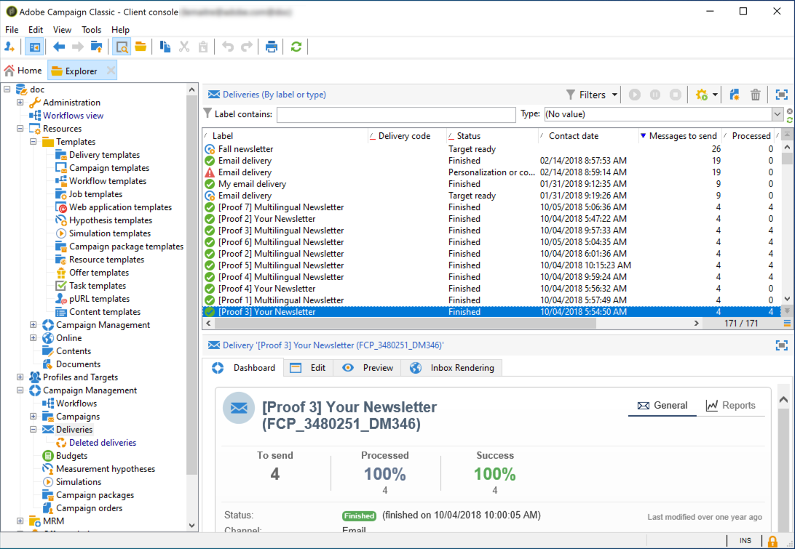

# Accessing the list of deliveries {#list-of-deliveries}

You can access deliveries from the delivery list, via the **[!UICONTROL Campaign Management > Deliveries]** node of the tree.

By default, the list of deliveries contains the names and statuses of the deliveries created in the selected node. It also shows the number of messages to send, processed and sent with success.

* The number of **[!UICONTROL Messages to send]** corresponds to the number of recipients targeted after analysis and prior to delivery.
* The number of messages in the **[!UICONTROL Success]** column corresponds to the number of messages sent by the server and received by the recipients.
* The number of **[!UICONTROL Processed]** messages corresponds to the number of messages received plus the number of messages with errors.

>[!NOTE]
>
>For large deliveries, you may wish to update these values. To do this, select the delivery in question and then right-click it. Select **[!UICONTROL Action > Recompute delivery and tracking indicators...]** and then use the wizard to update this information.

**Related topics:**

* [Delivery dashboard](../../delivery/using/delivery-dashboard.md)
* [Delivery statuses](../../delivery/using/delivery-statuses.md)
