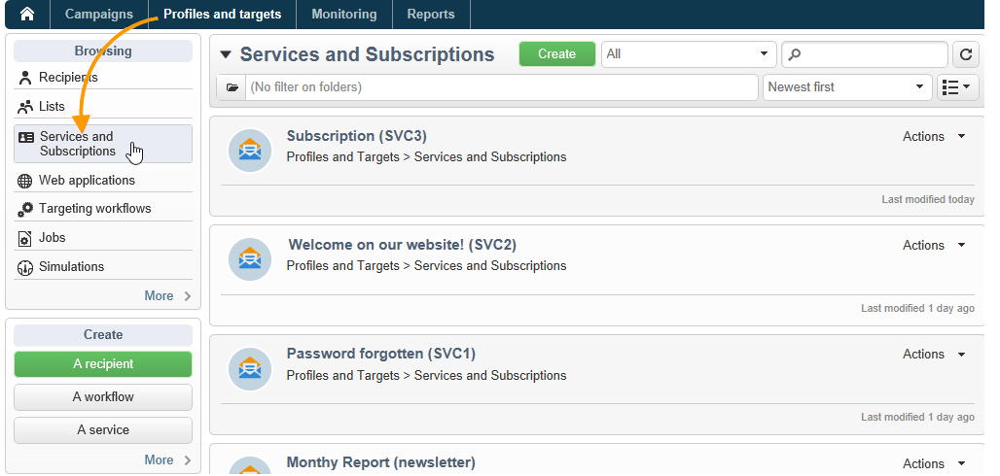
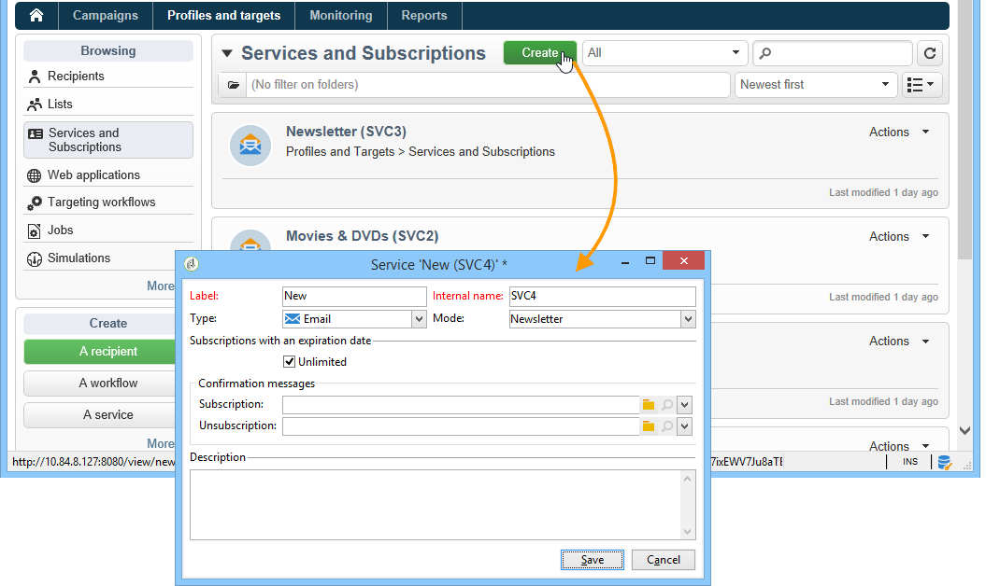
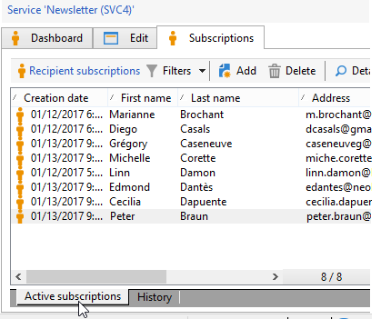
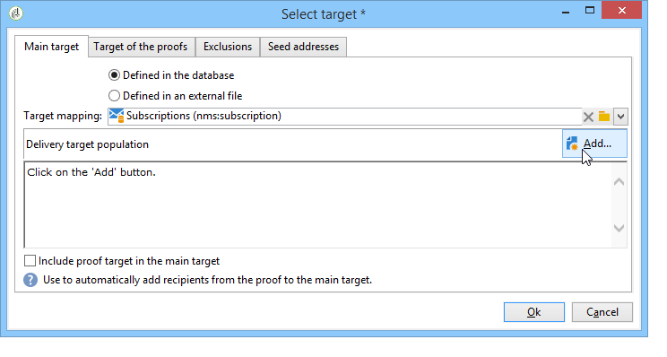
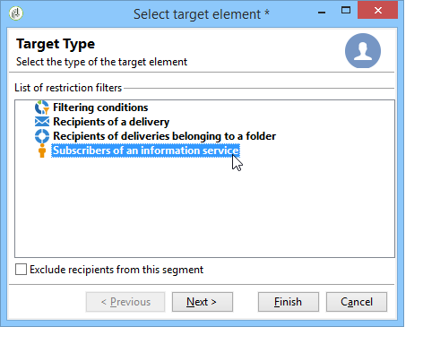
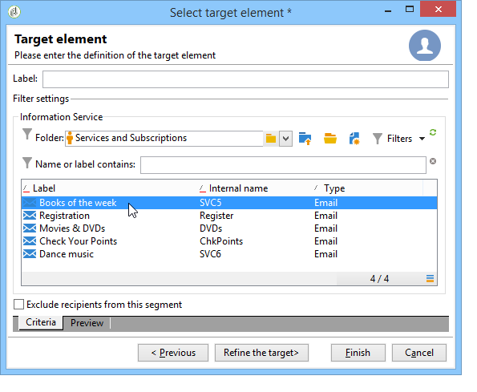
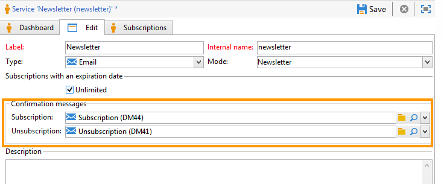
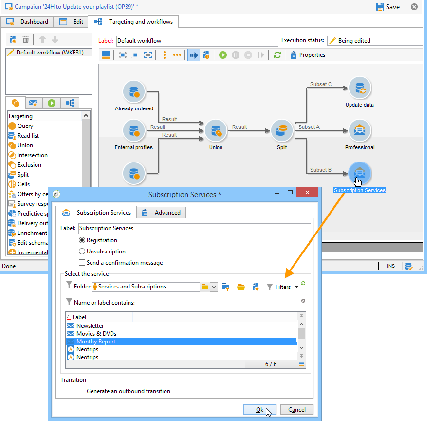
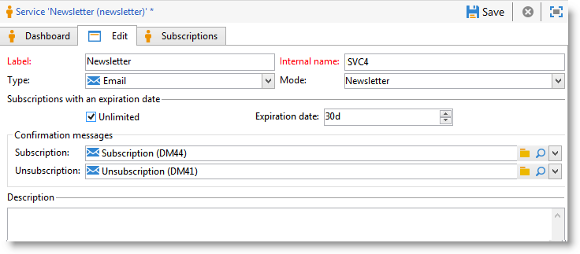
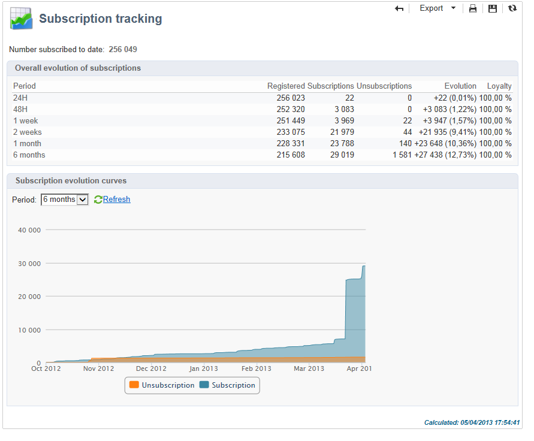

# Managing subscriptions{#managing-subscriptions}

## About information services {#about-information-services}

An information service comprises:

* Registration and subscription (opt-in),
* Deregistration, voluntary unsubscription (opt out) or automatic unsubscription (limited-time service, for example as a trial offer),
* Subscription and unsubscription confirmation mechanisms (simple mechanisms with confirmation, double opt in, etc.),
* Tracking of subscriber history.

As a standard feature, these services include specific statistical reports: subscriber tracking, loyalty level, unsubscription trends, etc.

For emails, the mandatory unsubscription links are generated automatically, and the entire opt in/opt out process us fully automated, with history tracking to guarantee full compliance with the regulations in force.

There are three service subscription/unsubscription modes:

1. manual
1. by importing (subscription only),
1. via a web form

>[!NOTE]
>
>A sample to create a subscription form with double opt-in is detailed in [this section](../../web/using/use-cases--web-forms.md#create-a-subscription--form-with-double-opt-in).

## Creating an information service {#creating-an-information-service}

You can create and manage subscriptions to information services with associated confirmation messages or automatic deliveries to subscribers.

To access the information services map, open the **[!UICONTROL Profiles and Targets]** tab and click the **[!UICONTROL Services and Subscriptions]** link. 

To edit an existing service, click its name. To create a service, click the **[!UICONTROL Create]** button located above the list.

* Enter the name of the service in the **[!UICONTROL Label]** field and select the delivery channel: email, mobile, Facebook, Twitter, or mobile applications.

  >[!NOTE]
  >
  >Facebook and Twitter subscriptions are detailed in [this section](../../social/using/about-social-marketing.md). Mobile application subscriptions are detailed in [About mobile app channel](about-mobile-app-channel.md).

* For an Email type service, select the **Delivery mode**. The possible modes are: **[!UICONTROL Newsletter]** or **[!UICONTROL Viral]**.
* You can send **confirmation messages** for a subscription or unsubscription. To do this, select the delivery templates to be used to create the corresponding deliveries from the **[!UICONTROL Subscription]** and **[!UICONTROL Unsubscription]** fields. These templates must be configured with a **[!UICONTROL Subscription]** type target mapping, without a defined target. See section [About email channel](about-email-channel.md).
* By default, subscriptions are unlimited. You can deselect the **[!UICONTROL Unlimited]** option to define a validity duration for the service. The duration can be specified in days (**[!UICONTROL d]** ) or months (**[!UICONTROL m]** ).

Once the service has been saved, it is added to the Services and Subscriptions list: Click its name to edit it. Several tabs are available. The **[!UICONTROL Subscriptions]** tab lets you look at the list of subscribers to the information service (**[!UICONTROL Active subscriptions]** tab) or the subscription/unsubscription history (**[!UICONTROL History]** tab). You can also add and delete subscribers from this tab. See [Adding and deleting subscribers](#adding-and-deleting-subscribers). 

The **[!UICONTROL Detail...]** button lets you look at the subscription properties for the selected recipient.

You can modify the subscription properties for a recipient.

On the dashboard, click the **[!UICONTROL Reports]** tab to track subscriptions: changes in subscription levels, total number of subscribers, etc. You can archive reports and look at histories from this tab.

## Adding and deleting subscribers {#adding-and-deleting-subscribers}

From the **[!UICONTROL Subscriptions]** tab of an information service click **[!UICONTROL Add]** to add subscribers. You can also right-click the list of subscribers and select **[!UICONTROL Add]**. Select the folder in which the profiles to be subscribed are stored, and then select the profiles to subscribe and click **[!UICONTROL OK]** to validate.

To delete subscribers, select them and click **[!UICONTROL Delete]**. You can also right-click the subscriber list and select **[!UICONTROL Delete]**.

In both cases, you can send a confirmation message to the users concerned if a delivery template for unsubscriptions has been attached to the service (see [Creating an information service](#creating-an-information-service)). A warning lets you validate or not validate this delivery:

See [Subscription and unsubscription mechanisms](#subscription-and-unsubscription-mechanisms).

## Delivering to the subscribers of a service {#delivering-to-the-subscribers-of-a-service}

To deliver to the subscribers of an information service, you can target the subscribers to the information service concerned, as in the following example:

>[!CAUTION]
>
>The target mapping must be **[!UICONTROL Subscriptions]**.

Select **[!UICONTROL Subscribers of an information service]** and click **[!UICONTROL Next]**.

Select the targeted information service and click **[!UICONTROL Finish]**.

The **[!UICONTROL Preview]** tab lets you view the list of subscribers to the selected information service.

## Subscription and unsubscription mechanisms {#subscription-and-unsubscription-mechanisms}

You can set up subscription and unsubscription mechanisms to automate the processes and subscriber management.

>[!NOTE]
>
>You can send a confirmation message to new subscribers.   
>The content of this message is defined in the information service configuration via the **[!UICONTROL Subscription]** or **[!UICONTROL Unsubscription]** fields.
>
>The confirmation messages are created via the delivery templates specified in these fields. These target mappings must be **[!UICONTROL Subscriptions]**.

### Subscribing a recipient to a service {#subscribing-a-recipient-to-a-service}

To register recipients for an information service, you can:

* Manually add the service: to do this, from the **[!UICONTROL Subscriptions]** tab of their profile, click **[!UICONTROL Add]** and select the information service concerned.

  For more on this, refer to the section on profile editing in [this section](../../platform/using/editing-a-profile.md).

* Automatically subscribe a set of recipients to this service. The list of recipients can come from a filtering operation, a group, a folder, an import, or a direct selection using the mouse. To subscribe these recipients, select the profiles and right-click. Select **[!UICONTROL Actions > Subscribe selection to a service...]**, select the service concerned, and launch the operation.
* Import recipients and subscribe them automatically to an information service. To do this, select the service concerned in the last step of the import wizard.

  For more on this, refer to [this section](../../platform/using/executing-import-jobs.md).

* Use a web form so that recipients can subscribe to a service.

  For more on this, refer to [this section](../../web/using/about-web-applications.md).

* Creating a targeting workflow and using a **[!UICONTROL Subscription service]** box.

  

  Workflows and how to use them is detailed in [this section](../../workflow/using/about-workflows.md).

### Unsubscribing a recipient from a service {#unsubscribing-a-recipient-from-a-service}

#### Manual unsubscribing {#manual-unsubscribing}

email deliveries must contain an unsubscription link, by law. Recipients can click this link to update their profile and be excluded from the targets of future deliveries.

The default unsubscription link is inserted via the last button in the toolbar of the content editor provided in the delivery wizard (see [About personalization](about-personalization.md)). When the recipient clicks this link, the profile is added to the denylist (opt-out), meaning that this recipient will no longer be targeted by any delivery action.

Recipients can, however, choose to unsubscribe from a service without unsubscribing from all services. To allow this, you can use a web form (refer to [this section](../../web/using/adding-fields-to-a-web-form.md#subscription-checkboxes)) or insert a personalized unsubscription link (see [Personalization blocks](personalization-blocks.md)).

You can also unsubscribe a recipient manually from the recipient profile. To do this, click the **[!UICONTROL Subscriptions]** tab of the recipient concerned, select the information service(s) concerned, and click **[!UICONTROL Delete]**.

You can finally unsubscribe one or more recipients via the information service concerned. To do this, click the **[!UICONTROL Subscriptions]** tab of the service, select the recipients concerned and click **[!UICONTROL Delete]**.

#### Automatic unsubscription {#automatic-unsubscription}

An information service can have a limited duration. Recipients will be unsubscribed automatically when the period of validity has expired. This period is specified in the **[!UICONTROL Edit]** tab of the service properties. It is expressed in days.

You can also set up an unsubscription workflow for a population. To do this, follow the same procedure as for a subscription workflow, but select the **[!UICONTROL Unsubscription]** option. See [Subscribing a recipient to a service](#subscribing-a-recipient-to-a-service).

### Subscriber tracking {#subscriber-tracking}

You can track the changes in subscriptions to the information services using the **[!UICONTROL Reports]** link on the dashboard.

