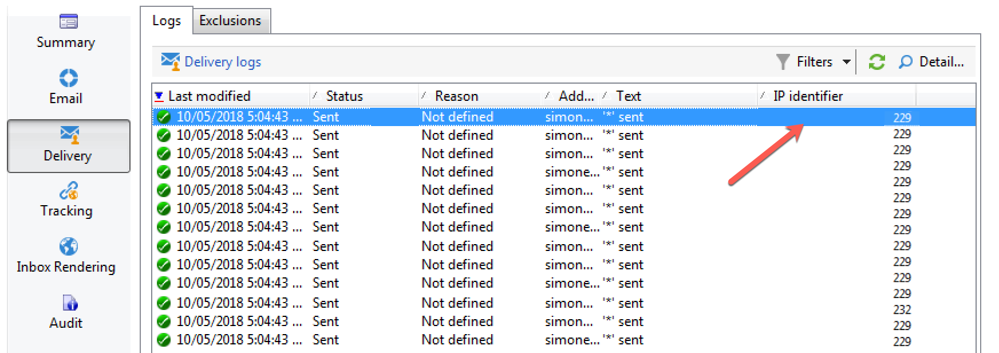

# Delivery monitoring interface {#monitoring-a-delivery}

## Delivery dashboard {#delivery-dashboard}

The **delivery dashboard** is key to monitor your deliveries and eventual issues encountered during the sending of messages.

**Related topics:**

* [Understanding delivery failures](../../delivery/using/understanding-delivery-failures.md)
* [Understanding quarantine management](../../delivery/using/understanding-quarantine-management.md)
* [Delivery best practices](../../delivery/using/delivery-best-practices.md)
* [Managing deliverability](../../delivery/using/about-deliverability.md)

To view the information on a delivery, edit it, view the dashboard and click the available tabs.

Tab contents may no longer be changed once the delivery has been sent. 


## Delivery summary {#delivery-summary}

The **[!UICONTROL Summary]** tab contains the characteristics of the delivery: delivery status, channel used, information about the sender, subject, information concerning execution. For more on this, refer to [Number of messages sent](#number-of-messages-sent).

The **[!UICONTROL reports]** link lets you look at a set of reports concerning the delivery action: general delivery report, detailed report, delivery report, distribution of failed messages, opening rate, clicks and transactions, etc. The contents of this tab can be configured according to your requirements. For more information, refer to [this section](../../reporting/using/delivery-reports.md).

## Delivery logs and history {#delivery-logs-and-history}

The **[!UICONTROL Delivery]** tab gives a history of the occurrences in this delivery. It contains the delivery logs, i.e. the list of messages sent and their status and the associated messages.

For a delivery, you can display (for example) only recipients with a failed delivery or an address in quarantine. To do this, click the **[!UICONTROL Filters]** button and select **[!UICONTROL By state]**. Then select the state in the drop-down list.


Various statuses are listed on [this page](#delivery-statuses).

>[!NOTE]
>
>The **[!UICONTROL Display the mirror page for this message...]** link lets you view the mirror page for the contents of the delivery selected from the list in a new window. The mirror page is available only for deliveries for which HTML content has been defined. For more on this, refer to [Generating the mirror page](../../delivery/using/sending-messages.md#generating-the-mirror-page).

## Tracking logs {#tracking-logs}

The **[!UICONTROL Tracking]** tab lists the tracking history for this delivery. This tab displays tracking data for the messages sent, i.e. all URLs subject to tracking by Adobe Campaign. The tracking data is updated hourly.

>[!NOTE]
>
>If tracking isn't enabled for a delivery, this tab isn't displayed.

Tracking configuration is performed at the appropriate stage in the delivery wizard. See [How to configure tracked links](../../delivery/using/how-to-configure-tracked-links.md).

**[!UICONTROL Tracking]** data is interpreted in the delivery reports. See [this section](../../reporting/using/delivery-reports.md).


## Delivery audit {#delivery-audit-}

The **[!UICONTROL Audit]** tab contains the delivery log and all the messages concerning the proofs. The **[!UICONTROL Refresh]** button lets you update the data. Use the **[!UICONTROL Filters]** button to define a filter on the data.

Special icons enable you to identify errors or warnings. See [Analyzing the delivery](../../delivery/using/steps-validating-the-delivery.md#analyzing-the-delivery).

The **[!UICONTROL Proofs]** sub-tab lets you view the list of proofs that have been sent.


You can modify the information displayed in this window (and that of the **[!UICONTROL Delivery]** and **[!UICONTROL Tracking]** tabs) by selecting the columns to be displayed. To do this, click the **[!UICONTROL Configure list]** icon located in the lower right-hand corner. For more on configuring list display, refer to [this section](../../platform/using/adobe-campaign-workspace.md#configuring-lists).

## Number of messages sent {#number-of-messages-sent}

You can access deliveries from the delivery list, via the **[!UICONTROL Campaign Management > Deliveries]** node of the tree.

By default, the list of deliveries contains the names and statuses of the deliveries created in the selected node. It also shows the number of messages to send, processed and sent with success.

* The number of **[!UICONTROL Messages to send]** corresponds to the number of recipients targeted after analysis and prior to delivery.
* The number of messages in the **[!UICONTROL Success]** column corresponds to the number of messages sent by the server and received by the recipients.
* The number of **[!UICONTROL Processed]** messages corresponds to the number of messages received plus the number of messages with errors.

The delivery dashboard lets you track the number of messages sent.

>[!NOTE]
>
>For large deliveries, you may wish to update these values. To do this, select the delivery in question and then right-click it. Select **[!UICONTROL Action > Recompute delivery and tracking indicators...]** and then use the wizard to update this information.

## Use case: How to know which IPs send emails

In this section, you will learn how to define which IP sent each email in a delivery.

>[!NOTE]
>
>This modification is different if you are using a single instance or mid-sourcing instance. Before doing the modification ensure you're connected to email sending instance.

### Step 1: Extend the schema

To add **publicID** in your delivery logs you need to extend the schema first. You can proceed as follow.

1. Create a schema extension, under **[!UICONTROL Administration]** > **[!UICONTROL Configuration]** > **[!UICONTROL Data Schemas]** > **[!UICONTROLNew]**.

    For more information about schema extensions, refer to [this page](../../configuration/using/extending-a-schema.md).

1. Select **[!UICONTROL broadLogRcp]** to extend the Recipient delivery logs (nms) and define a custom Namespace. In this case it will be "cus":

    

    >[!NOTE]
    >
    >If your instance is in Mid-sourcing, you need to work with broadLogMid schema.

1. Add the new field in your extension. In this sample, you need to replace:

    ```
    <element img="nms:broadLog.png" label="Recipient delivery logs" labelSingular="Recipient delivery log" name="broadLogRcp"/>
    ```

    by:

    ```
    <element img="nms:broadLog.png" label="Recipient delivery logs" labelSingular="Recipient delivery log" name="broadLogRcp">
    <attribute desc="Outbound IP identifier" label="IP identifier"
    name="publicId" type="long"/>
    </element>
    ```

    

### Step 2: Update database structure

Once modifications are done, you need to update database structure so that it is aligned with its logical description.

To do this, follow the steps below:

1. Click the **[!UICONTROL Tools]** > **[!UICONTROL Advanced]** > **[!UICONTROL Update database structure...]** menu.

    

1. In the **[!UICONTROL Edit tables]** window, the **[!UICONTROL NmsBroadLogRcp]** table is checked (or the **[!UICONTROL broadLogMid]** table if your are in a Mid-sourcing environment), as below:

    

    >[!IMPORTANT]
    >
    >Always ensure there is no other modification, except the **[!UICONTROL NmsBroadLoGRcp]** table (or the **[!UICONTROL broadLogMid]** table if your are in a Mid-sourcing environment). If so, uncheck other tables.

1. Click **[!UICONTROL Next]** to validate. The following screen displays:

    

1. Click **[!UICONTROL Next]**, then **[!UICONTROL Start]** to start updating database structure. Index building is starting. This step can be long, depending on the number of rows in the **[!UICONTROL NmsBroadLogRcp]** table.

    

  >[!NOTE]
  >
  >Once update of the physical structure of the database is sucessfully completed, you need to disconnect and reconnect so that your modifications are taken into account.

### Step 3: Validate the modification

To confirm everything worked correctly, you need to update delivery logs screen.

To do this, access the delivery logs and add the "IP identifier" column.


>[!NOTE]
>
>To learn how to configure lists in Campaign Classic interface, refer to [this page](../../platform/using/adobe-campaign-workspace.md).

Below is what you should see in the **[!UICONTROL Delivery]** tab after modifications:


