# Personalization blocks{#personalization-blocks}

Personalization blocks are dynamic, personalized and contain a specific rendering that you can insert into your deliveries. For example, you can add a logo, a greeting message, or a link to a mirror page. See [Inserting personalization blocks](#inserting-personalization-blocks).

 Discover this feature [in video](#personalization-blocks-video)

Personalization blocks are accessed via the **[!UICONTROL Resources > Campaign Management > Personalization blocks]** node of the Adobe Campaign explorer. Several blocks are available by default (see [Out-of-the-box personalization blocks](#out-of-the-box-personalization-blocks)).

You have the ability to define new blocks that will enable you to optimize your deliveries personalization. For more on this, refer to [Defining custom personalization blocks](#defining-custom-personalization-blocks).

>[!NOTE]
>
>Personalization blocks are also available from the **[!UICONTROL Digital Content Editor (DCE)]** . For more on this, refer to [this page](../../web/using/editing-content.md#inserting-a-personalization-block).

## Inserting personalization blocks {#inserting-personalization-blocks}

To insert a personalization block in a message, follow the steps below:

1. In the content editor of the delivery wizard, click the personalized field icon and select the **[!UICONTROL Include]** menu.
1. Select a personalization block from the list (the list displays the 10 last used blocks), or click the **[!UICONTROL Other...]** menu to access the full list.

   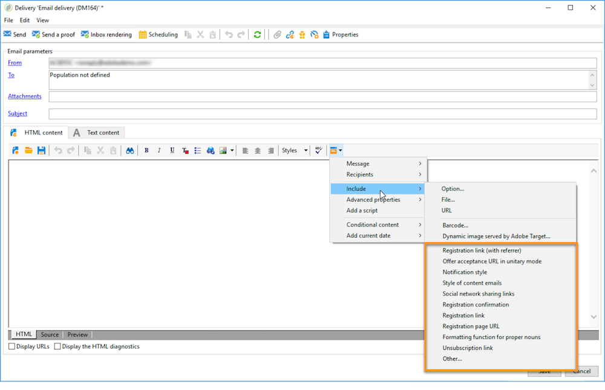

1. The **[!UICONTROL Other...]** menu gives access to all the out-of-the-box and custom personalization blocks (see [Out-of-the-box personalization blocks](#out-of-the-box-personalization-blocks) and [Defining custom personalization blocks](#defining-custom-personalization-blocks)).

   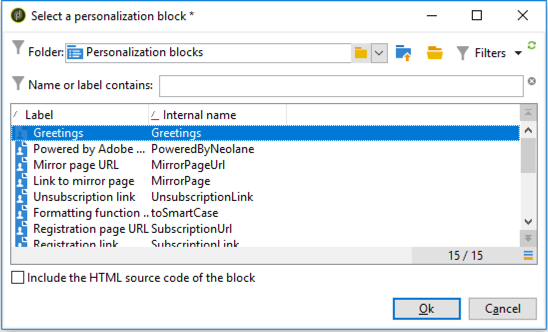

1. The personalization block is then inserted as a script. It is automatically adapted to the recipient profile when personalization is generated.

   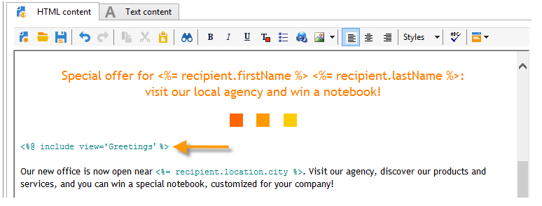

1. Click the **[!UICONTROL Preview]** tab and select a recipient to view the personalization.

   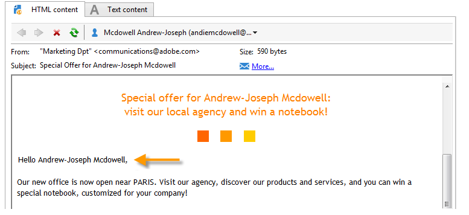

You can include the source code of a personalization block in the delivery content. To do this, select **[!UICONTROL Include the HTML source code of the block]** when selecting it.

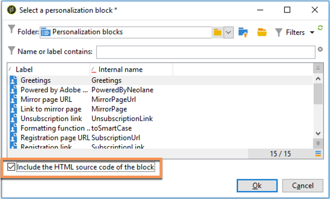

The HTML source code is inserted in the delivery content. For example, the **[!UICONTROL Greetings]** personalization bloc displays as below:

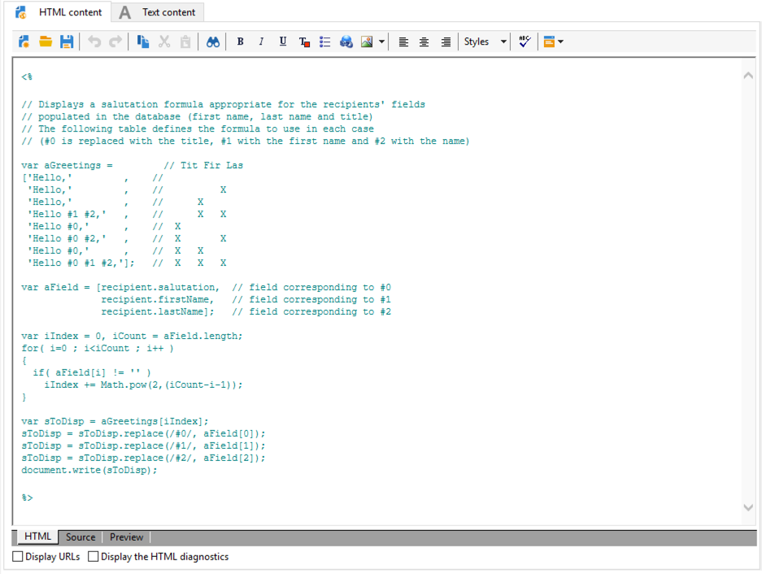

## Personalization blocks example {#personalization-blocks-example}

In this example, we create an email in which we use personalization blocks to enable the recipient to view the mirror page, share the newsletter on social networks, and unsubscribe from future deliveries.

To do this, we need to insert the following personalization blocks:

* **[!UICONTROL Link to mirror page]** .
* **[!UICONTROL Social network sharing links]** .
* **[!UICONTROL Unsubscription link]** .

>[!NOTE]
>
>For more on the mirror page generation, refer to [Generating the mirror page](sending-messages.md#generating-the-mirror-page).

1. Create a new delivery or open an existing email type delivery.
1. In the delivery wizard, click **[!UICONTROL Subject]** to edit the subject of the message and enter a subject.
1. Insert the personalization blocks in the message body. To do this, click in the message content, click the personalized field icon and select the **[!UICONTROL Include]** menu.
1. Select the first block to insert. Renew the procedure to include the two other blocks.

   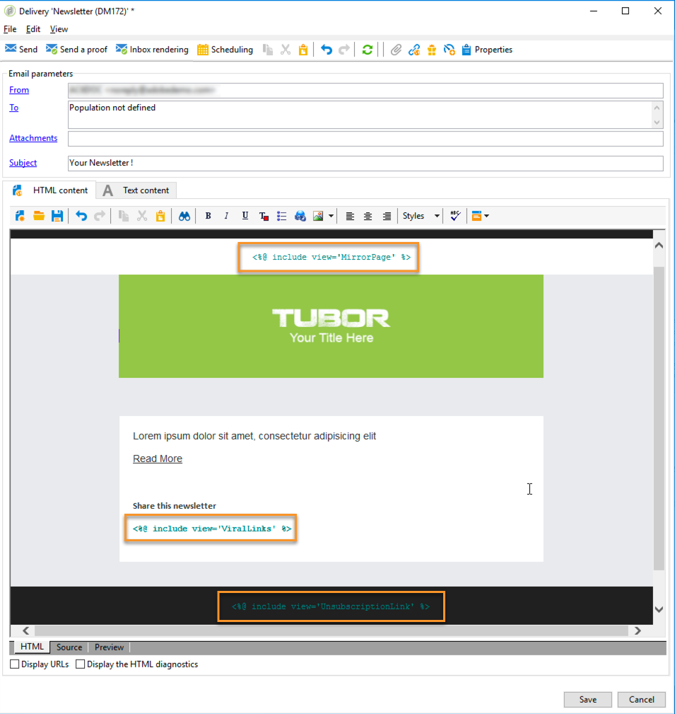

1. Click the **[!UICONTROL Preview]** tab to view the personalization result. You must select a recipient to display that recipient's message.

   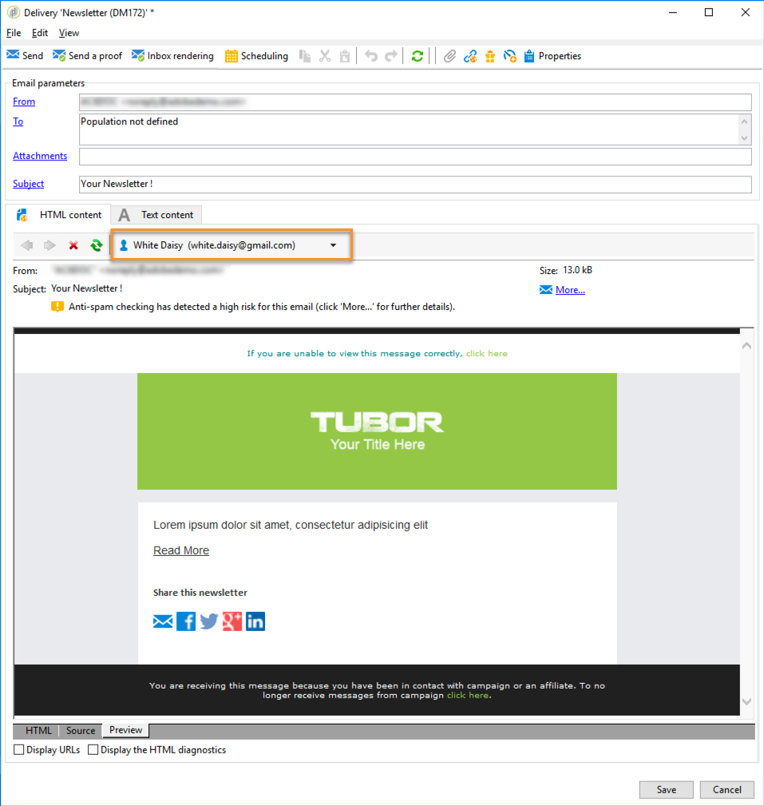

1. Confirm that the block contents are displayed properly.

## Out-of-the-box personalization blocks {#out-of-the-box-personalization-blocks}

A list of personalization blocks is available by default to help you personalize the content of your message.

>[!NOTE]
>
>The list of personalization blocks depends on the modules and options which have been installed on your instance.

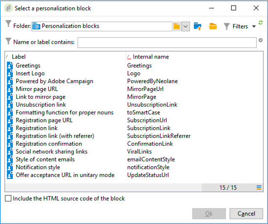

* **[!UICONTROL Greetings]** : inserts greetings with the recipient's name. Example: "Hello John Doe,".
* **[!UICONTROL Insert logo]** : inserts an out-of-the-box logo that has been defined when configuring the instance.
* **[!UICONTROL Powered by Adobe Campaign]** : inserts the "Powered by Adobe Campaign" logo.
* **[!UICONTROL Mirror page URL]** : inserts the mirror page URL, enabling Delivery Designers to check the link.

  >[!NOTE]
  >
  >For more on the mirror page generation, refer to [Generating the mirror page](sending-messages.md#generating-the-mirror-page).

* **[!UICONTROL Link to mirror page]** : inserts a link to the mirror page: "If you are unable to view this message correctly, click here".
* **[!UICONTROL Unsubscription link]** : inserts a link enabling to unsubscribe from all deliveries (denylist).
* **[!UICONTROL Formatting function for proper nouns]** : generates the **[!UICONTROL toSmartCase]** Javascript function, which changes the first letter of each word to uppercase. 
* **[!UICONTROL Registration page URL]** : inserts a subscription URL (see [About services and subscriptions](about-services-and-subscriptions.md)).
* **[!UICONTROL Registration link]** : inserts a subscription link. that has been defined when configuring the instance.
* **[!UICONTROL Registration link (with referrer)]** : inserts a subscription link, enabling to identify the visitor and delivery. The link has been defined when configuring the instance.

  >[!NOTE]
  >
  >This block can be used in deliveries targeting visitors only.

* **[!UICONTROL Registration confirmation]** : inserts a link enabling to confirm subscription.
* **[!UICONTROL Social network sharing links]** : inserts buttons that enable the recipient to share a link to the mirror page content with the email client, Facebook, Twitter, and LinkedIn (see [Viral marketing: forward to a friend](viral-and-social-marketing.md#viral-marketing--forward-to-a-friend)).
* **[!UICONTROL Style of content emails]** and **[!UICONTROL Notification style]** : generate code that format an email with predefined HTML styles. These blocks must be inserted in the source code of the delivery, in the **[!UICONTROL ...]** section, into **``** tags.
* **[!UICONTROL Offer acceptance URL in unitary mode]** : inserts an URL enabling to set an Interaction offer to **[!UICONTROL Accepted]** (see [this section](../../interaction/using/offer-analysis-report.md)).

## Defining custom personalization blocks {#defining-custom-personalization-blocks}

You can define new personalization fields to be inserted from the personalized field icon via the **[!UICONTROL Include...]** menu. These fields are defined in personalization blocks.

To create a personalization block, go to the explorer and apply the following steps:

1. Click the **[!UICONTROL Resources > Campaign Management > Personalization blocks]** node.
1. Right-click the list of blocks and select **[!UICONTROL New]** .
1. Fill in the settings of the personalization block:

   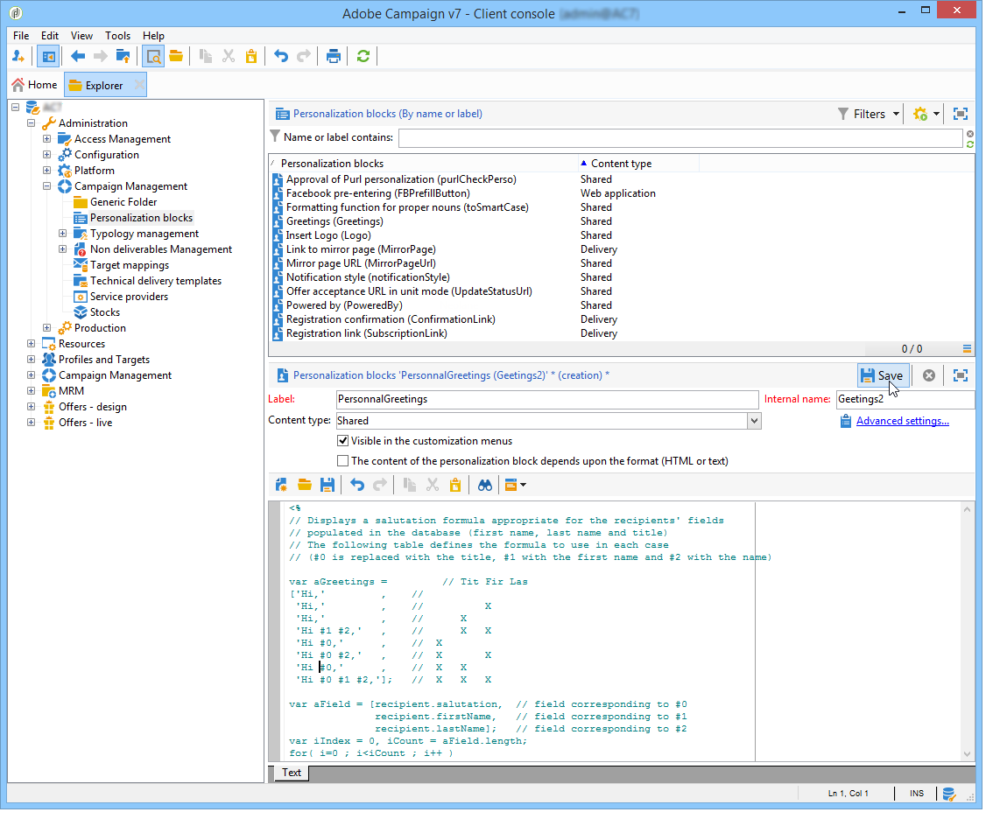

    * Enter the label of the block. This label will be displayed in the personalization field insertion window.
    * Select **[!UICONTROL Visible in the customization menus]** to make this block accessible from the personalization field insertion icon.
    * If necessary, select **[!UICONTROL The content of the personalization block depends upon the format]** to define two separate blocks for emails in HTML format and those in text format.

      Two tabs are then displayed in the lower section of this editor (HTML content and Text content) to define the corresponding contents.

      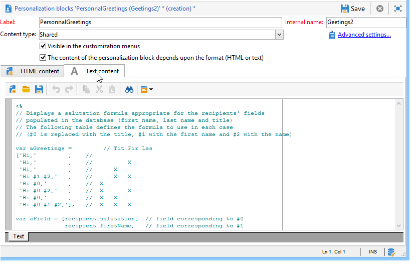

    * Enter the content (in HTML, text, JavaScript, etc.) of the personalization block(s) and click **[!UICONTROL Save]**.

## Tutorial video {#personalization-blocks-video}

Learn how to create dynamic content blocks and how to use them to personalize the content of your email delivery.

>[!VIDEO](https://video.tv.adobe.com/v/24924?quality=12)

Additional Campaign Classic how-to videos are available [here](https://experienceleague.adobe.com/docs/campaign-classic-learn/tutorials/overview.html).
