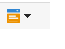
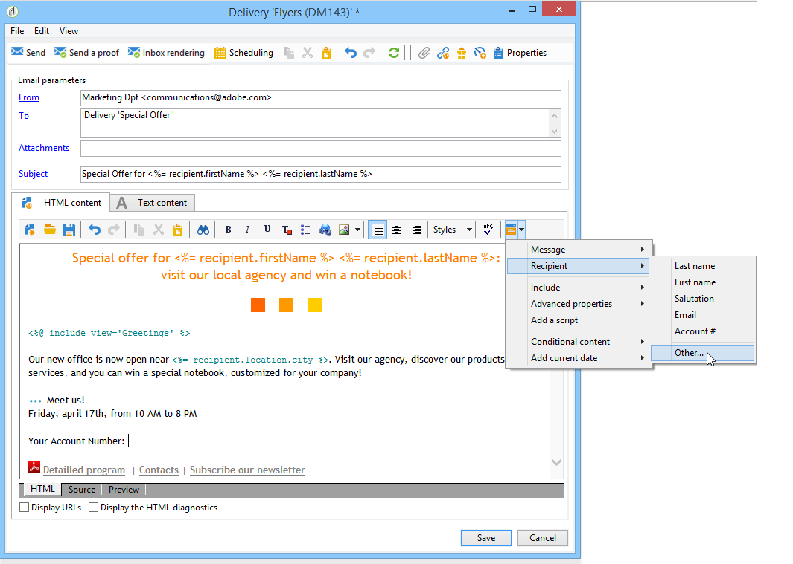
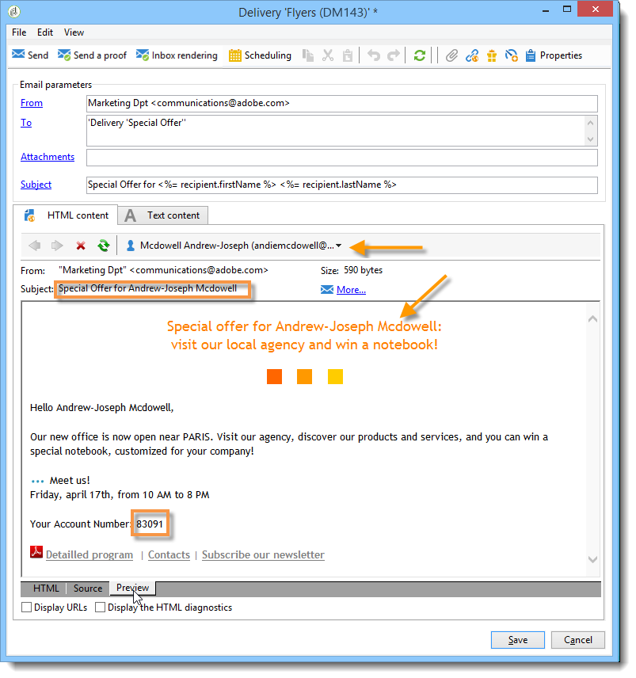
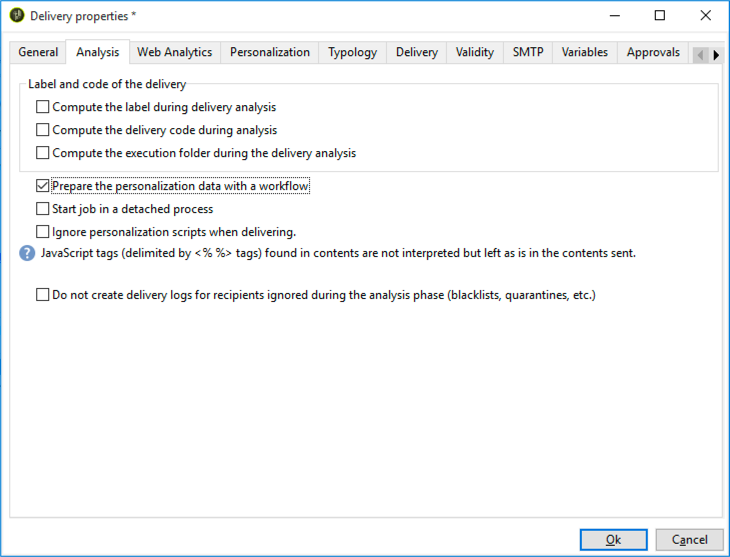
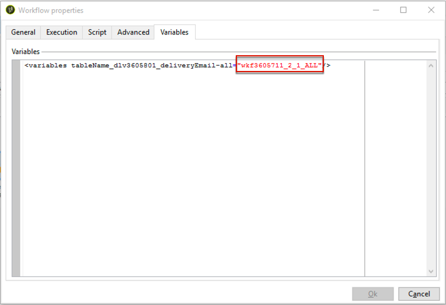

# Personalization fields{#personalization-fields}

Personalization fields are used for first-level personalization of the content of delivered messages. The fields you insert in a main content show the position where to insert the data from the selected data source.

For example, the personalization field with the **<%= recipient.LastName %>** syntax tells Adobe Campaign to insert the name of the recipient into the database (recipient table).

## Data sources {#data-sources}

Personalization fields can come from two types of data source, according to the delivery mode selected:

* The Adobe Campaign database is the data source. This is the most common case, with for example 'recipient personalization fields'. These are all the fields defined in the recipients table, whether standard fields (typically: last name, first name, address, town, date of birth, etc.) or user defined fields.
* An external file is the data source. These are all the fields defined in the columns of the file presented as input during a delivery using the data found in an external file.

>[!NOTE]
>
>An Adobe Campaign personalization tag always has the following form **<%=table.field%>**.

## Inserting a personalization field {#inserting-a-personalization-field}

To insert personalization fields, click the drop-down icon that is accessible from any header, subject, or message body editing field.

After the selection of a data source (recipient fields or file field), this insertion takes the form of a command that will be interpreted by Adobe Campaign and replaced by the value of the field for a given recipient. The physical replacement can then be viewed in the **Preview** tab.

## Personalization fields example {#personalization-fields-example}

We create an email in which we will first insert the name of the recipient and then add the profile creation date in the body of the message. To do this:

1. Create a new delivery or open an existing email type delivery.
1. In the delivery wizard, click **Subject** to edit the subject of the message and enter a subject.
1. Enter "**Special offer for **" and use the button in the toolbar to insert a personalization field. Select **Recipients>Title**.
1. Repeat the operation to insert the name of the recipient. Insert spaces between all the personalization fields.
1. Click **OK** to validate.
1. Insert the personalization in the message body. To do this, click in the message content and click the field insertion button.
1. Select **Recipient>Other...**.

   

1. Select the field with the information to display and click **OK**.

   

1. Click the **Preview** tab to view the personalization result. You must select a recipient to display that recipient's message.

   

   >[!NOTE]
   >
   >When a delivery is part of a workflow, you can use the data from the temporary workflow table. This data is grouped in the **Target extension** menu. For more on this, refer to [this section](../../workflow/using/executing-a-workflow.md#target-data).

## Optimizing personalization {#optimizing-personalization}

You can optimize personalization using a dedicated option: **Prepare the personalization data with a workflow**, available in the **Analysis** tab of the delivery properties.

During the delivery analysis, this option automatically creates and executes a workflow that stores all of the data linked to the target in a temporary table, including data from tables linked in FDA.

By checking this option, you can achieve a significant increase in performance for executing personalization.

For example, if you are experiencing performance issues when delivering to a high number of recipients while using a lot of personalization fields and/or personalization blocks in the content of your messages, this option can accelerate the handling of personalization and therefore the delivering of your messages.

To use this option, follow the steps below:

1. Create a campaign. For more on this, refer to [this section](../../campaign/using/setting-up-marketing-campaigns.md#creating-a-campaign).
1. In the **Targeting and workflows** tab of your campaign, add a **Query** activity to your workflow. For more on using this activity, refer to [this section](../../workflow/using/query.md).
1. Add an **Email delivery** activity to the workflow and open it. For more on using this activity, refer to [this section](../../workflow/using/delivery.md).
1. Go to the **Analysis** tab of the **Delivery properties** and select the **Prepare the personalization data with a workflow** option.

   

1. Configure the delivery and start the workflow to launch the analysis.

Once the analysis is done, the personalization data are stored in a temporary table through a temporary technical workflow that is created on the fly during the analysis.

This workflow is not visible in the Adobe Campaign interface. It is only meant to be a technical means to quickly store and handle personalization data.

Once the analysis is complete, go to the workflow **Properties** and select the **Variables** tab. There you can see the name of the temporary table that you may use to make an SQL call in order to display the IDs that it contains.

