# Personalized coupons{#personalized-coupons}

Adding coupons to your deliveries can give your recipients enhanced value for products and services. You can use the Campaign coupon module to create a set of coupons that you expect to add to upcoming marketing offers. When you are ready to create a delivery, assign the applicable coupons. Since coupons are valid for a select period, an assigned coupon is uniquely linked to its delivery message. Also, Campaign confirms that there are enough coupons for the number of messages before the delivery is sent.

>[!NOTE]
>
>Coupon management is a package that must be installed. To confirm that you have Coupon management, check **[!UICONTROL Administration > Configuration > Package management > Installed packages.]**
>
>Coupon data can be imported and exported using CSV and XML formats. For details regarding importing and exporting, refer to [this section](../../platform/using/get-started-data-import-export.md).

## Creating a coupon {#creating-a-coupon}

The coupon module gives you two options when creating coupons:

* **Anonymous**: A generic coupon for select recipients or lists of recipients.
* **Individual**: A personalized coupon for select recipients.

Before following the steps below, make sure that you know the type of coupon you want to create.

1. In the Campaign tree, go to **[!UICONTROL Resources > Campaign management > Coupons]**.

   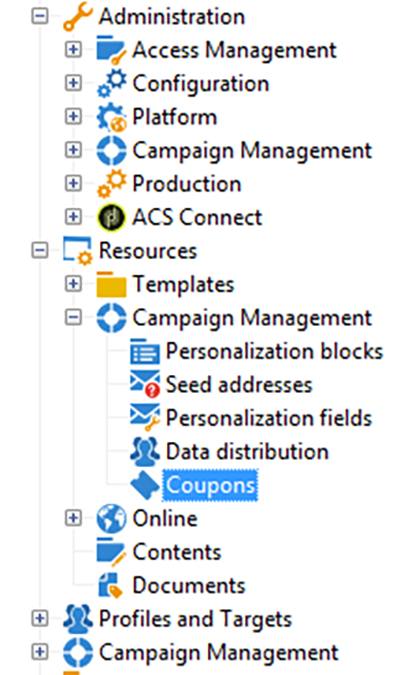

1. Click the **[!UICONTROL New]** button.
1. Enter the name of the coupon in **[!UICONTROL Label]** field. A unique code has been automatically entered in **[!UICONTROL Coupon code]**. You can keep the code or enter a new one.

   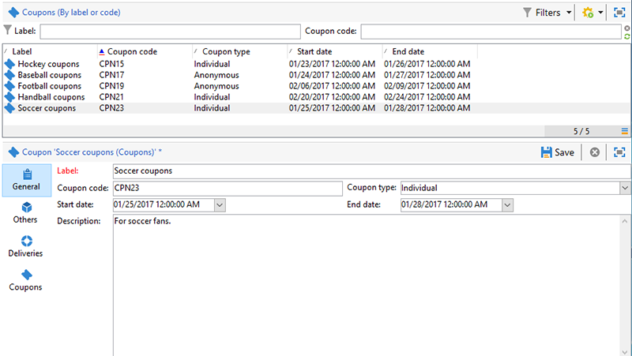

1. Choose **[!UICONTROL Start date]** and **[!UICONTROL End date]** to set the period in which the coupon is valid.
1. In **[!UICONTROL Coupon type]**, choose Anonymous or Individual.

   **[!UICONTROL Anonymous coupons]** : An anonymous coupon is identical for all recipients. Confirm that Anonymous is selected in the **Coupon type** menu and click **Save** to generate the coupon.

   **[!UICONTROL Individual coupons]** : An individual coupon can be further personalized with additional coupon codes. For example, an individual coupon is created for a sale at a sports equipment store. However, the list of recipients is long and they do not share the same enthusiasm for a single sport. You can add code names for the individual coupon based upon a sport (e.g. soccer, football, baseball etc.) and send each code to the applicable recipients.

    1. When choosing Individual, a new tab, Coupons, appears on the lower left. Go to the **[!UICONTROL Coupons]** tab and click **[!UICONTROL Add]**.
    1. Enter a unique code for the individual coupon when prompted by the pop-up window.
    1. Click **[!UICONTROL Save]** to generate the coupon.

   For more details about the Coupons tab, see [Configuring individual coupons](#configuring-individual-coupons).

   >[!NOTE]
   >
   >Individual coupons can be imported in bulk. For details regarding importing and exporting, refer to [this section](../../platform/using/get-started-data-import-export.md).

### Configuring individual coupons {#configuring-individual-coupons}

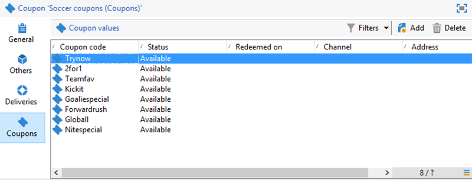

The Coupons tab is only available with Individual coupons. After a coupon is associated with a delivery, the Coupons tab provides the following details:

* **[!UICONTROL Status]** : Coupon availability.
* **[!UICONTROL Redeemed on]** : The date the coupon is redeemed.
* **[!UICONTROL Channel]** : The channel used to send the coupon.
* **[!UICONTROL Address]** : The recipients' email addresses.

Values for **[!UICONTROL status]**, **[!UICONTROL channel]**, and **[!UICONTROL address]** are automatically completed. However, the values for **[!UICONTROL redeemed on]** are not recovered by Campaign. They can be completed by importing a file that has the details for coupon redemption.

## Inserting a coupon into an email delivery {#inserting-a-coupon-into-an-email-delivery}

In the example below, the delivery is created from the Home page. For detailed instructions on how to create a delivery, refer to [this section](about-email-channel.md). You can also add a coupon to a delivery in a workflow.

1. Go to **[!UICONTROL Campaigns]** and choose **[!UICONTROL Deliveries]**.
1. Click **[!UICONTROL Create]**.

   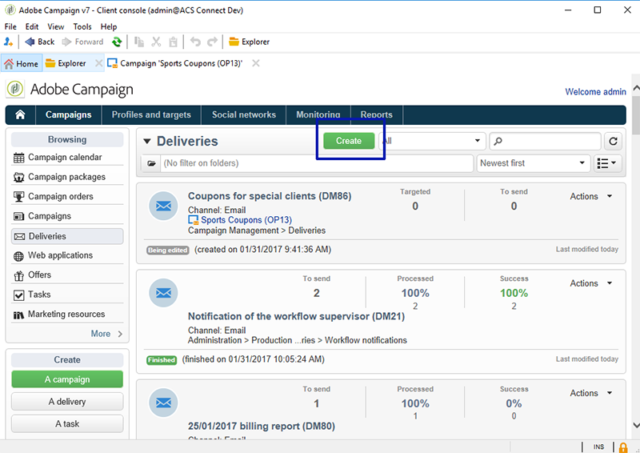

1. Enter a name in **[!UICONTROL Label]** and click **[!UICONTROL Continue]**.
1. Click **[!UICONTROL To]** to add recipients.
1. Click **[!UICONTROL Add]** to choose recipients for the delivery. Once you have selected your recipients, click **[!UICONTROL Ok]** to return to the delivery.

   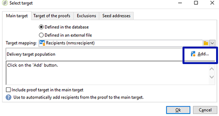

1. Enter a subject and add content to the message.

   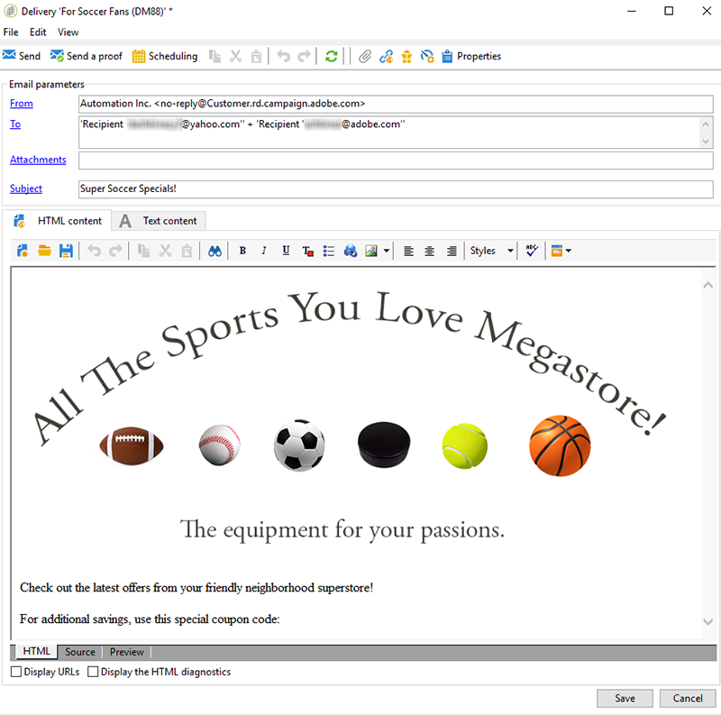

1. In the toolbar, click **[!UICONTROL Properties]** and choose the **[!UICONTROL Advanced]** tab.
1. Click the folder icon for **[!UICONTROL Coupon management]**.

   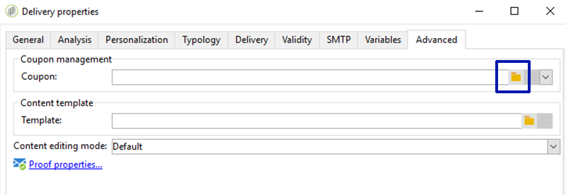

1. Choose the coupon and click **[!UICONTROL Ok]**. Click **[!UICONTROL Ok]** again.

   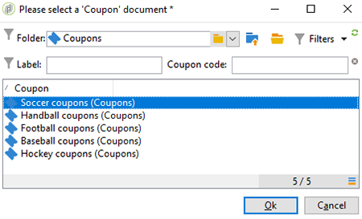

1. Click on the message to choose where you want to place the coupon.

   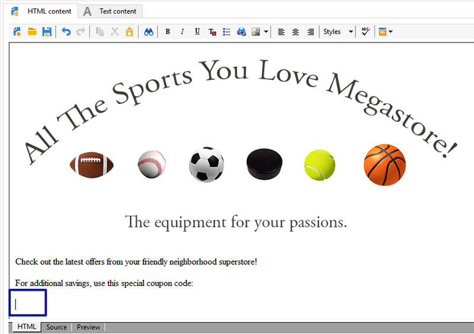

1. Click the personalization icon to choose one of the following based upon the type of coupon:

    * Anonymous coupon: **[!UICONTROL Coupon > Coupon code]** 

      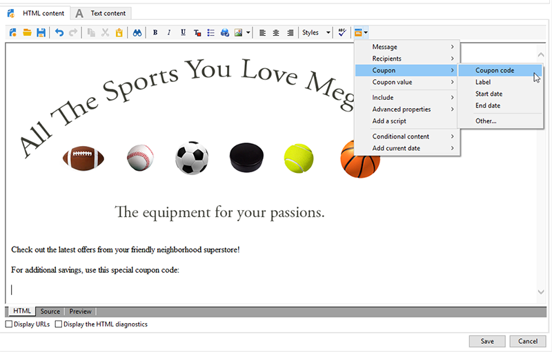

    * Individual coupon: **[!UICONTROL Coupon value > Coupon code]** 

      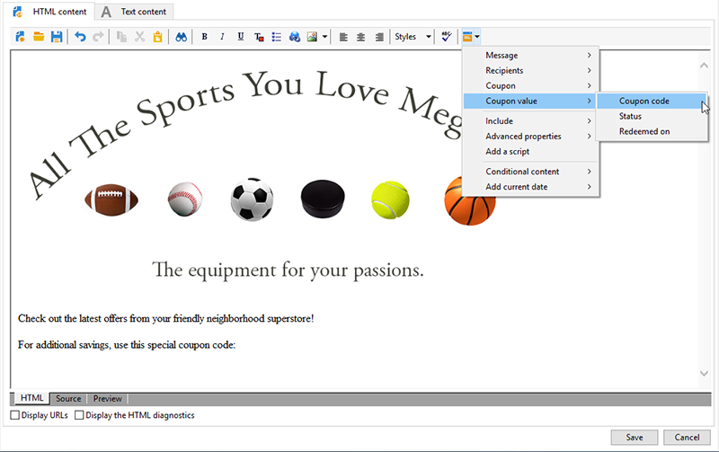

      The coupon is inserted into the message as code rather than the name you assigned. The code is used within the Campaign ootb data model.

   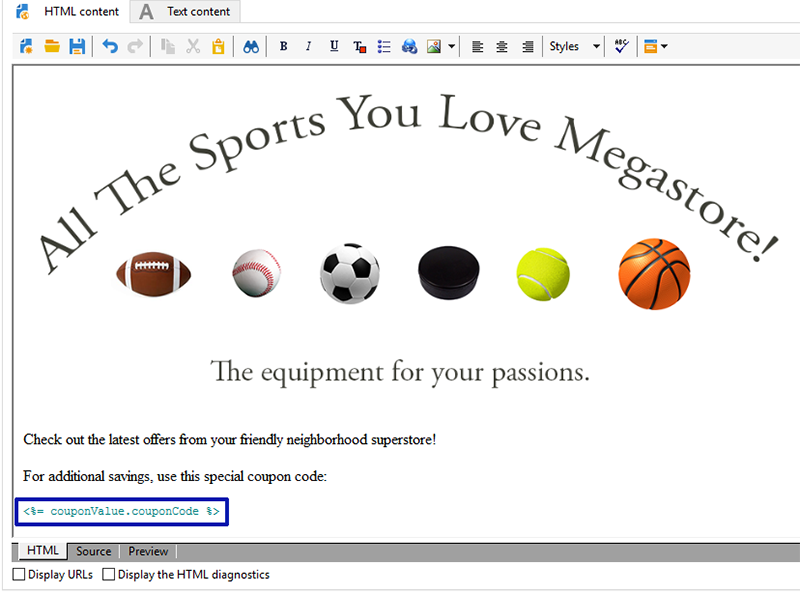

1. Run a test to confirm the name you assigned to the coupon. Go to the **[!UICONTROL Preview]** tab and click **[!UICONTROL Test personalization]**. Choose a recipient for the test.

   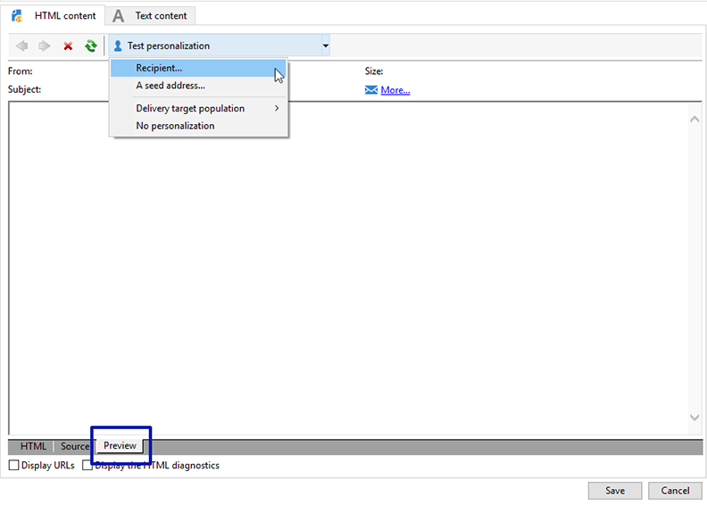

   Following the test, the coupon should appear as the assigned name rather than the code.

   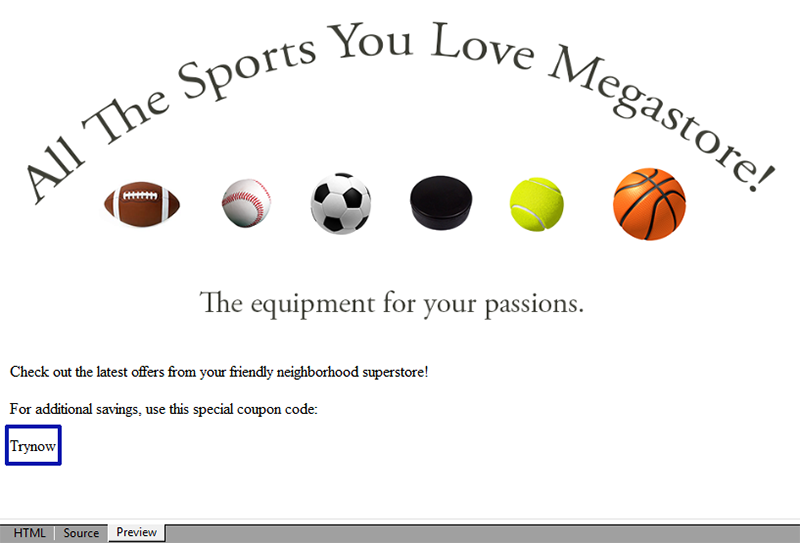

1. In the toolbar, click **[!UICONTROL Send]** (upper left) and choose how you want to send the delivery.

   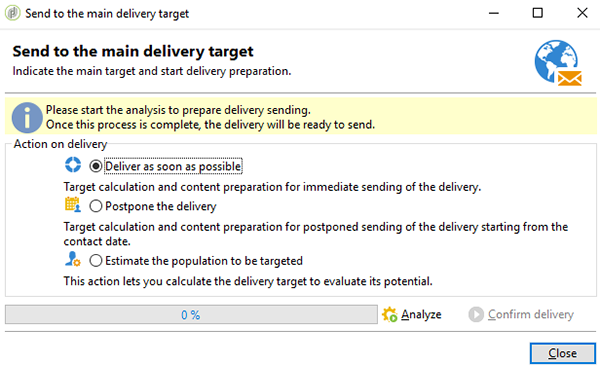

1. Click **[!UICONTROL Analyze]**. If the analysis log confirms that there are enough coupons for all recipients, click **[!UICONTROL Confirm delivery]** to send it.

   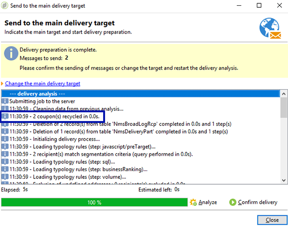

>[!NOTE]
>
>For instructions on how to manage insufficient coupons for a delivery, see [Managing insufficient coupons](#managing-insufficient-coupons)

To confirm that the delivery was successful:

1. Go to **[!UICONTROL Explorer > Resources > Campaign management > Coupons]**.
1. Click the **[!UICONTROL Deliveries]** tab.

   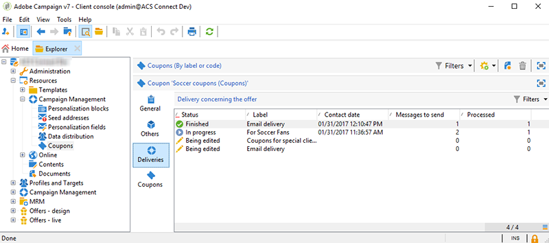

   The status reads as **[!UICONTROL Finished]** for a successful delivery.

>[!NOTE]
>
>By default, the coupon management module uses an **nms:recipient** table. For instructions on how to use other tables, see [Editing schemas](../../configuration/using/data-schemas.md).

## Managing insufficient coupons {#managing-insufficient-coupons}

The delivery analysis stops if there are fewer coupons than messages. In such a case, you can import more coupons or restrict the number of messages. Follow the instructions below if you want to limit the number of messages.

1. Go to the email delivery window.
1. Click **[!UICONTROL To]**.
1. In **[!UICONTROL Select target]**, go to the **[!UICONTROL Exclusions]** tab.

   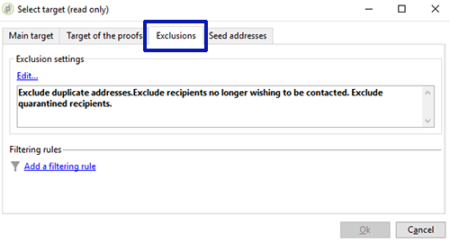

1. In the exclusion settings section, click **[!UICONTROL Edit]**.
1. Enter the number of messages you want to send in **[!UICONTROL Limit delivery to...messages]** and click **[!UICONTROL Ok]**. You can send the delivery.

   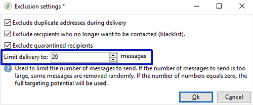

>[!NOTE]
>
>When managing a limited number of coupons, a delivery workflow lets you split the delivery based upon your criteria. It is a good option if you want to send coupons to a select population without restricting the target.
