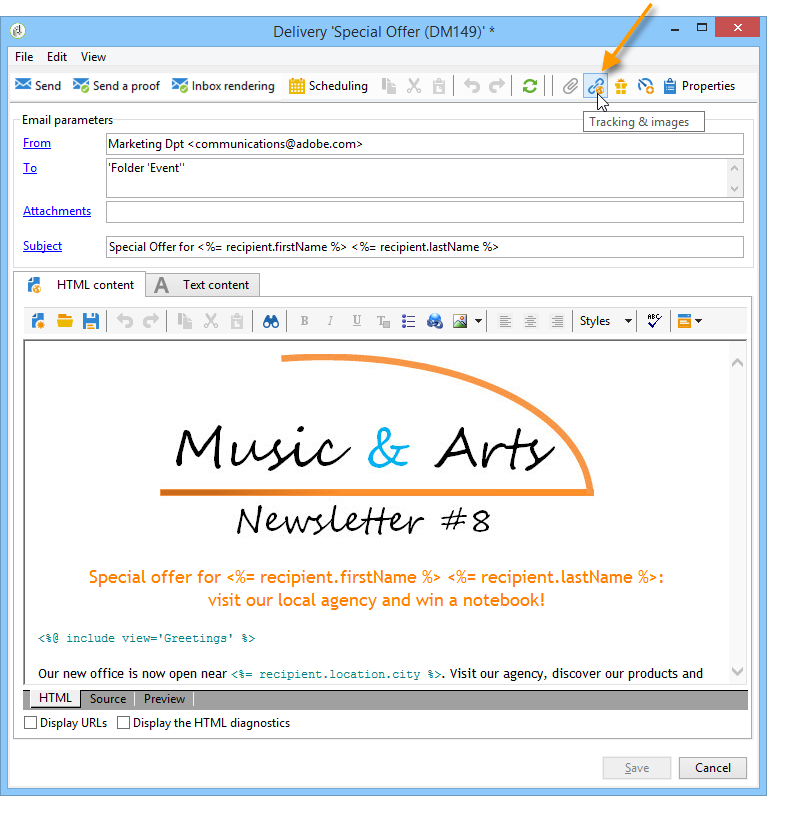
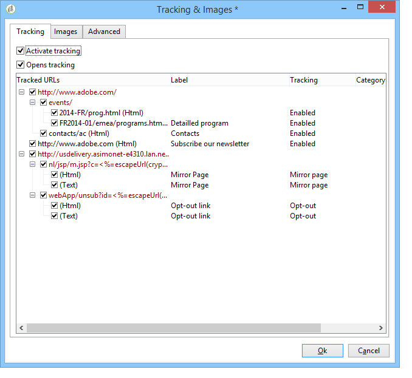
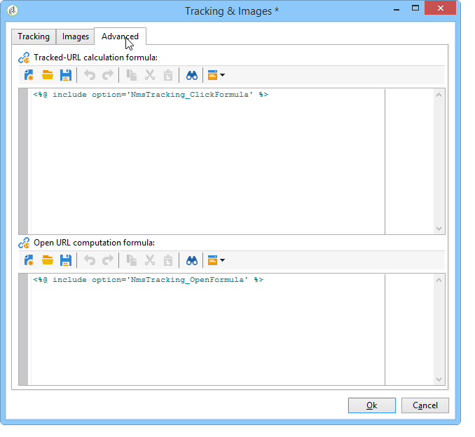

# Configure URL tracking options{#personalizing-url-tracking}

Advanced message tracking settings are accessible via the **[!UICONTROL Tracking & Images]** icon in the toolbar of the delivery assistant.

>[!NOTE]
>
>The management of images in emails is also configured in this window. See [Add images](defining-the-email-content.md#adding-images).

You can configure the tracking options:

* Activate/Deactivate URL tracking for all messages.

  >[!CAUTION]
  >
  >When tracking is not activated on a delivery (i.e. **[!UICONTROL Activate tracking]** option not selected), reports and data related to tracking are not available: Opens, Hot click and tracked URLs reports will not show any data, and **[!UICONTROL Tracking logs]** tabs will not be displayed for this delivery.

* Activate/Deactivate tracking for message opens.

The tracked URLs are listed in the central window in tree form.

You can activate or deactivate tracking individually for each URL of the message. For more on this, refer to [this section](how-to-configure-tracked-links.md).

The **[!UICONTROL Advanced]** tab lets you personalize the calculation formulas of the tracked URLs and the opening URL.

>[!CAUTION]
>
>Settings in this tab can only be modified by expert users.
