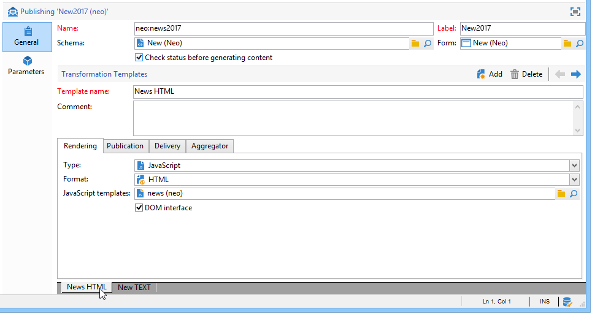
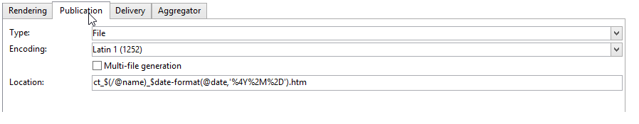
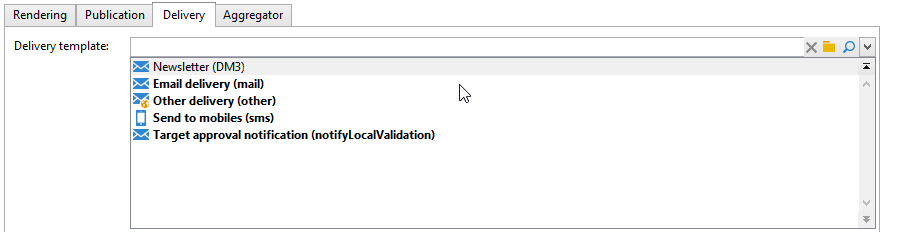
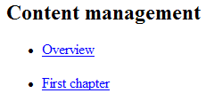
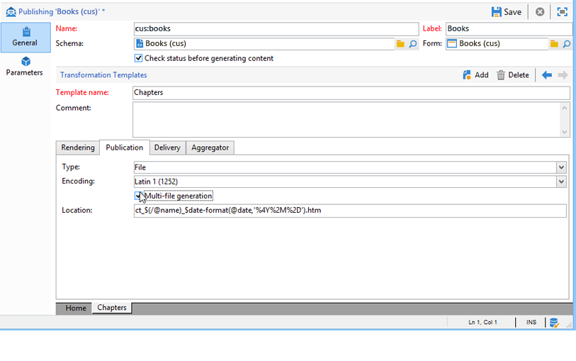

# Publication templates{#publication-templates}

## About publication templates {#about-publication-templates}

The publication template is the identity card of the content to be published. It references the resources used in the publication process, i.e.:

* the data schema,
* the input form,
* the transformation templates for each output document.

## Identification of a publication template {#identification-of-a-publication-template}

A publication template is identified by its name and namespace.

The identification key of a stylesheet is a string made up of the namespace and the name separated by a colon; for example: **cus:newsletter**.

>[!NOTE]
>
>In practice, it is recommended to use the same key for the schema, the form, and the publication template.

## Creating and configuring the template {#creating-and-configuring-the-template}

Publication templates are stored by default in the **[!UICONTROL Administration > Configuration > Publication templates]** node. To create a new template, click the **[!UICONTROL New]** button above the list of templates.

To configure the publication template, populate the name of the template (i.e. the identification key consisting of the name and the namespace), its label, data schema, and the input form it is linked to.



>[!NOTE]
>
>The label will appear whenever content is created based on this publication template.

The **Check status to validate content generation** option forces a check on the "Validated" status of the content instances to authorize file generation. For more on this, refer to [Publication](#publication).

A transformation template must be added for each output document. You can create as many transformation templates as necessary.

The **[!UICONTROL Name of template]** field is a free label that describes the type of rendering at the output. For each transformation template, the publication settings are available in the tabs.

### Rendering {#rendering}

The **[!UICONTROL Rendering]** tab, choose:

* the type of rendering used for projecting the output document: XSL stylesheet or JavaScript template,
* the format of the output document: HTML, Text, XML or RTF,
* the template which contains the construction data, i.e. the stylesheet or JavaScript template to be used.

### Publication {#publication}

Publication involves generating the output document in the form of a file, if the type selected is **[!UICONTROL File]**.



The following publication options are available:

* The output file encoding character set can be forced via the **[!UICONTROL Encoding]** field. The Latin 1 (1252) character set is used by default.
* The **[!UICONTROL Multi-file generation]** option activates a special document publication mode. This option consists of populating a partitioning tag at the beginning of each page of the output document. Generating the content will produce a file for each populated partitioning tag. This mode is used to generate mini-sites from a content block. for more on this, refer to [Multi-file generation](#multi-file-generation).
* The **[!UICONTROL Location]** field contains the name of the output file. The name can be made up of variables in order to generate an automatic filename.

  A variable is populated with the following format: **`$(<xpath>)`**, where **`<xpath>`** is the path of a field of the publication template data schema.

  The name of a file can consist of a date-type field. To format this field correctly, use the **$date-format** function, using the path of the field and the output format as parameters.

  By default, the construction format of the file name uses the variables on the "@name" and "@date" fields:

  ```
  ct_$(@name)_$date-format(@date,'%4Y%2M%2D').htm
  ```

  The generated file name will look like this: ct_news12_20110901.htm.

  >[!NOTE]
  >
  >For more on content generation, refer to [Creating a content instance](using-a-content-template.md#creating-a-content-instance).

### Delivery {#delivery}

This tab lets you select a scenario in order to launch a delivery directly on the content. The content of the email will be populated automatically based on the output format (HTML or Text).



>[!NOTE]
>
>For an example of delivery creation based on a content, refer to [Delivering a content instance](using-a-content-template.md#delivering-a-content-instance).

### Aggregator {#aggregator}

Aggregating the data from a script or query list lets you enrich the XML document with the content data. The aim is to supplement certain information referenced by links or to add elements from the database.

### Multi-file generation {#multi-file-generation}

To activate multiple file generation, select the **[!UICONTROL Multi-file generation]** option in the publication model. This option lets you specify partitioning tags in the stylesheet for the beginning of each page of the output document. The generation of the content will produce a file for each partitioning tag encountered.

The partitioning tag to be integrated in the stylesheet is as follows:

**`<xsl:comment> #nl:output_replace(<name_of_file>) </xsl:comment>`** where **`<name_of_file>`** is the filename of the page to be generated.

**Example:** Multiple file generation using the "cus:book" schema.

The principle is to generate a main page listing the chapters, with the possibility of displaying the details of the chapter in an external page.



The corresponding stylesheet ("cus:book.xsl") is as follows:

```
<?xml version="1.0" encoding="ISO-8859-1" ?>
<xsl:stylesheet xmlns:xsl="http://www.w3.org/1999/XSL/Transform" version="1.0">
  <xsl:output encoding="ISO-8859-1" method="html"/>

  <!-- Style sheet entry point -->
  <xsl:template match="/book">
    <html>
      <body>
        <h1><xsl:value-of select="@name"/></h1>
        <lu>
          <xsl:for-each select="chapter">
            <li><a target="_blank" href="chapter{@id}.htm"><xsl:value-of select="@name"/></a></li>  
          </xsl:for-each>
       </lu>
      </body>
    </html>
   </xsl:template>
</xsl:stylesheet>
```

A second stylesheet ("cus:chapter.xsl") is required to generate the details of the chapters:

```
<?xml version="1.0" encoding="ISO-8859-1" ?>
<xsl:stylesheet xmlns:xsl="http://www.w3.org/1999/XSL/Transform" version="1.0">
  <xsl:output encoding="ISO-8859-1" method="html"/>

  <!-- Detail of a chapter -->
  <xsl:template match="chapter">
    <!-- Cut tag -->   
    <xsl:comment> #nl:output_replace($(path)/chapter<xsl:value-of select="@id"/>.htm)</xsl:comment>
    
    <html>
      <body>
        <h1><xsl:value-of select="@name"/></h1>
        <xsl:value-of select="page" disable-output-escaping="yes"/>
      </body>
    </html>
  </xsl:template>

  <!-- Style sheet entry point -->
  <xsl:template match="/book">
    <xsl:apply-templates/>
   </xsl:template>
</xsl:stylesheet>
```

The partitioning tag is populated at the beginning of the page to be included in the file to generate.

```
<xsl:comment> #nl:output_replace($(path)/<xsl:value-of select="@id"/>.htm)</xsl:comment>
```

The filename is constructed with the **$(path)** variable containing the publication path and **`<xsl:value-of select="@id" />`**, which matches the identifier of the chapter in the input document.

The publication model must be populated with the two stylesheets "cus:book.xsl" and "cus:chapter.xsl".

The **[!UICONTROL Multi-file generation]** option must be active on the chapter transformation model:



The **[!UICONTROL Location]** field is not used in the generation of multiple files, but you must still populate this field to avoid an error when publishing.
