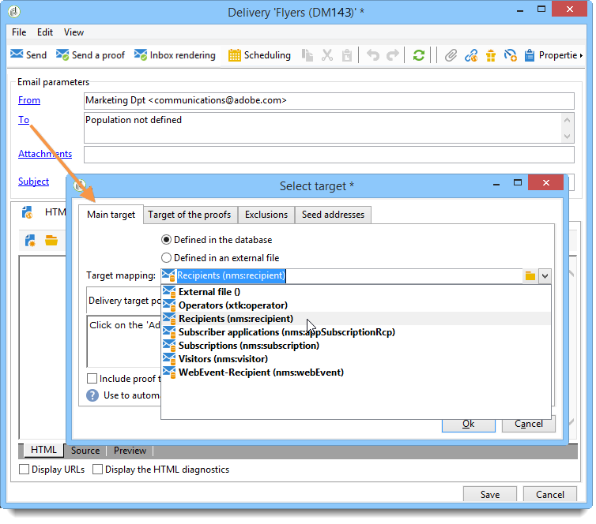

# Selecting a target mapping{#selecting-a-target-mapping}

By default, delivery templates target **[!UICONTROL Recipients]**. Their target mapping therefore uses the fields of the **nms:recipient** table. Adobe Campaign offers other target mappings for your deliveries, to be used based on your needs. 

These mappings are as follows:

|  Name  | Use  | Standard schema  |
|---|---|---|
|  Recipients  | Deliver to recipients of the Adobe Campaign database  | nms:recipient  |
|  Visitors  | Deliver to visitors whose profiles have been collected via referral (viral marketing) or via social networks (Facebook, Twitter) for instance.  | mns:visitor  |
|  Subscriptions  | Deliver to recipients who are subscribed to an information service such as a newsletter  | nms:subscription  |
|  Visitor subscriptions  | Deliver to visitors who are subscribed to an information service  | nms:visitorSub  |
|  Service  | Publish to a Twitter account or a Facebook page  | nms:service  |
|  Operators  | Deliver to Adobe Campaign operators  | nms:operator  |
|  External file  | Deliver via a file that contains all information needed for delivery  | No linked schema, no target entered  |

>[!NOTE]
>
>You can also create new target mappings. This operation is reserved for expert users. For more information, refer to the [Configuration guide](../../configuration/using/target-mapping.md).
