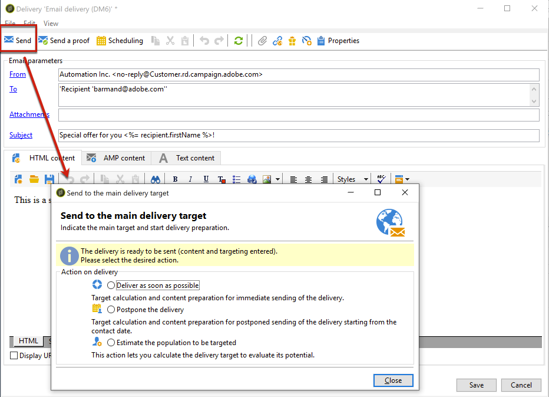

# Sending an email{#sending-an-email}

When a delivery has been created and configured, you must validate it before sending it to the main target. For more on this, see [Validating the delivery](../../delivery/using/steps-validating-the-delivery.md).

When the delivery is validated and ready for send, click **[!UICONTROL Send]** to approve your email and send it to the recipients of the delivery being created.

Select an action and click **[!UICONTROL Analyze]** to run the analysis. For more on this, see [Launching the analysis](../../delivery/using/steps-validating-the-delivery.md#analyzing-the-delivery).

Once analysis is complete, click **[!UICONTROL Confirm delivery]** to launch the delivery of messages. For more confirming the send, see [this section](../../delivery/using/steps-sending-the-delivery.md).

The full and detailed steps to configure and send a delivery are presented in [this section](../../delivery/using/steps-sending-the-delivery.md).

The following sections detail the options and parameters that are specific to delivering emails:
* [Generating the mirror page](../../delivery/using/generating-mirror-page.md)
* [Email BCC](../../delivery/using/email-bcc.md)
* [Email parameters](../../delivery/using/sending-email-parameters.md)
* [Sending emails with the Enhanced MTA](../../delivery/using/sending-with-enhanced-mta.md)
* [Sending on Japanese mobiles](../../)
