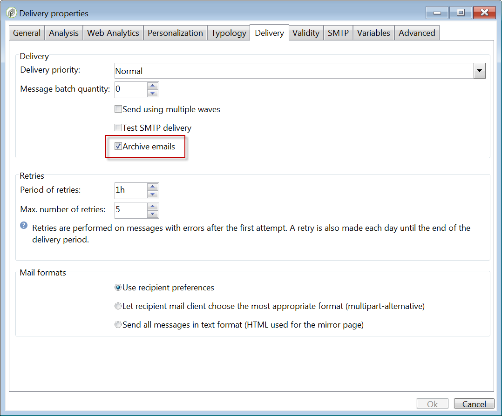
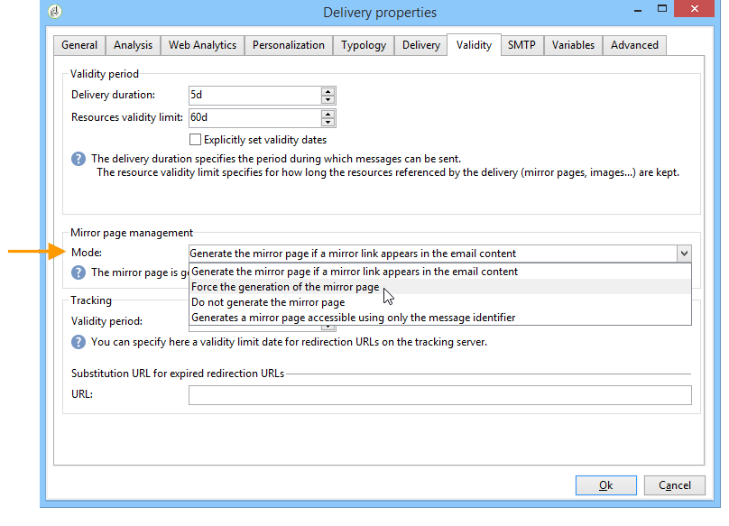
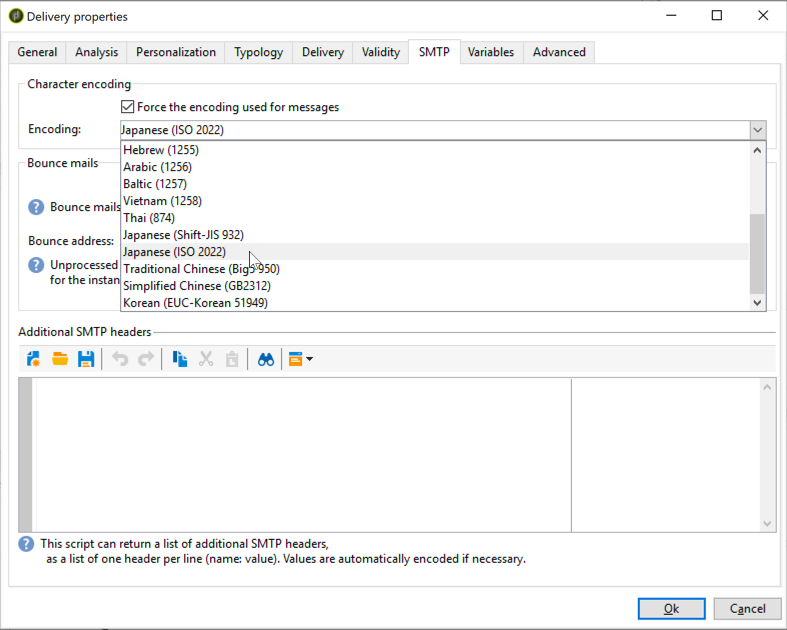

# Sending an email{#sending-an-email}

To approve your email and send it to the recipients of the delivery being created, click **[!UICONTROL Send]**.

The detailed process when validating and sending a delivery is presented in the sections below:

* [Validating the delivery](../../delivery/using/steps-validating-the-delivery.md)
* [Sending the delivery](../../delivery/using/steps-sending-the-delivery.md)

The sections below detail the parameters that are specific to delivering emails.

## Email BCC {#archiving-emails}

Adobe Campaign enables you to store emails on an external system through BCC by simply adding a BCC email address to your message target. Once the option activated, an exact copy of all sent messages will be kept for this delivery.

For more information on Email BCC configuration and best practices, refer to [this section](../../installation/using/email-archiving.md).

>[!NOTE]
>
>Email BCC is an optional capability. Please check your license agreement and contact your account executive to activate it.

When creating a new delivery or delivery template, Email BCC is not enabled by default. You need enable it manually at the email delivery or delivery template level.

To enable Email BCC for an email delivery template, follow the steps below:

1. Go to **[!UICONTROL Campaign Management]** > **[!UICONTROL Deliveries]** or **[!UICONTROL Resources]** > **[!UICONTROL Templates]** > **[!UICONTROL Delivery templates]**.
1. Select the delivery of your choice or duplicate the out-of-the-box **Email delivery** template, then select the duplicated template.
1. Click the **Properties** button.
1. Select the **[!UICONTROL Delivery]** tab.
1. Check the **Email BCC** option. A copy of all sent messages for each delivery based on this template will be sent to the Email BCC address which has been configured.

   

   >[!NOTE]
   >
   >If the emails sent to the BCC address are opened and clicked through, this will be taken into account in the **[!UICONTROL Total opens]** and **[!UICONTROL Clicks]** from the send analysis, which could cause some miscalculations.

## Generating the mirror page {#generating-the-mirror-page}

The mirror page is an HTML page accessible online via a web browser. Its content is identical to the email.

By default, the mirror page is generated if the link is inserted in the content of the mail. For more on personalization blocks insertion, refer to [Personalization blocks](../../delivery/using/personalization-blocks.md).

In the delivery properties, the **[!UICONTROL Mode]** field of the **[!UICONTROL Validity]** tab lets you modify the generation mode for this page.

>[!CAUTION]
>
>An HTML content must have been defined for the delivery for the mirror page to be created.

In addition to the default mode, the following options are also available:

* **[!UICONTROL Force the generation of the mirror page]** : even if no link to the mirror page is inserted in the delivery, the mirror page will be created.
* **[!UICONTROL Do not generate the mirror page]** : no mirror page is generated, even if the link is present in the delivery.
* **[!UICONTROL Generates a mirror page accessible using only the message identifier]** : this option lets you access the content of the mirror page, with personalization information, in the delivery log window. To do this, after the end of the delivery, click the **[!UICONTROL Delivery]** tab and select the line of the recipient whose mirror page you wish to view. Click the **[!UICONTROL Display the mirror page for this message...]** link.

  

## Managing bounce emails {#managing-bounce-emails}

The **[!UICONTROL SMTP]** tab of the delivery parameters lets you configure the management of bounce mails.

By default, bounced emails are received in the default error box of the platform, but you can define a specific error address for a delivery.

You can also define a specific address from this screen in order to investigate the reasons for bounce mails when these could not be automatically qualified by the application. For each of these fields, the 'add personalized fields' icon lets you add personalization parameters.

## Character encoding {#character-encoding}

In the **[!UICONTROL SMTP]** tab of the delivery parameters, the **[!UICONTROL Character encoding]** section allows you to set a specific encoding.

The default encoding is UTF-8. If some of your recipients' email providers do not support the UTF-8 standard encoding, you may want to set a specific encoding to properly display the special characters to your emails' recipients.

For example, you want to send an email containing Japanese characters. To make sure that all characters will be correctly displayed to your recipients in Japan, you may want to use an encoding that will support the Japanese characters rather than the standard UTF-8.

To do this, select the **[!UICONTROL Force the encoding used for messages]** option in the **[!UICONTROL Character encoding]** section and choose an encoding from the drop-down list that is displayed.

## Adding SMTP headers {#adding-smtp-headers}

It is possible to add SMTP headers to your deliveries. To do this, use the relevant section of the **[!UICONTROL SMTP]** tab in the delivery.

The script entered in this window must reference one header per line in the following form: **name:value**.

Values are encoded automatically if necessary.

>[!CAUTION]
>
>Adding a script for inserting additional SMTP headers is reserved for advanced users.
>
>The syntax of this script must comply with the requirements of this content type: no unused space, no empty line, etc.
