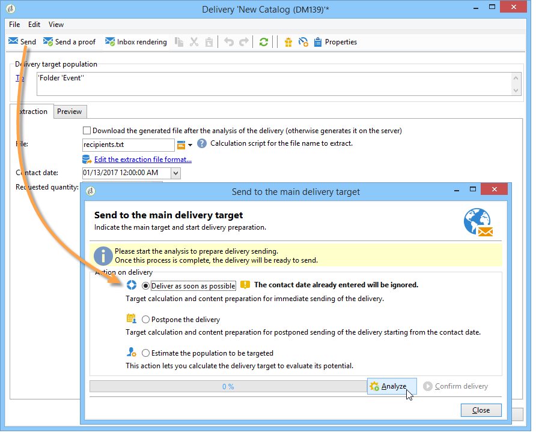
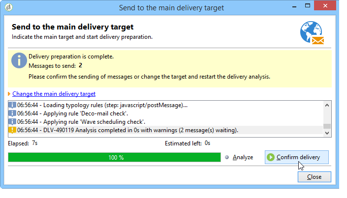
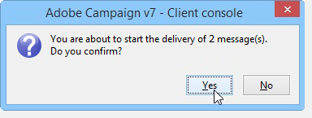
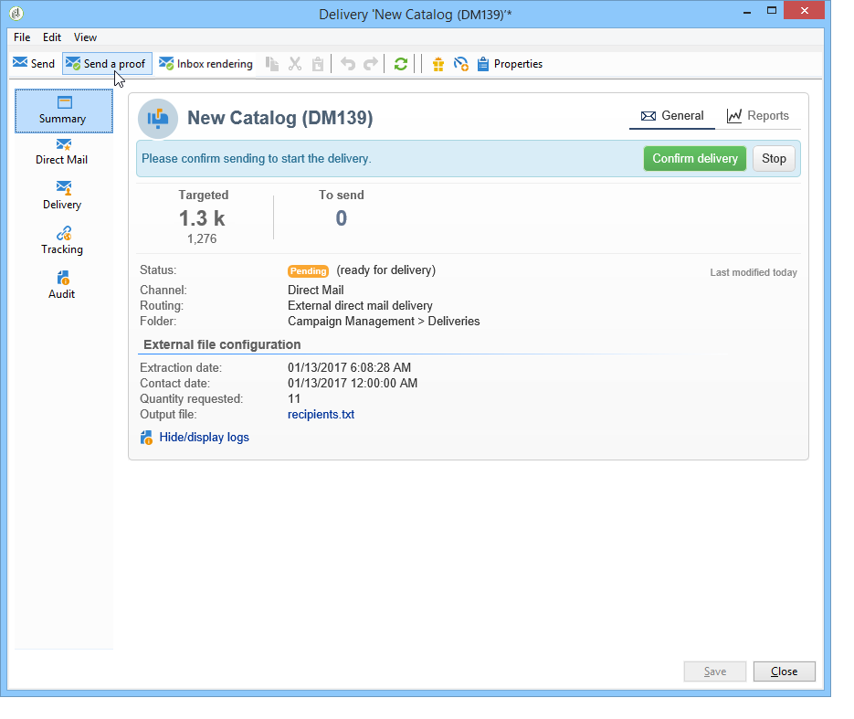
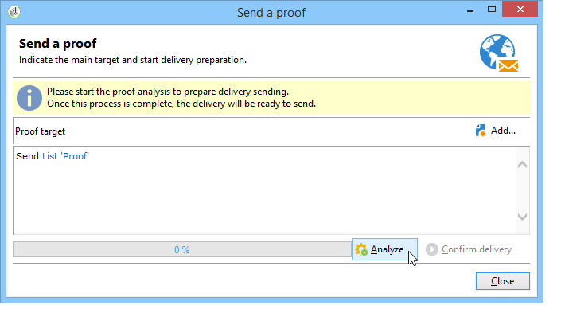

# Sending the delivery{#sending-the-delivery}

To approve your message and send it to the recipients of the delivery being created, click **[!UICONTROL Send]**.

The detailed process when validating and sending a delivery is presented in the sections below:

* [Validating the delivery](../../delivery/using/steps-validating-the-delivery.md)
* [Sending the delivery](../../delivery/using/sending-the-delivery.md)

## Analyzing the delivery {#analyzing-the-delivery}

To launch the delivery analysis, click **[!UICONTROL Send]** and select **[!UICONTROL Deliver as soon as possible]** or **[!UICONTROL Estimate target population]**.

The **[!UICONTROL Analyze]** button lets you launch the analysis manually. The progress bar shows the progress of the analysis.

The lower section of the window displays the analysis result. Special icons display warnings. The approval rules are presented in [Validation process with typologies](../../delivery/using/steps-validating-the-delivery.md#validation-process-with-typologies).

>[!CAUTION]
>
>The analysis freezes the target and the content of the delivery or of the proof at the moment of analysis. Any modification to the delivery or the proof must be followed by another analysis before becoming applicable.

The last log message displays any error messages and the number of errors. A special icon shows the error type.

Use the scroll bar to go up to the error message(s). Make the necessary changes, and then restart the analysis.

Check the result of the analysis before clicking **[!UICONTROL Confirm delivery]**. A confirmation message lets you launch the delivery.

When the delivery has been launched, you may close the delivery wizard.

## Sending a proof {#sending-a-proof}

The proof lets you test the delivery on a control group before sending it to the main target.

>[!NOTE]
>
>The proof target is defined in [Defining a specific proof target](../../delivery/using/steps-defining-the-target-population.md#defining-a-specific-proof-target).

To send a proof, click the **[!UICONTROL Send a proof]** button.

Click **[!UICONTROL Analyze]** to launch the analysis, then send the proof by clicking **[!UICONTROL Confirm delivery]**.

The delivery proof is added to the list of deliveries with the appropriate status. Delivery statuses are presented in [Accessing the list of deliveries](../../delivery/using/accessing-deliveries-information.md#accessing-the-list-of-deliveries).

Select this delivery and use its detail tabs to view its content.
