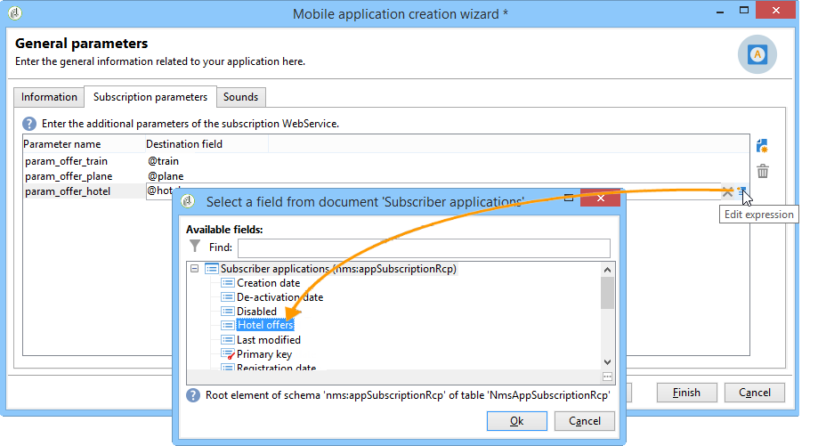

# Setting up mobile app channel{#setting-up-mobile-app-channel}

## Introduction {#introduction}

>[!CAUTION]
>
>Mobile App Channel implementation has to be performed by expert users. If you need to be assisted, contact your Adobe Account executive or Professional services partner.

You can create several versions of your mobile application (iOS, Android): the Mobile App channel option enables you to send notifications to terminals which the application is installed on.

To use the functionalities of the Adobe Campaign Mobile App Channel, you need to change/adapt your mobile application to integrate it into the Adobe Campaign platform.

Two Campaign Classic SDKs are available, one for Android and one for iOS, for an easy integration of your mobile application with Adobe Campaign. A deep technical knowledge of Java and Objective-C is required. A detailed description of Campaign SDK is found in [Integrating Campaign SDK into the mobile application](../../delivery/using/setting-up-mobile-app-channel.md#integrating-campaign-sdk-into-the-mobile-application).

>[!NOTE]
>
>Libraries provided by Adobe Campaign are designed to be used with Xcode (iOS) and Android Studio (Android).

## Connectors {#connectors}

### iOS connectors {#ios-connectors}

For iOS, two connectors are available:

* The iOS binary connector sends notifications on the legacy binary APNS server.
* The iOS HTTP/2 connector sends notifications to the HTTP/2 APNS.

To choose which connector you want to use, follow these steps:

1. Go to **[!UICONTROL Administration > Platform > External accounts]**.
1. Select the iOS routing external account.
1. In the **[!UICONTROL Connector]** tab, fill in the **[!UICONTROL Access URL of the connector]** field:

   For iOS binary: https://localhost:8080/nms/jsp/ios.jsp

   For iOS HTTP2: http://localhost:8080/nms/jsp/iosHTTP2.jsp

   

### Android connectors {#android-connectors}

For Android, two connectors are available:

* The V1 connector which allows one connection per MTA child. 
* The V2 connector which allows simultaneous connections to the FCM server to improve throughput.

To choose which connector you want to use, follow these steps:

1. Go to **[!UICONTROL Administration > Platform > External accounts]**.
1. Select the **[!UICONTROL Android routing]** external account.
1. In the **[!UICONTROL Connector]** tab, fill in the **[!UICONTROL JavaScript used in the connector]** field:

   For Android V1: https://localhost:8080/nms/jsp/androidPushConnector.js

   For Android V2: https://localhost:8080/nms/jsp/androidPushConnectorV2.js

   

1. For Android V2, one additional parameter is available in the Adobe Server configuration file (serverConf.xml):

    * **maxGCMConnectPerChild**: Maximum limit of parallel HTTP requests to the FCM initiated by each child server (8 by default).

## Configuration steps {#configuration-steps}

### Creating the application {#creating-the-application}

If you don't have a mobile application (app), the application developer needs to create it and integrate the SDK. If the mobile application exists, the developer needs to adapt it by integrating the Adobe Campaign SDK and adding the settings specific to the service. For a description of the SDK, refer to [Integrating Campaign SDK into the mobile application](../../delivery/using/setting-up-mobile-app-channel.md#integrating-campaign-sdk-into-the-mobile-application).

>[!CAUTION]
>
>The application must have been configured for Push actions BEFORE any integration to Adobe Campaign SDK.
>
>If this is not the case, please refer to [this page](https://developer.apple.com/library/archive/documentation/NetworkingInternet/Conceptual/RemoteNotificationsPG/).

### Collecting information {#collecting-information-}

To configure the application, you have to collect the technical specifications which define the set of parameters that enable Adobe Campaign and the mobile application to communicate. These parameters are:

* **the integration key**: each application has a unique key. This key lets you link the Adobe Campaign service and the mobile application. Refer to [General information](../../delivery/using/setting-up-mobile-app-channel.md#general-information).
* **the variables**: define the behavior of the application when you activate the notification. Refer to [General information](../../delivery/using/setting-up-mobile-app-channel.md#general-information).
* **the subscription settings**: by default, Adobe Campaign recovers the **@userKey** field that enables you to reconcile mobile devices with the recipients in the database. If you want to collect additional data (such as a complex reconciliation key), you can define subscription settings. Refer to [Subscription settings](../../delivery/using/setting-up-mobile-app-channel.md#subscription-settings).
* **the sounds** (iOS only): if the selected sound isn't a system sound, the sound file must be embedded into the mobile application. Refer to [Application sounds](../../delivery/using/setting-up-mobile-app-channel.md#application-sounds).
* **the URL of the marketing server and the tracking server**: the Adobe Campaign administrator must provide the application developer with the URLs of the marketing server and the URLs of the tracking server. For more on this, refer to: [Integrating Campaign SDK into the mobile application](../../delivery/using/setting-up-mobile-app-channel.md#integrating-campaign-sdk-into-the-mobile-application).

### Creating the service {#creating-the-service}

The Adobe Campaign administrator needs to create and configure a service linked to the mobile application. For more on this, refer to [Configuring the mobile application in Adobe Campaign](../../delivery/using/setting-up-mobile-app-channel.md#configuring-the-mobile-application-in-adobe-campaign).

### Testing the application {#testing-the-application}

On iOS, you need to create an application that uses the sandbox mode for tests and approvals. Then, within the same Adobe Campaign service, create a new production type application and enter the relevant certificate. For more on this, refer to the documentation on the Apple notifications service.

On Android, you only need to create one application. Test the full subscription and delivery collection process on your application before making it public.

## Data path {#data-path}

The following schemas detail the steps that enable a mobile application to exchange data with Adobe Campaign. This process involves three entities:

* the mobile application
* the notification service: APNS (Apple Push Notification Service) for Apple and FCM (Firebase Cloud Messaging) for Android
* Adobe Campaign

The three main steps of the notification process are: registration of the application in Adobe Campaign (subscription collection), deliveries, and tracking.

### Step 1: Subscription collection {#step-1--subscription-collection}

The mobile application is downloaded by the user from the App Store or from Google Play. This application contains the connection settings (iOS certificate and project key for Android) and the integration key. The first time the application is opened, (depending on configuration), the user can be asked to enter registration information (@userKey: email or account number for instance). At the same time, the application questions the notification service to collect a notification ID (push ID). All this information (connection settings, integration key, notification identifier, userKey) is sent to Adobe Campaign.


### Step 2: Delivery {#step-2--delivery}

Marketers target application subscribers. The delivery process sends the connection settings to the notification service (iOS certificate and project key for Android), the notification ID (push ID) and the content of the notification. The notification service sends notifications to the targeted terminals.

The following information is available in Adobe Campaign:

* Android only: number of devices that have displayed the notification (impressions)
* Android and iOS: number of clicks on the notification


The Adobe Campaign server must be able to contact the APNS server on the following ports:

* 2195 (sending) and 2186 (feedback service) for iOS binary connector
* 443 for iOS HTTP/2 connector

To check that it works correctly, use the following commands:

* For tests:

  ```
  telnet gateway.sandbox.push.apple.com
  ```

* In production:

  ```
  telnet gateway.push.apple.com
  ```

If an iOS binary connector is used, the MTA and web server must be able to contact the APNS on port 2195 (sending), the workflow server must be able to contact the APNS on port 2196 (feedback service).

If an iOS HTTP/2 connector is used, the MTA, web server and workflow server must be able to contact the APNS on port 443.

## Integrating Campaign SDK into the mobile application {#integrating-campaign-sdk-into-the-mobile-application}

Campaign SDKs for iOS and Android are one of the components of the Mobile App Channel module.

>[!NOTE]
>
>To get Campaign SDK (previously known as Neolane SDK), contact Adobe Customer Care.

The goal of the SDK is to facilitate the integration of a mobile application into the Adobe Campaign platform.

To learn more on the different Android and iOS versions supported, refer to the [Compatibility matrix](https://helpx.adobe.com/campaign/kb/compatibility-matrix.html#MobileSDK) .

### Loading Campaign SDK {#loading-campaign-sdk}

* **In Android**: the **neolane_sdk-release.aar** file must be linked to the project.

  The following permission grants access to the Adobe Campaign server:

  ```
  Neolane.getInstance().setIntegrationKey("your Adobe mobile app integration key");
  Neolane.getInstance().setMarketingHost("https://yourMarketingHost:yourMarketingPort/");
  Neolane.getInstance().setTrackingHost("https://yourTrackingHost:yourTrackingPort/");
  ```

  The following permission allows you to recover a telephone's unique ID:

  ```
  <uses-permission android:name="android.permission.READ_PHONE_STATE" /> 
  ```

  From version 1.0.24 of the SDK, this permission is only used for versions older than Android 6.0.

  From version 1.0.26 of the SDK, this permission is no longer used.

* **In iOS**: the **libNeolaneSDK.a** and **Neolane_SDK.h** files must be linked to the project. From version 1.0.24 of the SDK, the option **ENABLE_BITCODE** is activated.

  >[!NOTE]
  >
  >For version 1.0.25 of the SDK, the four architectures are available in the **Neolane_SDK.h** file.

### Declaring integration settings {#declaring-integration-settings}

To integrate Campaign SDK into the mobile application, the functional administrator must provide the following information to the developer:

* **An integration key**: to enable the Adobe Campaign platform to identify the mobile application.

  >[!NOTE]
  >
  >This integration key is entered in the Adobe Campaign console, in the **[!UICONTROL Information]** tab of service dedicated to the mobile application. Refer to [General information](../../delivery/using/setting-up-mobile-app-channel.md#general-information).

* **A tracking URL**: that matches the address of the Adobe Campaign tracking server.
* **A marketing URL**: to enable the collection of subscriptions.

* **In Android**:

  ```
  Neolane.getInstance().setIntegrationKey("your Adobe mobile app integration key");
  Neolane.getInstance().setMarketingHost("https://yourMarketingHost:yourMarketingPort/");
  Neolane.getInstance().setTrackingHost("https://yourTrackingHost:yourTrackingPort/"); 
  ```

* **In iOS**:

  ```
  Neolane_SDK *nl = [Neolane_SDK getInstance];
  [nl setMarketingHost:strMktHost];
  [nl setTrackingHost:strTckHost];
  [nl setIntegrationKey:strIntegrationKey];
  ```

### Registration function {#registration-function}

The registration function enables you to:

* send the notification ID or push ID (deviceToken for iOS and registrationID for Android) to Adobe Campaign.
* recover the reconciliation key or userKey (email or account number, for instance)

* **In Android**:

  ```
  void registerInNeolane(String registrationId, String userKey, Context context)
  {
   try{
    Neolane.getInstance().registerDevice(registrationToken, userKey, null, context);
   } catch (NeolaneException e){
    //...
   } catch (IOException e){
    //...
   }
  }
  ```

  If you use FCM (Firebase Cloud Messaging), we advise you use the **registerDevice** function when calling the **onTokenRefresh** function to notify Adobe Campaign of the change in the user's mobile device token.

  ```
  public class NeoTripFirebaseInstanceIDService extends FirebaseInstanceIdService {
    @Override
    public void onTokenRefresh() {
      String registrationToken = FirebaseInstanceId.getInstance().getToken();
      NeolaneAsyncRunner neolaneAs = new NeolaneAsyncRunner(Neolane.getInstance());
      ...
      ...
      // Neolane Registration
      neolaneAs.registerDevice(registrationToken, userKey, additionnalParam, this, new NeolaneAsyncRunner.RequestListener() {
      public void onComplete(String e, Object state) { ... }
      public void onNeolaneException(NeolaneException e, Object state) { ... }
      public void onIOException(IOException e, Object state) { ... }
      });
      ...
      ...
    }
  }
  ```

* **In iOS**:

  ```
  // Callback called on successful registration to the APNS
  - (void)application:(UIApplication*)application didRegisterForRemoteNotificationsWithDeviceToken:(NSData*)deviceToken
  {
      // Pass the token to Adobe Campaign
      Neolane_SDK *nl = [Neolane_SDK getInstance];
      [nl registerDevice:tokenString:self.userKey:dic];
  }
  ```

### Tracking function {#tracking-function}

* **In Android**:

  Tracking functions allow you to track notification activations (opens) and notification displays (screenshot).

  To track the notification display (done by calling the **notifyReceive** function of the SDK), follow the implementation below. Note that if you use FCM (Firebase Cloud Messaging), we advise you to use the **notifyReceive** function when the **onMessageReceived** function is called by the Android system.

  ```
  package com.android.YourApplication;

  import android.content.Context;
  import android.content.SharedPreferences;
  import android.os.Bundle;
  import android.util.Log;

  import com.google.firebase.messaging.FirebaseMessagingService;
  import com.google.firebase.messaging.RemoteMessage;

  import java.util.Iterator;
  import java.util.Map;
  import java.util.Map.Entry;

  public class YourApplicationFirebaseMessagingService extends FirebaseMessagingService {
    private static final String TAG = "MyFirebaseMsgService";

    @Override
    public void onMessageReceived(RemoteMessage message) {
      Log.d(TAG, "Receive message from: " + message.getFrom());
      Map<String,String> payloadData = message.getData();
      final Bundle extras = new Bundle();
      final Iterator<Entry<String, String>> iter = payloadData.entrySet().iterator();
      while(iter.hasNext())
      {
        final Entry<String, String>  entry =iter.next();
        extras.putString(entry.getKey(), entry.getValue());
      }

      SharedPreferences settings = this.getSharedPreferences(YourApplicationActivity.APPLICATION_PREF_NAME, Context.MODE_PRIVATE);
      String mesg = payloadData.get("_msg");
      String title = payloadData.get("title");
      String url = payloadData.get("url");
      String messageId = payloadData.get("_mId");
      String deliveryId = payloadData.get("_dId");
      YourApplicationActivity.handleNotification(this, mesg, title, url, messageId, deliveryId, extras);
    }
  }
  ```

  ```
  public static void handleNotification(Context context, String message, String title, String url, String messageId, String deliveryId, Bundle extras){
      if( message == null ) message = "No Content";
      if( title == null )   title = "No title";
      if( url == null )     url = "https://www.tripadvisor.fr";
      int iconId = R.drawable.notif_neotrip;

      // notify Neolane that a notification just arrived
      NeolaneAsyncRunner nas = new NeolaneAsyncRunner(Neolane.getInstance());
      nas.notifyReceive(Integer.valueOf(messageId), deliveryId, new NeolaneAsyncRunner.RequestListener() {
        public void onNeolaneException(NeolaneException arg0, Object arg1) {}
        public void onIOException(IOException arg0, Object arg1) {}
        public void onComplete(String arg0, Object arg1){}
      });
      if (yourApplication.isActivityVisible())
      {
        Log.i("INFO", "The application has the focus" );
        ...
      }
      else
      {
        // notification creation :
        NotificationManager notificationManager = (NotificationManager) context.getSystemService(Context.NOTIFICATION_SERVICE);
        Notification notification;

        // Activity to start :
        Intent notifIntent = new Intent(context.getApplicationContext(), NotificationActivity.class);
        notifIntent.putExtra("notificationText", message);
        notifIntent.putExtra(NotificationActivity.NOTIFICATION_URL_KEYNAME, url);
        notifIntent.putExtra("_dId", deliveryId);
        notifIntent.putExtra("_mId", messageId);
        notifIntent.addFlags(Intent.FLAG_ACTIVITY_NEW_TASK);
        PendingIntent contentIntent = PendingIntent.getActivity(context, 1, notifIntent, PendingIntent.FLAG_UPDATE_CURRENT);

        notification = new Notification.Builder(context)
                .setContentTitle(title)
                .setContentText(message)
                .setSmallIcon(iconId)
                .setContentIntent(contentIntent)
                .build();

        // launch the notification :
        notification.flags |= Notification.FLAG_AUTO_CANCEL;
        notificationManager.notify(Integer.valueOf(messageId), notification);
      }
  }
  ```

  Here is an implementation example for tracking a notification open (executed by calling the **notifyOpening** function of the SDK). The **NotificationActivity** class corresponds to the one used to create the **notifIntent** object in the previous example.

  ```
  public class NotificationActivity extends Activity {
   public static final String NOTIFICATION_URL_KEYNAME = "NotificationUrl";
   .....
   public void onCreate(Bundle savedBundle) {
    super.onCreate(savedBundle);
    setContentView(R.layout.notification_viewer);  
    .....  
    Bundle extra = getIntent().getExtras();  
    .....  
    //get the messageId and the deliveryId to do the tracking  
    String deliveryId = extra.getString("_dId");
    String messageId = extra.getString("_mId");
    if (deliveryId != null && messageId != null) {
     NeolaneAsyncRunner neolaneAs = new NeolaneAsyncRunner(Neolane.getInstance());
     neolaneAs.notifyOpening(Integer.valueOf(messageId), deliveryId, new NeolaneAsyncRunner.RequestListener() {
      public void onNeolaneException(NeolaneException arg0, Object arg1) {}
      public void onIOException(IOException arg0, Object arg1) {}
      public void onComplete(String arg0, Object arg1) {}
      });
    }
   }
  }
  ```

* **In iOS**:

  The tracking function allows you to track when notifications are activated (opens).

  ```
  (void)application:(UIApplication *)application didReceiveRemoteNotification:(NSDictionary *)launchOptions
  fetchCompletionHandler:(void (^)(UIBackgroundFetchResult))completionHandler
  {
  if( launchOptions ) { // Retrieve notification parameters here ... // Track application opening Neolane_SDK
  *nl = [Neolane_SDK getInstance]; [nl track:launchOptions:NL_TRACK_CLICK]; } 
  ...  
  completionHandler(UIBackgroundFetchResultNoData);
  }
  ```

  >[!NOTE]
  >
  >From version 7.0, once the **application:didReceiveRemoteNotification:fetchCompletionHandler** function is implemented, the operating system only calls this function. The **application:didReceiveRemoteNotification** function is therefore not called.

### Silent notification tracking {#silent-notification-tracking}

iOS lets you send silent notifications, a notification or data which will be directly sent to a mobile application without displaying it. Adobe Campaign allows you to track them.

To track your silent notification, follow the example below:

```
// AppDelegate.m
...
...
#import "AppDelegate.h"
#import "Neolane_SDK.h"
...
...
// Callback called when the application is already launched (whether the application is running foreground or background)
- (void)application:(UIApplication *)application didReceiveRemoteNotification:(NSDictionary *)launchOptions fetchCompletionHandler:(void (^)(UIBackgroundFetchResult))completionHandler
{
 NSLog(@"IN didReceiveRemoteNotification:fetchCompletionHandler");
 if (launchOptions) NSLog(@"IN launchOptions: %@", [launchOptions description]);
 NSLog(@"Application state: %ld", (long)application.applicationState);

 // Silent Notification (specific case, can use NL_TRACK_RECEIVE as the user doesn't have click/open the notification)
 if ([launchOptions[@"aps"][@"content-available"] intValue] == 1 )
       {
  NSLog(@"Silent Push Notification");
  ...  
  ...
  //Call receive tracking
        Neolane_SDK *nl = [Neolane_SDK getInstance];
  [nl track:launchOptions:NL_TRACK_RECEIVE];

  completionHandler(UIBackgroundFetchResultNoData); //Do not show notification
  return;
 }  
 ...
 ...
        completionHandler(UIBackgroundFetchResultNoData);
}
```

### RegisterDeviceStatus delegate {#registerdevicestatus-delegate}

>[!NOTE]
>
>Please note that this is exclusive to iOS.

In iOS, the delegate protocol allows you to get the result of the **registerDevice** call and can be used to know if an error occured during registration.

The **registerDeviceStatus** prototype is:

```
- (void) registerDeviceStatus: (ACCRegisterDeviceStatus) status:(NSString *) errorReason;
```

**Status** allows you to know if a registration succeeded or if an error occured.

**ErrorReason** provides you with more information on the errors that occurred. For more information on available errors and their descriptions, refer to the table below.

<table> 
 <thead>
  <tr>
   <th> Status<br /> </th>
   <th> Description<br /> </th>
   <th> ErrorReason<br /> </th>
  </tr>
 </thead>
 <tbody>
  <tr>
   <td> ACCRegisterDeviceStatusSuccess <br /> </td>
   <td> Registration Succeeded<br /> </td>
   <td> EMPTY<br /> </td>
  </tr>
  <tr> 
   <td> ACCRegisterDeviceStatusFailureMarketingServerHostnameEmpty <br /> </td>
   <td> The ACC marketing server hostname is empty or not set.<br /> </td>
   <td> EMPTY<br /> </td>
  </tr>
  <tr> 
   <td> ACCRegisterDeviceStatusFailureIntegrationKeyEmpty <br /> </td>
   <td> The integration key is empty or not set.<br /> </td>
   <td> EMPTY<br /> </td>
  </tr>
  <tr> 
   <td> ACCRegisterDeviceStatusFailureConnectionIssue<br /> </td>
   <td> Connection issue with ACC<br /> </td>
   <td> More information (in OS current language)<br /> </td>
  </tr>
  <tr> 
   <td> ACCRegisterDeviceStatusFailureUnknownUUID<br /> </td>
   <td> The provided UUID (integration key) is unknown.<br /> </td>
   <td> EMPTY<br /> </td>
  </tr>
  <tr> 
   <td> ACCRegisterDeviceStatusFailureUnexpectedError<br /> </td>
   <td> Unexpected error returned to ACC server.<br /> </td>
   <td> The error message returned to ACC.<br /> </td>
  </tr>
 </tbody>
</table>

**Neolane_SDKDelegate** protocol and **registerDeviceStatus** delegate definition is as follows:

```
//  Neolane_SDK.h
//  Neolane SDK
..
.. 
// Register Device Status Enum
typedef NS_ENUM(NSUInteger, ACCRegisterDeviceStatus) {
 ACCRegisterDeviceStatusSuccess,                               // Resistration Succeed
 ACCRegisterDeviceStatusFailureMarketingServerHostnameEmpty,   // The ACC marketing server hostname is Empty or not set
 ACCRegisterDeviceStatusFailureIntegrationKeyEmpty,            // The integration key is empty or not set
 ACCRegisterDeviceStatusFailureConnectionIssue,                // Connection issue with ACC, more information in errorReason
 ACCRegisterDeviceStatusFailureUnknownUUID,                    // The provided UUID (integration key) is unknown
 ACCRegisterDeviceStatusFailureUnexpectedError                 // Unexpected error returned by ACC server, more information in errorReason
};
// define the protocol for the registerDeviceStatus delegate
@protocol Neolane_SDKDelegate <NSObject>
@optional
- (void) registerDeviceStatus: (ACCRegisterDeviceStatus) status :(NSString *) errorReason;
@end
@interface Neolane_SDK: NSObject {
} 
...
...
// registerDeviceStatus delegate
@property (nonatomic, weak) id <Neolane_SDKDelegate> delegate;
...
...
@end
```

To implement **registerDeviceStatus** delegate, follow these steps:

1. Implement the **setDelegate** during the SDK initialization.

   ```
   // AppDelegate.m
   ...
   ... 
   - (BOOL)application:(UIApplication *)application didFinishLaunchingWithOptions:(NSDictionary *)launchOptions
   {
   ...
   ...
    // Get the stored settings

    NSUserDefaults *defaults = [NSUserDefaults standardUserDefaults];
    NSString *strMktHost = [defaults objectForKey:@"mktHost"];
    NSString *strTckHost = [defaults objectForKey:@"tckHost"];
    NSString *strIntegrationKey = [defaults objectForKey:@"integrationKey"];
    userKey = [defaults objectForKey:@"userKey"];

    // Configure Neolane SDK on first launch
    Neolane_SDK *nl = [Neolane_SDK getInstance];
    [nl setMarketingHost:strMktHost];
    [nl setTrackingHost:strTckHost];
    [nl setIntegrationKey:strIntegrationKey];
    [nl setDelegate:self];    // HERE
   ...
   ...
   }
   ```

1. Add the protocol in the **@interface** of your class.

   ```
   //  AppDelegate.h

   #import <UIKit/UIKit.h>
   #import <CoreLocation/CoreLocation.h>
   #import "Neolane_SDK.h"

   @class LandingPageViewController;

   @interface AppDelegate : UIResponder <UIApplicationDelegate, CLLocationManagerDelegate, Neolane_SDKDelegate> {
       CLLocationManager *locationManager;
       NSString *userKey;
       NSString *mktServerUrl;
       NSString *tckServerUrl;
       NSString *homeURL;
       NSString *strLandingPageUrl;
       NSTimer *timer;
   }
   ```

1. Implement the delegate in the **AppDelegate**.

   ```
   //  AppDelegate.m

   #import "AppDelegate.h"
   #import "Neolane_SDK.h"
   #import "LandingPageViewController.h"
   #import "RootViewController.h"
   ...
   ...
   - (void) registerDeviceStatus: (ACCRegisterDeviceStatus) status :(NSString *) errorReason
   {
       NSLog(@"registerStatus: %lu",status);

       if ( errorReason != nil )
           NSLog(@"errorReason: %@",errorReason);

       if( status == ACCRegisterDeviceStatusSuccess )
       {
           // Registration successful
           ...
           ...
       }
       else { // An error occurred
           NSString *message;
           switch ( status ){
               case ACCRegisterDeviceStatusFailureUnknownUUID:
                   message = @"Unkown IntegrationKey (UUID)";
                   break;
               case ACCRegisterDeviceStatusFailureMarketingServerHostnameEmpty:
                   message = @"Marketing URL not set or Empty";
                   break;
               case ACCRegisterDeviceStatusFailureIntegrationKeyEmpty:
                   message = @"Integration Key not set or empty";
                   break;
               case ACCRegisterDeviceStatusFailureConnectionIssue:
                   message = [NSString stringWithFormat:@"%@ %@",@"Connection issue:",errorReason];
                   break;
               case ACCRegisterDeviceStatusFailureUnexpectedError:
               default:
                   message = [NSString stringWithFormat:@"%@ %@",@"Unexpected Error",errorReason];
                   break;
           }
    ...
    ...
       }
   }
   @end
   ```

### Variables {#variables}

The variables let you define mobile application behavior after receiving a notification. These variables must be defined in the mobile application code and in the Adobe Campaign console, in the **[!UICONTROL Variables]** tab in the dedicated mobile application service (see [General information](../../delivery/using/setting-up-mobile-app-channel.md#general-information)). Here is an example of a code that allows a mobile application to collect any added variables in a notification. In our example, we are using the "VAR" variable.

* **In Android**:

  ```
  public void onReceive(Context context, Intent intent) {
       ...
      String event = intent.getStringExtra("VAR");
       ...
  }
  ```

* **In iOS**:

  ```
  - (BOOL)application:(UIApplication *)application didFinishLaunchingWithOptions:(NSDictionary *)launchOptions
  {
      ....
      if( launchOptions )
      {
          // When application is not already launched, the notification data if any are stored in the key 'UIApplicationLaunchOptionsRemoteNotificationKey'
          NSDictionary *localLaunchOptions = [launchOptions objectForKey:@"UIApplicationLaunchOptionsRemoteNotificationKey"];
          if( localLaunchOptions )
          {
           ...
           [localLaunchOptions objectForKey:@"VAR"];
          ...
          }
     }
  }

  // Callback called when the application is already launched (whether the application is running foreground or background)
  - (void)application:(UIApplication *)application didReceiveRemoteNotification:(NSDictionary *)launchOptions
  {
      if( launchOptions )
      {
       ...
          [launchOptions objectForKey:@"VAR"];
      }
  }
  ```

>[!CAUTION]
>
>Adobe recommends choosing short variable names because notification size is limited to 4kB for iOS and Android.

## Configuring the mobile application in Adobe Campaign {#configuring-the-mobile-application-in-adobe-campaign}

You can find below a configuration sample based on a company which sells online holiday packages. His mobile application (Neotrips) is available to its customers in two versions: Neotrips for Android and Neotrips for iOS. To configure the mobile application in Adobe Campaign, you need to:

1. Create a **[!UICONTROL Mobile application]** type [information service](../../delivery/using/setting-up-mobile-app-channel.md#creating-the-service-and-collecting-subscriptions) for the Neotrips mobile application.
1. Add the iOS and Android versions of the application to this service.


>[!NOTE]
>
>Go to the **[!UICONTROL Subscriptions]** tab of the service to view the list of subscribers to the service, i.e. all people who have installed the application on their mobile and agreed to receive notifications.

### Creating the service and collecting subscriptions {#creating-the-service-and-collecting-subscriptions}

1. Go to the **[!UICONTROL Profiles and Targets > Services and subscriptions]** node and click **[!UICONTROL New]**. 

   

1. Define a **[!UICONTROL Label]** and an **[!UICONTROL Internal name]**.
1. Go to the **[!UICONTROL Type]** field and select **[!UICONTROL Mobile application]**.

   >[!NOTE]
   >
   >The default **[!UICONTROL Subscriber applications (nms:appSubscriptionRcp)]** target mapping is linked to the recipients table. If you want to use a different target mapping, you need to create a new target mapping and enter it in the **[!UICONTROL Target mapping]** field of the service. For more on creating target mapping, refer to the [Configuration guide](../../configuration/using/about-custom-recipient-table.md).

1. Then click the **[!UICONTROL Add]** button to define the various versions of your mobile application (iOS, Android). 

   

See below for a detailed presentation of the configuration steps for each version.

>[!NOTE]
>
>When you create an iOS application, the wizard invites you to configure the application's development version (sandbox) and the production version. Once created, the two versions of the application are added.

### General information {#general-information}


1. Start by entering the **[!UICONTROL Label]**.
1. Make sure the same **[!UICONTROL Integration key]** is defined in Adobe Campaign and in the application code (via the SDK). For more on this, refer to: [Integrating Campaign SDK into the mobile application](../../delivery/using/setting-up-mobile-app-channel.md#integrating-campaign-sdk-into-the-mobile-application). This integration key, which is specific to each application, lets you link the mobile application to the Adobe Campaign platform.
1. If your application handles an application icon (top left corner of the notification), you can add it here so that the preview is more faithful to the actual style of the delivery. To add an image in the content (rich notification), refer to the [Rich notifications](../../delivery/using/setting-up-mobile-app-channel.md#rich-notifications) section.

   >[!CAUTION]
   >
   >Expected image resolution is 48x48 pixels for iOS.

1. For Android, enter the application's connection settings: enter the project key that was provided by the developer of the mobile application. 
1. Then enter the application variables.

   

   Variables let you define the application behavior following the receipt of a notification: for instance, you can configure an application specific screen to come up when the user activates the notification. These variables must be defined in the code of your mobile application. Click the **[!UICONTROL Add]** button to add them to Adobe Campaign.

   The delivery wizard lets you define the values of these variables. Refer to [Creating notifications](../../delivery/using/creating-notifications.md).

### Subscription settings {#subscription-settings}

>[!NOTE]
>
>This tab only needs configuring if you want to collect additional data.



By default, Adobe Campaign saves a key in the **[!UICONTROL User identifier]** (@userKey) field of the **[!UICONTROL Subscriber applications (nms:appSubscriptionRcp)]** table. This key enables you to link a subscription to a recipient. To collect additional data (such as a complex reconciliation key), you need to apply the following configuration:

1. Create an extension of the **[!UICONTROL Subscriber applications (nms:appsubscriptionRcp)]** schema and define the new fields.
1. Define the mapping in the **[!UICONTROL Subscription parameters]** tab.

   >[!CAUTION]
   >
   >Make sure the configuration names in the **[!UICONTROL Subscription parameters]** tab are the same as those in the mobile application code. Refer to the [Integrating Campaign SDK into the mobile application](../../delivery/using/setting-up-mobile-app-channel.md#integrating-campaign-sdk-into-the-mobile-application) section.

### Application sounds {#application-sounds}

>[!NOTE]
>
>This tab is only available for iOS versions of the applications.


If your iOS application has embedded sounds, use this tab to add them. You will then be able to use the delivery wizard to select one of the sounds to be played when the notification is received. For more on this, refer to [Sending notifications on iOS](../../delivery/using/creating-notifications.md#sending-notifications-on-ios).

>[!NOTE]
>
>System sounds can also be defined in this screen.

In the **[!UICONTROL Application setting]** screen, the **[!UICONTROL Internal name]** field must contain the name of the file embedded in the application or the name of the system sound. The value entered in the **[!UICONTROL Label]** field will appear in the **[!UICONTROL Play a sound]** drop-down list of the delivery wizard.

### Certificate {#certificate}

>[!NOTE]
>
>This tab is only available for iOS versions of the applications.

In this screen, enter the application connection settings. 


Click the **[!UICONTROL Enter the certificate...]** link then select the authentication certificate and enter the password that was provided by the mobile application developer.

>[!NOTE]
>
>Make sure that you do not use the same certificate for the development version (sandbox) and the production version of the application.

## Rich notifications {#rich-notifications}

A rich notification allows you to include other types of media into your notifications such as images, videos, etc.

### Android {#android}

Adobe Campaign allows you to define application variables in addition to content (see [Sending notifications on Android](../../delivery/using/creating-notifications.md#sending-notifications-on-android)). These variables can be used to provide information such as the image URL to the mobile application. The mobile application can then generate a custom notification.

You first need to create a mobile application in Adobe Campaign and define the application variables for that application.

1. Go to **[!UICONTROL Profiles and Targets]** > **[!UICONTROL Services and Subscriptions]**.
1. Click **[!UICONTROL New]** to create a service.
1. In the **[!UICONTROL Edit]** tab, select **[!UICONTROL Mobile application]** as the **[!UICONTROL Type]** and **[!UICONTROL Subscriber application]** (nms:appSubscriptionRcp) as the **[!UICONTROL Target mapping]**.
1. In the **[!UICONTROL List of mobile applications that use the service]**, add a new application and select **[!UICONTROL Create an Android application]**.
1. Click **[!UICONTROL Next]**.
1. In the **[!UICONTROL Information]** tab of the creation wizard, enter a label.
1. In the **[!UICONTROL Application variables]** field, add the parameters that you want to use for sending a rich push:

    * title
    * sub
    * validity
    * imageURL
    * webpageURL

1. Click **[!UICONTROL Finish]** and save the service.

   

Then you need to create a new delivery template and link it to the mobile application that you created.

1. Go to **[!UICONTROL Resources]** > **[!UICONTROL Templates]** > **[!UICONTROL Delivery templates]**.
1. Duplicate the **[!UICONTROL Deliver on Android]** template.
1. Change the label and click **[!UICONTROL Continue]**.
1. Click the **[!UICONTROL To]** link to target the application's subscribers.
1. Change the **[!UICONTROL Target mapping]** to **[!UICONTROL Subscriber applications (nms:appSubscriptionRcp)]**.

   

1. Click **[!UICONTROL Add]**, select **[!UICONTROL Subscribers of an Android mobile application]** and click **[!UICONTROL Next]**.
1. Enter a label, select the service that you created and the mobile application that you created within this service.

   

1. Click **[!UICONTROL Finish]**.

The parameters that you created within your mobile application are displayed in the **Application variables** field.


Finally, create a new Android delivery and add the values that you want for the parameters that you defined in the mobile application.

1. Go to **[!UICONTROL Campaign management]** > **[!UICONTROL Deliveries]**.
1. Click **[!UICONTROL New]**.
1. Select the delivery template that you just created and click **[!UICONTROL Continue]**.
1. In the **[!UICONTROL Application variables]** field, add the values of your choice for the different parameters.

   

1. Click **[!UICONTROL Save]** and send your delivery.

The image and web page should be displayed in the push notification when received on the subscribers' mobile Android devices.

### iOS {#ios}

With iOS 10 or higher, it is possible to generate rich notifications. Adobe Campaign can send notifications using variables that will allow the device to display a rich notification.

>[!NOTE]
>
>If you want to use rich notifications, you need to use the iOS HTTP/2 connector. Refer to the [Connectors](../../delivery/using/setting-up-mobile-app-channel.md#connectors) section.

In Adobe Campaign, the following parameters have to be sent to the mobile application:

* Check the **[!UICONTROL Mutable content]** box in the edit notification window. This will allow the mobile application to download media content.
* The **[!UICONTROL Category]** field must be set. The value must match one of the mobile application's content extensions (parameter **UNNotificationExtensionCategory**).
* In the application variables, add the URL of the media file you want the mobile application to download and display. 

  

To implement rich notifications in the mobile application, you need to add the following extensions to your project:

* Notification Service Extension
* Notification Content Extension (one or more according to your implementation)

**Notification Service Extension**

The media has to be downloaded at the notification service extension level.

```
#import "NotificationService.h"

@interface NotificationService ()

@property (nonatomic, strong) void (^contentHandler)(UNNotificationContent *contentToDeliver);
@property (nonatomic, strong) UNMutableNotificationContent *bestAttemptContent;

@end

@implementation NotificationService

- (void)didReceiveNotificationRequest:(UNNotificationRequest *)request withContentHandler:(void (^)(UNNotificationContent * _Nonnull))contentHandler {
    NSDictionary *userInfo = nil;
    NSString *url = nil;

    self.contentHandler = contentHandler;
    self.bestAttemptContent = [request.content mutableCopy];

    userInfo = request.content.userInfo;
    if ( userInfo != nil )
    {
        url = userInfo[@"mediaUrl"];  // Get the url of the media to download (Adobe Campaign additional variable)
    }
    ...
    // Perform the download to local storage
```

**Notification Content Extension**

At this level, you need to:

* Associate your content extension to the category sent by Adobe Campaign:

  If you want your mobile application to display an image, you can set the category value to "image" in Adobe Campaign and in your mobile application, you create a notification extension with the **UNNotificationExtensionCategory** parameter set to "image". When the push notification is received on the device, the extension is called according to the defined category value.

* Define your notification layout

  You need to define a layout with the relevant widgets. For an image, the widget is named **UIImageView**.

* Display your media

  You need to add code to feed the media data to the widget. Here is an example of code for an image:

  ```
  #import "NotificationViewController.h"
  #import <UserNotifications/UserNotifications.h>
  #import <UserNotificationsUI/UserNotificationsUI.h>

  @interface NotificationViewController () <UNNotificationContentExtension>
  
  @property (strong, nonatomic) IBOutlet UIImageView *imageView;
  @property (strong, nonatomic) IBOutlet UILabel *notifContent;
  @property (strong, nonatomic) IBOutlet UILabel *label;
  
  @end

  @implementation NotificationViewController

  - (void)viewDidLoad {
      [super viewDidLoad];
      // Do any required interface initialization here.
  }

  - (void)didReceiveNotification:(UNNotification *)notification {
      self.label.text = notification.request.content.title;
      self.notifContent.text = notification.request.content.body;
      UNNotificationAttachment *attachment = [notification.request.content.attachments objectAtIndex:0];
      if ([attachment.URL startAccessingSecurityScopedResource])
      {
        NSData * imageData = [[NSData alloc] initWithContentsOfURL:attachment.URL];
        self.imageView.image =[UIImage imageWithData: imageData];
        [attachment.URL stopAccessingSecurityScopedResource];
      }
  }
  @end
  ```
