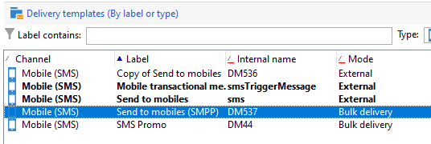

# SMS channel{#sms-channel}

Adobe Campaign lets you perform mass personalized deliveries of SMS messages. The recipient profiles must contain at least a mobile telephone number.

>[!NOTE]
>
>Adobe Campaign also lets you submit notifications on mobile terminals, via its **Adobe Campaign Mobile App Channel (NMAC)** option. 
> 
>For more on this, refer to the [About mobile app channel](../../delivery/using/about-mobile-app-channel.md) section.

The sections below provide information that is specific to the SMS channel. For global information on how to create a delivery, refer to [this section](../../delivery/using/steps-about-delivery-creation-steps.md).

## Setting up SMS channel {#setting-up-sms-channel}

To send to a mobile phone, you need:

1. An external account specifying a connector and type of message.

   Note that following connectors will be deprecated as of release 20.2: NetSize, Generic SMPP (SMPP version 3.4 supporting binary mode), Sybase365 (SAP SMS 365), CLX Communications, Tele2, O2 and iOS. Deprecated capabilities are still available, but they will not be further enhanced, nor supported. For more on this, refer to this [page](https://helpx.adobe.com/campaign/kb/deprecated-and-removed-features.html).

1. A delivery template in which this external account is referenced.

### Creating an SMPP external account {#creating-an-smpp-external-account}

To send a SMS to a mobile phone, you first need to create your SMPP external account.
For more information on SMS protocol and settings, refer to this [technical note](https://helpx.adobe.com/campaign/kb/sms-connector-protocol-and-settings.html).

To do this, follow the steps below:

1. In the **[!UICONTROL Platform]** > **[!UICONTROL External accounts]** node of the tree, click the **[!UICONTROL New]** icon.
1. Define the account type as **Routing**, the channel as **Mobile (SMS)**, and the delivery mode as **Bulk delivery**.

   

1. Check the **[!UICONTROL Enabled]** box.
1. In the **[!UICONTROL Mobile]** tab, select **[!UICONTROL Extended generic SMPP]** from the **[!UICONTROL Connector]** drop-down list.

   

   >[CAUTION]
   >
   > As of release 20.2, legacy connectors will be deprecated and not supported. We recommend using the **[!UICONTROL Extended generic SMPP]** connector. For more information on how to migrate to the recommended connector, refer to this [page](https://helpx.adobe.com/campaign/kb/sms-connector.html).

1. The **[!UICONTROL Enable verbose SMPP traces in the log file]** option allows you to dump all SMPP traffic in log files. This option must be enabled to troubleshoot the connector and to compare with the traffic seen by the provider.

1. Contact your SMS service provider who will explain to you how to complete the different external account fields from the **[!UICONTROL Connection settings]** tab.

   Then, contact your provider, depending on the one chosen, who will give you the value to enter into the **[!UICONTROL SMSC implementation name]** field.

   You can define the number of connections to the provider per MTA child. By default, it is set to 1.

1. By default, the number of characters in an SMS meets the GSM standards.

   SMS messages using GSM encoding are limited to 160 characters, or 153 characters per SMS for messages sent in multiple parts.

   >[!NOTE]
   >
   >Certain characters count as two (braces, square brackets, the euro symbol, etc.).  
   >
   >The list of available GSM characters is presented below.

   If you like, you can authorize character transliteration by checking the corresponding box.

   

   For more on this, refer to [this section](#about-character-transliteration).

1. In the **[!UICONTROL Throughput and delays]** tab, you can specify the maximum throughput of outbound messages ("MT", Mobile Terminated) in MT per second. If you enter "0" in the corresponding field, the throughput will be unlimited.

   The values of all of the fields corresponding to durations need to be completed in seconds.

1. In the **[!UICONTROL Mapping of encodings]** tab, you can define encodings.

   For more on this, refer to [this section](#about-text-encodings).

1. In the **[!UICONTROL SMSC specificities]** tab, the **[!UICONTROL Send full phone number]** option is disabled by default. Do not enable it if you want to respect the SMPP protocol and transfer only digits to the server of the SMS provider (SMSC).

   However, given that certain providers require the use of the '+' prefix, it is advised that you check with your provider and they will suggest that you enable this option if necessary.

   The **[!UICONTROL Enable TLS over SMPP]** checkbox allows you to encrypt SMPP traffic. For more on this, refer to this [technical note](https://helpx.adobe.com/campaign/kb/sms-connector-protocol-and-settings.html).

1. If you are configuring an **[!UICONTROL Extended generic SMPP]** connector, you can set up automatic replies.

   For more on this, refer to [this section](#automatic-reply).

### About character transliteration {#about-character-transliteration}

Character transliteration can be set up in a SMPP mobile delivery external account, under the **[!UICONTROL Mobile]** tab.

Transliteration consists of replacing one character of an SMS by another when that character is not taken into account by the GSM standard.

* If transliteration is **[!UICONTROL authorized]**, each character that is not taken into account is replaced by a GSM character when the message is sent. For example, the letter "ë" is replaced by "e". The message is therefore slightly altered, but the character limit will remain the same.
* When transliteration is **[!UICONTROL not authorized]**, each message that contains characters that are not taken into account is sent in binary format (Unicode): all of the characters are therefore sent as they are. However, the SMS messages using Unicode are limited to 70 characters (or 67 characters per SMS for messages sent in multiple parts). If the maximum number of characters is exceeded, several messages will then be sent, which may create additional costs.

>[!IMPORTANT]
>
>Inserting personalization fields into the content of your SMS message may introduce characters that are not taken into account by the GSM encoding.

By default, character transliteration is disabled. If you would like all of the characters in your SMS messages to be kept as they are, to not alter proper names for example, we recommend that you do not enable this option.

However, if your SMS messages contain a lot of characters that generate Unicode messages, you can choose to enable this option to limit the costs of sending your messages.

The following table presents the characters taken into account by the GSM standard. All of the characters inserted into the message body, other than those mentioned below, convert the entire message into binary format (Unicode) and therefore limit it to 70 characters.

**Basic characters**

<table> 
 <tbody> 
  <tr> 
   <td> @ </td> 
   <td>  </td> 
   <td> SP </td> 
   <td> 0 </td> 
   <td> ¡ </td> 
   <td> P </td> 
   <td> ¿ </td> 
   <td> p </td> 
  </tr> 
  <tr> 
   <td> £ </td> 
   <td> _ </td> 
   <td> ! </td> 
   <td> 1 </td> 
   <td> A </td> 
   <td> Q </td> 
   <td> a </td> 
   <td> q </td> 
  </tr> 
  <tr> 
   <td> $ </td> 
   <td>  </td> 
   <td> " </td> 
   <td> 2 </td> 
   <td> B </td> 
   <td> R </td> 
   <td> b </td> 
   <td> r </td> 
  </tr> 
  <tr> 
   <td> ¥ </td> 
   <td>  </td> 
   <td> # </td> 
   <td> 3 </td> 
   <td> C </td> 
   <td> S </td> 
   <td> c </td> 
   <td> s </td> 
  </tr> 
  <tr> 
   <td> è </td> 
   <td>  </td> 
   <td> ¤ </td> 
   <td> 4 </td> 
   <td> D </td> 
   <td> T </td> 
   <td> d </td> 
   <td> t </td> 
  </tr> 
  <tr> 
   <td> é </td> 
   <td>  </td> 
   <td> % </td> 
   <td> 5 </td> 
   <td> E </td> 
   <td> U </td> 
   <td> e </td> 
   <td> u </td> 
  </tr> 
  <tr> 
   <td> ù </td> 
   <td>  </td> 
   <td> &amp; </td> 
   <td> 6 </td> 
   <td> F </td> 
   <td> V </td> 
   <td> f </td> 
   <td> v </td> 
  </tr> 
  <tr> 
   <td> ì </td> 
   <td>  </td> 
   <td> ' </td> 
   <td> 7 </td> 
   <td> G </td> 
   <td> W </td> 
   <td> g </td> 
   <td> w </td> 
  </tr> 
  <tr> 
   <td> ò </td> 
   <td>  </td> 
   <td> ( </td> 
   <td> 8 </td> 
   <td> H </td> 
   <td> X </td> 
   <td> h </td> 
   <td> x </td> 
  </tr> 
  <tr> 
   <td> Ç </td> 
   <td>  </td> 
   <td> ) </td> 
   <td> 9 </td> 
   <td> I </td> 
   <td> Y </td> 
   <td> i </td> 
   <td> y </td> 
  </tr> 
  <tr> 
   <td> LF </td> 
   <td>  </td> 
   <td> * </td> 
   <td> : </td> 
   <td> J </td> 
   <td> Z </td> 
   <td> j </td> 
   <td> z </td> 
  </tr> 
  <tr> 
   <td> Ø </td> 
   <td> ESC </td> 
   <td> + </td> 
   <td> ; </td> 
   <td> K </td> 
   <td> Ä </td> 
   <td> k </td> 
   <td> ä </td> 
  </tr> 
  <tr> 
   <td> ø </td> 
   <td> Æ </td> 
   <td> , </td> 
   <td> &lt; </td> 
   <td> L </td> 
   <td> Ö </td> 
   <td> l </td> 
   <td> ö </td> 
  </tr> 
  <tr> 
   <td> CR </td> 
   <td> æ </td> 
   <td> - </td> 
   <td> = </td> 
   <td> M </td> 
   <td> Ñ </td> 
   <td> m </td> 
   <td> ñ </td> 
  </tr> 
  <tr> 
   <td> Å </td> 
   <td> ß </td> 
   <td> . </td> 
   <td> &gt; </td> 
   <td> N </td> 
   <td> Ü </td> 
   <td> n </td> 
   <td> ü </td> 
  </tr> 
  <tr> 
   <td> å </td> 
   <td> É </td> 
   <td> / </td> 
   <td> ? </td> 
   <td> O </td> 
   <td> § </td> 
   <td> o </td> 
   <td> à </td> 
  </tr> 
 </tbody> 
</table>

SP: Space

ESC: Escape

LF: Line Feed

CR: Carriage Return

**Advanced characters (counted twice)**

^ { } `[ ~ ]` | €

### About text encodings {#about-text-encodings}

When sending an SMS message, Adobe Campaign can use one or several text encodings. Each encoding has its own specific character set and determines the number of characters that fit into an SMS message.

When configuring a new SMPP mobile delivery external account, you can define the **[!UICONTROL Mapping of encodings]** in the **[!UICONTROL Mobile]** tab: the **[!UICONTROL data_coding]** field allows Adobe Campaign to communicate which encoding is used to the SMSC.

>[!NOTE]
>
>The mapping between the **data_coding** value and the encoding actually used is standardized. Nevertheless, certain SMSC have their own specific mapping: in this case, your **Adobe Campaign** administrator needs to declare this mapping. Check with your provider to find out more.

You can declare **data_codings** and force the encoding if necessary: to do this, specify a single encoding in the table.

* When no mapping of encodings is defined, the connector takes on a generic behavior:

    * It will try to use GSM encoding to which it assigns the value **data_coding = 0**.
    * If GSM encoding fails, it will use **UCS2** encoding to which it assigns the value **data_coding = 8**.

* When you define the encodings that you would like to use as well as the linked **[!UICONTROL data_coding]** field values, Adobe Campaign will try to use the first encoding in the list, then the following, if the first encoding proves impossible.

>[!IMPORTANT]
>
>The order of declaration is important: it is recommended that you put the list in ascending order **of cost** in order to favor the encodings allowing you to fit as many characters as possible in each SMS message.
>
>Only declare the encodings that you would like to use. If some of the encodings provided by the SMSC should not correspond to your purpose of use, do not declare them in the list.

### Automatic reply {#automatic-reply}

When setting up an extended generic SMPP connector, you can configure automatic replies.

When a subscriber replies to an SMS message which was sent to them via Adobe Campaign and their message contains a keyword such as "STOP", you can configure messages which are automatically sent back to them in the **[!UICONTROL Automatic reply sent to the MO]** section.

>[!NOTE]
>
>The keywords are not case-sensitive.

For each keyword, specify a short code, which is a number that is usually used to send deliveries and will serve as a sender name, then enter the message that will be sent to the subscriber.

You can also link an action to your automatic response: **[!UICONTROL Send to quarantine]** or **[!UICONTROL Remove from quarantine]**. For example, if a recipient sends the keyword "STOP", they will automatically receive an unsubscription confirmation and are sent to quarantine.


If you link the **[!UICONTROL Remove from quarantine]** action to an automatic response, the recipients sending the corresponding keyword are automatically removed from quarantine.

Recipients are listed in the **[!UICONTROL Non deliverables and addresses]** table available through the **[!UICONTROL Administration]** > **[!UICONTROL Campaign Management]** > **[!UICONTROL Non deliverables Management]** menu.

* To send the same reply no matter what the short code, leave the **[!UICONTROL Short code]** column empty.
* To send the same reply no matter what the keyword, leave the **[!UICONTROL Keyword]** column empty.
* To carry out an action without sending a response, leave the **[!UICONTROL Response]** column empty. For example, this allows you to remove from quarantine a user who replies with a message other than "STOP".

If you have multiple external accounts using the Extended generic SMPP connector with the same provider account, the following issue may happen: when sending a reply to a short code, it may be received on any of your external account connections. Consequently, the automatic reply that is sent could not be the expected message.
To avoid this, apply one of the following solutions, depending on the provider you are using:

* Create one provider account for each external account.
* Use the **[!UICONTROL System type]** field from the **[!UICONTROL Mobile]** > **[!UICONTROL Connection settings]** tab to distinguish each short code. Ask your provider a different value for each account.

   

The steps for setting up an external account using the Extended generic SMPP connector are detailed in the [Creating an SMPP external account](../../delivery/using/sms-channel.md#creating-an-smpp-external-account) section.

### Changing the delivery template {#changing-the-delivery-template}

Adobe Campaign provides you with a template for delivering to mobiles. This template is available in the **[!UICONTROL Resources > Templates > Delivery templates]** node. For more on this, refer to the [About templates](../../delivery/using/about-templates.md) section.

To deliver via SMS channel, you must create a template in which the channel connector is referenced.

In order to keep the native delivery template, we recommend that you duplicate it and then configure it.

In the example below, we create a template to deliver messages via the SMPP account enabled earlier. To do this:

1. Go to the **[!UICONTROL Delivery templates]** node.
1. Right-click the **[!UICONTROL Send to mobiles]** template, and select **[!UICONTROL Duplicate]**.

   

1. Change the label of the template, for example **Sent to mobiles (SMPP)**.

   

1. Click **[!UICONTROL Properties]**.
1. In the **[!UICONTROL General]** tab, select a routing mode that corresponds to the external account that you created in the previous steps.

   

1. Click **[!UICONTROL Save]** to create the template.

   

You now have an external account and a delivery template that let you deliver via SMS.

## Creating a SMS delivery {#creating-a-sms-delivery}

### Selecting the delivery channel {#selecting-the-delivery-channel}

To create a new SMS delivery, follow the steps below:

>[!NOTE]
>
>Global concepts on delivery creation are presented in [this section](../../delivery/using/steps-about-delivery-creation-steps.md).

1. Create a new delivery, for example from the Delivery dashboard.
1. Select the delivery template **Sent to mobiles (SMPP)** that you created earlier. For more on this, refer to the [Changing the delivery template](#changing-the-delivery-template) section.

   

1. Identify your delivery with a label, code, and description. For more on this, refer to [this section](../../delivery/using/steps-create-and-identify-the-delivery.md#identifying-the-delivery).
1. Click **[!UICONTROL Continue]** to confirm this information and display the message configuration window.

## Defining the SMS content {#defining-the-sms-content}

To create the content of the SMS, follow the steps below:

1. Enter the content of the message in the **[!UICONTROL Text content]** section of the wizard. The toolbar buttons let you import, save, or search in contents. The last button is used to insert personalization fields.

   

   The use of personalization fields is presented in the [About personalization](../../delivery/using/about-personalization.md) section.

1. Click **[!UICONTROL Preview]** at the bottom of the page to view the rendering of the message with its personalization. To launch the preview, select a recipient using the **[!UICONTROL Test personalization]** button in the toolbar. You can select a recipient from the defined targets or choose another recipient.

   

   You can approve the SMS message. You can also view the content of the SMS on the mobile phone screen displayed on the right of the content editor. Click the screen and use the mouse to scroll through the content.

   

1. Click the **[!UICONTROL Data loaded]** link to view the information concerning the recipient.

   

   >[!NOTE]
   >
   >SMS messages are limited to a length of 160 characters if the Latin-1 (ISO-8859-1) code page is used. If the message is written in Unicode, it must not exceed 70 characters. Certain special characters can affect message length. For more information on message length, refer to the [About character transliteration](#about-character-transliteration) section.
   >
   >When personalization fields or conditional content fields are present, the size of the message varies from one recipient to the other. The length of the message must be evaluated when personalization has been carried out.
   >
   >When you launch the analysis, the length of messages is checked and a warning is displayed in the event of overflow.

1. If you use the NetSize connector or an SMPP connector, you can personalize the name of the delivery sender. For more on this, refer to the [Advanced parameters](#advanced-parameters) section.

## Selecting the target population {#selecting-the-target-population}

The detailed process when selecting the target population of a delivery is presented in [this section](../../delivery/using/steps-defining-the-target-population.md).

For more on the use of personalization fields, refer to [About personalization](../../delivery/using/about-personalization.md).

For more on the inclusion of a seed list, refer to [About seed addresses](../../delivery/using/about-seed-addresses.md).

## Sending SMS messages {#sending-sms-messages}

To approve your message and send it to the recipients of the delivery being created, click **[!UICONTROL Send]**.

The detailed process when validating and sending a delivery is presented in the sections below:

* [Validating the delivery](../../delivery/using/steps-validating-the-delivery.md)
* [Sending the delivery](../../delivery/using/steps-sending-the-delivery.md)

### Advanced parameters {#advanced-parameters}

The **[!UICONTROL Properties]** button gives access to the advanced delivery parameter. The parameters specific to SMS deliveries are in the **[!UICONTROL SMS parameters]** section of the **[!UICONTROL Delivery]** tab.

The following options are available:

* **Sender address**: lets you personalize the name of the delivery sender using a string of alphanumeric characters limited to eleven characters. The field must not be exclusively made up of figures. You can define a condition to display, for example, different names according to the area code of the recipient:

  ```
  <% if( String(recipient.mobilePhone).indexOf("+1") == 0){ %>NeoShopUS<%} else %>
  ```

  >[!IMPORTANT]
  >
  >Check the law in your country regarding editing sender names. You should also check with your operator whether they offer this functionality.

* **Transmission mode**: message transmission by SMS.
* **Priority**: level of importance assigned to a message. **[!UICONTROL Normal]** priority is selected by default. Ask your service provider about the cost of SMS sent with **[!UICONTROL High]** priority.
* **Type of application**: choose the application you wish to assign to your SMS delivery. The **[!UICONTROL Direct Marketing]** option is selected by default and is the most common one used.

**Parameters specific to the NetSize connector**


* **Use several SMS for a single message**: this lets you send a message over 160 characters long via several SMS messages.

**Parameters specific to an SMPP connector**


* **Maximum number of SMS per message**: this option lets you set the number of SMS to use to send a message. If the number is set to 0, you can use an SMS to deliver your message. If the number of SMS is set to 1 or 2 for instance, and the message exceeds this threshold, it will not be sent.

## Monitoring and tracking SMS deliveries {#monitoring-and-tracking-sms-deliveries}

After sending messages, you can monitor and track your deliveries. For more on this, refer to these sections:

* [Monitoring a delivery](../../delivery/using/monitoring-a-delivery.md)
* [Understanding delivery failures](../../delivery/using/understanding-delivery-failures.md)
* [About message tracking](../../delivery/using/about-message-tracking.md)

## Processing inbound messages {#processing-inbound-messages}

The **nlserver sms** module queries the SMS router at regular intervals. This allows Adobe Campaign to track the progress of deliveries and handle the status reports and recipient unsubscription requests.

* **Status reports**: view delivery logs to check the status of your messages.

  >[!NOTE]
  >
  >Every SMS sent is linked to an external account its primary key. In this way:  
  >
  > * Status reports from a deleted external SMS account are not correctly processed.
  > * An SMS account can only be linked to a single external account to ensure that status reports are attributed to the correct account

* **Unsubscription**: recipients who wish to stop receiving SMS deliveries can return a message containing the word STOP. If your provider allows it under the terms of the contract, you can retrieve messages via the **Inbound SMS** workflow activity and then create a query to enable the **No longer contact this recipient** option for the recipients concerned.

  Refer to the [Workflows](../../workflow/using/architecture.md) guide.

## InSMS schema {#insms-schema}

The InSMS schema contains information relevant to incoming SMS. A description of these fields is available via the desc attribute.

* **message**: content of the SMS received.
* **origin**: mobile number at the origin of message.
* **providerId**: identifier of the message returned by the SMSC (message center).
* **created**: date incoming message was inserted into Adobe Campaign.
* **extAccount**: Adobe Campaign external account.

  >[!IMPORTANT]
  >
  >The following fields are specific to NetSize.
  >
  >If the operator in use is not NetSize, these fields are considered empty.

* **alias**: alias of incoming message.
* **separator**: separator between the alias and the body of the message.
* **messageDate**: message date given by operator.
* **receivalDate**: date message from operator was received by SMSC (message center).
* **deliveryDate**: date message sent by SMSC (message center).
* **largeAccount**: customer account code linked to incoming SMS.
* **countryCode**: operator country code.
* **operatorCode**: operator network code.
* **linkedSmsId**: Adobe Campaign identifier (broadlogId) linked to outgoing SMS, where this SMS is the response.

## Managing automatic replies (American regulation) {#managing-automatic-replies--american-regulation-}

When subscribers reply to an SMS message that was sent to them via Adobe Campaign, and they use a keyword such as STOP, HELP, or YES, it is necessary, in the US market, to configure messages that are automatically returned.

For example, if recipients send the keyword STOP, they automatically receive a confirmation message stating that they have been unsubscribed.

The sender name for this type of message is a short code usually used to send deliveries.

>[!IMPORTANT]
>
>The following detailed procedure is only valid for SMPP connectors, except for the extended generic SMPP connector. For more on this, refer to the [Creating an SMPP external account](#creating-an-smpp-external-account) section.
>
>It makes up part of the certification process carried out by American operators for marketing campaigns in the US. These replies to subscriber SMS messages containing the keyword must be sent back to the subscriber immediately after receiving a message from them.

1. Create this type of XML file:

   ```
   <autoreply>
     <shortcode name="12345">
       <reply keyword="STOP" text="You will not receive SMS anymore" />
       <reply keyword="HELP" text="Powered by Adobe Campaign" />
     </shortcode>
     <shortcode name="43115">
       <reply keyword="STOP" text="Vous ne recevrez plus de SMS" />
       <reply keyword="HELP" text="Service rendu par Adobe Campaign" />
     </shortcode>
     <shortcode name="*">
       <reply keyword="ADOBE" text="This text is replied when you send ADOBE to any short code" />
     </shortcode>
   </autoreply>
   ```

1. For the **name** attribute of the **`<shortcode>`** tag, specify the short code that will be displayed in the place of the message sender name.

   In each **`<reply>`** tag, enter the **keyword** attribute with a keyword and the **text** attribute with the message that you would like to send for this keyword.

   >[!NOTE]
   >
   >Each keyword must be written in capital letters.

   If you want to send the same message for several keywords, duplicate the corresponding line.

   For example:

   ```
   <reply keyword="STOP" text="You will not receive SMS anymore" />
   <reply keyword="QUIT" text="You will not receive SMS anymore" />
   ```

1. Once completed, save this file under the name **smsAutoReply.xml**.

   Note that the name of the file is case sensitive in Linux.

1. Copy this file into the **conf** directory in Adobe Campaign, at the same place as the Web server.

>[!IMPORTANT]
>
>These kinds of automatic messages do not keep a history. Therefore they do not appear in the [delivery dashboard](../../delivery/using/monitoring-a-delivery.md#delivery-dashboard).
>
>These messages are not considered part of the [commercial pressure rules](../../campaign/using/pressure-rules.md).
