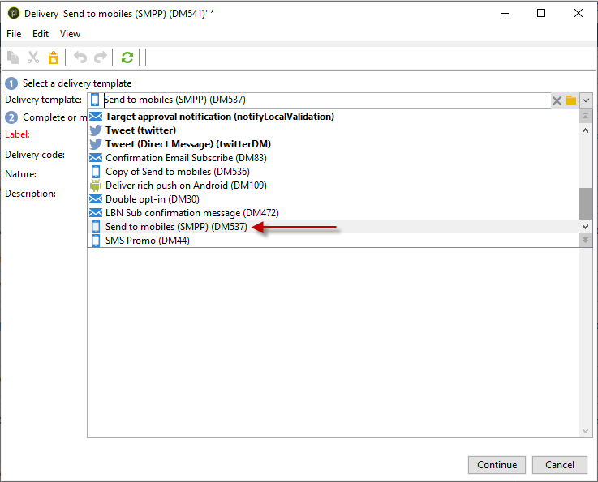
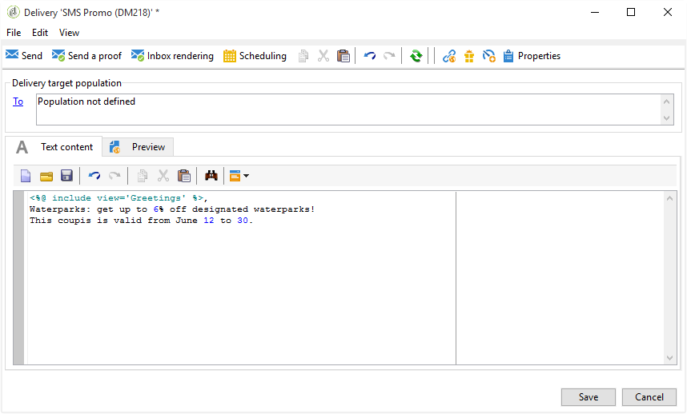
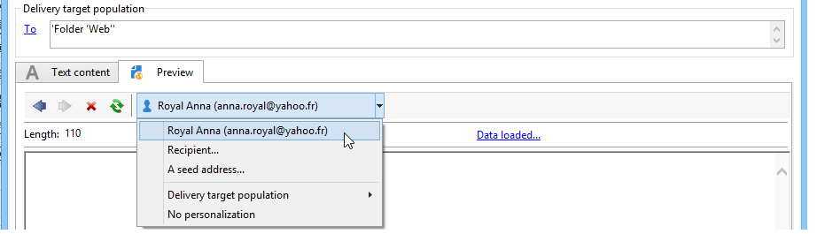
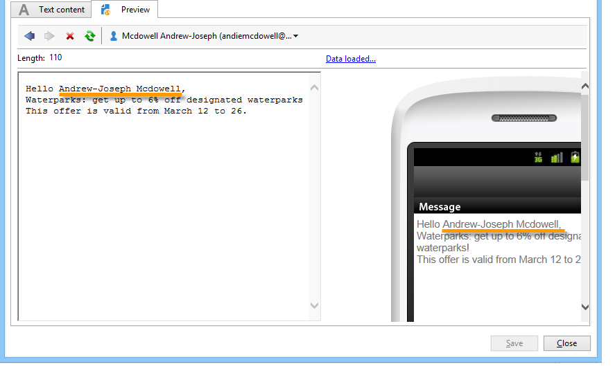
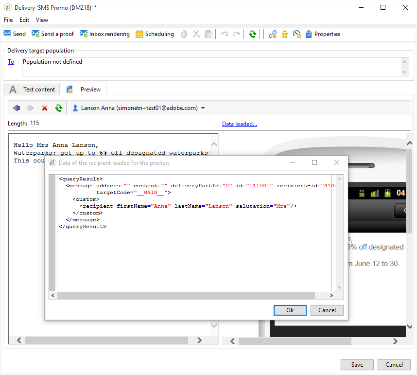

# Create a SMS delivery {#creating-a-sms-delivery}

## Select the delivery channel {#selecting-the-delivery-channel}

To create a new SMS delivery, follow the steps below:

>[!NOTE]
>
>Global concepts on delivery creation are presented in [this section](../../delivery/using/steps-about-delivery-creation-steps.md).

1. Create a new delivery, for example from the Delivery dashboard.
1. Select the delivery template **Sent to mobiles (SMPP)** that you created earlier. For more on this, refer to the [Change the delivery template](sms-set-up.md#changing-the-delivery-template) section.

   

1. Identify your delivery with a label, code, and description. For more on this, refer to [this section](../../delivery/using/steps-create-and-identify-the-delivery.md#identifying-the-delivery).
1. Click **[!UICONTROL Continue]** to confirm this information and display the message configuration window.

## Define the SMS content {#defining-the-sms-content}

To create the content of the SMS, follow the steps below:

1. Enter the content of the message in the **[!UICONTROL Text content]** section of the wizard. The toolbar buttons let you import, save, or search in contents. The last button is used to insert personalization fields.

   

   The use of personalization fields is presented in the [About personalization](../../delivery/using/about-personalization.md) section.

1. Click **[!UICONTROL Preview]** at the bottom of the page to view the rendering of the message with its personalization. To launch the preview, select a recipient using the **[!UICONTROL Test personalization]** button in the toolbar. You can select a recipient from the defined targets or choose another recipient.

   

   You can approve the SMS message. You can also view the content of the SMS on the mobile phone screen displayed on the right of the content editor. Click the screen and use the mouse to scroll through the content.

   

1. Click the **[!UICONTROL Data loaded]** link to view the information concerning the recipient.

   

   >[!NOTE]
   >
   >SMS messages are limited to a length of 160 characters if the Latin-1 (ISO-8859-1) code page is used. If the message is written in Unicode, it must not exceed 70 characters. Certain special characters can affect message length. For more information on message length, refer to the [SMS character transliteration](#about-character-transliteration) section.
   >
   >When personalization fields or conditional content fields are present, the size of the message varies from one recipient to the other. The length of the message must be evaluated when personalization has been carried out.
   >
   >When you launch the analysis, the length of messages is checked and a warning is displayed in the event of overflow.

1. If you use the NetSize connector or an SMPP connector, you can personalize the name of the delivery sender. For more on this, refer to the [Advanced parameters](#advanced-parameters) section.

## Select the target population {#selecting-the-target-population}

The detailed process when selecting the target population of a delivery is presented in [this section](../../delivery/using/steps-defining-the-target-population.md).

For more on the use of personalization fields, refer to [this section](../../delivery/using/about-personalization.md).

For more on the inclusion of a seed list, refer to [this page](../../delivery/using/about-seed-addresses.md).
