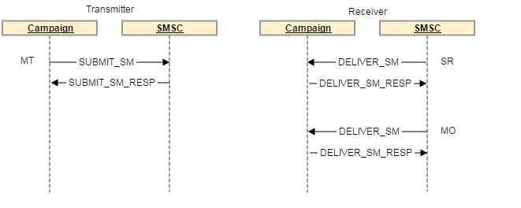
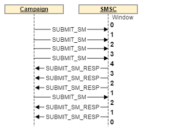
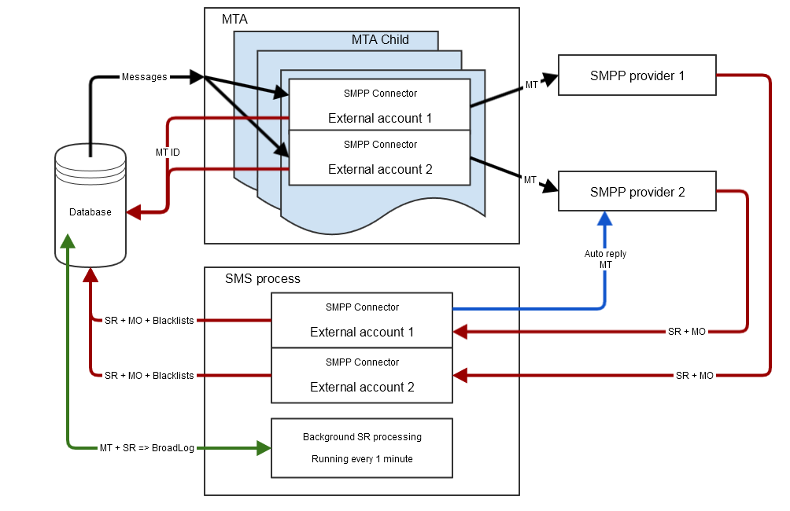

# SMS connector protocol and settings {#sms-connector-protocol}

>[!NOTE]
>
>Through this document, all references to details about the protocol, field names and values refer to the [SMPP 3.4 specification](https://smpp.org/SMPP_v3_4_Issue1_2.pdf).
>

## Overview {#overview}

SMS might be limited to sending short text messages with no formatting but its simplicity makes it a valuable communication channel.

There are two main ways to send an SMS:

* Send it manually from a phone, the usual way to communicate directly between people.
* Send it from the internet, the way Adobe Campaign send messages. For that, you need a SMS service provider that connects the internet to the mobile network.
Adobe Campaign uses the SMPP protocol to send SMS to a service provider.

This document will walk you through the connection set up between Adobe Campaign and a SMPP provider.

SMPP providers can sometimes deviate from the official specification but the SMS connector in Adobe Campaign provides many options to adapt its behavior for it to be compatible with most providers.

>[!IMPORTANT]
>
>Setting up a connection to a new provider may require some technical skills, knowledge of TCP, binary, hexadecimal representation and text encodings. It will also require active cooperation with the provider.

### SMS types {#sms-types}

When sending mass SMS through an SMS provider, you will encounter three different kinds of SMS:

* **SMS MT (Mobile Terminated)**: an SMS that is emitted by Adobe Campaign towards mobile phones through the SMPP provider.

* **SMS MO (Mobile Originated)**: an SMS that is sent by a mobile to Adobe Campaign through the SMPP provider.

* **SMS SR (Status Report) or DR or DLR (Delivery Receipt)**: a return receipt sent by the mobile to Adobe Campaign through the SMPP provider indicating that the SMS has been received successfully. Adobe Campaign may also receive SR indicating that the message could not be delivered, often with a description of the error.

You need to distinguish between acknowledgments (RESP PDU, part of the SMPP protocol) and SR: SR is a kind of SMS that is sent through the network end-to-end, whereas an acknowledgement is only a confirmation that one transfer has been successful.

Both acknowledgements and SR can trigger errors, distinguishing between the two will help the troubleshooting.

### Information carried by an SMS {#information-sms}

An SMS carries more information than text. Here a list of what you can expect to find in an SMS:

* The text, which is limited to 140 bytes, which means between 70 and 160 characters depending on the encoding. See [SMS text encoding](../../delivery/using/sms-protocol.md#sms-text-encoding) below for details and limitations.

* A recipient address, sometimes called `ADC` or `MSISDN`. That's the number of the mobile that will receive the SMS.

* A sender address, that can be called `oADC` or sometimes `sender id`. That can be a phone number in day to day use, a short code when sent through a provider or a name. Name is an optional feature, in that case you cannot reply to the SMS.

* A flag to indicate if the message is a flash message. A flash message is a pop-up that is not stored in memory.

* A flag to indicate whether a SR is expected or not.

* A validity date, after which no network equipment is allowed to retry.

* A `data_coding` field, which indicates the encoding of the text.

## SMPP protocol {#smpp-protocol}

Adobe Campaign Classic supports the SMPP protocol version 3.4. This is a widespread protocol that allows sending SMS to a provider (SMSC) and receiving SMS as well as receipts. For more on this, refer to the [SMPP documentation](https://smpp.org/SMPP_v3_4_Issue1_2.pdf).

The network equipment on the SMS service provider side is often called the SMSC.

### SMPP connections {#smpp-connections}

Adobe Campaign connects to the network equipment of the SMS service provider via TCP. The SMPP protocol sets permanent TCP connections from Adobe Campaign to the provider. TCP connections are always initiated by Adobe Campaign, even to receive messages.
SMPP opens 1 or 2 TCP connections, depending on its mode. All connections are always initiated by Adobe Campaign.

The SMPP protocol can work in two modes:

* **Transmitter+receiver (or TX+RX)**: two separate TCP connections are used for transmitting and receiving messages.
* **Transceiver (or TRX)**: a single TCP connection is used for transmitting and receiving messages.

>[!NOTE]
>
> Adobe Campaign Classic only supports the TX+RX mode. This limitation is due to its technical architecture.

### SMPP PDU {#smpp-pdu}

SMPP transmission units ("packets") are called PDUs. A **PDU** contains a command, a status, a sequence number and data.

Each PDU must be acknowledged by an `SMPP RESP PDU` (synchronous response). Requests may be pipelined: the sender can send many commands without waiting for `RESP`, the number of requests that may be pipelined at any time is called the window. `RESP PDU` may arrive in any order, unrelated to the order of their corresponding initiator PDU.

In the separated **Transmitter+receiver** mode, the connection used depends on the kind of message transmitted. The transmitter connection is used for MT, and the receiver connection is used for MO and SR. Requests and responses for each kind of message are sent over the same TCP connection.

For example, when sending an MT, the transmitter connection is used and the `RESP` that acknowledges the MT is also sent through the transmitter channel. When you receive an MO (or an SR), the receiver connection is used to receive the MO and to send the `RESP` that acknowledges the MO.



In Adobe Campaign Classic, to link SR with their corresponding MT, an ID is returned by the SMSC with the `SUBMIT_SM_RESP` and `DELIVER_SM` steps. The identifier is stored in the `providerId` field of the `nms::providerMsgId` table and is linked to `broadLogId` and `deliveryId`. This matching operation is done by the SMS process when writing to the database.

A successful `SUBMIT_SM_RESP PDU` triggers the "sent" message status in the sending log while a successful `DELIVER_SM (SR) PDU` triggers the "received" message status.

### Security aspects {#security-aspects}

The protocol itself is not encrypted. Most providers implement a variant of IP on allowlist so Adobe Campaign server IP addresses have to be declared to the provider.

Adobe Campaign supports passing a login and a password during the bind phase. It also supports SMPP over TLS. It should be noted that certificates are required for proper security. While the SMPP connector allows bypassing certificate checks, it should only be used for testing since TLS without certificates provides a significantly lower level of security.

The connector uses the default certificates provided by the system `openssl` library. Usually it's provided by the `/etc/ssl/certs` directory on Debian. This directory is provided by the "ca-certificates" package by default but it may be customized.

### Information in each kind of PDU {#information-pdu}

Each kind of PDU has distinct fields that carry different pieces of information. These PDU are detailed in the [SMPP 3.4 specification](https://smpp.org/SMPP_v3_4_Issue1_2.pdf).

Each section below describes both the PDU and its synchronous response (`*_RESP PDU`). All PDUs must be acknowledged by a corresponding `RESP`, this is a mandatory part of the specification.

PDUs can have optional fields. Only the most common fields are described here. Refer to the [SMPP 3.4 specification](https://smpp.org/SMPP_v3_4_Issue1_2.pdf) for more information.

**BIND_TRANSMITTER / BIND_RECEIVER / BIND_TRANSCEIVER**

This PDU is used to initiate a connection to the SMSC. **Transmitter**, **Receiver** and **Transceiver** modes only change the kind of SMS allowed to be transferred over this connection, specifically:

| Mode | Kinds of SMS allowed  |
|:-:|:-:|
| Transmitter | MT |
| Receiver | MO + SR |
| Transceiver | MT + MO + SR |

Notable fields in a `BIND_* PDU`:

* **system_id**: Login used for authentication. Set in the external account.

* **password**: Password used for authentication. Set in the external account.

* **system_type**: Required to be set at a specific value for some providers. Set in the external account, available in all versions. Often distinguishes between different types of contracts, channels, countries, etc.

* **addr_ton** and **addr_npi**: Required by some providers. Set by the `Bind TON` and `Bind NPI` settings in the external account.

* **address_range**: Required by some providers. Most of the time, this is a list of shortcodes allowed on this connection. Set in the external account.

`BIND_*_RESP` has no specific field, it confirms whether the connection was successful or not.

#### UNBIND {#unbind}

This PDU must be sent by the system before disconnecting. It must wait the matching `UNBIND_RESP` PDU before closing the connection.

Conforming SMSC must not close the connection, the TCP connection is controlled by the Adobe Campaign connector.

#### SUBMIT_SM {#submit-sm}

This PDU sends a MT to the SMSC. Its response PDU gives the ID of the MT.

Notable fields in a `SUBMIT_SM` PDU:

* **service_type**: required by some providers. Set in the delivery properties.

* **source_addr_ton** and **source_addr_npi**: indicates what kind of source address is transmitted. The meaning of these fields is standardized, but since some providers use it differently, you should ask the provider for its correct value. Set in the external account.

* **source_addr**: the source address / oADC of the MT. It will be displayed on the mobile phone. Set in the external account and the delivery, the value in the delivery takes precedence over the value of the external account.

* **dest_addr_ton** and **dest_addr_npi**: indicates what kind of destination address is transmitted (e.g. local or international format). The meaning of these fields is standardized, but since some providers use it differently, you should ask the provider for its correct value. Set in the external account.

* **destination_addr**: recipient address, phone number or MSISDN.

* **esm_class**: used to tell if UDH is used or not in the text field. Enabled automatically by the connector for split SMS if the `message_payload` mode is not used.

* **priority_flag**: priority of this message over others. This is tied to the priority of the delivery itself.

* **validity_period**: timestamp after which no retry should be attempted. Set in the delivery itself.

* **registered_delivery**: tells whether a SR is requested or not. Adobe Campaign always sets this flag except for automatic replies. For multipart messages, the flag is only set for the first part. All versions have the same behavior.

* **data_coding**: indicates the encoding used in the text field. See the [SMS text encoding](../../delivery/using/sms-protocol.md#sms-text-encoding) section for more information.

* **short_message**: the text of the message. If UDH is used, this also contains the UHD header.

Adobe Campaign supports these optional fields:

* **dest_addr_subunit**: used to specify the target of the SMS: flash, mobile or SIM card. Set in the delivery properties.

* **message_payload**: when enabled in the external account, long messages will be sent in a single PDU and the text will be transmitted in this field rather than the `short_message` field.

#### SUBMIT_SM_RESP {#submit-sm-resp}

This PDU will contain the ID of the MT. This is useful to match it with incoming SR.

>[!IMPORTANT]
>
>Many providers transmit the MT ID in hexadecimal. Make sure that you set the **ID format in MT acknowledgement** setting correctly in the external account.

Some providers send `SUBMIT_SM_RESP` after sending the SR. To account for that behavior, Adobe Campaign waits 30 seconds before replying **Invalid message ID** to a SR with an unknown ID.

#### DELIVER_SM {#delivery-sm}

This PDU is sent by the SMSC to Adobe Campaign. It contains either a MO or a SR.

Most fields have the same meaning as their `SUBMIT_SM` counterpart. Here is the list of useful fields:

* **source_addr**: source address of the MO/SR. Usually this is a phone number.

* **destination_addr**: short code that received the MO or the SR.

* **esm_class**: used to tell if the PDU is a MO or a SR.

* **short_message**: text of the message. For SR, this contains data described in the Appendix B of the SMPP protocol specification. See [SR error management](../../delivery/using/sms-protocol.md#sr-error-management) for more details.

Adobe Campaign is able to read message ID in the `receipted_message_id` optional field with some configuration.

#### DELIVER_SM_RESP {#deliver-sm-resp}

This PDU is sent by Adobe Campaign to acknowledge SR and MO.

Adobe Campaign Classic acknowledges SR and MO once they have been inserted into the database. Some processing errors can happen even if a successful `DELIVER_SM_RESP` PDU has been sent. This limitation is caused by the software architecture of Adobe Campaign Classic.

#### ENQUIRE_LINK {#enquire-links}

This PDU is only used to check that the connection is live. Its frequency should be set according to the provider's needs.

The default 60 seconds should match most configurations set in the external account.

#### ENQUIRE_LINK_RESP {#enquire-links-resp}

This PDU acknowledges that the connection is alive.

### Multipart SMS (long SMS) {#multipart}

Multipart SMS, or long SMS, are SMS that are sent in multiple parts. Due to technical limitations in the mobile network protocol, a SMS cannot be larger than 140 bytes or it will need to be split. See the [SMS text encoding](../../delivery/using/sms-protocol.md#sms-text-encoding) section to learn more on the number of characters that can fit in a SMS.

Each part of a long message is an individual SMS. These parts travel independently on the network and are assembled by the receiving mobile phone. To handle retries and connectivity problems, Adobe Campaign sends these parts in reverse order and requests a SR only on the first part of the message, the last sent. Since the mobile phone only displays a message when its first part is received, retries on additional parts won't produce duplicates on the mobile phone.

The maximum number of SMS per message can be set per delivery using the **Maximum number of SMS per message** setting in the **Delivery template**. Messages that go above this limit will fail during sending with a SMS too long failure reason.

There are 2 ways to send long SMS:

* **UDH**: the default and recommended way to send long messages. In this mode, the connector splits the message in multiple `SUBMIT_SM PDU`s with UDH information in them. This protocol is the one used by mobile phones themselves. This means that Adobe Campaign has the most control over the message generation, making it capable to compute exactly how many parts were sent and how they were split.

* **message_payload**: the way to send the whole long message in a single `SUBMIT_SM PDU`. The provider will have to split it, which means that it is impossible for Adobe Campaign to know exactly how many parts have been sent. Some providers require this mode, but we advise you to only use it if they do not support UDH.

See the description of the `esm_class`, `short_message` and `message_payload` fields of the [SUBMIT_SM PDU](../../delivery/using/sms-protocol.md#information-pdu) for more details about the protocol and formats.

### Throughput capping and windowing {#throughput-capping}

Most providers require a throughput limit for each SMPP connection. This can be achieved by setting a number of SMS in the external account. Note that throughput throttling happens per connection, the total effective throughput is the limit per connection multiplied by the total number of connections. This is detailed in the [Simultaneous connections](../../delivery/using/sms-protocol.md#connection-settings) section.

To reach maximum possible throughput, you will need to fine tune the maximum sending window. The sending window is the number of `SUBMIT_SM PDU`s that can be sent without waiting for a `SUBMIT_SM_RESP`. See the [Sending window setting](../../delivery/using/sms-protocol.md#throughput-timeouts) section for more details.

### SR and error management ("Appendix B") {#sr-error-management}

The SMPP protocol defines standard synchronous errors in `RESP PDU`s, but it does not define error codes for SR. Each provider uses their own error codes with their meaning.

A recommendation is made in the Appendix B section of the [SMPP protocol specification](https://smpp.org/SMPP_v3_4_Issue1_2.pdf) (page 167), but this does not list the actual error codes nor their meaning.

To adapt to error management, the broadlog message system of Adobe Campaign has been leveraged to properly provision errors and their severity (hard, soft, etc.).

As mentioned above, there are two different kinds of errors:

* synchronous replies in the `SUBMIT_SM_RESP` that happen immediately after the message was sent to the SMSC
* receipts that may come much later when the mobile received the message or when the message timed out. In that case the error is found in a SR.

When a SR is received, status and error can be found in its `short_message` field (example for Appendix B conforming implementations). The `short_message` field of the PDU is often called the **text field** since it contains text in MT. In case of SR, it contains technical information plus a sub-field named **Text**. These 2 fields are different and `short_message` actually contains the **Text** field and other information.

Adobe Campaign Classic connectors (except Extended SMPP) use a hardcoded behavior that depends on the selected provider. Generic SMPP only distinguishes between success and error, with no detail. Delivery log may contain some information which is not guaranteed.

#### SR text field format {#sr-text-field-format}

The specification recommends using this format for the SR text field. It is a list of subfields, space-separated with a colon to separate the field name and its value. Field names are case insensitive.

Example of a SR text field matching the Appendix B recommendation:

```
id:1234567890 sub:001 dlvrd:001 submit date:1608011415 done date:1608011417 stat:DELIVRD err:000 Text:Hello Adobe world
```

The id field is the ID received in the `SUBMIT_SM_RESP PDU`, the acknowledge of the MT.

`sub` and `dlvrd` are supposed to count the amount of delivered parts and delivered messages, but this is not used by Adobe Campaign since the broadlog system gives a better, and more integrated information.

`submit date` and `done date` fields are indicative timestamps of when the MT was sent and when the SR was sent by the mobile. Expect some problems with time zones or even wrong timestamps given by mobiles with incorrect date set.

The stat field is important since it tells the status of the message. The only important status are `DELIVRD`, `UNDELIV` and `REJECTD`. The `DELIVRD` status indicates a success, the other two indicate an error. Other values are possible, but they are usually intermediate notifications e.g. the MT reached the mobile carrier, but not the mobile phone. These intermediate notifications are ignored by Adobe Campaign.

The err field contains the provider-specific error code. The provider has to give a table of possible error codes along with their meaning to be able to interpret this value.

Finally, the text field usually contains the beginning of the text of the MT. This is ignored by Adobe Campaign and some providers don't transmit it to avoid PII leakage and network bandwidth consumption. It can be used during troubleshooting to spot the SR matching a test MT more easily by reading this field.

### Example of SR processing in Adobe Campaign Classic Extended generic SMPP {#sr-processing}

This example displays the case of an implementation following the Appendix B recommendation, default values in the external account, and a successful SMS MT.

```
id:1234567890 sub:001 dlvrd:001 submit date:1608011415 done date:1608011417 stat:DELIVRD err:000 Text:Hello Adobe world
```

First, the `id extraction` regex is applied to extract the ID and reconcile it with the corresponding MT.

Then, the `status extraction` regex and `error code extraction` regex are applied to extract these fields and are appended to the string.

The broadlog message is constructed with this information, and the original unaltered string is appended for reference:

```
SR ExampleProvider DELIVRD 000|MESSAGE=id:1234567890 sub:001 dlvrd:001 submit date:1608011415 done date:1608011417 stat:DELIVRD err:000 Text:Hello Adobe world
```

The message is then normalized, removing the MESSAGE part to be able to match multiple messages with the same stat and err codes.

```
SR ExampleProvider DELIVRD 000|#MESSAGE#
```

If the message is not already provisioned in the broadlog message table, a new entry will be created, using the whole message as **firstText** and the normalized message. Then, the connector uses the success and `error` regex to determine if it was a success or a failure:

* If it matches the `success` regex, it will be considered as a success.

* If it matches the `error` regex, the message is qualified as an error.

* If none of these two regex match, the SR is ignored. It might be an intermediate notification, which is not handled by Adobe Campaign.

By default, all errors are provisioned as soft errors. This means that hard errors must be provisioned by hand.

### SMS text encoding {#sms-text-encoding}

You should **always contact the SMSC provider in case of encoding problems**. Only the SMSC providers have knowledge of the encoding they support and special rules that may apply due to limitations in their technical platform.

SMS messages use a special 7 bits encoding, often called the GSM7 encoding.

In the SMPP protocol, GSM7 text will be expanded to 8 bits per character for easier troubleshooting. The SMSC will pack it into 7 bits per character before it is sent to the mobile. This means that the `short_message` field of the SMS may be up to 160 bytes long in the SMPP frame whereas it is limited to 140 bytes when sent on the mobile network.

In case of encoding problems, here are some important things to check:

* Make sure that you know which characters belong to which encoding. GSM7 does not fully support diacritical marks or accents. Especially in French, where é and è are part of GSM7, but ê, â or ï are not. The same applies to Spanish.

* The C with cedilla (ç) is present only in upper case in the GSM7 alphabet, but some phones render it in lower case or "smart" case. The general recommendation is to completely avoid it and remove the cedilla or switch to UCS-2.

* **Do not use ASCII in SMS** unless explicitly requested by the SMSC provider. This encoding wastes space because it has 8-bit characters and less coverage than GSM7. This encoding may be required for CDMA networks, used in North America.

* Latin-1 is not always supported. Check the compatibility with your SMSC provider before attempting to use Latin-1.

* National language shift tables are not supported by the Adobe Campaign connector. You must use UCS-2 or other `data_coding` instead.

* UCS-2 and UTF-16 are often mixed by phones. This is a problem when using emojis and other characters not present in UCS-2.

* Most phones don't have font glyphs for all UCS-2 characters. Smartphones tend to be able to display rare characters rather easily, but feature phones generally have limited support to what is useful in the native tongue of the country they were bought in. If you want to use emoji or ASCII-art, test it on a wide variety of phones before sending. Adobe Campaign preview does not simulate missing glyphs and will display symbols available on the web browser.

The `data_coding` field tells you which encoding is used. A major problem is that the value 0 means default SMSC encoding in the specification, which usually refers to GSM7. Check with the SMSC partner which encoding is associated with `data_coding` = 0 which Adobe Campaign only supports. Other `data_coding` values tend to follow the specification, but the only way to be sure is to check with the SMSC provider.

The maximum size of a message depends on its encoding. This table sums up all the relevant information:

|  Encoding | Usual data_coding  |  Message size (characters) | Part size for multipart SMS | Available characters  |
|:-:|:-:|:-:|:-:|:-:|
| GSM7 |  0 | 160 | 152  | GSM7 basic character set + extension (extended characters take 2 characters) |
| Latin-1 | 3 |  140 | 134 |  ISO-8859-1 |
|  UCS-2 <br>UTF-16 | 8 | 70  |  67 |  Unicode (varies from phone to phone) |

## SMPP external account parameters {#SMPP-parameters-external}

Each implementation of the SMPP protocol has many variations. To improve compatibility and adaptability, many settings are available to change the behavior of the SMPP connector. This section describes every parameter and its effects on the connector.

### General parameters and routing {#general-parameters-routing}

**Limit MTA instances for this account**

It is possible to set a limit to the number of MTA instances allowed to connect to the SMPP provider. When checked, you can specify how many MTAs can be used at most.

This option allows finer control over the number of connections, see [Simultaneous connections](../../delivery/using/sms-protocol.md#connection-settings).

If you set a value higher than the number of running MTAs, all MTAs will run as normal: this option is only a limit and cannot spawn additional MTAs.

If you need to precisely control the number of connections, e.g. provider requirement, it is recommended to always set this option even if the current deployment has the right number of MTAs running. If additional MTAs are added afterwards, the connection limit will still be respected.

### Connection settings {#connection-settings}

#### SMSC implementation name {#smsc-implementation-name}

Sets the name of the SMSC implementation. It should be set to the name of your provider. Contact the administrator or the deliverability team to know what to add in this field. The role of this field is described in the [SR error management](../../delivery/using/sms-protocol.md#sr-error-management) section.

#### Server {#server}

The DNS name or IP address of the server to connect to.

#### Port {#port}

The TCP port to connect to.

#### Account {#account}

The login of the connection. Passed in the `system_id` field of the BIND PDU.

#### Password {#password}

Password of the SMPP connection. Passed in the password field of the BIND PDU.

#### System type {#system-type}

Value passed in the `system_id` field of the BIND PDU. Some providers need a specific value here.

#### Number of MTA child connections {#number-mta-child}

In Adobe Campaign Classic, it defines the number of connections per MTA child.

The Adobe Campaign Classic Extended SMPP connector can control the number of connections per MTA child. To control the global limit of connections, you will have to limit the number of MTA child processes, which often means having a dedicated mid-sourcing platform for SMS.

For Adobe Campaign Classic, there can be a different number of receiver and transmitter connections:

* **Transmitter connections = Number of MTA child connections * number of MTA child processes * number of MTAs (if auto-reply is set) + Number of MTA child connections**

As suggested above, the Adobe Campaign Classic SMS process opens more transmitter connections if auto-reply is enabled. These extra connections are used to send the automatic replies.

* **Receiver connections = Number of MTA child connections**

If you set up automatic replies, the SMS process will open transmitter/receiver pairs, increasing the number of transmitter connections. If you did not set up any automatic reply, it will open only receiver connections.

#### Enable TLS over SMPP {#enable-TLS}

Use TLS to connect to the provider. The connection will be encrypted. The TLS connection is managed by the OpenSSL library anything applicable to OpenSSL will be true for this connection.

#### Enable verbose SMPP traces in the log file {#enable-verbose-log-file}

This setting dumps all SMPP traffic in log files. It's often required to adjust parameters during initial setup. This must be enabled when troubleshooting the connector and compared to the traffic seen by the provider.

In Adobe Campaign Classic, log output is in the MTA log for MT-related traffic and in the SMS log for MO and SR-related traffic.

### Receiver connection setting {#receiver-connection}

This section is only visible in separated **transmitter+receiver** mode.

#### Use different parameters for the receiver {#receiver-parameters}

When the box is unchecked, the same settings are used for transmitter and receiver.

When the box is checked, settings in the **Connection settings** section will apply to the transmitter and settings in the **Receiver connection** settings will apply to the receiver.

**Receiver server, port, account, password, system type**

These settings apply to the receiver when in transmitter+receiver mode. They work like the transmitter part, see above for more details.

### SMPP channel settings {#smpp-channel-settings}

#### Allow character transliteration {#allow-character-transliteration}

Transliteration is the process of finding equivalent characters to missing ones. For example, the French "ê" (e with circumflex accent) character is missing from GSM encoding, but it can be replaced by "e" without impairing readability.

When this box is unchecked, text encoding will fail if it cannot encode the string exactly as-is.

When this box is checked, text encoding will try to convert the string to an approximate version instead of failing. If some characters have no equivalent in the target encoding, text encoding will fail.

See the [Define a specific mapping of encodings setting](../../delivery/using/sms-protocol.md#SMSC-specifics) for a more general explanation of the encoding process.

#### Store incoming MO in the database {#incoming-mo-storing}

When enabled, incoming MO will be stored in the inSMS table of the database. This table can be queried using the query activity of any workflow.

Adobe Campaign Classic always stores all MOs in the inSMS database so this option is not available.

#### Enable Real-time KPI updates during SR processing {#real-time-kpi}

When enabled, KPIs will be updated in real-time on the main delivery page when receiving error SR.

The drawback can be low performance because of the database contention it generates. If disabled, statistics are updated by the **syncfromexec** workflow, running every 20 minutes.

Adobe Campaign Classic has an entirely different mechanism for KPIs so this option is not available.

#### Source number {#source-number}

Defines the default source address for messages. This setting only applies if the source number has been left empty in the delivery.

By default, the source number field is not passed, so the provider will substitute it for the short code.

This enables the sender address/oADC override feature.

#### Short code {#short-code}

Indicates the main short code of the account. If multiple short codes are used for this account or if the short code is unknown, leave this field empty.

Specifying short code is helpful for two features:

* The preview will display the short code if no source number is provided. It will reflect the real behavior on the mobile phone.

* The denylist setting of the auto reply feature only sends to quarantine the user for a specific short code.

#### Source TON/NPI, Destination TON/NPI {#ton-npi}

TON (Type Of Number) and NPI (Numbering Plan Indicator) are described in section 5.2.5 of the [SMPP 3.4 specification](https://smpp.org/SMPP_v3_4_Issue1_2.pdf) (page 117). These values should be set to the provider's needs.

They are transmitted as-is in `source_addr_ton`, `source_addr_npi`, `dest_addr_ton` and `dest_addr_npi` fields of the `SUBMIT_SM PDU`.

#### Service type {#service-type}

This field is transmitted as-is in the `service_type` field of the `SUBMIT_SM PDU`. Set this to the provider's needs.

### Throughput and timeouts {#throughput-timeouts}

These settings control all the timing aspects of the SMPP channel. Some providers require very precise control of the message rate, window and retry timings. These settings should be set to values that match the capacity of the provider and the conditions indicated in their contract.

#### Sending window {#sending-window}

The window is the number of `SUBMIT_SM PDU`s that can be sent without waiting for a matching `SUBMIT_SM_RESP`.

Example of a transmission with a maximum window of 4:



The window helps increase the throughput when the network link has a high latency.  The value of the window must be at least the number of SMS/s multiplied by the latency of the link
in seconds so the connector is never waiting for a `SUBMIT_SM_RESP` before sending the next message.
If the window is too big, you may send more duplicate messages in case of connection problems. Also, most providers have a very strict limit for the window and refuse messages that go over the limit.

How to calculate the optimal sending window formula:

* Measure the maximum latency between `SUBMIT_SM` and `SUBMIT_SM_RESP`.

* Multiply this value in seconds to the max MT throughput. This will give the optimal sending window value.

Example: If you have 300 SMS/s set in max MT throughput and there is 100ms latency between `SUBMIT_SM` and `SUBMIT_SM_RESP` on average, the optimal value would be `300×0.1 = 30`.

#### Max MT throughput {#max-mt-throughput}

Maximum number of MT per second and per connection. This setting is strictly enforced, the MTA will never push messages faster than this limit. It is useful for providers that require precise throttling.

To know the total throughput limit, multiply this number by the total number of connections as detailed in the formula above.

0 means no limit, the MTA will send MT as fast as possible.

It is generally recommended to keep this setting under 1000, since it is impossible to guarantee precise throughput above this number unless properly benchmarked on the final architecture and specifically requested SMPP provider. It may be better to increase the number of connections to go above 1000 MT/s.

#### Time before reconnection {#time-reconnection}

When the TCP connection is lost, the connector will wait this number of seconds before trying to make a connection.

#### Expiration period of the MT {#expiration-period}

Timeout between `SUBMIT_SM` and its matching `SUBMIT_SM_RESP`. If the `RESP` is not received on time, the message will be considered as failed and global retry policy of the MTA will apply.

#### Bind timeout {#bind-timeout}

Timeout between the TCP connect attempt and the `BIND_*_RESP` reply. When it times out, the connection is closed by the Adobe Campaign connector and it will wait Time before reconnection before trying again.

#### enquire_link period {#enquire-link-period}

`enquire_link` is a special kind of PDU sent to keep the connection alive. This period is in seconds. The campaign connector only sends `enquire_link` when the connection is idle in order to conserve bandwidth. If no RESP is received after twice this period, the connection will be considered dead and a reconnection process will be triggered.

### SMSC specifics {#SMSC-specifics}

These settings are advanced settings which adapt the Adobe Campaign connector to most SMPP implementation peculiarities.

**Define a specific mapping of encodings**

See the [SMS text encoding](../../delivery/using/sms-protocol.md#sms-text-encoding) section for details on text encoding.

This setting allows you to define a custom encoding mapping, different from the specification. You will be able to declare a list of encodings, along with their `data_coding` value.

The MTA will try to encode using the first encoding in the list. If it fails, it will try to use the next encoding on the list, etc. If no encoding can be used to encode the message, an error will happen. Once the encoding is found, the MTA will create the `SUBMIT_SM PDU` with the encoded text and the `data_coding` field set with the value specified in the table.

The order of items in the table is important: encodings are tries from top to bottom. You should put the cheapest or most recommended encoding at the top of the list, then followed by more and more expensive encodings.

Please note that UCS-2 will never fail as it can encode all characters supported in Adobe Campaign and that the maximum length of an UCS-2 SMS is much smaller: 70 characters only.

You can also use this setting to force a specific encoding to be always used by declaring only 1 line in the mapping table.

The default mapping used when the checkbox is not checked is equivalent to the following table:

| data_coding | Encoding |
|---|---|
| 0 | GSM |
| 9 | UCS-2 |

This means that the MTA will try to encode the message in GSM. If it succeeds it will send it with `data_coding` set to 0.

If the message cannot be encoded in GSM, it will be encoded in UCS-2 and will set `data_coding` to 8.

#### Enable message_payload {#enable-message-payload}

When unchecked, long SMS will be split by the MTA and sent in multiple `SUBMIT_SM PDU`s with UDH. The message will be recomposed by the mobile phone following UDH data.

When checked, long SMS will be sent in one SUBMIT_SM PDU, putting the text in the message_payload optional field. See the [SMPP specification](../../delivery/using/sms-protocol.md#ACS-SMPP-connector) for details about this.

If this feature is enabled, Adobe Campaign will be unable to count SMS parts individually: all messages will be counted as sent in one part.

#### Send the full phone number {#send-full-phone-number}

When this checkbox is not checked, only digits of the phone number are sent to the provider (`destination_addr` field of the `SUBMIT_SM` field). This is the default behavior since the international number indicator, usually a + prefix, is replaced by TON and NPI fields in SMPP.

When the checkbox is checked, the phone number is sent as-is, with no preprocessing and potential spaces, + prefix or pound/hash/star signs.

This feature also has an effect on the behavior of auto reply denylist feature: when the checkbox is not checked, a + prefix will be added to phone numbers inserted into the quarantine table in order to compensate for the + prefix being removed from the phone number by the SMPP protocol itself.

#### Skip TLS certificate check {#skip-tls}

When TLS is enabled, skip all certificate checks.

When checked, the connection is not secure anymore, it should not be enabled in production.

It can useful for debugging or test purposes.

You can choose between three different values for the certificate validation:

* Full certification check (including the hostname), default.
* Skip the hostname verification.
* Skip the certificate verification.

#### Bind TON/NPI {#bind-ton-npi}

TON (Type Of Number) and NPI (Numbering Plan Indicator) described in section 5.2.5 of the [SMPP 3.4 specification](https://smpp.org/SMPP_v3_4_Issue1_2.pdf) (page 117). These values should be set to whatever the provider needs.

They are transmitted as-is in `addr_ton` and `addr_npi` fields of the BIND PDU.

#### Address range {#address-range}

Sent as-is in the address_range field of the BIND PDU. This value should be set to whatever the provider needs.

#### Invalid ID acknowledge count {#invalid-id}

Limits the number of **Message ID invalid** `DELIVER_SM_RESP` that can be sent for a single SR.

**This should be only used for troubleshooting purpose as a workaround** and set to 0 in normal conditions.

Fox example, when setting to 2:

* The provider sends a SR (`DELIVER_SM`) with ID "1234".

* The ID "1234" could not be found in the database.

* The connector counts 1 **Invalid ID** error for that ID, so it sends `DELIVER_SM_RESP` with the "Message ID invalid" error code (normal behavior).

* The provider retries the same SR with ID "1234".

* The ID "1234" still could not be found in the database.

* The connector counts 2 **Invalid ID** error for that ID, so it sends `DELIVER_SM_RESP` "OK", even if it was not processed correctly.

* This feature is meant to flush SR buffers on the provider side when invalid SR block legitimate that messages cannot be processed.

Setting this field to 0 disables the mechanism where **Message ID invalid** is always returned, this is normal behavior.

Setting this field to 1 makes the connector always respond "OK" even if the ID is invalid. This should be set to 1 only under supervision, for troubleshooting and for the minimum amount of time, e.g. to recover from a provider-side issue.

#### Extraction regex of the ID in the SR {#regex-extraction}

SR format is not strictly enforced by the SMPP protocol specification. It is only a recommendation described in [Appendix B](../../delivery/using/sms-protocol.md#sr-error-management) (page 167) of the specification. Some SMPP implementers format this field differently, so Adobe Campaign needs a way to extract the correct field.

By default, it captures up to 10 alphanumeric characters after `id:`.

The regex must have exactly one capture group with a part contained within parentheses. Parentheses must surround the ID part. The regex format is PCRE.

When adjusting this setting, be sure to include as much context as possible to avoid false triggers. If there are specific prefixes, such as `id:` in the standard, include them in the regex. Also use word delimiters (\b) as much as possible to avoid capturing text in the middle of a word.

Not including enough context in the regex can introduce a small security flaw: the actual content of the message can be included in the SR. If you only match a specific ID format with no context, e.g. a UUID, it may be parsing the actual text content, e.g. a UUID embedded in the text field, instead of the ID.

#### Regex applied to determine successful/error status {#regex-applied}

When messages with an unknown stat/err field combination are encountered, these regex are applied on the stat field to determine whether the SR was a success or an error. SR with stat values that don't match any of these regexes are ignored.

By default, stat values that begin with `DELIV`, e.g. `DELIVRD` in the [Appendix B](../../delivery/using/sms-protocol.md#sr-error-management), will be considered as successfully delivered and all stat values that match errors, e.g. `REJECTED`, `UNDELIV`, are considered errors.

#### ID format in MT acknowledgement {#id-format-mt}

This indicates the format of the ID returned in the `message_id` field of the `SUBMIT_SM_RESP PDU`.

* **Do not modify**: The ID is stored as-is in the database, as ASCII-encoded text. No pre-processing nor filtering occurs.

* **Decimal number**: The ID is expected to be a decimal number in ASCII form. Leading and trailing spaces and leading zeros are removed when this setting is used.

* **Hexadecimal number**: The ID is expected to be a hexadecimal number in ASCII form, with no leading 0x nor trailing h. The ID is then converted to a decimal number before being stored in the database.

* **Hexadecimal string**: The ID is expected to be an ASCII-encoded text that is itself a string of bytes encoded as hexadecimal. For example, in the PDU you will find `0x34 0x31 0x34 0x32 0x34 0x33`, which translates to ASCII "414243". This string is then decoded as a hexadecimal string of bytes and you obtain "ABC" as a result: you will store the ID "ABC" in the database.

#### ID format in SR {#id-format-sr}

This indicates the format of the ID captured by the `Extraction` regex of the ID in the SR. Values have the same meaning and the same behavior as the format in MT above.

**SR ID or error code in optional field**

>[!NOTE]
>
>Only available in the Adobe Campaign Classic Extended SMPP connector.

If checked, the content of optional fields will be appended to the text processed by regexes above. The text will have the format `0xTAG:VALUE`, `0xTAG` being the 4-digit hexadecimal value of the tag in upper case e.g. `0x002E`.

For example, you might want to capture the ID in the `receipted_message_id` field. For this, enable this checkbox and the following text will be added to the status:

```
0x001E:05e3299e-8d37-49d0-97c6-8e4fe60c7739
```

In this example, 0x001E is the tag of the optional field and the UUID is the value of the field.

In order to capture this value, you may now set the following regex in the Extraction regex of the ID in the SR field:

```
\b0x001E:([0-9a-f]{8}-[0-9a-f]{4}-[0-9a-f]{4}-[0-9a-f]{4}-[0-9a-f]{12})\b
```

>[!IMPORTANT]
>
>You can only capture optional fields that have text (ASCII/UTF-8) values. Specifically, binary fields cannot be captured reliably with the current regex system.

**SR ID or error code in text field**

If checked, the **Text** field will be kept during processing of the status text of the SR.

This is useful if the provider places important data in this field like the ID or the status. Usually this field can be safely discarded since it may contain text with a non-ASCII encoding and disrupt regex processing.

Enabling this option may introduce a very small security flaw if the `Extraction` regex of the ID in the SR field is not specific enough. The content of the **Text** field may be parsed as an ID and an attacker may use it to inject forged IDs, which may lead to a partial denial of service situation.

**Service ID tag**

Allows to add a custom TLV. This field sets the tag portion. The value can be customized per delivery in the **Service or program ID** value in the advanced parameters of the delivery.

This setting only allows adding one TLV option per message.

### Automatic reply sent to the MO {#automatic-reply}

>[!IMPORTANT]
>
>In Adobe Campaign Classic and in a hybrid architecture, applying auto-reply for the extended SMPP connector requires to add write access for the mid operator on the **External account** folder.

This feature allows to quickly reply text to MO and handle per-short code sending to denylist.

The **Keyword** and **Short code** columns define conditions to trigger the auto reply. If both fields match, the MO is sent and the additional action is triggered. To specify a wildcard, you should leave the field empty. Keyword matches against the first alphanumeric word in the MO text, ignoring punctuation and leading spaces. It means that the **Keyword** field cannot contain spaces and must be a single word.

The **Keyword** setting is a prefix. For example, if you specify "AD", it will match "AD", "ADAPT" and "ADOBE". If you have multiple keywords with a common prefix, you need to pay attention to the order since keywords are processed from top to bottom.

The **Reply** column is the text to reply. No personalization is available in this field. If you leave this field empty, no message will be replied but the additional action will be triggered anyway.

The **Additional action** column provides an extra action when both **Keyword** and **Short code** match, empty short code matches all short codes. You can send to quarantine or remove from quarantine, value none replies to the text. If you specify an **Additional action** but leave the **Reply** field empty, the action will be executed but no reply will be sent. Quarantine is applied only for the specified short code, or all short codes if the field is left empty.

>[!IMPORTANT]
>
>The send full phone number setting has an impact on the behavior of automatic reply quarantine mechanism: if send full phone number is not checked, the phone number put in quarantine will be prefixed by a plus sign ("+") to make it compatible with the international phone number format.

All entries in the table are processed in the specified order, until one rule matches. If multiple rules match a MO, only the topmost rule will be applied.

## SMS delivery template parameters {#sms-delivery-template-parameters}

Some parameters may be set per delivery template.

### From field {#from-field}

This field is optional. It allows overriding sender address (oADC). The content of this field is placed in the `source_addr` field of the `SUBMIT_SM PDU`.

The field is limited to 21 characters by the SMPP specification, but some providers may allow longer values. Note also that very strict restrictions may be applied in some countries, for example length, content, allowed characters.

### Delivery parameters {#delivery-parameters}

#### Maximum number of SMS per message {#maximum-sms}

This setting only works if the **Message payload** setting is disabled. If the message requires more SMS than this value, an error will be triggered.

The SMS protocol limits SMS to 255 parts, but some mobile phones have trouble putting together long messages with more than 10 parts or so, the limit depends on the exact model. We advise you not to go over 5 parts per message.

Due to how personalized messages work in Adobe Campaign, messages can vary in size. Having a great amount of long messages could increase sending costs.

#### Transmission mode {#transmission-mode}

This field indicates the kind of SMS you wish to transfer: normal or flash messages, storing on the mobile or the SIM card.

This setting is transmitted in the `dest_addr_subunit` optional field in the `SUBMIT_SM PDU`.

* **Unspecified** sends no optional field in the PDU.

* **Flash** sets the value to 1. It sends a flash message that pops up on the mobile and is not stored in memory.

* **Normal** sets the value to 0. It sends a normal message.

* **Save on mobile** sets the value to 2. It tells the phone to store the SMS in internal memory.

* **Save on terminal** sets the value to 3. It tells the phone to store the SMS in the SIM card.

#### Validity period {#validity-period}

The validity period is transmitted in the `validity_period` field of the `SUBMIT_SM PDU`. The date is always formatted as an absolute UTC time format, the date field will end with "00+".

## Extended generic SMPP connector {#acc-extended-connector}



Arrows represent data flows.

When sending delivery parts, the MTA spawns MTA children. The number of MTA child processes is dynamic and depends on a configuration in serverConf.xml. Each MTA child instantiates the connector `CSmppConnectorWorker` which connects to the SMPP provider. Connections are kept alive as long as the MTA child is kept alive, also configurable in serverConf.xml.

The SMS process only processes SR, it connects to the provider and leaves the connection open. The process reconnects every 10 minutes to reload new settings, this is normal operation.

### Matching MT, SR and broadlog entries {#matching-mt}

An intermediate table `nmsProviderMsgId` is used to store MT and SR data temporarily before being committed asynchronously to the broadlog.

`nmsProviderMsgId` table has 3 groups of columns:

* Columns updated when a MT is sent and acknowledged: `iBroadLogId`, `iDeliveryId`

* Columns updated when a SR is received: `iMsgId`, `iStatus`

* Columns that are always updated: `tsCreated`, `sProviderId`

When both MT and SR finished processing, you should have complete lines, with both broadlog information and status information.

Here, `iMsgId` is linked to `nmsBroadLogMsg` table, indicating the full status/error message.

The SMS process checks for complete lines every minute, then processes them asynchronously:

* The complete line is read.
* SMS process computes the name of the broadlog table based on the delivery mapping.
* SMS process updates the broadlog table with the message ID and the status.

**Throughput and parallel connections**

Each MTA child creates a configurable amount of connections, so limiting the number of MTA child will limit the number of connections. Because the correlation between MTA child processes and traffic is correlated, this can be somewhat controlled but still a bit unpredictable.

## Before going live {#checklist}

This checklist provides a list of things that you should check before going live. An incomplete setup can lead to many issues.

### Check for external account conflicts {#external-account-conflict}

Check that you don't have old SMS external accounts. If you leave the test account disabled you run the risk for it to be re-enable on the production system and generate potential conflicts.

If you have multiple accounts on the same Adobe Campaign instance that connect to the same provider, contact the provider to make sure that they actually distinguish connections between these accounts. Having multiple accounts with the same login requires extra configuration.

### Enable verbose SMPP traces during checks {#enable-verbose}

You should always enable verbose SMPP traces during checks.
Even if you cannot check the logs yourself, it will be easier for [Adobe Customer Care](https://helpx.adobe.com/enterprise/admin-guide.html/enterprise/using/support-for-experience-cloud.ug.html) to help you.

### Test your SMS {#test}

* **Send SMS with all kinds of characters**
  If you need to send SMS with non-GSM or non-ASCII characters, try sending some messages with as many diverse characters as possible. If you set up a custom character mapping table, send at least one SMS for all possible `data_coding` values.

* **Check that SR are properly processed**
  The SMS should be marked as received in the delivery log. The delivery log should be successful and look like the following:
  `SR yourProvider stat=DELIVRD err=000|#MESSAGE`
  Check that you changed the delivery provider name. The delivery log should never contain **SR Generic** on production environments.

* **Check that MO are processed**
  If you need to process MO (automatic replies, storing MO in the database,etc.) try to do some tests. Send a few SMS for all automatic reply keywords and check if the reply is fast enough,no more than a few seconds.
  Check in the log that Adobe Campaign replies with a successful `DELIVER_SM_RESP` (command_status=0).

### Check PDUs {#check-pdus}

Even if messages look successful, it is important to check that PDUs are properly formatted.

This step is necessary when connecting to a provider that was not connected to Adobe Campaign before.

#### BIND {#bind}

Check that `BIND_* PDUs` are correctly sent. The most important thing to check is that the provider always returns successful `BIND_*_RESP PDUs` (command_status = 0).

Check that there aren't too many `BIND_* PDU`s. If there are too many of them, it might indicate that the connection is unstable. See the [Issues with unstable connections](../../delivery/using/sms-protocol.md#issues-unstable-connection) section for more information.

#### ENQUIRE_LINK {#enquire-link-pdus}

Check that `ENQUIRE_LINK PDU`s are regularly exchanged when the connection is idle.

**SUBMIT_SM / DELIVER_SM**

Send a message, then search in the logs for its corresponding `SUBMIT_SM`, `SUBMIT_SM_RESP`, `DELIVER_SM` and `DELIVER_SM_RESP PDU`s.

With the `SUBMIT_SM PDU`:

* Check that `data_coding` is correct, 0 by default.
* Check that `short_message` is properly encoded. Try decoding it using a hexadecimal converter that supports multiple encodings.

With the `SUBMIT_SM_RESP PDU`:

* Check that it was successful, command_status = 0.
* Check that its body contains a properly formatted ID followed by a '0' byte.

With the `DELIVER_SM PDU`:

* Decode the hexadecimal `short_message` field.
* Check with a regex checking tool that the regex defined in `Extraction` regex of the ID in the SR returns exactly one capture group and that it captures the whole ID in the message.
* Check that the extracted ID matches the one in `SUBMIT_SM_RESP`.
* Check that the regex defined in `Extraction` regex of the status in the SR returns the content of the stat field.
* Check that the regex defined in `Extraction` regex of the error in the SR returns the content of the err field.

With the `DELIVER_SM_RESP PDU`:

* Check that it was sent quickly after receiving the `DELIVER_SM PDU`, typically less than 1 second.
* Check that it was successful, command_status = 0.

### Check with your provider {#provider}

Even if your SMS is successful, contact the provider to see if everything is in order.

### Disable verbose SMPP traces {#disable-verbose}

Once all checks are complete, the last thing is to **Disable verbose SMPP traces** to not generate too many logs. You can re-enable them for troubleshooting purposes even on production systems.
