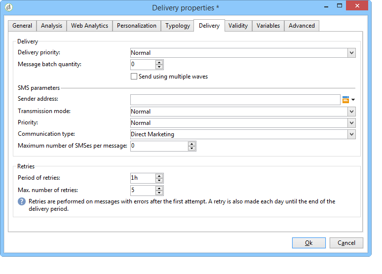
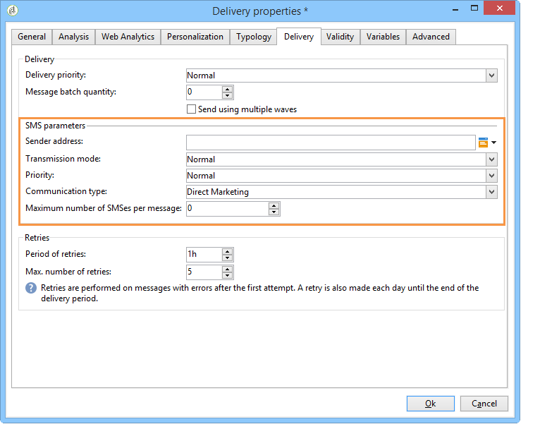

# Send, monitor and track SMS deliveries{#sms-properties}

## Send SMS messages {#sending-sms-messages}

To approve your message and send it to the recipients of the delivery being created, click **[!UICONTROL Send]**.

The detailed process when validating and sending a delivery is presented in the sections below:

* [Validate the delivery](../../delivery/using/steps-validating-the-delivery.md)
* [Send the delivery](../../delivery/using/steps-sending-the-delivery.md)

## Advanced parameters {#advanced-parameters}

The **[!UICONTROL Properties]** button gives access to the advanced delivery parameter. The parameters specific to SMS deliveries are in the **[!UICONTROL SMS parameters]** section of the **[!UICONTROL Delivery]** tab.

The following options are available:

* **Sender address**: lets you personalize the name of the delivery sender using a string of alphanumeric characters limited to eleven characters. The field must not be exclusively made up of figures. You can define a condition to display, for example, different names according to the area code of the recipient:

  ```
  <% if( String(recipient.mobilePhone).indexOf("+1") == 0){ %>NeoShopUS<%} else %>
  ```

  >[!IMPORTANT]
  >
  >Check the law in your country regarding editing sender names. You should also check with your operator whether they offer this functionality.

* **Transmission mode**: message transmission by SMS.
* **Priority**: level of importance assigned to a message. **[!UICONTROL Normal]** priority is selected by default. Ask your service provider about the cost of SMS sent with **[!UICONTROL High]** priority.
* **Type of application**: choose the application you wish to assign to your SMS delivery. The **[!UICONTROL Direct Marketing]** option is selected by default and is the most common one used.

**Parameters specific to the NetSize connector**



* **Use several SMS for a single message**: this lets you send a message over 160 characters long via several SMS messages.

**Parameters specific to an SMPP connector**



* **Maximum number of SMS per message**: this option lets you set the number of SMS to use to send a message. If the number is set to 0, you can use an SMS to deliver your message. If the number of SMS is set to 1 or 2 for instance, and the message exceeds this threshold, it will not be sent.

## Monitor and track SMS {#monitoring-and-tracking-sms-deliveries}

After sending messages, you can monitor and track your deliveries. For more on this, refer to these sections:

* [Monitor a delivery](../../delivery/using/about-delivery-monitoring.md)
* [Understand delivery failures](../../delivery/using/understanding-delivery-failures.md)
* [About message tracking](../../delivery/using/about-message-tracking.md)

## Process inbound messages {#processing-inbound-messages}

The **nlserver sms** module queries the SMS router at regular intervals. This allows Adobe Campaign to track the progress of deliveries and handle the status reports and recipient unsubscription requests.

* **Status reports**: view delivery logs to check the status of your messages.

  >[!NOTE]
  >
  >Every SMS sent is linked to an external account its primary key. In this way:  
  >
  > * Status reports from a deleted external SMS account are not correctly processed.
  > * An SMS account can only be linked to a single external account to ensure that status reports are attributed to the correct account

* **Unsubscription**: recipients who wish to stop receiving SMS deliveries can return a message containing the word STOP. If your provider allows it under the terms of the contract, you can retrieve messages via the **Inbound SMS** workflow activity and then create a query to enable the **No longer contact this recipient** option for the recipients concerned.

  Refer to the [Workflows](../../workflow/using/architecture.md) guide.

## InSMS schema {#insms-schema}

The InSMS schema contains information relevant to incoming SMS. A description of these fields is available via the desc attribute.

* **message**: content of the SMS received.
* **origin**: mobile number at the origin of message.
* **providerId**: identifier of the message returned by the SMSC (message center).
* **created**: date incoming message was inserted into Adobe Campaign.
* **extAccount**: Adobe Campaign external account.

  >[!IMPORTANT]
  >
  >The following fields are specific to NetSize.
  >
  >If the operator in use is not NetSize, these fields are considered empty.

* **alias**: alias of incoming message.
* **separator**: separator between the alias and the body of the message.
* **messageDate**: message date given by operator.
* **receivalDate**: date message from operator was received by SMSC (message center).
* **deliveryDate**: date message sent by SMSC (message center).
* **largeAccount**: customer account code linked to incoming SMS.
* **countryCode**: operator country code.
* **operatorCode**: operator network code.
* **linkedSmsId**: Adobe Campaign identifier (broadlogId) linked to outgoing SMS, where this SMS is the response.

## Manage automatic replies (American regulation) {#managing-automatic-replies--american-regulation-}

When subscribers reply to an SMS message that was sent to them via Adobe Campaign, and they use a keyword such as STOP, HELP, or YES, it is necessary, in the US market, to configure messages that are automatically returned.

For example, if recipients send the keyword STOP, they automatically receive a confirmation message stating that they have been unsubscribed.

The sender name for this type of message is a short code usually used to send deliveries.

>[!IMPORTANT]
>
>The following detailed procedure is only valid for SMPP connectors, except for the extended generic SMPP connector. For more on this, refer to the [Create an SMPP external account](sms-set-up.md#creating-an-smpp-external-account) section.
>
>It makes up part of the certification process carried out by American operators for marketing campaigns in the US. These replies to subscriber SMS messages containing the keyword must be sent back to the subscriber immediately after receiving a message from them.

1. Create this type of XML file:

   ```
   <autoreply>
     <shortcode name="12345">
       <reply keyword="STOP" text="You will not receive SMS anymore" />
       <reply keyword="HELP" text="Powered by Adobe Campaign" />
     </shortcode>
     <shortcode name="43115">
       <reply keyword="STOP" text="Vous ne recevrez plus de SMS" />
       <reply keyword="HELP" text="Service rendu par Adobe Campaign" />
     </shortcode>
     <shortcode name="*">
       <reply keyword="ADOBE" text="This text is replied when you send ADOBE to any short code" />
     </shortcode>
   </autoreply>
   ```

1. For the **name** attribute of the **`<shortcode>`** tag, specify the short code that will be displayed in the place of the message sender name.

   In each **`<reply>`** tag, enter the **keyword** attribute with a keyword and the **text** attribute with the message that you would like to send for this keyword.

   >[!NOTE]
   >
   >Each keyword must be written in capital letters.

   If you want to send the same message for several keywords, duplicate the corresponding line.

   For example:

   ```
   <reply keyword="STOP" text="You will not receive SMS anymore" />
   <reply keyword="QUIT" text="You will not receive SMS anymore" />
   ```

1. Once completed, save this file under the name **smsAutoReply.xml**.

   Note that the name of the file is case sensitive in Linux.

1. Copy this file into the **conf** directory in Adobe Campaign, at the same place as the Web server.

>[!IMPORTANT]
>
>These kinds of automatic messages do not keep a history. Therefore they do not appear in the delivery dashboard. [Learn more](../../delivery/using/delivery-dashboard.md).
>
>These messages are not taken into account in the commercial pressure rules. [Learn more](../../campaign/using/pressure-rules.md).
