# Configure SMS channel on a mid-sourcing infrastructure {#setting-up-sms-channel}

To send to a mobile phone with mid-servers, you need:

1. An SMS Operator created on the Mid-server used for the SMS external account created on the Marketing server.

1. An external account on the Marketing server, specifying the Channel and Delivery mode.

1. An external account on the Mid-server, detailing the connector and message type.

1. A delivery template that references the external account to streamline the sending process.

>[!NOTE]
>
> For SMS deliveries, typology should be using a specific SMS affinity created in **one** dedicated application server container. [Learn more](../../installation/using/configure-delivery-settings.md#managing-outbound-smtp-traffic-with-affinities)

## Create the SMS Operator on the Mid-server {#create-sms-operator}

To start the configuration process, you must create an SMS Operator on the Mid-server specifically for the external account.

>[!IMPORTANT]
>
>Each SMS connector requires a unique SMS Operator.

1. In the **[!UICONTROL Administration]** > **[!UICONTROL Access management]** > **[!UICONTROL Operators node]** node of the tree, click the **[!UICONTROL New]** icon.

   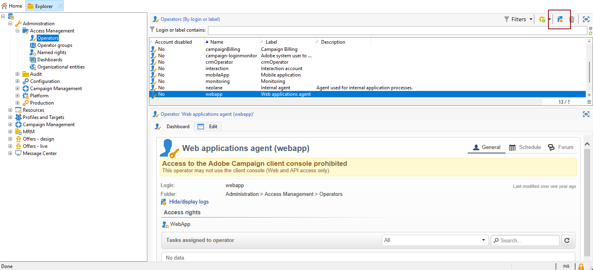

1. Specify the user's **[!UICONTROL Identification parameters]**, including their login, password, and name. The login and password are necessary for the operator to log in to Adobe Campaign securely.

   Note that the **[!UICONTROL Name (login)]** is to be later used to name your SMPP external account in the Mid-server.

   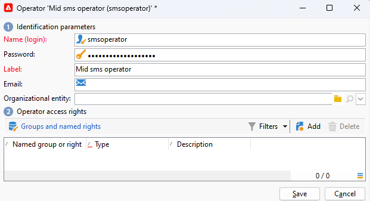

1. Select the permissions granted to the operator in the Operator access rights section.

   To allocate rights to the operator, click the **[!UICONTROL Add]** button located above the list of rights. Next, select an **[!UICONTROL Operator group]** or **[!UICONTROL Named rights]** from the available groups list.

   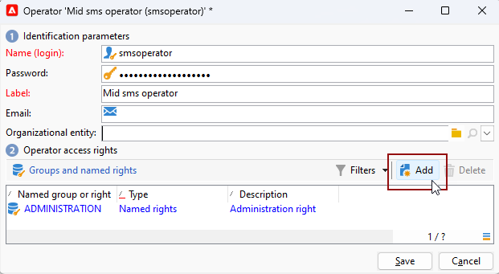

1. Click **[!UICONTROL Save]** to finalize the creation of the operator. The profile is now included in the list of existing operators.

## Create an SMS external account on the Marketing server {#create-accound-mkt}

To send a SMS to a mobile phone with Mid-servers, you first need to create your SMS external account on the Marketing server.

1. In the **[!UICONTROL Platform]** > **[!UICONTROL External accounts]** node of the tree, click the **[!UICONTROL New]** icon.

   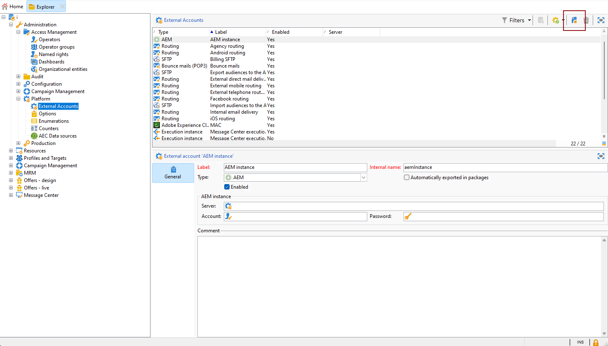

1. Type-in your **[!UICONTROL Label]** and **[!UICONTROL Internal name]**. Note that the Internal name is to be later used to name your SMPP external account in the Mid-server.

1. Define the account type as **[!UICONTROL Routing]**, the channel as **[!UICONTROL Mobile (SMS)]**, and the delivery mode as **[!UICONTROL Mid-sourcing]**.

   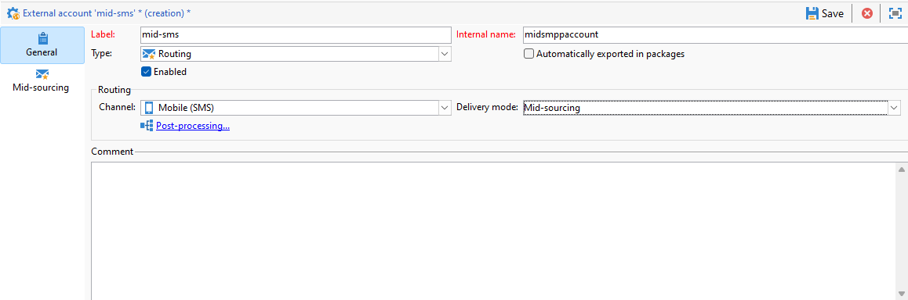

1. In the **[!UICONTROL Mid-Sourcing]** tab, specify the mid-sourcing server connection parameters.

   Enter the details of the [previously created SMS connector](#create-sms-operator) in the **[!UICONTROL Account]** and **[!UICONTROL Password]** fields.

   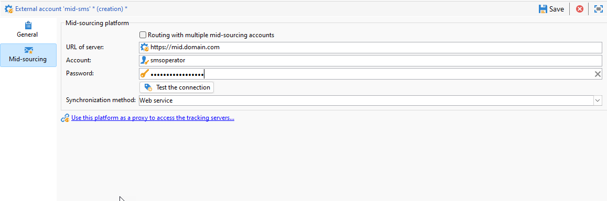

1. Confirm your configuration by clicking **[!UICONTROL Test the connection]**.

1. Click **[!UICONTROL Save]**.

## Create an SMPP external account on the Mid-server {#creating-smpp-mid}

>[!IMPORTANT]
>
>Using the same account and password for multiple external SMS accounts can result in conflicts and overlap between the accounts. Refer to the [SMS troubleshooting page](troubleshooting-sms.md#external-account-conflict).

Once you have successfully set up your SMS external account on the Marketing server, the next step is to establish your SMPP external account on the Mid-server.

For more information on SMS protocol and settings, refer to this [page](sms-protocol.md).

To do this, follow the steps below:

1. In the **[!UICONTROL Platform]** > **[!UICONTROL External accounts]** node of the tree, click the **[!UICONTROL New]** icon.

1. Type-in your **[!UICONTROL Label]** and **[!UICONTROL Internal name]**.

   >[!WARNING]
   >
   >When assigning an **[!UICONTROL Internal name]**, make sure to follow the specified naming convention:
   >  `SMS Operator Name_Internal Name of the Marketing SMS external account`

   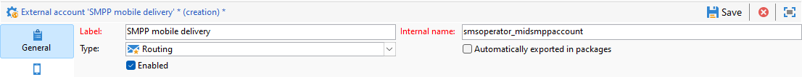

1. Define the account type as **Routing**, the channel as **Mobile (SMS)**, and the delivery mode as **Bulk delivery**.

   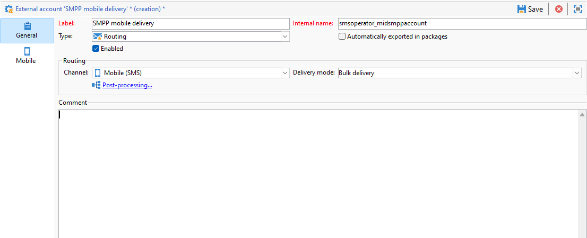

1. Check the **[!UICONTROL Enabled]** box.

1. In the **[!UICONTROL Mobile]** tab, select **[!UICONTROL Extended generic SMPP]** from the **[!UICONTROL Connector]** drop-down list.

   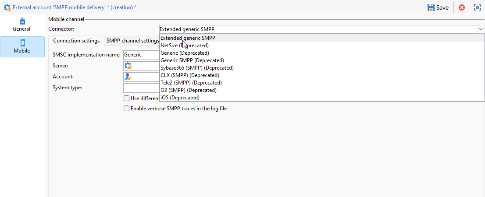

1. The **[!UICONTROL Enable verbose SMPP traces in the log file]** option allows you to dump all SMPP traffic in log files. This option should only be enabled to troubleshoot the connector and to compare with the traffic seen by the provider.

1. Contact your SMS service provider who will explain to you how to complete the different external account fields from the **[!UICONTROL Connection settings]** tab.

   Then, contact your provider, depending on the one chosen, who will give you the value to enter into the **[!UICONTROL SMSC implementation name]** field.

   You can define the number of connections to the provider per MTA child. By default, it is set to 1.

1. By default, the number of characters in an SMS meets the GSM standards.

   SMS messages using GSM encoding are limited to 160 characters, or 153 characters per SMS for messages sent in multiple parts.

   >[!NOTE]
   >
   >Certain characters count as two (braces, square brackets, the euro symbol, etc.).  
   >
   >The list of available GSM characters is presented in [this section](sms-set-up.md#about-character-transliteration).

   You can also authorize character transliteration by checking the corresponding box.

   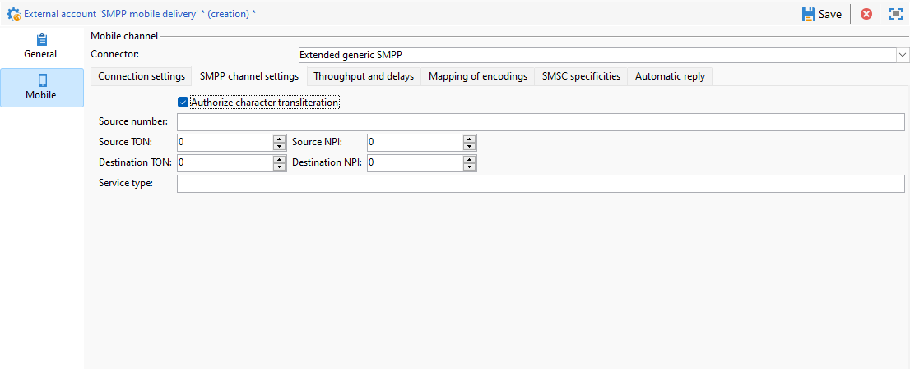

1. In the **[!UICONTROL Throughput and delays]** tab, you can specify the maximum throughput of outbound messages ("MT", Mobile Terminated) in MT per second. If you enter "0" in the corresponding field, the throughput will be unlimited.

   The values of all of the fields corresponding to durations need to be completed in seconds.

1. In the **[!UICONTROL Mapping of encodings]** tab, you can define encodings.

   For more on this, refer to [this section](sms-set-up.md#about-text-encodings).

1. In the **[!UICONTROL SMSC specificities]** tab, the **[!UICONTROL Send full phone number]** option is disabled by default. Do not enable it if you want to respect the SMPP protocol and transfer only digits to the server of the SMS provider (SMSC).

   However, given that certain providers require the use of the '+' prefix, it is advised that you check with your provider and they will suggest that you enable this option if necessary.

   The **[!UICONTROL Enable TLS over SMPP]** checkbox allows you to encrypt SMPP traffic. For more on this, refer to this [page](sms-protocol.md).

1. If you are configuring an **[!UICONTROL Extended generic SMPP]** connector, you can set up automatic replies.

   For more on this, refer to [this section](sms-set-up.md#automatic-reply).

## Change the delivery template {#changing-the-delivery-template}

Adobe Campaign offers a mobile delivery template located in the **[!UICONTROL Resources > Templates > Delivery templates]** node. For more on this, refer to the [Campaign v8 documentation](https://experienceleague.adobe.com/docs/campaign/campaign-v8/send/create-templates.html){target="_blank"}.

To send messages through the SMS channel, you must create a template that includes a reference to the channel connector.

To keep the native delivery template, we recommend that you duplicate it and then configure it.

In the example below, we generate a template to facilitate the delivery of messages through the previously created SMPP account. To do this:

1. In the **[!UICONTROL Resources]** > **[!UICONTROL Templates]** > **[!UICONTROL Delivery templates]** node of the tree, right-click the **[!UICONTROL Send to mobiles]** template, and select **[!UICONTROL Duplicate]**.

   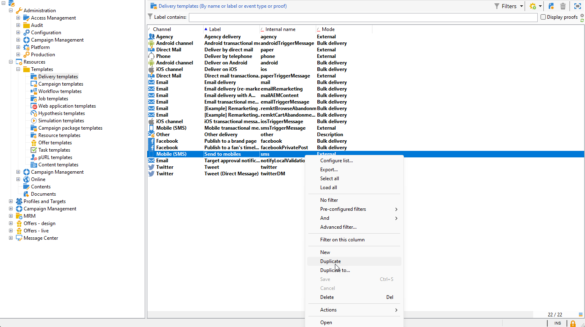

1. Change the label of the template, for example **Sent to mobiles (SMPP)**.

   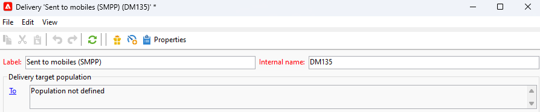

1. Click **[!UICONTROL Properties]**.

1. In the **[!UICONTROL General]** tab, select a routing mode that corresponds to the external account that you created in the section [Create an SMS external account on the Marketing server](#create-accound-mkt).

   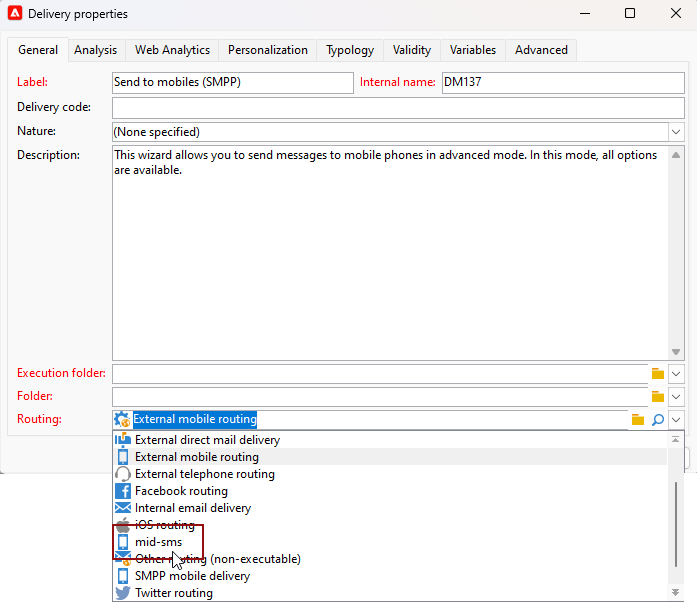

1. Click **[!UICONTROL Save]** to create the template.

   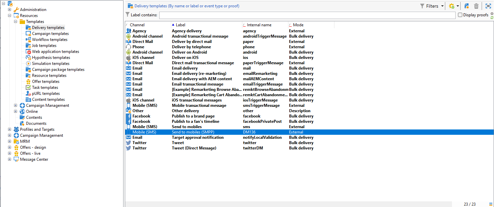

You now have an external account and a delivery template that let you deliver via SMS.

## Related topics {#related-topics}

* [SMS character transliteration](sms-set-up.md#about-character-transliteration)
* [Text encodings](sms-set-up.md#about-text-encodings)
* [Automatic reply](sms-set-up.md#automatic-reply)
