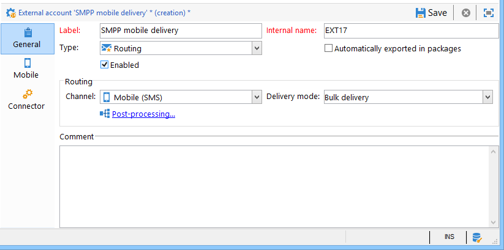
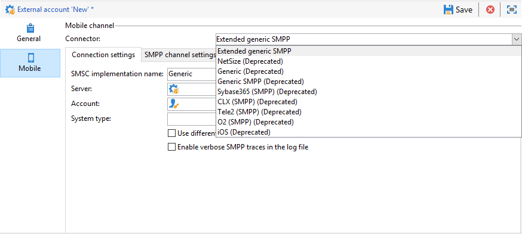
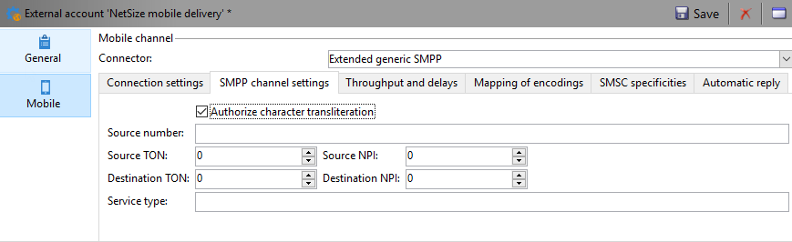
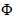
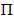
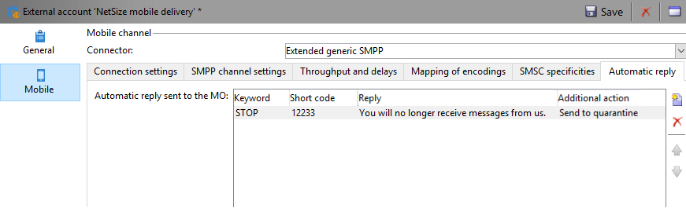
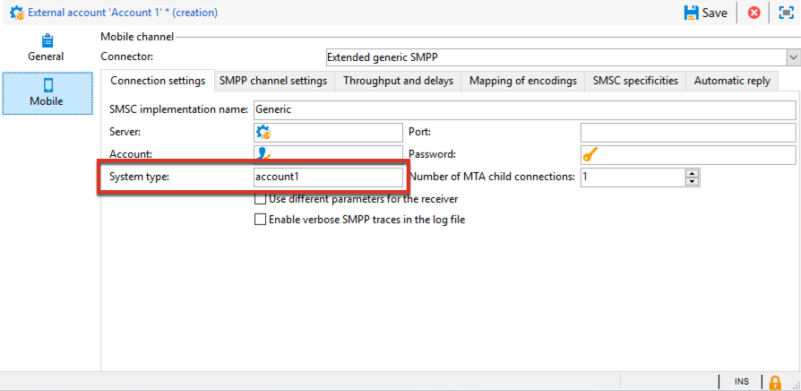
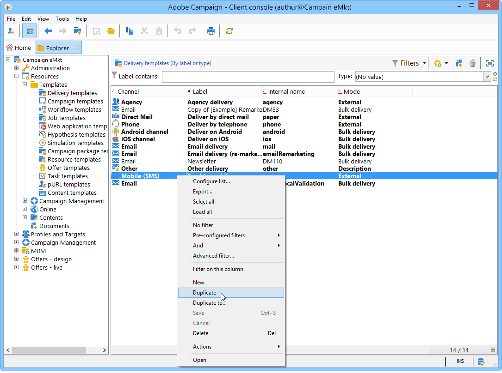
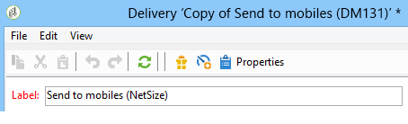

# Configure SMS channel {#setting-up-sms-channel}

To send to a mobile phone, you need:

1. An external account specifying a connector and type of message.

   Note that legacy connectors are now deprecated. Deprecated capabilities are still available, but they will not be further enhanced, nor supported. Learn more [in this page](../../rn/using/deprecated-features.md).

1. A delivery template in which this external account is referenced.

## Create an SMPP external account {#creating-an-smpp-external-account}

To send a SMS to a mobile phone, you first need to create your SMPP external account.
For more information on SMS protocol and settings, refer to this [page](../../delivery/using/sms-protocol.md).

To do this, follow the steps below:

1. In the **[!UICONTROL Platform]** > **[!UICONTROL External accounts]** node of the tree, click the **[!UICONTROL New]** icon.
1. Define the account type as **Routing**, the channel as **Mobile (SMS)**, and the delivery mode as **Bulk delivery**.

   

1. Check the **[!UICONTROL Enabled]** box.
1. In the **[!UICONTROL Mobile]** tab, select **[!UICONTROL Extended generic SMPP]** from the **[!UICONTROL Connector]** drop-down list.

   

   >[!CAUTION]
   >
   > As of release 20.2, legacy connectors are deprecated and not supported. We recommend using the **[!UICONTROL Extended generic SMPP]** connector. For more information on how to migrate to the recommended connector, refer to this [page](../../delivery/using/unsupported-connector-migration.md).

1. The **[!UICONTROL Enable verbose SMPP traces in the log file]** option allows you to dump all SMPP traffic in log files. This option must be enabled to troubleshoot the connector and to compare with the traffic seen by the provider.

1. Contact your SMS service provider who will explain to you how to complete the different external account fields from the **[!UICONTROL Connection settings]** tab.

   Then, contact your provider, depending on the one chosen, who will give you the value to enter into the **[!UICONTROL SMSC implementation name]** field.

   You can define the number of connections to the provider per MTA child. By default, it is set to 1.

1. By default, the number of characters in an SMS meets the GSM standards.

   SMS messages using GSM encoding are limited to 160 characters, or 153 characters per SMS for messages sent in multiple parts.

   >[!NOTE]
   >
   >Certain characters count as two (braces, square brackets, the euro symbol, etc.).  
   >
   >The list of available GSM characters is presented below.

   If you like, you can authorize character transliteration by checking the corresponding box.

   

   For more on this, refer to [this section](#about-character-transliteration).

1. In the **[!UICONTROL Throughput and delays]** tab, you can specify the maximum throughput of outbound messages ("MT", Mobile Terminated) in MT per second. If you enter "0" in the corresponding field, the throughput will be unlimited.

   The values of all of the fields corresponding to durations need to be completed in seconds.

1. In the **[!UICONTROL Mapping of encodings]** tab, you can define encodings.

   For more on this, refer to [this section](#about-text-encodings).

1. In the **[!UICONTROL SMSC specificities]** tab, the **[!UICONTROL Send full phone number]** option is disabled by default. Do not enable it if you want to respect the SMPP protocol and transfer only digits to the server of the SMS provider (SMSC).

   However, given that certain providers require the use of the '+' prefix, it is advised that you check with your provider and they will suggest that you enable this option if necessary.

   The **[!UICONTROL Enable TLS over SMPP]** checkbox allows you to encrypt SMPP traffic. For more on this, refer to this [page](../../delivery/using/sms-protocol.md).

1. If you are configuring an **[!UICONTROL Extended generic SMPP]** connector, you can set up automatic replies.

   For more on this, refer to [this section](#automatic-reply).

## SMS character transliteration {#about-character-transliteration}

Character transliteration can be set up in a SMPP mobile delivery external account, under the **[!UICONTROL Mobile]** tab.

Transliteration consists of replacing one character of an SMS by another when that character is not taken into account by the GSM standard.

* If transliteration is **[!UICONTROL authorized]**, each character that is not taken into account is replaced by a GSM character when the message is sent. For example, the letter "ë" is replaced by "e". The message is therefore slightly altered, but the character limit will remain the same.
* When transliteration is **[!UICONTROL not authorized]**, each message that contains characters that are not taken into account is sent in binary format (Unicode): all of the characters are therefore sent as they are. However, the SMS messages using Unicode are limited to 70 characters (or 67 characters per SMS for messages sent in multiple parts). If the maximum number of characters is exceeded, several messages will then be sent, which may create additional costs.

>[!IMPORTANT]
>
>Inserting personalization fields into the content of your SMS message may introduce characters that are not taken into account by the GSM encoding.

By default, character transliteration is disabled. If you would like all of the characters in your SMS messages to be kept as they are, to not alter proper names for example, we recommend that you do not enable this option.

However, if your SMS messages contain a lot of characters that generate Unicode messages, you can choose to enable this option to limit the costs of sending your messages.

The following table presents the characters taken into account by the GSM standard. All of the characters inserted into the message body, other than those mentioned below, convert the entire message into binary format (Unicode) and therefore limit it to 70 characters.

**Basic characters**

<table> 
 <tbody> 
  <tr> 
   <td> @ </td> 
   <td>  </td> 
   <td> SP </td> 
   <td> 0 </td> 
   <td> ¡ </td> 
   <td> P </td> 
   <td> ¿ </td> 
   <td> p </td> 
  </tr> 
  <tr> 
   <td> £ </td> 
   <td> _ </td> 
   <td> ! </td> 
   <td> 1 </td> 
   <td> A </td> 
   <td> Q </td> 
   <td> a </td> 
   <td> q </td> 
  </tr> 
  <tr> 
   <td> $ </td> 
   <td>  </td> 
   <td> " </td> 
   <td> 2 </td> 
   <td> B </td> 
   <td> R </td> 
   <td> b </td> 
   <td> r </td> 
  </tr> 
  <tr> 
   <td> ¥ </td> 
   <td>  </td> 
   <td> # </td> 
   <td> 3 </td> 
   <td> C </td> 
   <td> S </td> 
   <td> c </td> 
   <td> s </td> 
  </tr> 
  <tr> 
   <td> è </td> 
   <td>  </td> 
   <td> ¤ </td> 
   <td> 4 </td> 
   <td> D </td> 
   <td> T </td> 
   <td> d </td> 
   <td> t </td> 
  </tr> 
  <tr> 
   <td> é </td> 
   <td>  </td> 
   <td> % </td> 
   <td> 5 </td> 
   <td> E </td> 
   <td> U </td> 
   <td> e </td> 
   <td> u </td> 
  </tr> 
  <tr> 
   <td> ù </td> 
   <td>  </td> 
   <td> &amp; </td> 
   <td> 6 </td> 
   <td> F </td> 
   <td> V </td> 
   <td> f </td> 
   <td> v </td> 
  </tr> 
  <tr> 
   <td> ì </td> 
   <td>  </td> 
   <td> ' </td> 
   <td> 7 </td> 
   <td> G </td> 
   <td> W </td> 
   <td> g </td> 
   <td> w </td> 
  </tr> 
  <tr> 
   <td> ò </td> 
   <td>  </td> 
   <td> ( </td> 
   <td> 8 </td> 
   <td> H </td> 
   <td> X </td> 
   <td> h </td> 
   <td> x </td> 
  </tr> 
  <tr> 
   <td> Ç </td> 
   <td>  </td> 
   <td> ) </td> 
   <td> 9 </td> 
   <td> I </td> 
   <td> Y </td> 
   <td> i </td> 
   <td> y </td> 
  </tr> 
  <tr> 
   <td> LF </td> 
   <td>  </td> 
   <td> * </td> 
   <td> : </td> 
   <td> J </td> 
   <td> Z </td> 
   <td> j </td> 
   <td> z </td> 
  </tr> 
  <tr> 
   <td> Ø </td> 
   <td> ESC </td> 
   <td> + </td> 
   <td> ; </td> 
   <td> K </td> 
   <td> Ä </td> 
   <td> k </td> 
   <td> ä </td> 
  </tr> 
  <tr> 
   <td> ø </td> 
   <td> Æ </td> 
   <td> , </td> 
   <td> &lt; </td> 
   <td> L </td> 
   <td> Ö </td> 
   <td> l </td> 
   <td> ö </td> 
  </tr> 
  <tr> 
   <td> CR </td> 
   <td> æ </td> 
   <td> - </td> 
   <td> = </td> 
   <td> M </td> 
   <td> Ñ </td> 
   <td> m </td> 
   <td> ñ </td> 
  </tr> 
  <tr> 
   <td> Å </td> 
   <td> ß </td> 
   <td> . </td> 
   <td> &gt; </td> 
   <td> N </td> 
   <td> Ü </td> 
   <td> n </td> 
   <td> ü </td> 
  </tr> 
  <tr> 
   <td> å </td> 
   <td> É </td> 
   <td> / </td> 
   <td> ? </td> 
   <td> O </td> 
   <td> § </td> 
   <td> o </td> 
   <td> à </td> 
  </tr> 
 </tbody> 
</table>

SP: Space

ESC: Escape

LF: Line Feed

CR: Carriage Return

**Advanced characters (counted twice)**

^ { } `[ ~ ]` | €

## Text encodings {#about-text-encodings}

When sending an SMS message, Adobe Campaign can use one or several text encodings. Each encoding has its own specific character set and determines the number of characters that fit into an SMS message.

When configuring a new SMPP mobile delivery external account, you can define the **[!UICONTROL Mapping of encodings]** in the **[!UICONTROL Mobile]** tab: the **[!UICONTROL data_coding]** field allows Adobe Campaign to communicate which encoding is used to the SMSC.

>[!NOTE]
>
>The mapping between the **data_coding** value and the encoding actually used is standardized. Nevertheless, certain SMSC have their own specific mapping: in this case, your **Adobe Campaign** administrator needs to declare this mapping. Check with your provider to find out more.

You can declare **data_codings** and force the encoding if necessary: to do this, specify a single encoding in the table.

* When no mapping of encodings is defined, the connector takes on a generic behavior:

    * It will try to use GSM encoding to which it assigns the value **data_coding = 0**.
    * If GSM encoding fails, it will use **UCS2** encoding to which it assigns the value **data_coding = 8**.

* When you define the encodings that you would like to use as well as the linked **[!UICONTROL data_coding]** field values, Adobe Campaign will try to use the first encoding in the list, then the following, if the first encoding proves impossible.

>[!IMPORTANT]
>
>The order of declaration is important: it is recommended that you put the list in ascending order **of cost** in order to favor the encodings allowing you to fit as many characters as possible in each SMS message.
>
>Only declare the encodings that you would like to use. If some of the encodings provided by the SMSC should not correspond to your purpose of use, do not declare them in the list.

## Automatic reply {#automatic-reply}

When setting up an extended generic SMPP connector, you can configure automatic replies.

When a subscriber replies to an SMS message which was sent to them via Adobe Campaign and their message contains a keyword such as "STOP", you can configure messages which are automatically sent back to them in the **[!UICONTROL Automatic reply sent to the MO]** section.

>[!NOTE]
>
>The keywords are not case-sensitive.

For each keyword, specify a short code, which is a number that is usually used to send deliveries and will serve as a sender name, then enter the message that will be sent to the subscriber.

You can also link an action to your automatic response: **[!UICONTROL Send to quarantine]** or **[!UICONTROL Remove from quarantine]**. For example, if a recipient sends the keyword "STOP", they will automatically receive an unsubscription confirmation and are sent to quarantine.

If you link the **[!UICONTROL Remove from quarantine]** action to an automatic response, the recipients sending the corresponding keyword are automatically removed from quarantine.

Recipients are listed in the **[!UICONTROL Non deliverables and addresses]** table available through the **[!UICONTROL Administration]** > **[!UICONTROL Campaign Management]** > **[!UICONTROL Non deliverables Management]** menu.

* To send the same reply no matter what the short code, leave the **[!UICONTROL Short code]** column empty.
* To send the same reply no matter what the keyword, leave the **[!UICONTROL Keyword]** column empty.
* To carry out an action without sending a response, leave the **[!UICONTROL Response]** column empty. For example, this allows you to remove from quarantine a user who replies with a message other than "STOP".

If you have multiple external accounts using the Extended generic SMPP connector with the same provider account, the following issue may happen: when sending a reply to a short code, it may be received on any of your external account connections. Consequently, the automatic reply that is sent could not be the expected message.
To avoid this, apply one of the following solutions, depending on the provider you are using:

* Create one provider account for each external account.
* Use the **[!UICONTROL System type]** field from the **[!UICONTROL Mobile]** > **[!UICONTROL Connection settings]** tab to distinguish each short code. Ask your provider a different value for each account.

   

The steps for setting up an external account using the Extended generic SMPP connector are detailed in the [Create an SMPP external account](#creating-an-smpp-external-account) section.

## Change the delivery template {#changing-the-delivery-template}

Adobe Campaign provides you with a template for delivering to mobiles. This template is available in the **[!UICONTROL Resources > Templates > Delivery templates]** node. For more on this, refer to the [About templates](../../delivery/using/about-templates.md) section.

To deliver via SMS channel, you must create a template in which the channel connector is referenced.

In order to keep the native delivery template, we recommend that you duplicate it and then configure it.

In the example below, we create a template to deliver messages via the SMPP account enabled earlier. To do this:

1. Go to the **[!UICONTROL Delivery templates]** node.
1. Right-click the **[!UICONTROL Send to mobiles]** template, and select **[!UICONTROL Duplicate]**.

   

1. Change the label of the template, for example **Sent to mobiles (SMPP)**.

   

1. Click **[!UICONTROL Properties]**.
1. In the **[!UICONTROL General]** tab, select a routing mode that corresponds to the external account that you created in the previous steps.

   

1. Click **[!UICONTROL Save]** to create the template.

   

You now have an external account and a delivery template that let you deliver via SMS.
