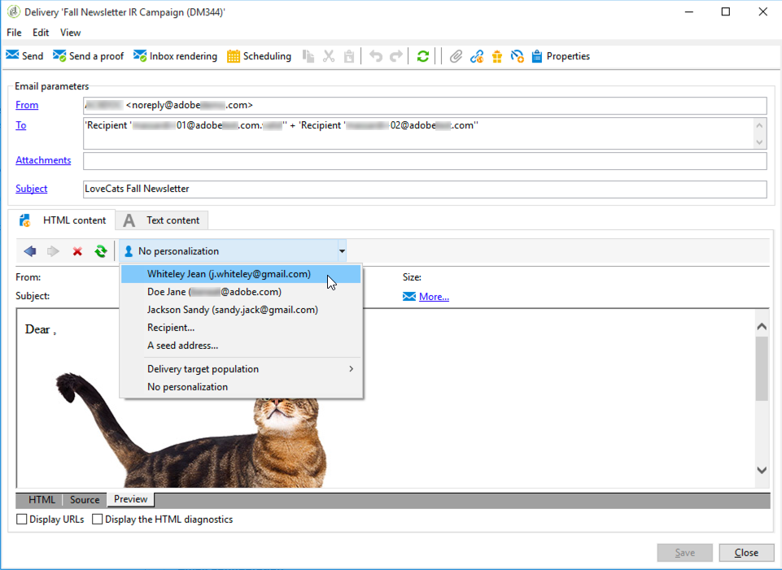
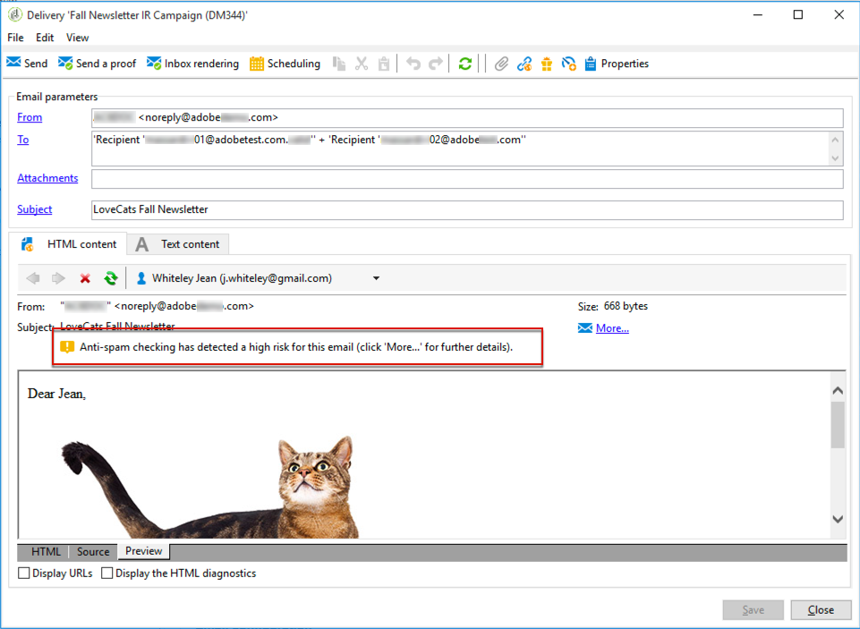
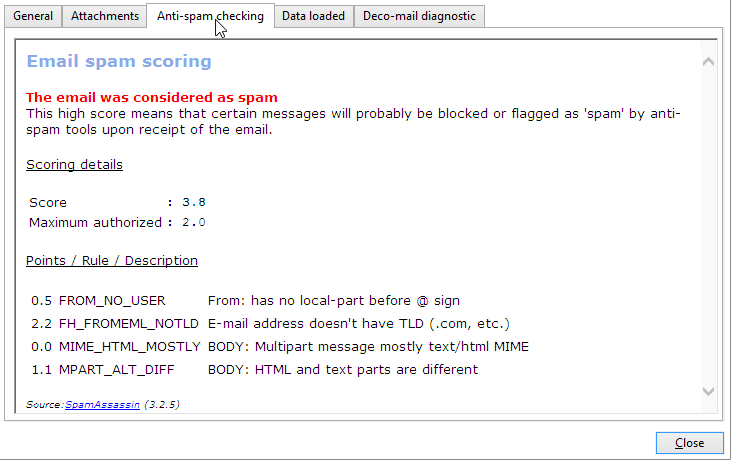

# SpamAssassin{#spamassassin}

## About SpamAssassin {#about-spamassassin}

Adobe Campaign can be configured to work with [SpamAssassin](https://spamassassin.apache.org), a third-party service used for email spam filtering. This allows you to score emails to determine whether a message runs the risk of being considered as spam by the anti-spam tools used upon receipt.

SpamAssassin leverages a variety of spam-detection techniques, including:

* DNS-based and fuzzy-checksum-based spam detection
* Bayesian filtering
* External programs
* Denylists
* Online databases

>[!NOTE]
>
>SpamAssassin must be installed and configured on the Adobe Campaign application server. For more on this, refer to [this section](../../installation/using/configuring-spamassassin.md).
>
>The rules that govern whether an element is spam or not are managed via SpamAssassin and can be edited by an administrator with privileges.

## Using SpamAssassin {#using-spamassassin}

Once you have created your email delivery and defined its content, follow the steps below to evaluate the risks.

For more on creating and designing a delivery, refer to [this section](../../delivery/using/about-email-channel.md).

1. Go to the **[!UICONTROL Preview]** tab.
1. Select a recipient to preview your delivery.

   

   >[!NOTE]
   >
   >If you do not select a recipient, the anti-spam checking cannot be performed.

1. A warning message gives the result of the test. If a high level of risk is detected, the following warning message is displayed:

   

1. Click the **[!UICONTROL More...]** link next to the warning.
1. Select the **[!UICONTROL Anti-spam checking]** tab.
1. Go to the **[!UICONTROL Points / Rule / Description]** section to view the reasons for this risk.

   

>[!NOTE]
>
>Each time you click the **[!UICONTROL Anti-spam checking]**, the SpamAssassin service is called and the message is analyzed again for anti-spam detection. Make sure you changed your content before running the anti-spam analysis again.
