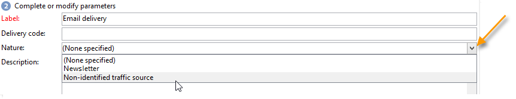

# Create and identify the delivery {#create-and-identify-the-delivery}

 

## Create the delivery {#creating-the-delivery}

You can create a delivery via the overview or via the **[!UICONTROL Create > Delivery]** menu.

To create a delivery, click **[!UICONTROL Create]** above the list of deliveries. When you create a new delivery, you must indicate the delivery channel used. To do this, select the appropriate delivery template from the drop-down list in the **[!UICONTROL Delivery template]** field. 

A default template is provided for each channel you have installed: direct mail, email, fax, telephone, mobile channel (SMS), Facebook, Twitter, etc.

>[!NOTE]
>
>The channels offered in the list depend on your license agreement.

You can create new delivery templates in order to pre-configure specific parameters to suit your needs. For further information about templates, refer to [this section](about-templates.md).

## Identify the delivery {#identifying-the-delivery}

You need to complete parameters to identify the delivery. To do this:

1. Enter a name for the delivery in the **[!UICONTROL Label]** field.

   A delivery code can also be assigned to the delivery. The name of the delivery and its code appear in the list of deliveries but cannot be seen by the recipients.

1. Add a description in the **[!UICONTROL Description]** field.
1. Select the delivery nature in the relevant field. This information is useful for delivery tracking: you can filter based on this criterion in the delivery list or build queries using this selection criterion.

   

1. Click **[!UICONTROL Continue]** to confirm this information and display the message configuration window.

The delivery content is ready to be configured. Delivery content definition is specific to each channel. For more on this, refer to the dedicated section:

* [Define the email content](defining-the-email-content.md)
* [Define the SMS content](sms-create.md#defining-the-sms-content)
* [Define the direct mail content](defining-the-direct-mail-content.md)
* [Push notifications](about-mobile-app-channel.md)
