# Defining the target population {#defining-the-target-population}

## About target populations {#about-target-populations}

For each delivery, you can define several types of target populations:

* **Main audience**: profiles who will receive messages. [Learn more](steps-defining-the-target-population.md#selecting-the-main-target)
* **Proof**: recipients of proof messages, involved in the validation cycle. [Learn more](steps-defining-the-target-population.md#defining-a-specific-proof-target)
* **Seed addresses**: recipients who are out of the delivery target but will receive the delivery (in the context of a marketing campaign only). [Learn more](about-seed-addresses.md)
* **Control groups**: population which will not receive the delivery, used to track behavior and campaign impact (in the context of a marketing campaign only). [Learn more](../../campaign/using/marketing-campaign-target.md#defining-a-control-group).

## Selecting the main recipients of the delivery {#selecting-the-main-target}

In most cases, the main target is extracted from Adobe Campaign database (default mode). However, recipients can also be stored in an external file. Learn more in [this section](steps-defining-the-target-population.md#selecting-external-recipients).

To select the recipients of a delivery, follow the steps below:

1. In the delivery editor, select **[!UICONTROL To]**.
1. If the recipients are stored in the database, choose the first option.

   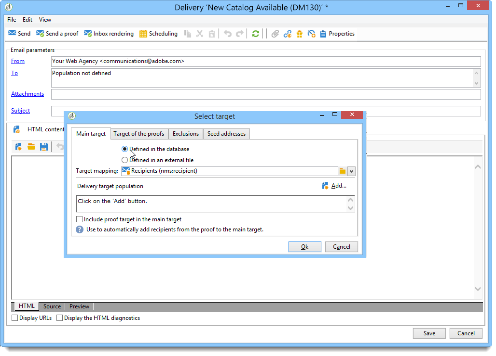

1. Select the target mapping in the **[!UICONTROL Target mapping]** drop-down list. Adobe Campaign default target mapping is **[!UICONTROL Recipients]**, based on **nms:recipient** schema.

   Other target mappings are available, and some can be related to your specific configuration. For more on target mappings, refer to [Selecting a target mapping](selecting-a-target-mapping.md).

1. Click the **[!UICONTROL Add]** button to define restriction filters.

   You can then select the type of filtering to apply:

   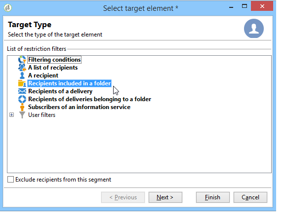

   You can select recipients using the types of targeting defined in the database. To use a target type, select it and click **[!UICONTROL Next]**. For each target, you can display the recipients concerned by clicking the **[!UICONTROL Preview]** tab. For certain types of target, the **[!UICONTROL Refine target]** button lets you combine several targeting criteria.

   The following target types are offered by default:

    * **[!UICONTROL Filtering conditions]** : this option lets you define a query and display the result. The method for defining queries is presented in [this section](../../platform/using/creating-filters.md#creating-an-advanced-filter).
    * **[!UICONTROL Subscribers of an information service]** : this option lets you select a newsletter to which the recipients must be subscribed to be targeted by the delivery being created.

      

    * **[!UICONTROL Recipients of a delivery]** : this option lets you define the recipients of an existing delivery as a targeting criterion. You must then select the delivery in the list:

      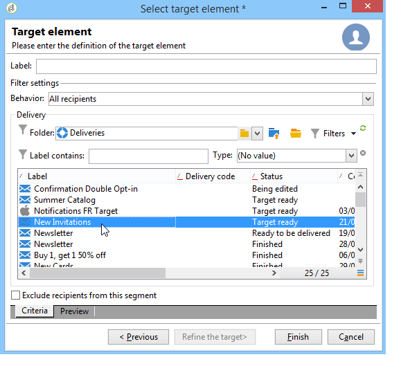

    * **[!UICONTROL Delivery recipients belonging to a folder]** : this option lets you select a delivery folder and target the recipients of the deliveries in that folder.

      

      You can filter the behavior of recipients by selecting from the drop-down list:

      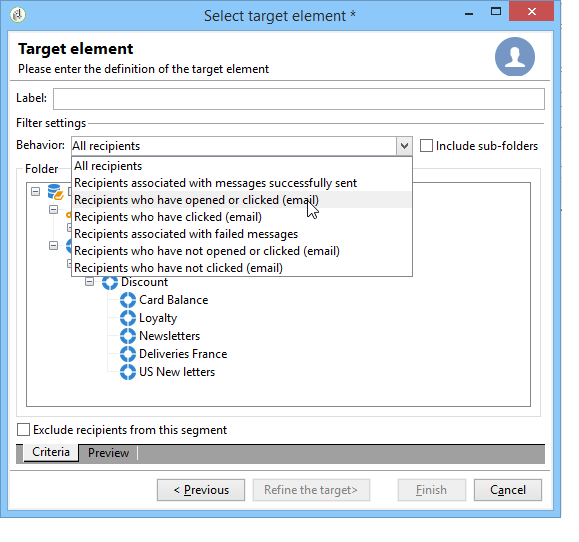

      >[!NOTE]
      >
      >The **[!UICONTROL Include sub-folders]** option also lets you target the deliveries contained in folders located in the tree structure below the selected node.

    * **[!UICONTROL Recipients included in a folder]** : this option lets you target the profiles contained in a specific folder of the tree.
    * **[!UICONTROL A recipient]** : this option lets you select a specific recipient from the profiles in the database.
    * **[!UICONTROL A list of recipients]** : this option lets you target a list of recipients. Lists are presented in the [this section](../../platform/using/creating-and-managing-lists.md).
    * **[!UICONTROL User filters]** : this option lets you access the preconfigured filters to use them as filtering criteria for profiles in the database. Preconfigured filters are presented in [this section](../../platform/using/creating-filters.md#saving-a-filter).
    * The option **[!UICONTROL Exclude recipients corresponding to this segment]** lets you target on recipients who do not satisfy the defined target criteria. To use this option, select the appropriate box and then apply targeting, as defined earlier, to exclude the resulting profiles.

      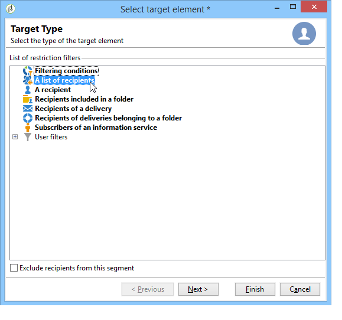

1. Enter a name for this targeting in the **[!UICONTROL Label]** field. By default, the label will be the label of the first targeting criterion. For a combination, it is better to use an explicit name.
1. Click **[!UICONTROL Finish]** to validate the configured targeting.

   The targeting criteria defined are summarized in the central section of the main target configuration tab. Click a criterion to view its contents (configuration and preview). To delete a criterion, click the cross located after its label.

   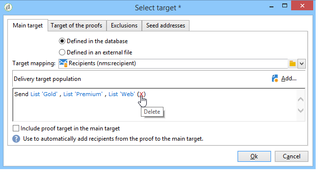

### Selecting external recipients {#selecting-external-recipients}

You can launch a delivery on recipients who are not saved in the database, but stored in an external file. For example, we will send here a delivery to recipients imported from a text file.

To do this:

1. Click the **[!UICONTROL To]** link to select the recipients of your delivery.
1. Select the **[!UICONTROL Defined in an external file]** option.

   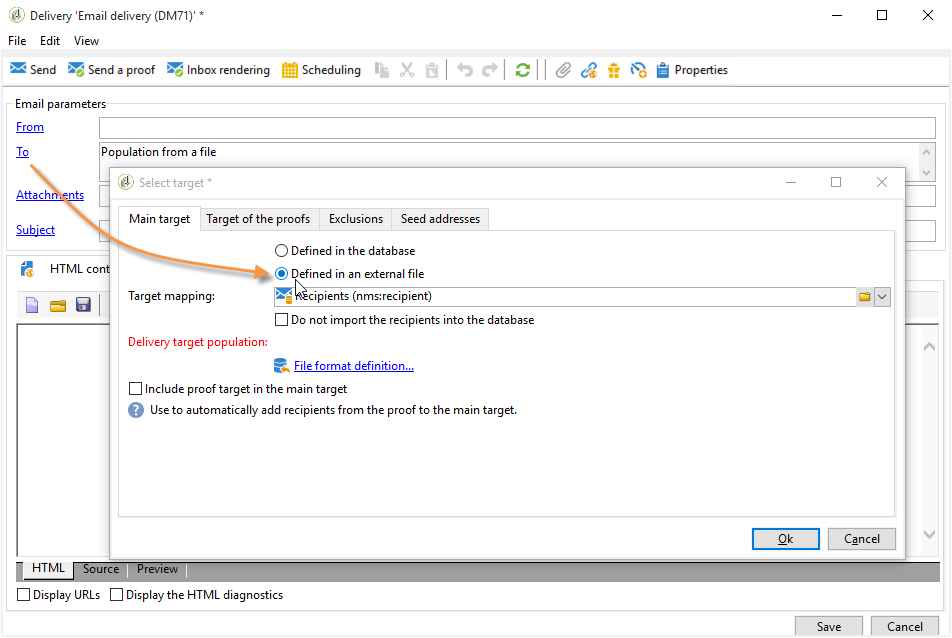

1. By default, recipients are imported in the database. You must select the **[!UICONTROL Target mapping]**. For more on target mappings, refer to [Selecting a target mapping](selecting-a-target-mapping.md)

   You can also choose **[!UICONTROL Do not import the recipients into the database]**.

1. When importing the recipients, click the **[!UICONTROL File format definition...]** link to select and configure the external file.

   For more information on data import, refer to [this section](../../platform/using/executing-import-jobs.md#step-2---source-file-selection).

1. Click **[!UICONTROL Finish]** and configure your delivery as a standard delivery.

>[!CAUTION]
>
>When defining the content of the message for email delivery, do not include the link to the mirror page; it cannot be generated in this delivery mode.

### Setting up exclusion settings {#customizing-exclusion-settings}

Address errors and quality ratings are supplied by the service provider (IAP). This information is automatically updated in the recipient profile following delivery actions and with files returned by service providers. It can be viewed in the profile on a read-only basis.

You can choose to exclude addresses that have reached a certain number of consecutive errors, or whose quality rating is below a threshold specified in this window. You can also choose whether or not to authorize non-qualified addresses for which no data has been returned.

>[!NOTE]
>
>If two recipients have the same first name, last name, postcode and city in a direct mail delivery, a double error will occur and the duplicate will not be taken into account.

The **[!UICONTROL Exclusions]** tab is used to limit the number of messages.

>[!NOTE]
>
>Default parameters are recommended, but you can adapt settings depending on your needs. However, these options should only be changed by an expert user to avoid any misusage and errors.

Click the **[!UICONTROL Edit...]** link to modify the default configuration.

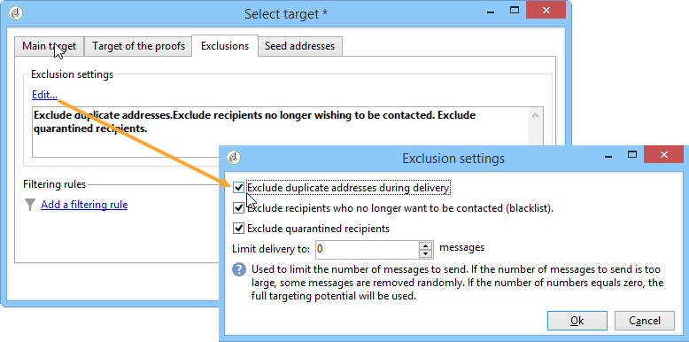

The following options are available:

* **[!UICONTROL Exclude duplicate addresses during delivery]**. This option is active by default: it lets you eliminate duplicate email addresses during delivery. The strategy applied can vary according to how Adobe Campaign is used and the type of data in the database.

  The default value of the option can be configured for each delivery template.

  For example:

  * Delivery of a newsletter or electronic document delivery. No exclusion of duplicates in some cases if the data has no native duplicates. A couple subscribing with the same email address can expect to receive two specific personalized email messages: one addressed to each individual by name. In this case, this option can be unselected.
  * Delivery of a marketing campaign: duplicate exclusion is essential to avoid sending too many messages to the same recipient. In this case, this option can be selected.

      If you unselect this option, you can access an additional option: **[!UICONTROL Keep duplicate records (same identifier)]**. It lets you authorize multiple deliveries to recipients who satisfy several targeting criteria.

    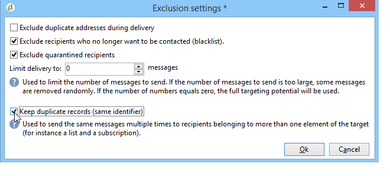

* **[!UICONTROL Exclude recipients who no longer want to be contacted]** , i.e. recipients whose email addresses are on denylist ('opt out'). This option must remain selected in order to observe the professional ethics of e-marketing and the laws governing e-commerce.
* **[!UICONTROL Exclude quarantined recipients]**. This option lets you exclude from the target any profiles with an address that does not respond. We strongly recommend keeping this option selected.

  >[!NOTE]
  >
  >For further information about quarantine management, refer to [Understanding quarantine management](understanding-quarantine-management.md).

* **[!UICONTROL Limit delivery]** to a given number of messages. This option lets you enter the maximum number of messages to be sent. If the content of the target exceeds the number of messages indicated, a random selection is applied to the target.

### Reducing the size of the target population {#reducing-the-size-of-the-target-population}

You can reduce the size of the target population. To do this, specify the number of recipients to be exported in the **[!UICONTROL Requested quantity]** field.

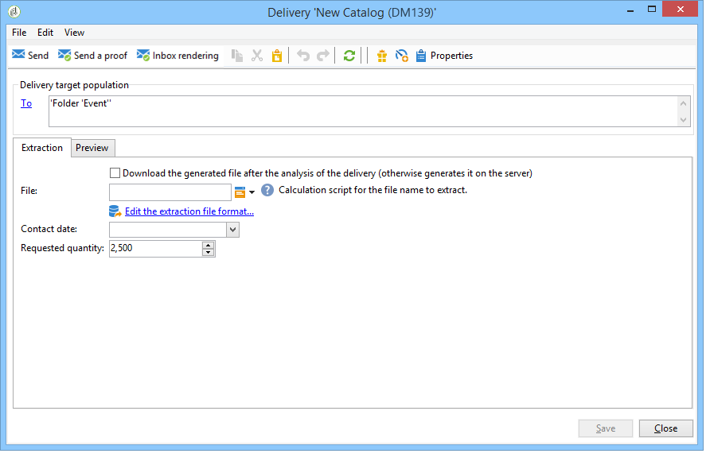

## Selecting the recipients of proof messages {#selecting-the-proof-target}

The proof is a special message that lets you test a delivery before sending it to the main target. Proof recipients are responsible for approving both the form and content of the message.

 [Discover this feature in video](#seeds-and-proofs-video)

To select the target of the proofs, follow the steps below:

1. Click the **[!UICONTROL To]** link.
1. Click the **[!UICONTROL Target of the proofs]** tab.
1. Click the **[!UICONTROL Targeting mode]** field to choose the method to apply: **[!UICONTROL Definition of a specific proof target]** , **[!UICONTROL Substitution of the address]** , **[!UICONTROL Seed addresses]** or **[!UICONTROL Specific target and seed addresses]**.

>[!NOTE]
>
>Usually, the target for the proof can be added to the main target. To do this, select the appropriate option in the lower section of the **[!UICONTROL Main target]** tab.

## Defining a specific proof target {#defining-a-specific-proof-target}

When selecting the proof target, the **[!UICONTROL Definition of a specific proof target]** option lets you select the proof recipients from the profiles in the database.

Select this option to choose recipients using the **[!UICONTROL Add]** button, as in the case of defining the main target. See [Selecting the main target](steps-defining-the-target-population.md#selecting-the-main-target).

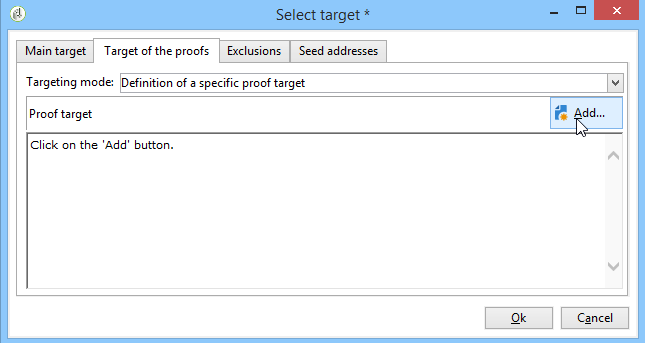

For more on proof sending, refer to [this section](steps-validating-the-delivery.md#sending-a-proof).

### Using address substitution in proof {#using-address-substitution-in-proof}

Instead of selecting dedicated recipients in the database, you can use the **[!UICONTROL Substitution of the address]** option.

This option lets you use the recipient profiles of the delivery and replace their email addresses with one or more other addresses that will receive the proof.

When this option is selected, the proof addresses will be filled in via a special editor that lets you configure the substitution(s). 

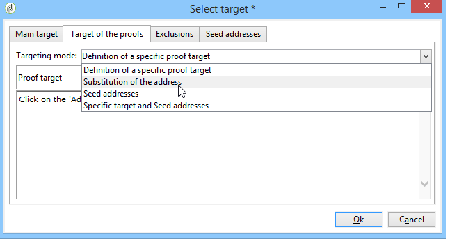

Configuration is performed as follows:

1. Click the **[!UICONTROL Add]** icon to define a substitution.
1. Enter the recipient address to be used, or select it from the list.
1. Select the profile to use in the proof: save the **[!UICONTROL Random]** value in the **[!UICONTROL Profile to use]** column to use the data of any profile of the target in the proof.

   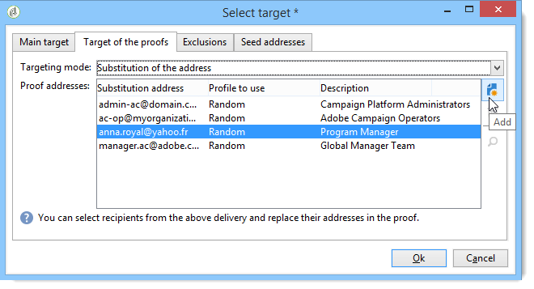

1. Click the **[!UICONTROL Detail]** icon to select a profile from the main target, as in the following example:

   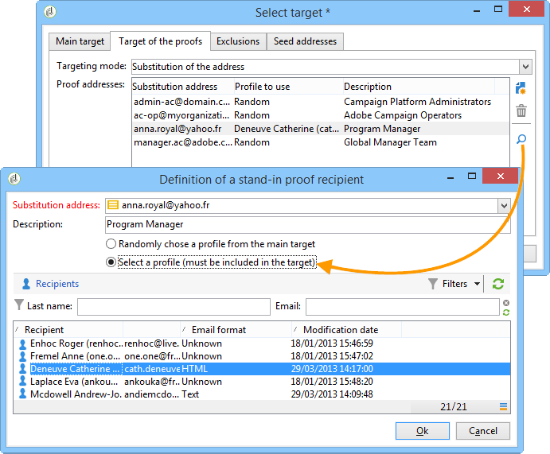

   You can define as many substitution addresses as necessary.

## Using seed addresses as proof {#using-seed-addresses-as-proof}

You can use **[!UICONTROL Seed addresses]** as target of the proofs: this option lets you use or import a list of existing seed addresses.

>[!NOTE]
>
>Seed addresses are presented in [About seed addresses](about-seed-addresses.md).

You can combine the definition of a specific proof target and the use of seed addresses using the **[!UICONTROL Specific target and Seed addresses]** option. The related configurations are then defined in two separate sub-tabs.

See also:

* [Selecting the proof target](#selecting-the-proof-target)
* [About seed addresses](about-seed-addresses.md)
* [Use case: selecting seed addresses on criteria](use-case--selecting-seed-addresses-on-criteria.md)

## Tutorial video {#seeds-and-proofs-video}

In this video you will learn how to add seeds and proofs to an existing email and how to send it.

>[!VIDEO](https://video.tv.adobe.com/v/25606?quality=12)

Additional Campaign Classic how-to videos are available [here](https://experienceleague.adobe.com/docs/campaign-classic-learn/tutorials/overview.html).
