# Configuring and sending the delivery {#configuring-and-sending-the-delivery}

>[!NOTE]
>
>Only the delivery owner can start a delivery. In order for another operator (or operator group) to be able to start a delivery, you have to add them as reviewers in the **[!UICONTROL Delivery start:]** field. For further information, refer to [this section](../../campaign/using/marketing-campaign-approval.md#selecting-reviewers).

## Delivery additional parameters {#delivery-additiona-parameters}

Before sending the delivery, you can define the sending parameters in the delivery properties, via the **[!UICONTROL Delivery]** tab.

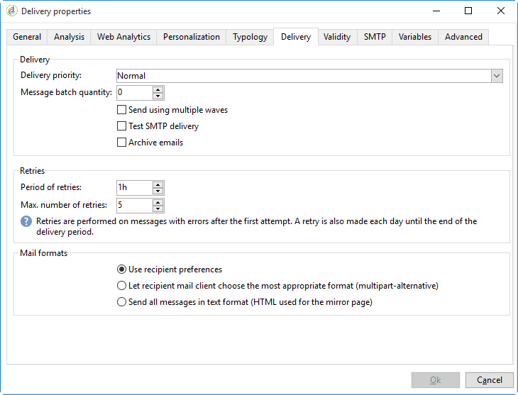

* **[!UICONTROL Delivery priority]**: This option allows you to influence the sending order for your deliveries by stating their priority level (normal, high or low). This lets you prioritize the order for certain, more urgent deliveries over others.

* **[!UICONTROL Message batch quantity]**: This option allows you to define the number of messages grouped within the same XML delivery package. If the parameter is set to 0, the messages are automatically grouped. The package size is defined by the calculation `<delivery size>/1024`, with a minimum of 8 and a maximum of 256 messages by package.

  >[!IMPORTANT]
  >
  >When the delivery is duplicated, the parameter is reset.

* **[!UICONTROL Send using multiple waves]**: For more on this, refer to [Sending using multiple waves](#sending-using-multiple-waves).

* **[!UICONTROL Test SMTP delivery]**: This option allows you to test sending a delivery via SMTP. The delivery is processed up to connection to the SMTP server but is not sent.

  >[!NOTE]
  >
  >Using this option is not advised when installing using mid-sourcing as to not call mta. For more on configuring an SMTP server, refer [to this section](../../installation/using/configure-delivery-settings.md).

* **[!UICONTROL Email BCC]**: This option lets you store emails on an external system through BCC by simply adding a BCC email address to your message target. For more on this, refer to [this section](../../delivery/using/sending-messages.md#archiving-emails).

## Confirming delivery {#confirming-delivery}

When the delivery is configured and ready to be sent, make sure you have run the delivery analysis.

To do this, click **[!UICONTROL Send]**, select the desired action and click **[!UICONTROL Analyze]**. For more on this, see [Launching the analysis](../../delivery/using/steps-validating-the-delivery.md#analyzing-the-delivery).

Once done, click **[!UICONTROL Confirm delivery]** to launch the delivery of messages.

You can then close the delivery wizard and track the execution of the delivery from the **[!UICONTROL Delivery]** tab, accessible via the detail of this delivery or via the list of deliveries.

After sending messages, you can monitor and track your deliveries. For more on this, refer to these sections:

* [Monitoring a delivery](../../delivery/using/about-delivery-monitoring.md)
* [Understanding delivery failures](../../delivery/using/understanding-delivery-failures.md)
* [About message tracking](../../delivery/using/about-message-tracking.md)

## Scheduling the delivery sending {#scheduling-the-delivery-sending}

You can defer the delivery of messages in order to schedule the delivery or to manage sales pressure and avoid over-soliciting a population.

1. Click the **[!UICONTROL Send]** button and select the **[!UICONTROL Postpone delivery]** option.

1. Specify a start date in the **[!UICONTROL Contact date]** field.

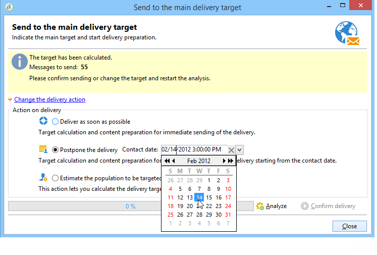

1. You can then start the delivery analysis, then confirm the delivery sending. However, the delivery sending will not start until the date given in the **[!UICONTROL Contact date]** field.

>[!IMPORTANT]
>
>Once you have started the analysis, the contact date that you defined is fixed. If you modify this date, you will have to restart the analysis so that your modifications are taken into account.

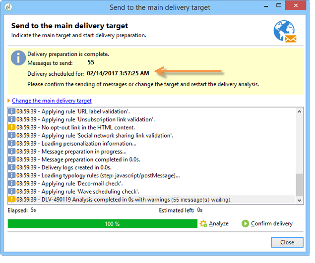

In the delivery list, the delivery will appear with **[!UICONTROL Pending]** status.

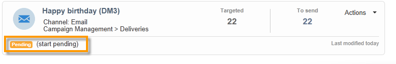

Scheduling can also be configured upstream via the **[!UICONTROL Scheduling]** button of the delivery.

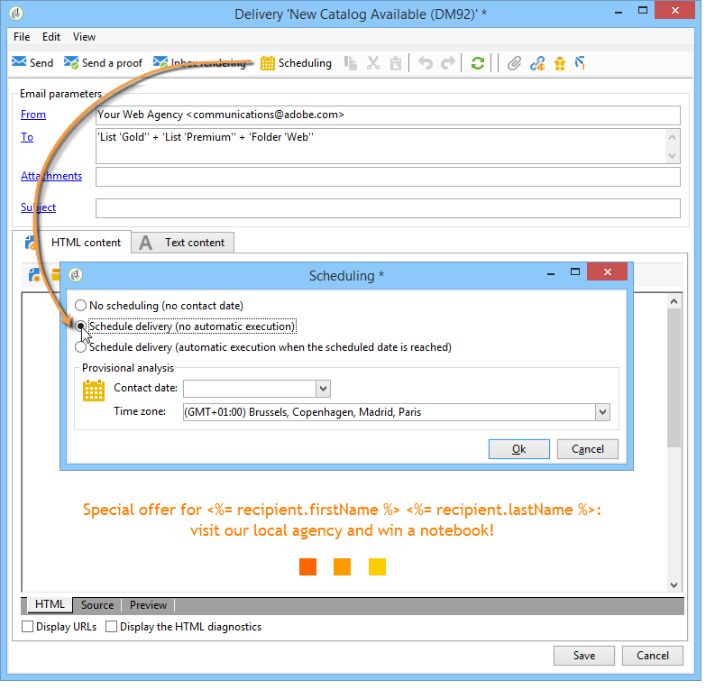

It lets you defer the delivery to a later date or save the delivery in the provisional calendar.

* The **[!UICONTROL Schedule delivery (no automatic execution)]** option lets you schedule a provisional analysis of the delivery.

  When this configuration is saved, the delivery changes to **[!UICONTROL Targeting pending]** status. The analysis will be launched on the specified date.

* The **[!UICONTROL Schedule delivery (automatic execution on planned date)]** option lets you specify the delivery date.

  Click **[!UICONTROL Send]** and select **[!UICONTROL Postpone delivery]** then launch the analysis and confirm delivery. When the analysis is complete, the delivery target is ready and messages will automatically be sent on the specified date.

Dates and times are expressed in the time zone of the current operator. The **[!UICONTROL Time zone]** drop-down list located below the contact date input field lets you automatically convert the entered date and time into the selected time zone.

For instance, if you schedule a delivery to be executed automatically at 8 o'clock London time, the time is automatically converted into the selected time zone:

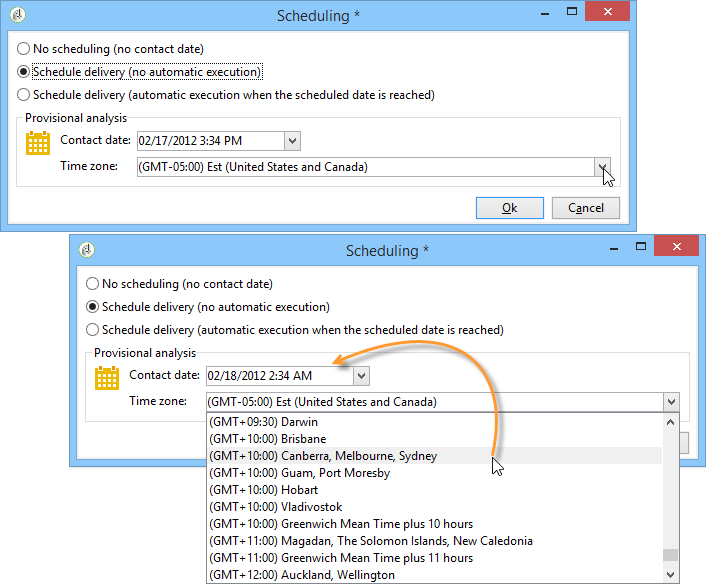

## Sending using multiple waves {#sending-using-multiple-waves}

To balance the load, you can divide deliveries into several batches. Configure the number of batches and their proportion with respect to the entire delivery.

>[!NOTE]
>
>You can only define the size and the delay between two consecutive waves. The recipient selection criteria for each wave cannot be configured.

1. Open the delivery properties window and click the **[!UICONTROL Delivery]** tab.
1. Select the **[!UICONTROL Send using multiple waves]** option and click the **[!UICONTROL Define waves...]** link.

   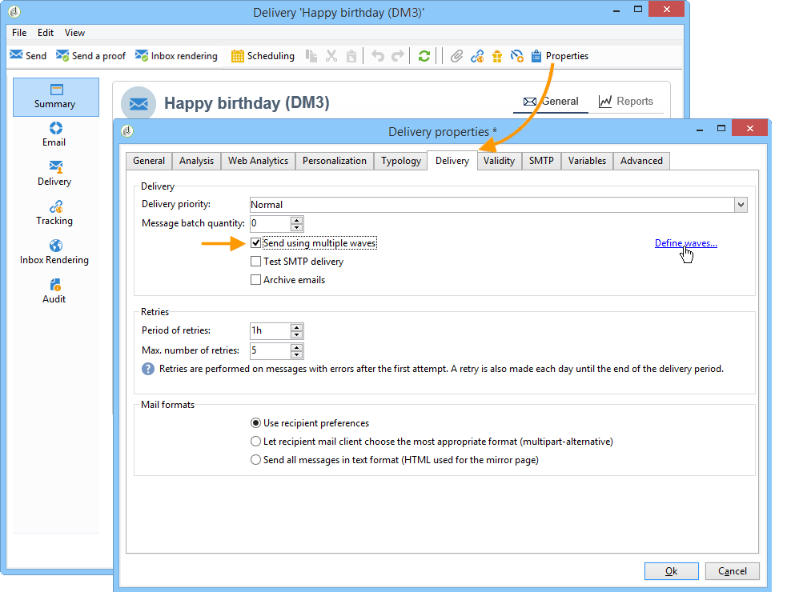

1. To configure waves, you can either:

    * Define the size for each wave. For example, if you enter **[!UICONTROL 30%]** in the corresponding field, each wave will represent 30% of the messages included in the delivery, except the last one, which will represent 10% of the messages.

      In the **[!UICONTROL Period]** field, specify the delay between the start of two consecutive waves. For example, if you enter **[!UICONTROL 2d]**, the first wave will start immediately, the second wave will start in two days, the third wave in four days, and so on.

      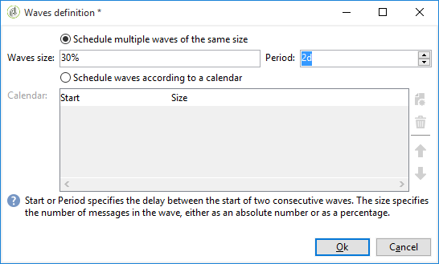

    * Define a calendar for sending each wave.

      In the **[!UICONTROL Start]** column, specify the delay between the start of two consecutive waves. In the **[!UICONTROL Size]** column, enter a fixed number or a percentage.

      In the example below, the first wave represents 25% of the total number of messages included in the delivery and will start immediately. The next two waves complete the delivery and are set to begin at six-hour intervals.

      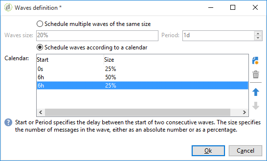

   A specific typology rule, **[!UICONTROL Wave scheduling check]**, ensures that the last wave is planned before the delivery validity limit. Campaign typologies and their rules, configured in the **[!UICONTROL Typology]** tab of the delivery properties, are presented in [Validation process with typologies](../../delivery/using/steps-validating-the-delivery.md#validation-process-with-typologies).

   >[!IMPORTANT]
   >
   >Make sure the last waves do not exceed the delivery deadline, which is defined in the **[!UICONTROL Validity]** tab. Otherwise some messages might not be sent.  
   >
   >You must also allow enough time for retries when configuring the last waves. See [this section](../../delivery/using/steps-sending-the-delivery.md#configuring-retries).

1. To monitor your sends, go to the delivery logs. See [this page](../../delivery/using/delivery-dashboard.md#delivery-logs-and-history).

   You can see the deliveries that were already sent in the processed waves (**[!UICONTROL Sent]** status) and the deliveries to be sent in the remaining waves (**[!UICONTROL Pending]** status).

The two examples below are the most common use cases for using multiple waves.

* **During ramp-up process**

  When emails are sent using a new platform, Internet service providers (ISPs) are suspicious of IP addresses that are not recognized. If large volumes of emails are suddenly sent, the ISPs often mark them as spam.

  To avoid being marked as spam, you can progressively increase the volume sent using waves. This should ensure smooth development of the start-up phase and enable you to reduce the overall rate of invalid addresses.

  To do so, use the **[!UICONTROL Schedule waves according to a calendar]** option. For example, set the first wave to 10%, the second to 15%, and so on.

  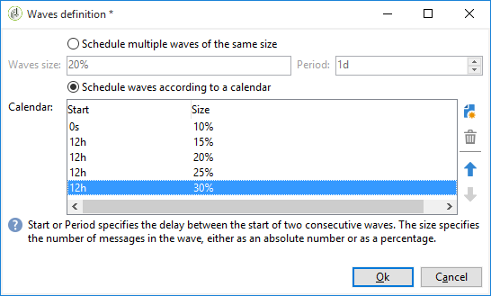

* **Campaigns involving a call center**

  When managing a telephone loyalty campaign, your organization has a limited capacity to process the number of calls to contact subscribers.

  Using waves, you can restrict the number of messages to 20 per day, which is the daily processing capacity of a call center.

  To do this, select the **[!UICONTROL Schedule multiple waves of the same size]** option. Enter **[!UICONTROL 20]** as the wave's size and **[!UICONTROL 1d]** in the **[!UICONTROL Period]** field.

  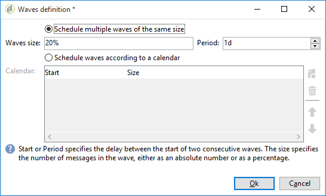

## Configuring retries {#configuring-retries}

Temporarily undelivered messages due to a **Soft** or **Ignored** error are subject to an automatic retry. The delivery failure types and reasons are presented in this [section](../../delivery/using/understanding-delivery-failures.md#delivery-failure-types-and-reasons).

>[!IMPORTANT]
>
>For hosted or hybrid installations, if you have upgraded to the [Enhanced MTA](../../delivery/using/sending-with-enhanced-mta.md), the retry settings in the delivery are no longer used by Campaign. Soft bounce retries and the length of time between them are determined by the Enhanced MTA based on the type and severity of the bounce responses coming back from the message’s email domain.

For on-premise installations and hosted/hybrid installations using the legacy Campaign MTA, the central section of the **[!UICONTROL Delivery]** tab for delivery parameters indicates how many retries should be performed the day after the delivery and the minimum delay between retries.

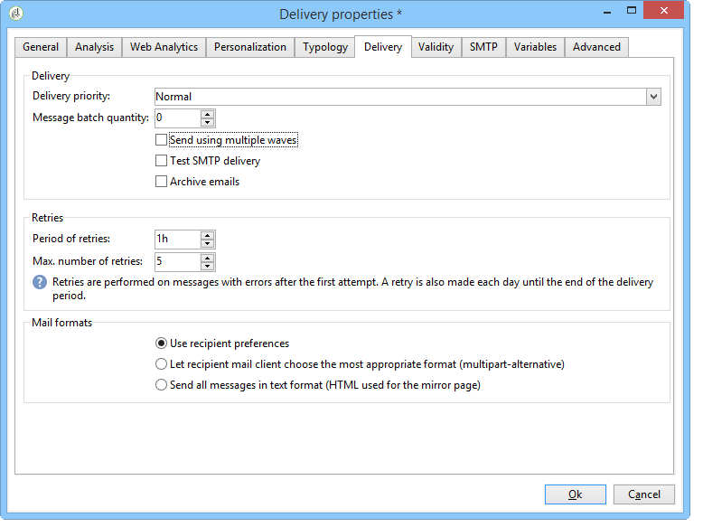

By default, five retries are scheduled for the first day of the delivery with a minimum interval of one hour spread out over the 24 hours of the day. One retry per day is programmed after that and until the delivery deadline, which is defined in the **[!UICONTROL Validity]** tab (see [Defining validity period](#defining-validity-period)).

## Defining validity period {#defining-validity-period}

When the delivery has been launched, the messages (and any retries) can be sent until the delivery deadline. This is indicated in the delivery properties, via the **[!UICONTROL Validity]** tab.

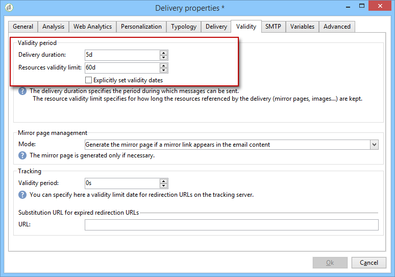

* The **[!UICONTROL Delivery duration]** field lets you enter the limit for global delivery retries. This means that Adobe Campaign sends the messages beginning on the start date, and then, for messages returning an error only, regular, configurable retries are performed until the validity limit is reached.

  You can also choose to specify dates. To do this, select **[!UICONTROL Explicitly set validity dates]**. In this case, the delivery and validity limit dates also let you specify the time. The current time is used by default, but you can modify this directly in the input field.

  >[!IMPORTANT]
  >
  >For hosted or hybrid installations, if you have upgraded to the [Enhanced MTA](../../delivery/using/sending-with-enhanced-mta.md), the **[!UICONTROL Delivery duration]** setting in your Campaign email deliveries will be used only if set to **3.5 days or less**. If you define a value higher than 3.5 days, it will not be taken into account.

* **Validity limit of resources**: The **[!UICONTROL Validity limit]** field is used for uploaded resources, mainly for the mirror page and images. The resources on this page are valid for a limited time (to save disk space).

  The values in this field can be expressed in the units listed in [this section](../../platform/using/adobe-campaign-workspace.md#default-units).
