# Validate the delivery {#validating-the-delivery}

When a delivery has been created and configured, you must validate it before sending it to the main target.

To do this:

1. **Analyze the delivery**: this step lets you prepare the messages to deliver. [Learn more](#analyzing-the-delivery).

   The rules applied during analysis are presented in [this section](#validation-process-with-typologies). The available validation modes are detailed in the [Changing the approval mode](#changing-the-approval-mode) section.

1. **Send proofs**: this step lets you control content, URLs, personalization, etc. Learn more in [Send a proof](../../delivery/using/steps-validating-the-delivery.md#sending-a-proof) and [Define a specific proof target](../../delivery/using/steps-defining-the-target-population.md#defining-a-specific-proof-target).

>[!IMPORTANT]
>
>The two steps above MUST BE executed after each modification on the message content.

## Analyze the delivery {#analyzing-the-delivery}

The analysis is the stage during which the target population is calculated and the delivery content prepared. Once it is complete, the delivery is ready to be sent.

### Launch the analysis {#launching-the-analysis}

1. To launch the delivery analysis, click **[!UICONTROL Send]**.
1. Select **[!UICONTROL Deliver as soon as possible]**.

   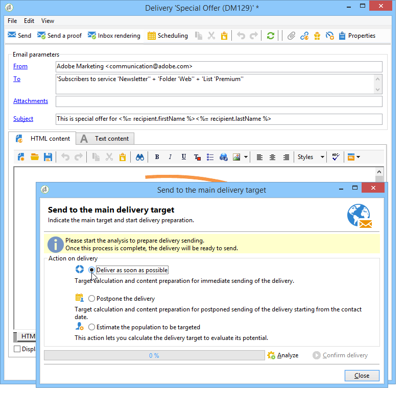

1. Click **[!UICONTROL Analyze]** to launch the analysis manually.

   The progress bar shows the progress of the analysis.

   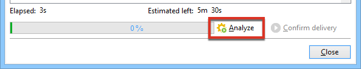

   >[!NOTE]
   >
   >The validation rules used during analysis are described in the [Validation process with typologies](../../delivery/using/steps-validating-the-delivery.md#validation-process-with-typologies) section.

1. You can stop the analysis at any time by clicking **[!UICONTROL Stop]**.

   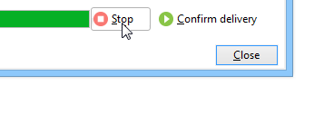

   No messages are sent during the preparation phase. You can therefore start or cancel the analysis without risk.

   >[!IMPORTANT]
   >
   >When running, the analysis freezes the delivery (or proof). Any change to the delivery (or proof) must be followed by another analysis before becoming applicable.

1. Wait until the analysis is complete.

   When the analysis finishes, the upper section of the window indicates if the delivery preparation is complete or if any errors occurred. All the validation steps, warnings and errors are listed. Colored icons show the message type:
   * The blue icon indicates an informative message.
   * The yellow icon indicates a non-critical processing error.
   * The red icon indicates a critical error that prevents sending the delivery.

   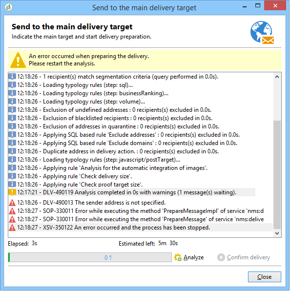

1. Click **[!UICONTROL Close]** to correct the errors if any.

1. After making the changes, restart the analysis clicking **[!UICONTROL Analyze]**.

After checking the result of the analysis, you will be able to click **[!UICONTROL Confirm delivery]** to send the message to the specified target. A confirmation message lets you launch the delivery.

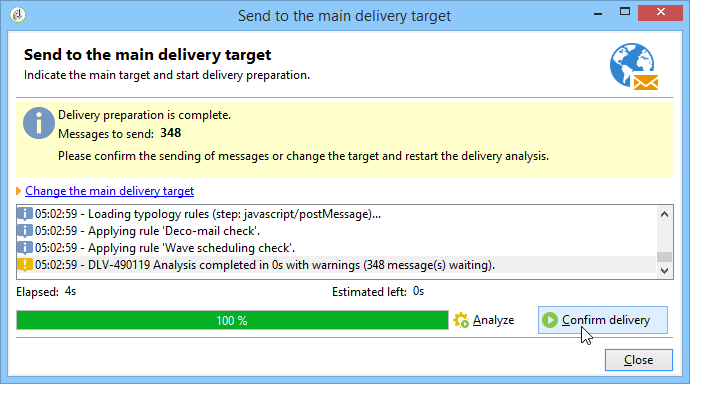

>[!NOTE]
>
>Click the **[!UICONTROL Change the main delivery target]** link if the number of messages to send does not match your configuration. This lets you change the definition of the target population and re-start the analysis.

### Analysis settings {#analysis-parameters}

The **[!UICONTROL Analysis]** tab of the delivery properties lets you define a set of information concerning the preparation of messages during the analysis phase.

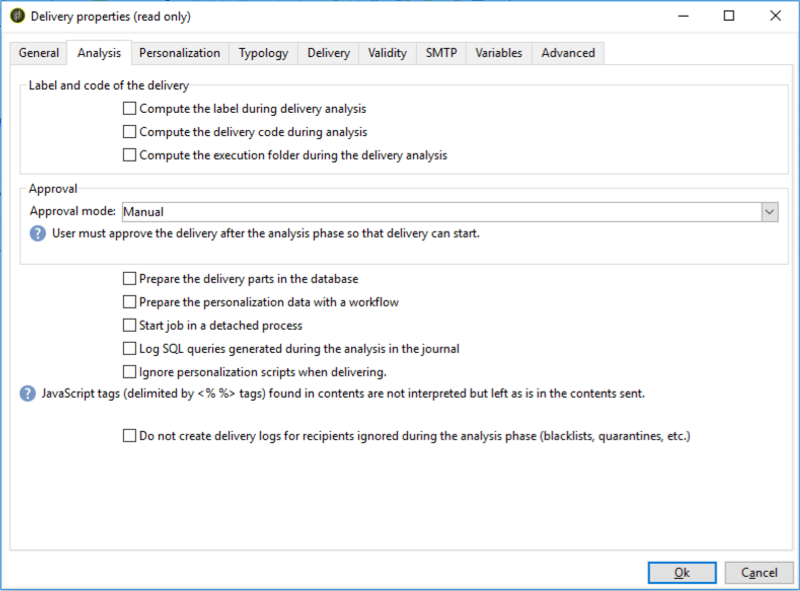

This tab gives access to the following options:

* **[!UICONTROL Label and code of the delivery]** : the options in this section are used to calculate the values of these fields during the delivery analysis phase. The **[!UICONTROL Compute the execution folder during the delivery analysis]** field computes the name of the folder that will contain this delivery action during the analysis phase.
* **[!UICONTROL Approval mode]** : this field lets you define manual or automatic delivery once analysis is complete. The validation modes are presented in the [Change the approval mode](#changing-the-approval-mode) section.
* **[!UICONTROL Prepare the delivery parts in the database]** : this option enables you to improve the delivery analysis performance. For more on this, see [this section](#improving-delivery-analysis).
* **[!UICONTROL Prepare the personalization data with a workflow]** : this option
allows to prepare the personalization data contained in your delivery in an automatic workflow, which can make you achieve a significant increase in performance for executing personalization. For more on this, see [Optimize personalization](../../delivery/using/personalization-fields.md#optimizing-personalization).
* **[!UICONTROL Start job in a detached process]** : this option lets you start the delivery analysis in a separate process. The analysis function uses the Adobe Campaign application server process (web nlserver) by default. By selecting this option, you ensure that the analysis will be completed even in the event of application server failure.
* **[!UICONTROL Log SQL queries generated during the analysis in the journal]** : this option adds the SQL query logs to the delivery journal during the analysis phase.
* **[!UICONTROL Ignore personalization scripts during sending]** : this option lets you bypass the interpretation of JavaScript directives found in HTML content. They will be displayed as is in the delivered contents. These directives are introduced with the **<%=** tag).

### Improve the delivery analysis performance {#improving-delivery-analysis}

To speed up the delivery preparation, you can check the **[!UICONTROL Prepare the delivery parts in the database]** option before launching the analysis.

When this option is enabled, the delivery preparation is performed directly within the database, which can significantly accelerate the analysis.

Currently, this option is only available when the following conditions are met:
* The delivery must be an email. The other channels are not supported for now.
* You must not use mid-sourcing or external routing, only bulk delivery routing type. You can check the routing that is used in the **[!UICONTROL General]** tab of the **[!UICONTROL Delivery properties]**.
* You cannot target a population coming from an external file. For a single delivery, click the **[!UICONTROL To]** link from the **[!UICONTROL Email parameters]** and check that the **[!UICONTROL Defined in the database]** option is selected. For a delivery used in a workflow, check that the recipients are **[!UICONTROL Specified by the inbound event(s)]** in the **[!UICONTROL Delivery]** tab.
* You must be using a PostgreSQL database.

### Configure the analysis priority {#analysis-priority-}

When the delivery is part of a campaign, the **[!UICONTROL Advanced]** tab offers an additional option. This lets you organize the processing order for deliveries in the same campaign.

Before sending, each delivery is analyzed. The analysis duration depends on the delivery extraction file. The more significant the size of the file, the longer the analysis takes, making the following deliveries wait.

The options for the **[!UICONTROL Message preparation by the scheduler]** let you prioritize the delivery analysis in a campaign workflow.

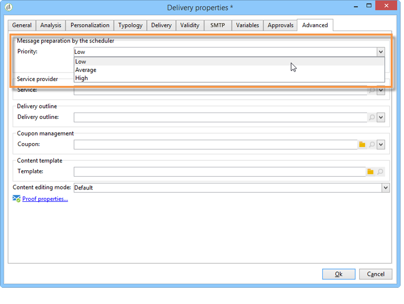

If a delivery is too large, it is better to assign a low priority to it in order to avoid slowing down the analysis of other workflow deliveries.

>[!NOTE]
>
>To ensure that the larger delivery analyses do not slow down the progress of your workflows, you can schedule their executions by ticking the **[!UICONTROL Schedule execution for a time of low activity]**.

## Send a proof {#sending-a-proof}

To detect possible errors in message configuration, Adobe highly recommend setting up a delivery validation cycle. Make sure content is approved as often as necessary by sending proofs to test recipients. A proof should be sent each time a change is made, to approve content.

>[!NOTE]
>
>* Available validation modes are detailed in [Change the approval mode](../../delivery/using/steps-validating-the-delivery.md#changing-the-approval-mode).
>* Configuration of the proof target is explained in [Define a specific proof target](../../delivery/using/steps-defining-the-target-population.md#defining-a-specific-proof-target).
>

To send a proof, follow the steps below:

1. Make sure the proof target has been configured as described in [Define a specific proof target](../../delivery/using/steps-defining-the-target-population.md#defining-a-specific-proof-target).
1. Click **[!UICONTROL Send a proof]** on the top bar of the delivery wizard.

   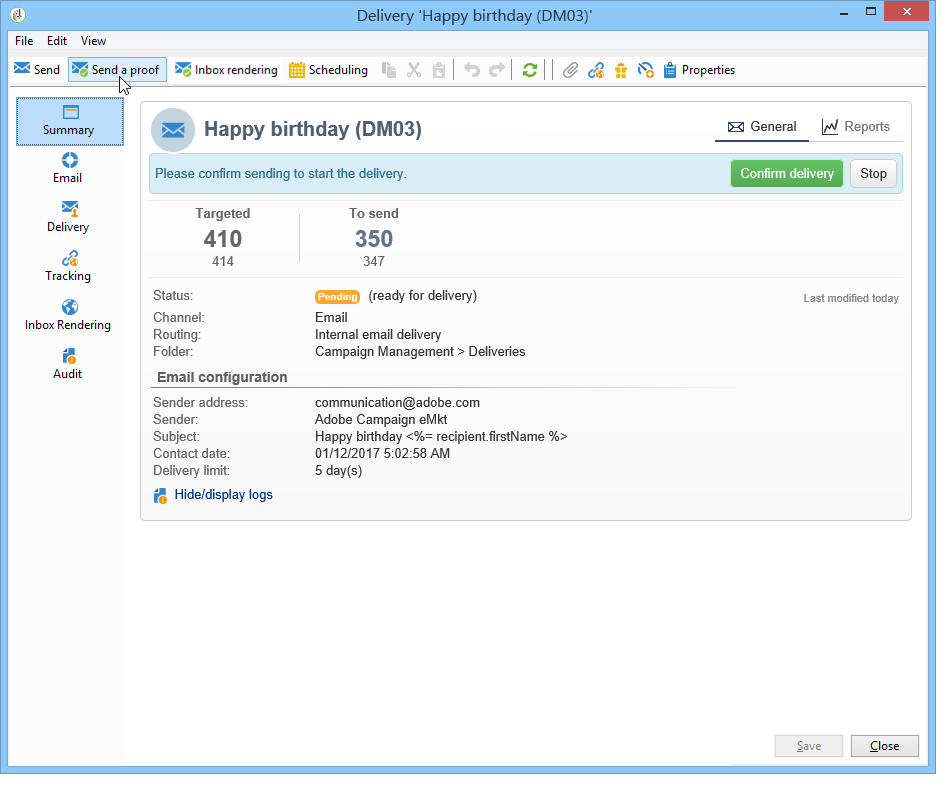

1. Start message analysis. See [Analyze the delivery](../../delivery/using/steps-validating-the-delivery.md#analyzing-the-delivery).
1. You can now send the delivery (see [Send the delivery](../../delivery/using/steps-sending-the-delivery.md)).

   Once the delivery is sent, the proof will appear in the delivery list, and is automatically created and numbered. It can be edited if you wish to access its content and properties. For more on this, refer to this [page](../../delivery/using/about-delivery-monitoring.md).

   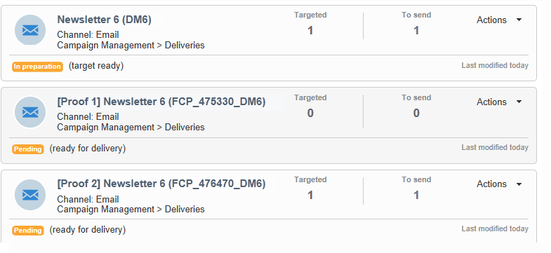

   >[!NOTE]
   >
   >If several formats were created for the delivery (HTML and Text), you can choose the format of the messages to be sent to the proof recipients in the lower section of the window.

   

You might wish to modify the content of the delivery as a result of any comments made by the validation group receiving the proof. After making your changes, you must relaunch the analysis and then send another proof. Each new proof is numbered and logged in the delivery journal.

Once the delivery has been analyzed, you can view the various proofs sent via the **[!UICONTROL Proofs]** sub-tab of the log (**[!UICONTROL Audit]** tab).

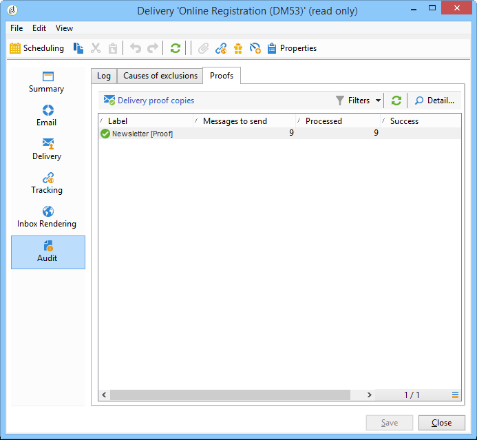

You must send as many proofs as necessary until the content of the delivery is finalized. After that, you can send the delivery to the main target and close the validation cycle.

The **[!UICONTROL Advanced]** tab of delivery properties lets you define the properties of the proof. When needed, you can override the recipient exclusion rules.

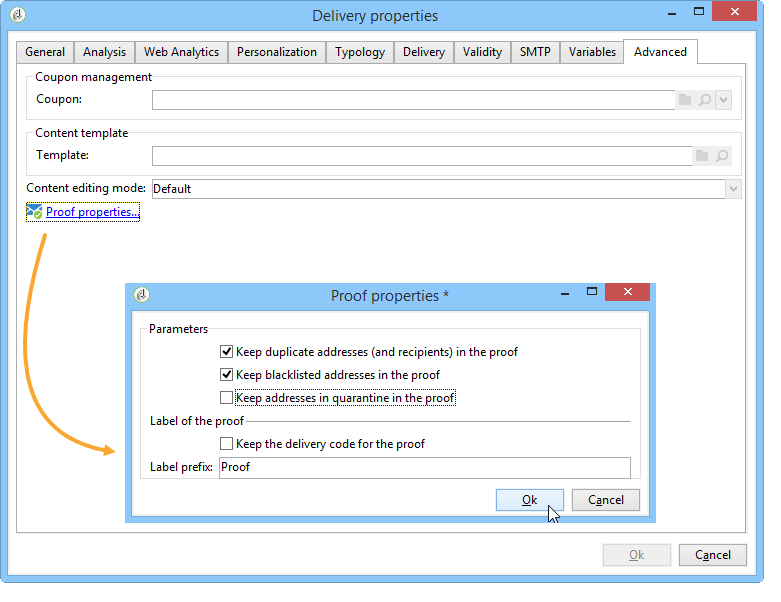

The following options are available:

* The first option lets you keep the proof doubles.
* Both of the following options let you keep recipients that are on denylist and addresses in quarantine. See the description of these options for the main target in [Customize exclusion settings](../../delivery/using/steps-defining-the-target-population.md#customizing-exclusion-settings). Unlike the target of a delivery, where these addresses are excluded by default, they are kept by default for the target of a proof.
* The **[!UICONTROL Keep the delivery code for the proof]** option lets you give the proof the same delivery code as the one defined for the delivery to which it relates. This code is specified in the first step of the delivery wizard.
* By default, the subject of the proof is prefixed by 'Proof #', where # is the number of the proof. You can change this prefix in the **[!UICONTROL Label prefix]** field.

## Validation process with typologies {#validation-process-with-typologies}

Before sending any messages, you should analyze the campaign to approve its contents and configuration. The checking rules applied during the analysis phase are defined in a **typology**. By default, for emails, the analysis covers the following points:

* Approving the object
* Approving the URLs and images
* Approving the URL labels
* Approving the unsubscription link
* Checking the size of proofs
* Checking the validity period
* Checking the scheduling of waves

The typology to be applied for each delivery is selected in the **[!UICONTROL Typologies]** tab in the delivery parameters.

You can view and edit the approval rules, their content, their order of execution, and their full description via the **[!UICONTROL Administration > Campaign execution > Typology management > Typology rules]** node.

You can create new rules and define new typologies from this node. These tasks are however reserved for expert users who know JavaScript.

For more on typology rules, refer to [this page](../../campaign/using/about-campaign-typologies.md).

To edit the current typology, click the **[!UICONTROL Edit link]** icon to the right of the **[!UICONTROL Typology]** field.

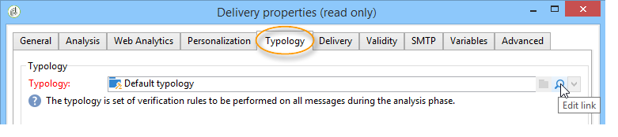

The **[!UICONTROL Rule]** tab gives a list of the typology rules to apply. Select a rule and click the **[!UICONTROL Detail...]** icon to view its configuration:

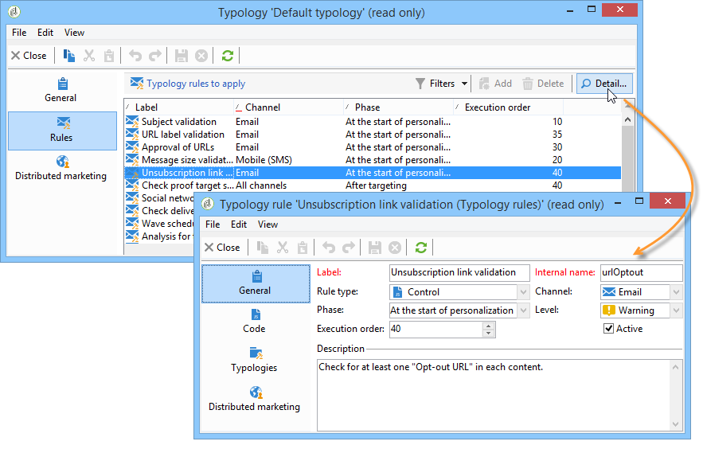

>[!NOTE]
>
>**[!UICONTROL Arbitration]** type typologies are used within the framework of sales pressure management. For more on this, refer to [this section](../../campaign/using/about-marketing-resource-management.md).

## Change the approval mode {#changing-the-approval-mode}

The **[!UICONTROL Analysis]** tab for delivery properties lets you select the validation mode. If warnings are generated during the analysis (e.g., if certain characters are accentuated in the subject of the delivery, etc.), you can configure the delivery to define whether or not it should still be executed. By default, the user must confirm the sending of messages at the end of the analysis phase: this is **manual** validation.

Select another approval mode from the drop-down list in the appropriate field.

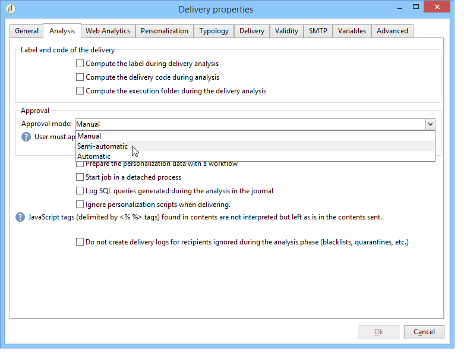

The following approval modes are available:

* **[!UICONTROL Manual]**: At the end of the analysis phase, the user must confirm delivery to start sending. To do this, click the **[!UICONTROL Start]** button to launch the delivery.
* **[!UICONTROL Semi-automatic]**: Sending begins automatically if the analysis phase generates no warning messages.
* **[!UICONTROL Automatic]**: Sending begins automatically at the end of the analysis phase irrespective of its result.
