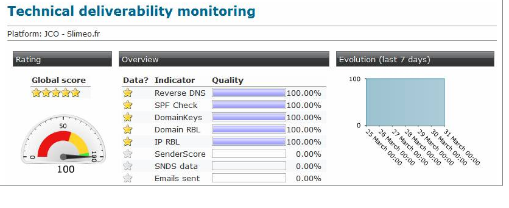

# Technical monitoring{#technical-monitoring}

The technical monitoring report is available via the **Supervision** universe, in the **[!UICONTROL Deliverability]** section.

It includes a number of deliverability quality indicators for your platform. These indicators are updated daily at 9 AM.

>[!NOTE]
>
>In addition, you are able to receive a daily report by email at a specified address. Please let us know the requested email address by email or via the Adobe Campaign Extranet.

The following indicators are used in the report:

* **[!UICONTROL IP and RBL domain]** (Real-time Blackhole List): List of IP addresses of polluting domains.

  These lists are maintained by dedicated organizations (such as SpamHaus, SpamCop...). Adobe Campaign currently processes these lists. These RBLs reflect your reputation and can be queried by the ISPs before accepting to receive your emails. 

* **[!UICONTROL SPF]** (Sender Policy Framework): Mechanism enabling you to check whether the email sender is authorized on the sending domain. 
* **[!UICONTROL SNDS]** (Smart Network Data Services): A Windows Live Hotmail anti-spam service ([https://postmaster.live.com/snds/FAQ.aspx](https://postmaster.live.com/snds/FAQ.aspx)).
* **[!UICONTROL DomainKeys]** : A service developed by Yahoo and intended to certify the identity of an email sender.
* **[!UICONTROL Reverse DNS]** : Adobe Campaign checks whether a reverse DNS is given for an IP address and that this correctly points back to the IP.
* **[!UICONTROL Sender Score]** : Database of reputed servers ([https://www.senderscore.org/](https://www.senderscore.org/))
