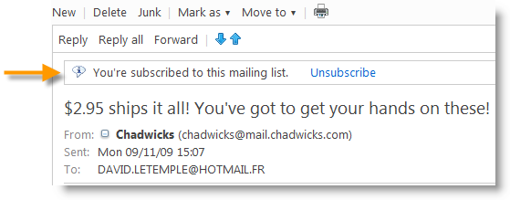
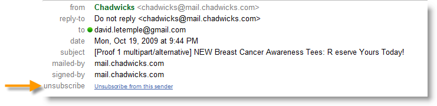
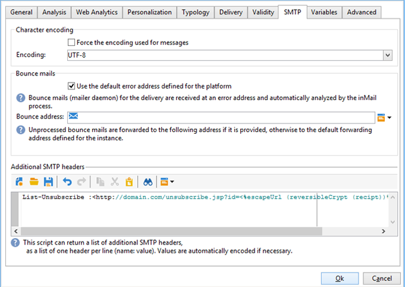

# Technical recommendations{#technical-recommendations}

Several techniques, configurations, and tools that you can use to improve your deliverability rate are listed below.

## Configuration {#configuration}

### Reverse DNS {#reverse-dns}

Adobe Campaign checks whether a reverse DNS is given for an IP address and that this correctly points back to the IP.

An important point in the network configuration is making sure a correct reverse DNS is defined for each of the IP addresses for outgoing messages. This means that for a given IP address, there is a reverse DNS record (PTR record) with a matching DNS (A record) looping back to the initial IP address.

The domain choice for a reverse DNS has an impact when dealing with certain ISPs. AOL, in particular, only accepts feedback loops with an address in the same domain as the reverse DNS (see [Feedback loop](#feedback-loop)).

A tool is available to verify the configuration of a domain: [https://mxtoolbox.com/SuperTool.aspx](https://mxtoolbox.com/SuperTool.aspx).

### MX rules {#mx-rules}

MX rules (Mail eXchanger) are the rules that manage communication between a sending server and a receiving server.

More precisely, they are used to control the speed at which the Campaign MTA (Message Transfer Agent) sends emails to each individual email domain or ISP (e.g. hotmail.com, comcast.net). These rules are typically based on limits published by the ISPs (e.g. do not include more than 20 messages per each SMTP connection).

For more on MX management, refer to [this section](../../installation/using/email-deliverability.md#mx-configuration).

### TLS {#tls}

TLS (Transport Layer Security) is an encryption protocol that can be used to secure the connection between two email servers and protect the content of an email from being read by anyone other than the intended recipients.

## Authentication {#authentication}

### SPF {#spf}

SPF (Sender Policy Framework) is an email authentication standard that allows the owner of a domain to specify which email servers are allowed to send email on behalf of that domain. This standard uses the domain in the email's "Return-Path" header (also referred to as the "Envelope From" address).

A tool is available to verify an SPF record: [https://www.kitterman.com/spf/validate.html](https://www.kitterman.com/spf/validate.html)

The SPF is a technique that, to a certain extent,enables you to make sure that the domain name used in an email is not forged. When a message is a received from a domain, the DNS server of the domain is queried. The response is a short record (the SPF record) that details which servers are authorized to send emails from this domain. If we assume that only the owner of the domain has the means to change this record, we can consider that this technique does not allow the sender address to be forged, at least not the part from the right of the "@".

In the final [RFC 4408 specification](https://www.rfc-editor.org/info/rfc4408), two elements of the message are used to determine the domain considered as the sender: The domain specified by the SMTP "HELO" (or "EHLO") command and the domain specified by the address of the "Return-Path" (or "MAIL FROM") header, which is also the bounce address. Different considerations make it possible to take into account one of these values only; we recommend making sure that both sources specify the same domain.

Checking the SPF provides an evaluation of the validity of the sender's domain:

* **None**: No evaluation could be performed,
* **Neutral**: The domain queried does not enable evaluation,
* **Pass**: The domain is considered authentic,
* **Fail**: The domain is forged and the message should be rejected,
* **SoftFail**: The domain is probably forged but the message should not be rejected solely on the basis of this result,
* **TempError**: A temporary error stopped the evaluation. The message can be rejected,
* **PermError**: The SPF records of the domain are invalid.

It is worth noting that records made at the level of the DNS servers can take up to 48 hours to be taken into account. This delay depends on how often the DNS caches of the receiving servers are refreshed.

### DKIM {#dkim}

DKIM (DomainKeys Identified Mail) authentication is a successor to SPF and uses public-key cryptography that allows the receiving email server to verify that a message was in fact sent by the person or entity it claims it was sent by, and whether or not the message content was altered in between the time it was originally sent (and DKIM "signed") and the time it was received. This standard typically uses the domain in the "From" or "Sender" header. To insure the security level of the DKIM, 1024b is the Best Practices recommended encryption size. Lower DKIM keys will not be considered as valid by the majority of access providers.

DKIM comes from a combination of the DomainKeys, Yahoo! and Cisco Identified Internet Mail authentication principles and is used to check the authenticity of the sender domain and guarantee the integrity of the message.

DKIM replaced **DomainKeys** authentication.

Using DKIM requires some prerequisites:

* **Security**: encryption is a key element of the DKIM and to insure the security level of the DKIM since the spring 2013, 1024b is the Best Practices recommended encryption size. Lower DKIM keys will not be considered as valid by the majority of access providers.
* **Reputation**: reputation is based on the IP and/or the domain, but the less transparent DKIM selector is also a key element to be taken into account. Choosing the selector is important: avoid keeping the “default” one which could be used by anyone and therefore has a very weak reputation. You must implement a different selector for **retention vs. acquisition communications** and for authentication.
* **Adobe Campaign option declaration**: in Adobe campaign the DKIM private key is based on a DKIM selector and a domain. It is not currently possible to create multiple private keys for the same domain/sub-domain with different selectors. It is not possible to define which selector domain/sub-domain must be used for the authentication in neither the platform or the email. The platform will alternatively select one of the private keys, which means the authentication has a high chance of failing.

>[!NOTE]
>
>* If you have configured DomainKeys for your Adobe Campaign instance, you just need to select **dkim** in the [Domain management rules](../../delivery/using/understanding-delivery-failures.md#domain-management). If not, follow the same configuration steps (private/public key) as for DomainKeys.
>* It is not necessary to enable both DomainKeys and DKIM for the same domain as DKIM is an improved version of DomainKeys.
>* The following domains currently validate DKIM: AOL, Gmail.

>[!IMPORTANT]
>
>For hosted or hybrid installations, if you have upgraded to the [Enhanced MTA](https://helpx.adobe.com/campaign/kb/acc-campaign-enhanced-mta.html), DKIM email authentication signing is done by the Enhanced MTA for all messages with all domains.

### DMARC {#dmarc}

DMARC (Domain-based Message Authentication, Reporting and Conformance) is the most recent form of email authentication, and it relies on both SPF and DKIM authentication to determine whether an email passes or fails. DMARC is unique and powerful in two very important ways:

* Conformance - it allows the sender to instruct the ISPs on what to do with any message that fails to authenticate (e.g. do not accept it).
* Reporting – it provides the sender with a detailed report showing all messages that failed DMARC authentication, along with the "From" domain and IP address used for each. This allows a company to identify legitimate email that's failing authentication and needs some type of "fix" (e.g. adding IP addresses to their SPF record), as well as the sources and prevalence of phishing attempts on their email domains.

DMARC can leverage the reports generated by [250ok](https://250ok.com/).

<!--#### Configuring the application {#configuring-the-application}

To define the domain used for the HELO command, edit the instance's configuration file (conf/config-instance.xml) and define a "localDomain" attribute as follows:

```
<serverConf>
  <shared>
    <dnsConfig localDomain="mydomain.net"/>
  </shared>
</serverConf>
```

The MAIL FROM domain is the domain used in technical bounce messages. This address is defined in the deployment wizard or via the NmsEmail_DefaultErrorAddr option.

#### DNS configuration {#dns-configuration}

An SPF record can currently be defined on a DNS server as a TXT type record (code 16) or an SPF type record (code 99). An SPF record takes the form of a character string. For example:

```
v=spf1 ip4:12.34.56.78/32 ip4:12.34.56.79/32 ~all
```

defines the 2 IP addresses 12.34.56.78 and 12.34.56.79 as authorized to send emails for the domain. **~all** means that any other address should be interpreted as a SoftFail.

Recommendations for defining an SPF record:

* Add **~all** (SoftFail) or **-all** (Fail) at the end to reject all servers other than those defined. Without this, servers will be able to forge this domain (with a Neutral evaluation).
* Do not add **ptr** (openspf.org recommends against this as costly and unreliable).-->

## Feedback loop {#feedback-loop}

A feedback loop works by declaring at the ISP level a given email address for a range of IP addresses used for sending messages. The ISP will send to this mailbox, in a similar way as what is done for bounce messages, those messages that are reported by recipients as spam. The platform should be configured to block future deliveries to users who have complained. It is important to no longer contact them even if they did not use the proper opt-out link. It is on the basis of these complaints that an ISP will add an IP address to its denylist. Depending on the ISP, a complaint rate of around 1% will result in blocking an IP address.

A standard is currently being drawn up to define the format of feedback loop messages: the [Abuse Feedback Reporting Format (ARF)](https://tools.ietf.org/html/rfc6650).

Implementing a feedback loop for an instance requires:

* A mailbox dedicated to the instance, which may be the bounce mailbox
* IP sending addresses dedicated to the instance

Implementing a simple feedback loop in Adobe Campaign uses the bounce message functionality. The feedback loop mailbox is used as a bounce mailbox and a rule is defined to detect these messages. The email addresses of the recipients who reported the message as spam will be added to the quarantine list.

* Create or modify a bounce mail rule, **Feedback_loop**, in **[!UICONTROL Administration > Campaign Management > Non deliverables Management > Mail rule sets]** with the reason **Refused** and the type **Hard**.
* If a mailbox has been defined specially for the feedback loop, define the parameters to access it by creating a new external Bounce Mails account in **[!UICONTROL Administration > Platform > External accounts]**.

The mechanism is immediately operational to process complaint notifications. To make sure this rule is working correctly, you can temporarily deactivate the accounts so that they do not collect these messages, then check the contents of the feedback loop mailbox manually. On the server, execute the following commands:

```
nlserver stop inMail@instance,
nlserver inMail -instance:instance -verbose.
```

If you are forced to use one single feedback loop address for multiple instances, you must:

* Replicate the messages received on as many mailboxes as there are instances,
* Have each mailbox picked up by one single instance,
* Configure the instances so that they only process the messages that concern them: the instance information is included in the Message-ID header of messages sent by Adobe Campaign and is therefore located also in the feedback loop messages. Simply specify the **checkInstanceName** parameter in the instance configuration file (by default, the instance is not verified and this may lead certain address to be quarantined incorrectly):

  ```
  <serverConf>
    <inMail checkInstanceName="true"/>
  </serverConf>
  ```

Adobe Campaign's Deliverability service manages your subscription to feedback loop services for the following ISPs: AOL, BlueTie, Comcast, Cox, EarthLink, FastMail, Gmail, Hotmail, HostedEmail, Libero, Mail.ru, MailTrust, OpenSRS, QQ, RoadRunner, Synacor, Telenor, Terra, UnitedOnline, USA, XS4ALL, Yahoo, Yandex, Zoho.

## List-Unsubscribe {#list-unsubscribe}

### About List-Unsubscribe {#about-list-unsubscribe}

Adding an SMTP header called **List-Unsubscribe** is mandatory to ensure optimal deliverability management.

This header can be used as an alternative to the "Report as SPAM" icon. It will display as an unsubscription link in the email interface.

Using this functionality helps to protect your reputation and feedback will be executed as an unsubscription.

>[!NOTE]
>
>This functionality is available from Build 6831.

To use List-Unsubscribe, you must enter a command line similar to as follows:

```
List-Unsubscribe: mailto: client@newsletter.example.com?subject=unsubscribe?body=unsubscribe
```

>[!IMPORTANT]
>
>The example above is based on the recipient table. If database implementation is done from another table, make sure to reword the command line with the correct information.

The following command line can be used to create a dynamic **List-Unsubscribe**:

```
List-Unsubscribe: mailto: %=errorAddress%?subject=unsubscribe%=message.mimeMessageId%
```

Gmail, Outlook.com and Microsoft Outlook support this method and an unsubscribe button is available directly in their interface. This technique lowers complaint rates.





You can implement the **List-Unsubscribe** by:

* directly adding the command line in the delivery template - see [this section](#adding-a-command-line-in-a-delivery-template),
* or, creating a typology rule - see [this section](#creating-a-typology-rule).

### Adding a command line in a delivery template {#adding-a-command-line-in-a-delivery-template}

The command line must be added in the additional section of the email's SMTP header.

This addition can be done in each email, or in existing delivery templates. You can also create a new delivery template that includes this functionality.

### Creating a typology rule {#creating-a-typology-rule}

The rule must contain the script that generates the command line and it must be included in the email header.

>[!NOTE]
>
>We recommend creating a typology rule: the List-Unsubscribe functionality will be automatically added in each email.

1. List-Unsubscribe: &lt;mailto:unsubscribe@domain.com&gt;

   Clicking the **unsubscribe** link opens the user's default email client. This typology rule must be added in a typology used for creating email.

1. List-Unsubscribe: `<https://domain.com/unsubscribe.jsp>`

   Clicking the **unsubscribe** link redirects the user to your unsubscription form.

   Example:

   

## Email optimization {#email-optimization}

### SMTP {#smtp}

SMTP (Simple mail transfer protocol) is an Internet standard for email transmission.

The SMTP errors that aren't checked by a rule are listed in the **[!UICONTROL Administration]** > **[!UICONTROL Campaign Management]** > **[!UICONTROL Non deliverables Management]** > **[!UICONTROL Delivery log qualification]** folder. These error messages are by default interpreted as unreachable soft errors. The most common errors must be identified and a corresponding rule added in **[!UICONTROL Administration]** > **[!UICONTROL Campaign Management]** > **[!UICONTROL Non deliverables Management]** > **[!UICONTROL Mail rule sets]** if you wish to correctly qualify the feedback from the SMTP servers. Without this, the platform will perform unnecessary retries (case of unknown users) or wrongly place certain recipients in quarantine after a given number of tests.

### Dedicated IPs {#dedicated-ips}

Adobe provides a dedicated IP strategy for each customer with a ramp-up IP in order to build a reputation and optimize delivery performance.

## IP Certification {#ip-certification}

IP Certification is a sending best practices program that helps ensuring that emails are received without being blocked by antispam filters or other email blocking systems.

Currently two providers offer IP Certification: Return Path and Certified Senders Alliance.

Certified senders are added to email allowlists which are used by global mailbox providers and email security companies. These commercial allowlists are based on a system that enables the sender to bypass antispam filters altogether or be assigned incremental points as they enter the system.

The [Return Path Certification](https://www.validity.com/products/returnpath/certification/) program offers a number of benefits, including the following:

* A measurable increase in inbox placement at top mailbox providers like Microsoft, AOL, Yahoo, Gmail, Comcast, Orange, Mail.ru, and more
* Favorable reputation and treatment at critical filters like Cloudmark, SpamAssassin, and Cisco Ironport
* A compliance team dedicated to 24/7 monitoring, providing with security alerts and working with you through the resolution of any compromises
* Mailbox provider data delivering detailed information about KPIs, placement, and Certification performance
* Simplified and faster IP warming, including stronger reputation and recognition when migrating or obtaining a new IP address

The [Certified Senders Alliance](https://certified-senders.org/certification-process/) Certification offers amongst other benefits:

* Certification of senders of commercial emails who can comply with high quality standards
* Improved delivery and deliverability of commercial emails to increase the inbox placement rate and reduce spam filtering
* Protection from legal and financial risks by fully complying with legal standards
* Protecting reputation by means of early warnings from the CSA Complaints Office and daily spam trap reports

ISPs are free to use these services and the number of ISPs can vary depending on the allowlist.

However, because more and more ISPs build their antispam filters based on each inbox owner's behavior rather than analyzing the message content itself, using IP Certification cannot be a guarantee of inbox placement or even delivery.
