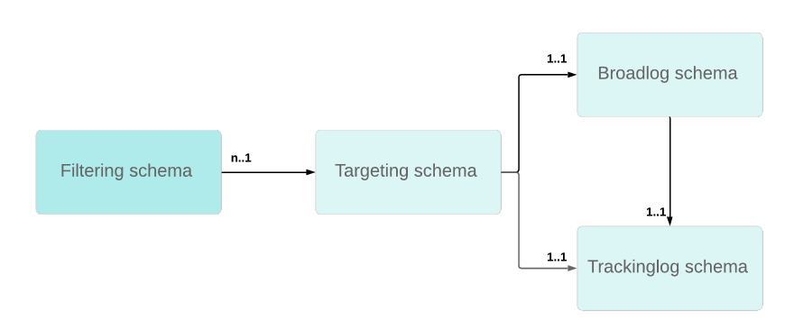

# Tracking troubleshooting {#tracking-troubleshooting}

In this section, you will find common questions related to tracking configuration and implementation in Adobe Campaign Classic.

## The tracking workflow is failing {#tracking-workflow-failing}

My tracking workflow is failing, how can I detect the corrupted lines in the tracking file?

>[!NOTE]
>
>Available for Windows only

The corrupted tracking log file .../nl6/var/&lt;instance_name&gt;/redir/log/0x0000 log can stop the tracking workflow. To easily detect corrupted lines and remove them to resume the tracking workflow, you can use the commands below.

### I know in which file the corrupted line is

In that case, corrupted lines can be found in the 0x00000000000A0000.log file but the same process can be applied to a set of files - one by one.

```
$ cd {install directory}/var/{instance name}/redir/log
$ cat 0x00000000000A0000.log | sed -nE '/^[[:alnum:]]{2}x[[:alnum:]]*\t[0-9T:\.-]*\t[0-9a-fA-F]*\t[0-9a-fA-F]*\t[0-9a-fA-F]*\t[[:alnum:]]*\t[[:alnum:]-]*\t[[:print:]]*\t[[:print:]]*\t[[:print:]]*\t([0-9a-fA-F\.:]*|[0-9a-fA-F\.:]*\t[[:print:]]*|[0-9a-fA-F\.:]*,[[:print:]]*)$/!p'
```

You can then stop the tracking workflow, delete the corrupted line(s) and restart the workflow.

### I do not now in which file the corrupted line is

1. use the following command line to check in all the tracking files.

   ```
   $ cd {install directory}/var/{instance name}/redir/log
   $ cat *.log | sed -nE '/^[[:alnum:]]{2}x[[:alnum:]]*\t[0-9T:\.-]*\t[0-9a-fA-F]*\t[0-9a-fA-F]*\t[0-9a-fA-F]*\t[[:alnum:]]*\t[[:alnum:]-]*\t[[:print:]]*\t[[:print:]]*\t[[:print:]]*\t([0-9a-fA-F\.:]*|[0-9a-fA-F\.:]*\t[[:print:]]*|[0-9a-fA-F\.:]*,[[:print:]]*)$/!p'
   ```

1. The command lists all the corrupted line(s). For example:

   ```
   50x000000000FD7EC86 2017-06-24T21:00:50.96 1f506d71 1aeab4b6 1af77020 0 e5155671-4ab7-4ce4-a763-3b82dda6d881 h
   Mozilla/5.0 (Macintosh; Intel Mac OS X 10_12_4) AppleWebKit/537.36 (KHTML, like Gecko) Chrome/55.0.2883.95 Safari/537.36 52.46.20.64
   ```

   >[!NOTE]
   >
   >Carriage return has been added before User Agent to allow better reading and does not reflect effective rendering.

1.  Run a grep command to find the corresponding file.

   ```
   $ grep -Rn <Log Id>
   # for example:
   $ grep -Rn 50x000000000FD7EC86
   ```

1. Find the faulty log with the filename and line number. For example:

   ```
   ./0x000000000FD7E000.log:3207:50x000000000FD7EC86 2017-06-24T21:00:50.96 1f506d71 1aeab4b6 1af77020 0 e5155671-4ab7-4ce4-a763-3b82dda6d881 h
   Mozilla/5.0 (Macintosh; Intel Mac OS X 10_12_4) AppleWebKit/537.36 (KHTML, like Gecko) Chrome/55.0.2883.95 Safari/537.36 52.46.20.64
   ```

   >[!NOTE]
   >
   >A carriage return has been added before User Agent to allow better reading and does not reflect effective rendering.

You can then stop the tracking workflow, delete the corrupted line(s) and restart the workflow.

## Tracking links fail intermittently {#tracking-links-fail-intermittently}

When trying to access the tracking links, the following message displays: 

`Requested URL '/r/ id=h787bc0,281a4d8,281a4da&amp;p1=1' cannot be found`

1. Access &lt;redirection_server&gt;/r/test URL and check if the build number and localhost were returned by the request.

1. Check the spareServer configuration in the serverConf.xml file for the tracking server. This configuration should be in redirection mode.

   ```
   <redirection>
      <spareServer _operation="update" enabledIf="$(hostname)!='test-rt1'" id="1"
      url="http://test-rt1:8080"/>
      <spareServer _operation="insert" enabledIf="$(hostname)!='test-rt4'" id="4"
      url="http://test-rt4:8080"/>
      <spareServer _operation="insert" enabledIf="$(hostname)!='test-rt3'" id="3"
      url="http://test-rt3:8080"/>
      <spareServer _operation="insert" enabledIf="$(hostname)!=test-rt2'" id="2"
      url="http://test-rt2:8080"/>
   </redirection>
   ```

1. Check manually whether the &lt;deliveryID&gt;.xml file exists on the machine in .../nl6/var/&lt;instance_name&gt;/redir/url/&lt;YYYY&gt; directory (YYYY represents delivery year).

1. Check manually whether &lt;trackingUrlId&gt; can be found in the &lt;deliveryID&gt;.xml file.

1. Check manually existence of broadlogID in related deliveryID delivery.

1. Check &lt;deliveryID&gt;.xml files permissions in .../nl6/var/&lt;instance_name&gt;/redir/url/year directory.

   They should have at least 644 permission so that Apache can read tracking urls to redirect requested link.

## Updating the NmsTracking_Pointer option? {#updating-option}

Follow these steps when updating the NmsTracking_Pointer option:

1. Stop the tracking workflow.

1. Stop the trackinglogd service.

1. Update the NmsTracking_Pointer option to the desired value.

1. Restart the trackinglogd service.

1. Restart the tracking workflow.

## Tracking does not seem to work with some WebMail {#webmail}

You can customize click tracking formula and specify a custom Adobe Analytics tracking formula.

That kind of customization needs to be done with caution to avoid adding extra linefeed characters. All linefeed characters present outside of the javascript expression will be present in the final formula.

This kind of extra linefeed character in the tracking URL will lead to issue in some webMail (AOL, GMail, etc.).

**First example:**

* Incorrect syntax

   ```
   <%@ include option='NmsTracking_ClickFormula' %><% // Parameters expected by Adobe-Genesis
   var pattern = new RegExp("(nl611\.test15|google\.com)", 'i')
   if( $(urlstring).match(pattern) && delivery.FCP == false )
   {
   %>
   &cid=<%= message.delivery.internalName %>&bid=<%= message.id.toString().toLowerCase() %><% } %>
   ```

* Correct syntax

   ```
   <%@ include option='NmsTracking_ClickFormula' %><% // Parameters expected by Adobe-Genesis
   var pattern = new RegExp("(nl611\.test15|google\.com)", 'i')
   if( $(urlstring).match(pattern) && delivery.FCP == false )
   {
   %>&cid=<%= message.delivery.internalName %>&bid=<%= message.id.toString().toLowerCase() %><% } %>
   ```

To understand where the extra linefeed is you can replace javascript expression by a fixed string STRING.

   ```
   // Incorrect
   STRING1
   &cid=STRING2&bid=STRING3
  
   // Correct
   STRING1&cid=STRING2&bid=STRING3
   ```

**Second example**

* Incorrect syntax

   ```
   <%@ include option='NmsTracking_ClickFormula' %>
   <% // Parameters expected by Adobe-Genesis
   var pattern = new RegExp("(vistaprint|entryUrl)", 'i')
   if( $(urlstring).match(pattern) && delivery.FCP == false )
   {%>&cid=<%= message.delivery.internalName%>&bid=<%= message.id.toString().toLowerCase()%>&SHPID=<%= message.recipient.factShopper.shopper_id %><% }
   
   %>
   ```

* Correct syntax

   ```
   <%@ include option='NmsTracking_ClickFormula' %><% // Parameters expected by Adobe-Genesis
   var pattern = new RegExp("(vistaprint|entryUrl)", 'i')
   if( $(urlstring).match(pattern) && delivery.FCP == false )
   {%>&cid=<%= message.delivery.internalName%>&bid=<%= message.id.toString().toLowerCase()%>&SHPID=<%= message.recipient.factShopper.shopper_id %><% }
   
   %>
   ```

To understand where the extra linefeed is you can replace javascript expression by a fixed string STRING.

```
// Incorrect
STRING1&cid=STRING2&bid=STRING3&SHPID=STRING4

// Correct
STRING1&cid=STRING2&bid=STRING3&SHPID=STRING4
```

## Tracking logs retrieval is too slow {#slow-retrieval}

When the instance does not retrieve directly tracking logs but from a distant Adobe Campaign Classic server, the logs are retrieved through the GetTrackingLogs SOAP call which is defined in the remoteTracking schema.

An option in the serverConf.xml file enables you to set the number of logs that are retrieved at once through this method: logCountPerRequest.

The default value of logCountPerRequest being 1000, it may prove in some case to be too small. The accepted values must be between 0 and 10.000.

## Tracking logs could not be linked to recipients {#link-recipients}

In Adobe Campaign Classic, a target mapping is supposed to be unique in term of recipient schema vs broadlog / trackinglog schemas.

   

It is not possible to use multiple targeting schemas with the same trackinglog schema since tracking workflow will be unable to reconciliate data with targeting id.

If you do not want to use the out-of-the-box target mapping with nms:recipient, we recommend the following approaches:

* If you want to use custom targeting dimension, you need to create custom broadLog/trackingLog schema using nms:broadlog as template (e.g. nms:broadLogRcp, nms:broadLogSvc,etc.).

* If you want to use OOB trackingLogRcp/broadLogRcp, the targeting dimension needs to be nms:recipient and filtering dimenstion could be a custom schema.
