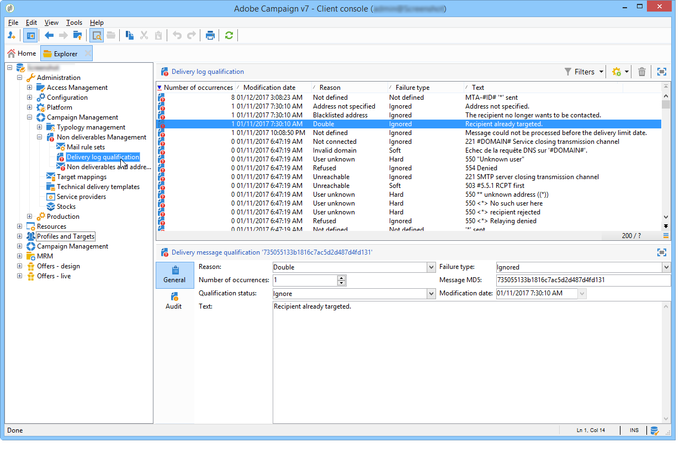
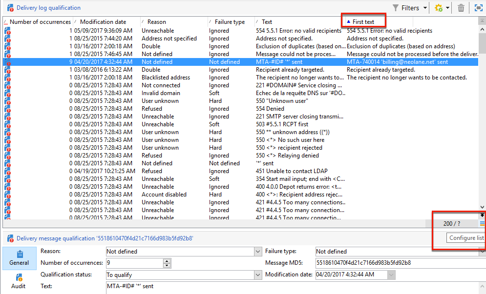
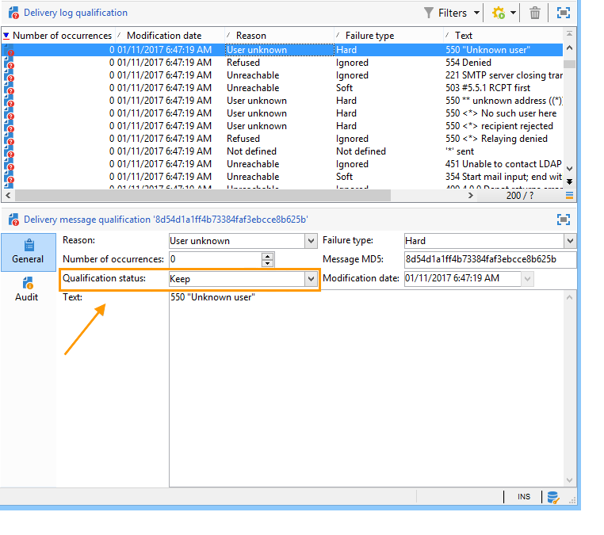
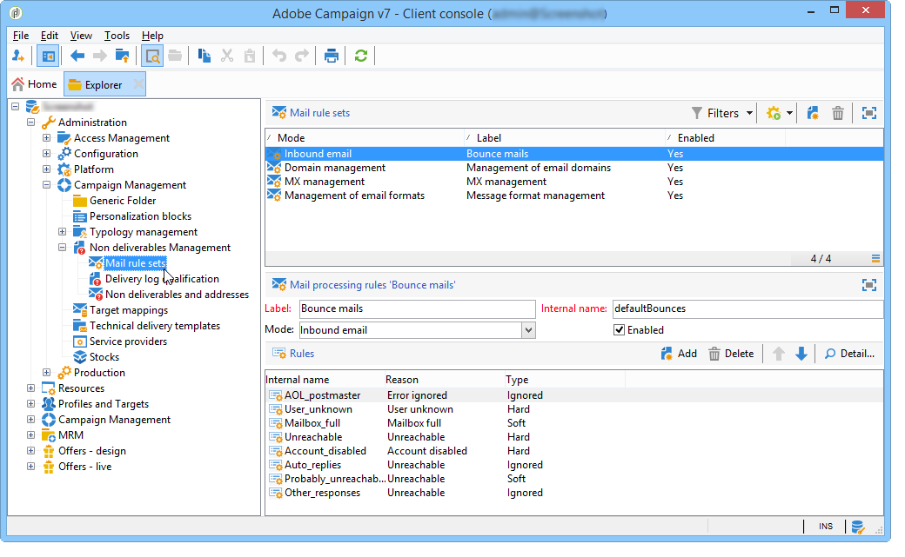
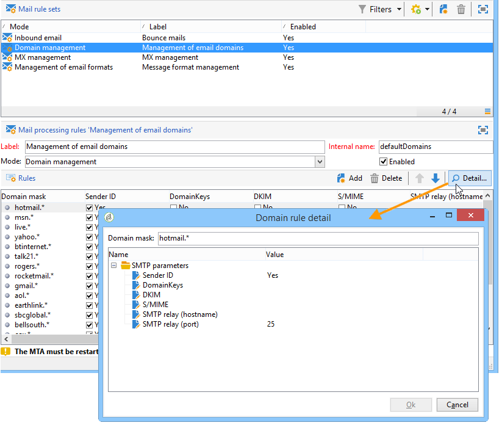

# Understanding delivery failures{#understanding-delivery-failures}

## About delivery failures {#about-delivery-failures}

When a message (email, SMS, push notification) cannot be sent to a profile, the remote server automatically sends an error message, which is picked up by the Adobe Campaign platform and qualified to determine whether or not the email address or phone number should be quarantined. See [Bounce mail management](#bounce-mail-management).

>[!NOTE]
>
>**Email** error messages (or "bounces") are qualified by the Enhanced MTA (synchronous bounces) or by the inMail process (asynchronous bounces).
>
>**SMS** error messages (or "SR" for "Status Report") are qualified by the MTA process.

Once a message is sent, the delivery logs allows you to view the delivery status for each profile and the associated failure type and reason.

Messages can also be excluded during the delivery preparation if an address is quarantined or if a profile is on denylist. Excluded messages are listed in the delivery dashboard.

**Related topics:**

* [Delivery logs and history](delivery-dashboard.md#delivery-logs-and-history)
* [Failed status](delivery-performances.md#failed-status)
* [Delivery failure types and reasons](#delivery-failure-types-and-reasons)

## Delivery failure types and reasons {#delivery-failure-types-and-reasons}

There are three types of error when a message fails. Each error type determines if an address is sent to quarantines. For more on this, refer to [Conditions for sending an address to quarantine](understanding-quarantine-management.md#conditions-for-sending-an-address-to-quarantine)

* **Hard**: A "hard" error indicates an invalid address. This involves an error message that explicitly states that the address is invalid, such as: "Unknown user".
* **Soft**: This might be a temporary error, or one that could not be categorized, such as: "Invalid domain" or "Mailbox full".
* **Ignored**: This is an error that is known to be temporary, such as "Out of office", or a technical error, for example if the sender type is "postmaster".

The possible reasons for a delivery failure are: 

<table> 
 <tbody> 
  <tr> 
   <td> Error label </td> 
   <td> Error type </td> 
   <td> Technical Value </td> 
   <td> Description </td> 
  </tr> 
  <tr> 
   <td> Account disabled </td> 
   <td> Soft / Hard </td> 
   <td> 4 </td> 
   <td> The account linked to the address is not active anymore. When the Internet Access Provider (IAP) detects a lengthy period of inactivity, it can close the user's account. Deliveries to the user's address will then be impossible. If the account is temporarily disabled due to six months of inactivity and can still be activated, the status With errors will be assigned and the account will be tried again until the error counter reaches 5. If the error signals that the account is permanently deactivated, it will directly be set to Quarantine.  </td> 
  </tr> 
  <tr> 
   <td> Address in quarantine </td> 
   <td> Hard </td> 
   <td> 9 </td> 
   <td> The address was placed in quarantine.  </td> 
  </tr> 
  <tr> 
   <td> Address not specified </td> 
   <td> Hard </td> 
   <td> 7 </td> 
   <td> No address is given for the recipient.  </td> 
  </tr> 
  <tr> 
   <td> Bad-quality address </td> 
   <td> Ignored </td> 
   <td> 14 </td> 
   <td> The quality rating for this address is too low.  </td> 
  </tr> 
  <tr> 
   <td> Denylisted address </td> 
   <td> Hard </td> 
   <td> 8 </td> 
   <td> The address was added to the denylist at the time of sending. This status is used for importing data from external lists and external systems into the Adobe Campaign Quarantine list.  </td> 
  </tr> 
  <tr> 
   <td> Control address </td> 
   <td> Ignored </td> 
   <td> 127 </td> 
   <td> The recipient's address is part of the control group.  </td> 
  </tr> 
  <tr> 
   <td> Double </td> 
   <td> Ignored </td> 
   <td> 10 </td> 
   <td> The address of the recipient was already in this delivery.  </td> 
  </tr> 
  <tr> 
   <td> Error ignored </td> 
   <td> Ignored </td> 
   <td> 25 </td> 
   <td> The address is on the allowlist. The error is therefore ignored and an email will be sent.  </td> 
  </tr> 
  <tr> 
   <td> Excluded after arbitration </td> 
   <td> Ignored </td> 
   <td> 12 </td> 
   <td> The recipient was excluded by a 'arbitration' type campaign typology rule.  </td> 
  </tr> 
  <tr> 
   <td> Excluded by a SQL rule </td> 
   <td> Ignored </td> 
   <td> 11 </td> 
   <td> The recipient was excluded by a 'SQL' type campaign typology rule.  </td> 
  </tr> 
  <tr> 
   <td> Invalid domain </td> 
   <td> Soft </td> 
   <td> 2 </td> 
   <td> The domain of the email address is incorrect or no longer exists. This profile will be targeted again until the error count reaches 5. After this, the record will be set to Quarantine status and no retry will follow.  </td> 
  </tr> 
  <tr> 
   <td> Mailbox full </td> 
   <td> Soft </td> 
   <td> 5 </td> 
   <td> The mailbox of this user is full and cannot accept more messages. This profile will be targeted again until the error count reaches 5. After this, the record will be set to Quarantine status and no retry will follow.  This type of error is managed by a clean-up process, the address is set to a valid status after 30 days.  Warning: in order for the address to be automatically removed from the list of quarantined addresses, the Database cleanup technical workflow must be started.  </td> 
  </tr> 
  <tr> 
   <td> Not connected </td> 
   <td> Ignored </td> 
   <td> 6 </td> 
   <td> The recipient's mobile phone is switched off or not connected to the network when the message is sent.  </td> 
  </tr> 
  <tr> 
   <td> Not defined </td> 
   <td> Not defined </td> 
   <td> 0 </td> 
   <td> The address is in qualification because error have not been incremented yet. This type of error occurs when a new error message is sent by the server: it can be an isolated error, but if it occurs again, the error counter increases, which will alert the technical teams. They can then carry out message analysis and qualify this error, via the Administration / Campaign Management / Non deliverables Management node in the tree structure.  </td> 
  </tr> 
  <tr> 
   <td> Not eligible for the offers </td> 
   <td> Ignored </td> 
   <td> 16 </td> 
   <td> The recipient was not eligible for the offers in the delivery.  </td> 
  </tr> 
  <tr> 
   <td> Refused </td> 
   <td> Soft / Hard </td> 
   <td> 20 </td> 
   <td> The address has been placed in quarantine due to a security feedback as a spam report. According to the error, the address will be tried again until the error counter reaches 5, or it will be directly sent to quarantines.  </td> 
  </tr> 
  <tr> 
   <td> Target limited in size </td> 
   <td> Ignored </td> 
   <td> 17 </td> 
   <td> The maximum delivery size was reached for the recipient.  </td> 
  </tr> 
  <tr> 
   <td> Unqualified address </td> 
   <td> Ignored </td> 
   <td> 15 </td> 
   <td> The postal address has not been qualified.  </td> 
  </tr> 
  <tr> 
   <td> Unreachable </td> 
   <td> Soft / Hard </td> 
   <td> 3 </td> 
   <td> An error has occurred in the message delivery chain. It could be an incident on the SMTP relay, a domain that is temporarily unreachable, etc. According to the error, the address will be tried again until the error counter reaches 5, or it will be directly sent to quarantines.  </td> 
  </tr> 
  <tr> 
   <td> User unknown </td> 
   <td> Hard </td> 
   <td> 1 </td> 
   <td> The address does not exist. No further deliveries will be attempted for this profile.  </td> 
  </tr> 
 </tbody> 
</table>

## Retries after a delivery temporary failure {#retries-after-a-delivery-temporary-failure}

If a message fails due to a **Soft** or **Ignored** error that is temporary, retries will be performed during the delivery duration.

>[!NOTE]
>
>Temporarily undelivered messages can only be related to a **Soft** or **Ignored** error, but not a **Hard** error (see [Delivery failure types and reasons](#delivery-failure-types-and-reasons)).

>[!IMPORTANT]
>
>For hosted or hybrid installations, if you have upgraded to the [Enhanced MTA](sending-with-enhanced-mta.md), the retry settings in the delivery are no longer used by Campaign. Soft bounce retries and the length of time between them are determined by the Enhanced MTA based on the type and severity of the bounce responses coming back from the message’s email domain.

For on-premise installations and hosted/hybrid installations using the legacy Campaign MTA, to modify the duration of a delivery, go to the advanced parameters of the delivery or delivery template and specify the desired duration in the corresponding field. See [Defining validity period](steps-sending-the-delivery.md#defining-validity-period).

The default configuration allows five retries at one-hour intervals, followed by one retry per day for four days. The number of retries can be changed globally (contact your Adobe technical administrator) or for each delivery or delivery template (see [Configuring retries](steps-sending-the-delivery.md#configuring-retries)).

## Synchronous and asynchronous errors {#synchronous-and-asynchronous-errors}

A message can fail immediately (synchronous error), or later on, after it has been sent (asynchronous error).

* Synchronous error: the remote mail server contacted by the Adobe Campaign delivery server immediately returned an error message, the delivery is not allowed to be sent to the profile's server. Adobe Campaign qualifies each error in order to determine whether or not the email addresses concerned should be quarantined. See [Bounce mail qualification](#bounce-mail-qualification). 
* Asynchronous error: a bounce mail or a SR was resent later by the receiving server. This mail is loaded into a technical mailbox the application uses to label messages with an error. Asynchronous errors can occur up until one week after a delivery has been sent.

  >[!NOTE]
  >
  >Configuration of the bounce mailbox is detailed in [this section](../../installation/using/deploying-an-instance.md#managing-bounced-emails).

  The [feedback loop](https://experienceleague.adobe.com/docs/deliverability-learn/deliverability-best-practice-guide/transition-process/infrastructure.html#feedback-loops) operates like bounce emails. When a user qualifies an email as spam, you can configure email rules in Adobe Campaign to block all deliveries to this user. Messages sent to users who have qualified an email as spam are automatically redirected towards an email box specifically created for this purpose. The addresses of these users are on denylist even though they didn't click the unsubscription link. Addresses are in denylist in the (**NmsAddress**) quarantine table and not in the (**NmsRecipient**) recipient table.

  >[!NOTE]
  >
  >Complaint management is detailed in the [Deliverability management](about-deliverability.md) section.

## Bounce mail management {#bounce-mail-management}

The Adobe Campaign platform lets you manage email delivery failures via the bounce mail functionality.

When an email cannot be delivered to a recipient, the remote messaging server automatically returns an error message (bounce mail) to a technical inbox designed for this purpose.

For on-premise installations and hosted/hybrid installations using the legacy Campaign MTA, error messages are collected by the Adobe Campaign platform and qualified by the inMail process to enrich the list of email management rules.

>[!IMPORTANT]
>
>For hosted or hybrid installations, if you have upgraded to the [Enhanced MTA](sending-with-enhanced-mta.md), most of the email management rules are no longer used. For more on this, see [this section](#email-management-rules).

### Bounce mail qualification {#bounce-mail-qualification}

>[!IMPORTANT]
>
>For hosted or hybrid installations, if you have upgraded to the [Enhanced MTA](sending-with-enhanced-mta.md):
>
>* The bounce qualifications in the **[!UICONTROL Delivery log qualification]** table are no longer used for **synchronous** delivery failure error messages. The Enhanced MTA determines the bounce type and qualification, and sends back that information to Campaign.
>
>* **Asynchronous** bounces are still qualified by the inMail process through the **[!UICONTROL Inbound email]** rules. For more on this, see [Email management rules](#email-management-rules).
>
>* For instances using the Enhanced MTA **without Webhooks/EFS**, the **[!UICONTROL Inbound email]** rules will also be used to process the synchronous bounce emails coming from the Enhanced MTA, using the same email address as for asynchronous bounce emails.

For on-premise installations and hosted/hybrid installations using the legacy Campaign MTA, when the delivery of an email fails, the Adobe Campaign delivery server receives an error message from the messaging server or the remote DNS server. The list of errors is made up of strings contained in the message returned by the remote server. Failure types and reasons are assigned to each error message.

This list is available via the **[!UICONTROL Administration > Campaign Management > Non deliverables Management > Delivery log qualification]** node. It contains all the rules used by Adobe Campaign to qualify delivery failures. It is non-exhaustive, and is regularly updated by Adobe Campaign and can also be managed by the user.

The message returned by the remote server on the first occurrence of this error type is displayed in the **[!UICONTROL First text]** column of the **[!UICONTROL Delivery log qualification]** table. If this column is not displayed, click the **[!UICONTROL Configure list]** button at the right bottom of the list to select it.

Adobe Campaign filters this message to delete the variable content (such as IDs, dates, email addresses, phone numbers, etc.) and displays the filtered result in the **[!UICONTROL Text]** column. The variables are replaced with **`#xxx#`**, except addresses that are replaced with **`*`**.

This process allows to bring together all failures of the same type and avoid multiple entries for similar errors in the Delivery log qualification table.
  
>[!NOTE]
>
>The **[!UICONTROL Number of occurrences]** field displays the number of occurrences of the message in the list. It is limited to 100 000 occurrences. You can edit the field, if you want, for example, to reset it.

Bounce mails can have the following qualification status:

* **[!UICONTROL To qualify]** : the bounce mail could not be qualified. Qualification must be assigned to the Deliverability team to guarantee efficient platform deliverability. As long as it isn't qualified, the bounce mail isn't used to enrich the list of email management rules.
* **[!UICONTROL Keep]** : the bounce mail was qualified and will be used by the **Refresh for deliverability** workflow to be compared to existing email management rules and enrich the list.
* **[!UICONTROL Ignore]** : the bounce mail is ignored by the Campaign MTA, meaning that this bounce will never cause the recipient's address to be quarantined. It will not be used by the **Refresh for deliverability** workflow and it will not be sent to client instances.

>[!NOTE]
>
>In case of an outage of an ISP, emails sent through Campaign will be wrongly marked as bounces. To correct this, you need to update bounce qualification. For more on this, see [this page](update-bounce-qualification.md).

### Email management rules {#email-management-rules}

>[!IMPORTANT]
>
>For hosted or hybrid installations, if you have upgraded to the [Enhanced MTA](sending-with-enhanced-mta.md), most of the email management rules are no longer used. For more details, see the sections below.

Mail rules are accessed via the **[!UICONTROL Administration > Campaign Management > Non deliverables Management > Mail rule sets]** node. Email management rules are shown in the lower part of the window.

>[!NOTE]
>
>The default parameters of the platform are configured in the deployment wizard. For further information, refer to [this section](../../installation/using/deploying-an-instance.md).

The default rules are as follows.

>[!IMPORTANT]
>
>* The delivery server (MTA) must be restarted if the parameters have been changed.
>* The modification or creation of management rules is for expert users only.

#### Inbound email {#inbound-email}

>[!IMPORTANT]
>
>For hosted or hybrid installations, if you have upgraded to the [Enhanced MTA](sending-with-enhanced-mta.md), and if your instance has **Webhooks/EFS** functionality, the **[!UICONTROL Inbound email]** rules are no longer used for synchronous delivery failure error messages. For more on this, see [this section](#bounce-mail-qualification).

For on-premise installations and hosted/hybrid installations using the legacy Campaign MTA, these rules contain the list of character strings which can be returned by remote servers and which let you qualify the error (**Hard**, **Soft** or **Ignored**).
  
When an email fails, the remote server returns a bounce message to the address specified in the platform parameters. Adobe Campaign compares the content of each bounce mail to the strings in the list of rules, and then assigns it one of the three [error types](#delivery-failure-types-and-reasons).

>[!NOTE]
>
>The user can create his own rules. When importing a package and when updating data via the **Refresh for deliverability** workflow, the user-created rules are overwritten.

For more on bounce mail qualification, see [this section](#bounce-mail-qualification).

#### Domain management {#domain-management}

>[!IMPORTANT]
>
>For hosted or hybrid installations, if you have upgraded to the [Enhanced MTA](sending-with-enhanced-mta.md), the **[!UICONTROL Domain management]** rules are no longer used. **DKIM (DomainKeys Identified Mail)** email authentication signing is done by the Enhanced MTA for all messages with all domains. It does not sign with **Sender ID**, **DomainKeys**, or **S/MIME** unless otherwise specified at the Enhanced MTA level.

For on-premise installations and hosted/hybrid installations using the legacy Campaign MTA, the Adobe Campaign messaging server applies a single **Domain management** rule to all domains.

<!---->

* You can choose whether or not to activate certain identification standards and encryption keys to check the domain name, such as **Sender ID**, **DomainKeys**, **DKIM**, and **S/MIME**.
* The **SMTP relay** parameters let you configure the IP address and the port of a relay server for a particular domain. For more on this, see [this section](../../installation/using/configuring-campaign-server.md#smtp-relay).

If your messages are displayed in Outlook with **[!UICONTROL on behalf of]** in the sender address, make sure you are not signing your emails with **Sender ID**, which is the outdated proprietary email authentication standard from Microsoft. If the **[!UICONTROL Sender ID]** option is enabled, uncheck the corresponding box and contact [Adobe Customer Care](https://helpx.adobe.com/enterprise/admin-guide.html/enterprise/using/support-for-experience-cloud.ug.html). Your deliverability will not be impacted.

#### MX Management {#mx-management}

>[!IMPORTANT]
>
>For hosted or hybrid installations, if you have upgraded to the [Enhanced MTA](sending-with-enhanced-mta.md), the **[!UICONTROL MX management]** delivery throughput rules are no longer used. The Enhanced MTA uses its own MX rules that allow it to customize your throughput by domain based on your own historical email reputation, and on the real-time feedback coming from the domains where you’re sending emails.

For on-premise installations and hosted/hybrid installations using the legacy Campaign MTA:

* The MX management rules are used to regulate the flow of outgoing emails for a specific domain. They sample the bounce messages and block sending where appropriate.

* The Adobe Campaign messaging server applies rules specific to the domains, and then the rules for the general case represented by an asterisk in the list of rules.

* To configure MX management rules, simply set a threshold and select certain SMTP parameters. A **threshold** is a limit calculated as an error percentage beyond which all messages towards a specific domain are blocked. For example, in the general case, for a minimum of 300 messages, the sending of emails is blocked for three hours if the error rate reaches 90%.

For more on MX management, refer to [this section](../../installation/using/email-deliverability.md#mx-configuration).
