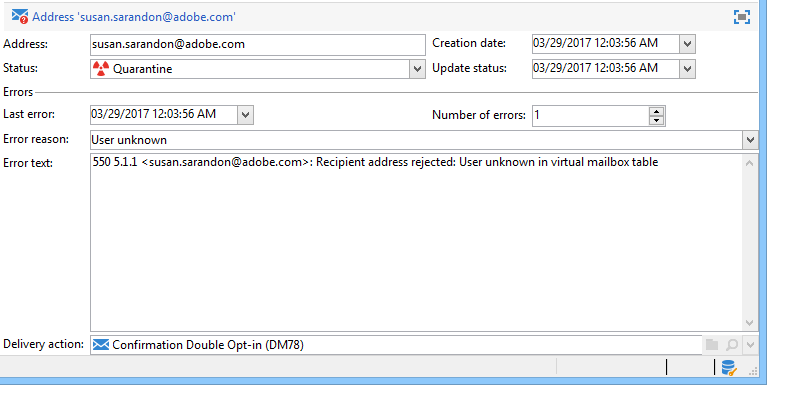
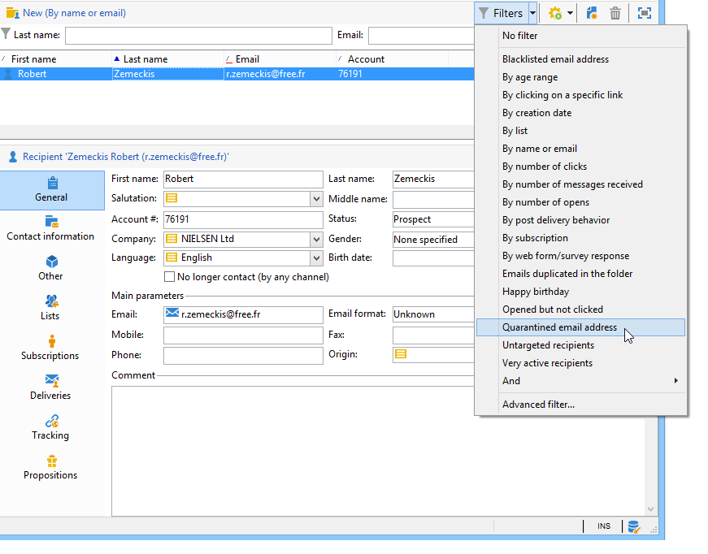
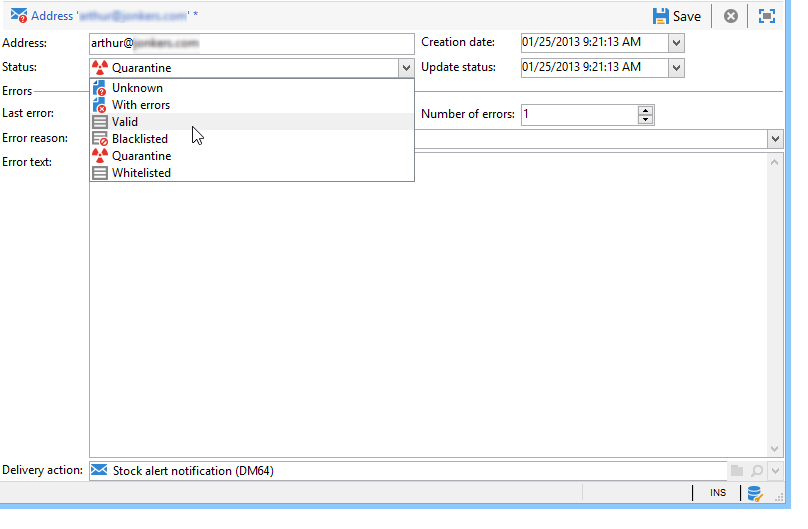
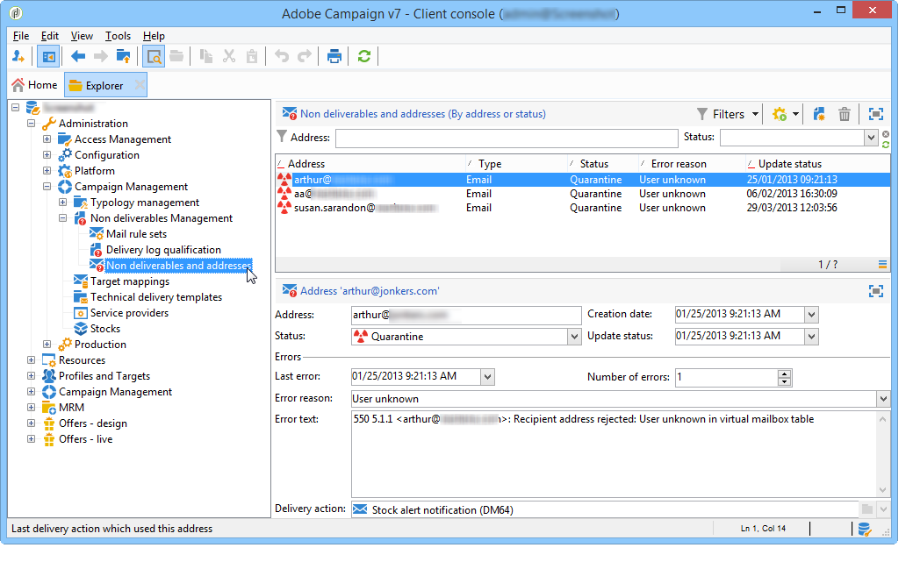
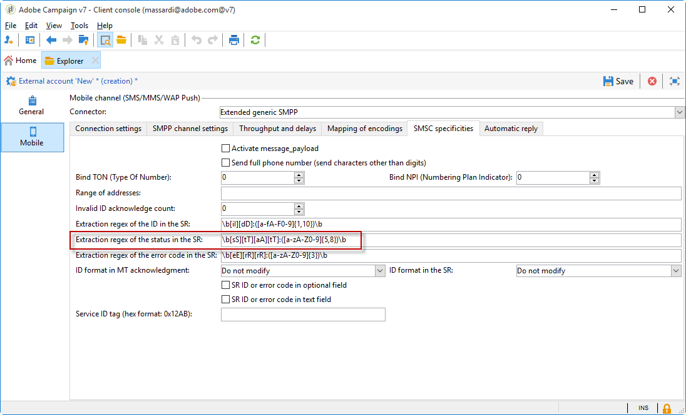

# Understanding quarantine management{#understanding-quarantine-management}

## About quarantines {#about-quarantines}

Adobe Campaign manages a list of quarantined addresses. Recipients whose address is quarantined are excluded by default during delivery analysis, and will not be targeted. An email address can be quarantined, for example, when the mailbox is full or if the address does not exist. In any case, the quarantine procedure complies with specific rules described below.

>[!NOTE]
>
>This section applies to online channels: email, SMS, push notification.

### Optimizing your delivery through quarantines {#optimizing-your-delivery-through-quarantines}

The profiles whose email addresses or phone number are in quarantine are automatically excluded during message preparation (see [Identifying quarantined addresses for a delivery](#identifying-quarantined-addresses-for-a-delivery)). This will speed up deliveries, as the error rate has a significant effect on delivery speed.

Some internet access providers automatically consider emails to be spam if the rate of invalid addresses is too high. Quarantine therefore allows you to avoid blacklisting by these providers.

Moreover, quarantines help reducing SMS sending costs by excluding erroneous phone numbers from deliveries. For more on best practices to secure and optimize your deliveries, refer to [this page](https://docs.campaign.adobe.com/doc/AC/getting_started/EN/deliveryBestPractices.html).

### Quarantine vs blacklisting {#quarantine-vs-blacklisting}

**Quarantine** applies only to an address, not the profile itself. It means that, if two profiles have the same email address, they will both be affected if the address is quarantined.

Likewise, a profile whose email address is quarantined could update his profile and enter a new address, and could then be targeted by delivery actions again.

**Blacklisting**, on the other hand, will result in the profile no longer being targeted by any delivery, for example after an unsubscription (opt-out).

>[!NOTE]
>
>When a user replies to an SMS message with a keyword such as "STOP" in order to opt-out from SMS deliveries, his profile is not blacklisted like in the email opt-out process. The profile phone number is sent to quarantine, so that the user continues receiving email messages.

## Identifying quarantined addresses {#identifying-quarantined-addresses}

Quarantined addresses can be listed for a specific delivery or for the entire platform.

### Identifying quarantined addresses for a delivery {#identifying-quarantined-addresses-for-a-delivery}

Quarantined addresses for a specific delivery are listed during the delivery preparation phase, in the delivery logs of the delivery dashboard (see [Delivery logs and history](../../delivery/using/monitoring-a-delivery.md#delivery-logs-and-history)).

### Identifying quarantined addresses for the entire platform {#identifying-quarantined-addresses-for-the-entire-platform}

Administrators can list the addresses in quarantine for the entire platform from the **[!UICONTROL Administration > Campaign Management > Non deliverables Management > Non deliverables and addresses]** node.

>[!NOTE]
>
>This menu lists quarantined elements for **email**, **SMS** and **Push notification** channels.  

The following information is available for each address:



>[!NOTE]
>
>The increase in number of quarantines is a normal effect, related to the "wear" of the database. For example, if the lifetime of an email address is considered to be three years and the recipients table increases by 50% each year, the increase in quarantines can be calculated as follows:
>
>End of Year 1: (1&#42;0.33)/(1+0.5)=22%.
>
>End of Year 2: ((1.22&#42;0.33)+0.33)/(1.5+0.75)=32.5%.

### Identifying quarantined addresses in delivery reports {#identifying-quarantined-addresses-in-delivery-reports}

The following reports provide information about the addresses in quarantine:

* For each delivery, the **[!UICONTROL Delivery summary]** report shows the number of addresses in quarantine in the delivery target. It displays:

    * The number of addresses placed in quarantine during the delivery analysis,

    * The number of addresses placed in quarantine following the delivery action.

* The **[!UICONTROL Non-deliverables and bounces]** report displays information about the addresses in quarantine, the types of error encountered, etc., and a failure breakdown by domain.

You can look up this information for all deliveries of the platform (**Home page>Reports**) or for a specific delivery. You can also create customized reports and select the information to be displayed.

### Identifying quarantined addresses for a recipient {#identifying-quarantined-addresses-for-a-recipient}

You can look up the status of the email address of any recipient. To do this, select the recipient profile and click the **[!UICONTROL Deliveries]** tab. For all deliveries to that recipient, you can find out whether the address failed, was quarantined during analysis, etc. For each folder, you can display only the recipients whose email address is in quarantine. To do this, use the **[!UICONTROL Quarantined email address]** application filter.



### Removing a quarantined address {#removing-a-quarantined-address}

If you need to remove an address from quarantine, change its status manually to **[!UICONTROL Valid]**. 



If you change the status to **[!UICONTROL Whitelisted]**, the address will be targeted systematically each time even if an error is encountered.

>[!CAUTION]
>
>Blacklisted addresses are not concerned by the quarantine system and are not targeted, even if you change the status of the address.

You can also change the number of errors and the period between errors. To do this, change the settings of the deployment wizard (Email channel/Advanced settings). For more on the deployment wizard, refer to [this section](../../installation/using/deploying-an-instance.md).

## Conditions for sending an address to quarantine {#conditions-for-sending-an-address-to-quarantine}

Adobe Campaign manages quarantine according to the delivery failure type and the reason assigned during error messages qualification (see [Bounce mail qualification](../../delivery/using/understanding-delivery-failures.md#bounce-mail-qualification)) and [Delivery failure types and reasons](../../delivery/using/understanding-delivery-failures.md#delivery-failure-types-and-reasons).

* **Ignored error**: ignored errors do not send an address to quarantine.
* **Hard error**: the corresponding email address is immediately sent to quarantine.
* **Soft error**: soft errors do not send immediately an address to quarantine, but they increment an error counter. When the error counter reaches the limit threshold, the address goes into quarantine. In the default configuration, the threshold is set at five errors, where two errors are significant if they occur at least 24 hours apart. The address is placed in quarantine at the sixth error. The error counter threshold can be modified. For more on this, refer to [Retries after a delivery temporary failure](../../delivery/using/understanding-delivery-failures.md#retries-after-a-delivery-temporary-failure).

  When a delivery is successful after a retry, the error counter of the address which was prior to that quarantined is reinitialized. The address status changes to **Valid** and it is deleted from the list of quarantines after two days by the **Database cleanup** workflow.

If a user qualifies an email as a spam (**Feedback loop**), the message is automatically redirected towards a technical mailbox managed by Adobe. The user's email address is then automatically sent to quarantine.

In the list of quarantined addresses, the **[!UICONTROL Error reason]** field indicates why the selected address was placed in quarantine. Quarantine in Adobe Campaign is case sensitive. Make sure to import email addresses in lower case, so that they are not retargeted later on.



## Push notification quarantines {#push-notification-quarantines}

The quarantine mechanism for push notifications is globally the same as the general process. See [About quarantines](#about-quarantines). However certain errors are managed differently for push notifications. For example, for certain soft errors, no retries are performed within the same delivery. The specificities for push notification are listed below. The retry mechanism (number of retries, frequency) is the same as for emails.

The items put in quarantine are device tokens.

### iOS quarantine {#ios-quarantine}

**For iOS - binary connector**

For each notification, Adobe Campaign receives the synchronous and asynchronous errors from the APNS server. For the following synchronous errors, Adobe Campaign generates soft errors:

* Payload length issues: no retry, the failure reason is **[!UICONTROL Unreachable]**.
* Certificate expiration issues: no retry, the failure reason is **[!UICONTROL Unreachable]**.
* Connection lost during the delivery: retry performed, the failure reason is **[!UICONTROL Unreachable]**.
* Service configuration issue (invalid certificate, invalid certificate password, no certificate): no retry, the failure reason is **[!UICONTROL Unreachable]**.

The APNS server asynchronously notifies Adobe Campaign that a device token has been unregistered (when the mobile application has been uninstalled by the user). The **[!UICONTROL mobileAppOptOutMgt]** workflow runs every 6 hours to contact the APNS feedback services to update the **AppSubscriptionRcp** table. For all the deactivated tokens, the field **Disabled** is set to **True** and the subscription linked to that device token will be automatically excluded from future deliveries.

**For iOS - HTTP/2 connector**

The http/2 protocol allows a direct feedback and status for each push delivery. If the http/2 protocol connector is used, the feedback service is no longer called by the **[!UICONTROL mobileAppOptOutMgt]** workflow. The unregistered tokens are handled differently between the iOS binary connector and the iOS http/2 connector. A token is considered unregistered when a mobile application is uninstalled or reinstalled.

Synchronously, if the APNS returns an "unregistered" status for a message, the target token will be immediately be put in quarantine.

<table> 
 <tbody> 
  <tr> 
   <td> <strong>Scenario</strong><br /> </td> 
   <td> <strong>Status</strong><br /> </td> 
   <td> <strong>Error message</strong><br /> </td> 
   <td> <strong>Failure type</strong><br /> </td> 
   <td> <strong>Failure reason</strong><br /> </td> 
   <td> <strong>Retry</strong><br /> </td> 
  </tr> 
  <tr> 
   <td> Targeted device powered on<br /> </td> 
   <td> OK<br /> </td> 
   <td> </td> 
   <td> </td> 
   <td> </td> 
   <td> </td> 
  </tr> 
  <tr> 
   <td> Targeted device powered off<br /> </td> 
   <td> OK<br /> </td> 
   <td> </td> 
   <td> </td> 
   <td> </td> 
   <td> </td> 
  </tr> 
  <tr> 
   <td> User disables notifications for the application<br /> </td> 
   <td> OK<br /> </td> 
   <td> </td> 
   <td> </td> 
   <td> </td> 
   <td> </td> 
  </tr> 
  <tr> 
   <td> Message creation/analysis phase - payload too big<br /> </td> 
   <td> Failure<br /> </td> 
   <td> Payload too long<br /> </td> 
   <td> Soft<br /> </td> 
   <td> Refused<br /> </td> 
   <td> No<br /> </td> 
  </tr> 
  <tr> 
   <td> Message creation/analysis phase - unexpected content format issue<br /> </td> 
   <td> Failure<br /> </td> 
   <td> Various error messages according to the error<br /> </td> 
   <td> Soft<br /> </td> 
   <td> Undefined<br /> </td> 
   <td> No<br /> </td> 
  </tr> 
  <tr> 
   <td> Certificate issue (password, corruption, etc.) and test connection to APNS issue<br /> </td> 
   <td> Failure<br /> </td> 
   <td> Various error messages according to the error<br /> </td> 
   <td> Soft<br /> </td> 
   <td> Refused<br /> </td> 
   <td> No<br /> </td> 
  </tr> 
  <tr> 
   <td> Network connection lost during sending<br /> </td> 
   <td> Failure<br /> </td> 
   <td> Connection error<br /> </td> 
   <td> Undefined<br /> </td> 
   <td> Unreachable<br /> </td> 
   <td> Yes<br /> </td> 
  </tr> 
  <tr> 
   <td> APNS message rejection: Unregistration<br /> the user has removed the application or the token has expired<br /> </td> 
   <td> Failure<br /> </td> 
   <td> Unregistered<br /> </td> 
   <td> Hard<br /> </td> 
   <td> User unknown<br /> </td> 
   <td> No<br /> </td> 
  </tr> 
  <tr> 
   <td> APNS message rejection: all other errors<br /> </td> 
   <td> Failure<br /> </td> 
   <td> The error rejection cause will be present in the error message<br /> </td> 
   <td> Soft<br /> </td> 
   <td> Refused<br /> </td> 
   <td> No<br /> </td> 
  </tr> 
 </tbody> 
</table>

### Android quarantine {#android-quarantine}

**For Android V1**

For each notification, Adobe Campaign receives the synchronous errors directly from the FCM server. Adobe campaign handles them on the fly and generates hard or soft errors according to the severity of the error and retries can be performed:

* Payload length exceeded, connection issue, service availability issue: retry performed, soft error, failure reason is **[!UICONTROL Refused]**.
* Device quota exceeded: no retry, soft error, failure reason is **[!UICONTROL Refused]**.
* Invalid or unregistered token, unexpected error, sender account issue: no retry, hard error, failure reason is **[!UICONTROL Refused]**.

The **[!UICONTROL mobileAppOptOutMgt]** workflow runs every 6 hours to update the **AppSubscriptionRcp** table. For the tokens declared unregistered or no longer valid, the field **Disabled** is set to **True** and the subscription linked to that device token will be automatically excluded from future deliveries.

During the delivery analysis, all the devices that are excluded from the target are automatically added to the **excludeLogAppSubRcp** table.

>[!NOTE]
>
>For customers using the Baidu connector, here are the different types of errors:  
>
>* Connection issue at the beginning of the delivery: failure type **[!UICONTROL Undefined]**, failure reason **[!UICONTROL Unreachable]**, retry is performed.
>* Connection lost during a delivery: soft error, failure reason **[!UICONTROL Refused]**, retry is performed.
>* Synchronous error returned by Baidu during the sending: hard error, failure reason **[!UICONTROL Refused]**, no retry is performed.
>
>Adobe Campaign contacts the Baidu server every 10 minutes to retrieve the sent message's status, and updates the broadlogs. If a message is declared as sent, the status of the message in the broadlogs is set to **[!UICONTROL Received]**. If Baidu declares an error, the status is set to **[!UICONTROL Failed]**.

**For Android V2**

Android V2 quarantine mecanism uses the same process as Android V1, the same applies for the subscriptions and exclusions update. For more on this refer to the [Android V1](#android-quarantine) section.

<table> 
 <tbody> 
  <tr> 
   <td> <strong>Scenario</strong><br /> </td> 
   <td> <strong>Status</strong><br /> </td> 
   <td> <strong>Error message</strong><br /> </td> 
   <td> <strong>Failure type</strong><br /> </td> 
   <td> <strong>Failure reason</strong><br /> </td> 
   <td> <strong>Retry</strong><br /> </td> 
  </tr> 
  <tr> 
   <td> Message creation/analysis phase: illegal keywords used in the custom fields<br /> </td> 
   <td> Failure<br /> </td> 
   <td> The following keywords cannot be used: {1}<br /> </td> 
   <td> Soft<br /> </td> 
   <td> </td> 
   <td> No<br /> </td> 
  </tr> 
  <tr> 
   <td> Message creation/analysis phase: payload too big<br /> </td> 
   <td> Failure<br /> </td> 
   <td> The notification is too heavy: {1} bits, while only {2} are authorized<br /> </td> 
   <td> Soft<br /> </td> 
   <td> Refused<br /> </td> 
   <td> No<br /> </td> 
  </tr> 
  <tr> 
   <td> Network connection lost during sending<br /> </td> 
   <td> Failure<br /> </td> 
   <td> No response from the Firebase Cloud Messaging service on the address: {1}<br /> </td> 
   <td> Soft<br /> </td> 
   <td> Unreachable<br /> </td> 
   <td> Yes<br /> </td> 
  </tr> 
  <tr> 
   <td> FCM message rejection: The FCM server is temporarily unavailable (for example with timeouts). <br /> </td> 
   <td> Failure<br /> </td> 
   <td> The Firebase Cloud Messaging service is temporarily unavailable<br /> </td> 
   <td> Soft<br /> </td> 
   <td> Unreachable<br /> </td> 
   <td> Yes<br /> </td> 
  </tr> 
  <tr> 
   <td> FCM message rejection: Error authenticating the sender account<br /> </td> 
   <td> Failure<br /> </td> 
   <td> Failed to identify the developer account, please check your ID and password<br /> </td> 
   <td> Soft<br /> </td> 
   <td> Refused<br /> </td> 
   <td> No<br /> </td> 
  </tr> 
  <tr> 
   <td> FCM message rejection: Device quota exceeded<br /> </td> 
   <td> Failure<br /> </td> 
   <td> </td> 
   <td> Soft<br /> </td> 
   <td> Refused<br /> </td> 
   <td> Yes<br /> </td> 
  </tr> 
  <tr> 
   <td> FCM message rejection: Invalid registration / not registered<br /> </td> 
   <td> Failure<br /> </td> 
   <td> </td> 
   <td> Hard<br /> </td> 
   <td> User unknown<br /> </td> 
   <td> No<br /> </td> 
  </tr> 
  <tr> 
   <td> FCM message rejection: All other error<br /> </td> 
   <td> Failure<br /> </td> 
   <td> The Firebase Cloud Messaging server has returned an unexpected error code: {1} </td> 
   <td> </td> 
   <td> Refused<br /> </td> 
   <td> No<br /> </td> 
  </tr> 
 </tbody> 
</table>

## SMS quarantines {#sms-quarantines}

**For standard connectors**

The quarantine mechanism for SMS messages is globally the same as the general process. See [About quarantines](#about-quarantines). The specificities for SMS are listed below.

>[!NOTE]
>
>The **[!UICONTROL Delivery log qualification]** table does not apply to the **Extended generic SMPP** connector.

<table> 
 <tbody> 
  <tr> 
   <td> <strong>Scenario</strong><br /> </td> 
   <td> <strong>Status</strong><br /> </td> 
   <td> <strong>Error message</strong><br /> </td> 
   <td> <strong>Failure type</strong><br /> </td> 
   <td> <strong>Failure reason</strong><br /> </td> 
  </tr> 
  <tr> 
   <td> Sent to the provider<br /> </td> 
   <td> Sent<br /> </td> 
   <td> </td> 
   <td> </td> 
   <td> </td> 
  </tr> 
  <tr> 
   <td> Received on the mobile<br /> </td> 
   <td> Received<br /> </td> 
   <td> </td> 
   <td> </td> 
   <td> </td> 
  </tr> 
  <tr> 
   <td> Error returned by the provider<br /> </td> 
   <td> Failure<br /> </td> 
   <td> Error while receiving data (SR or MO)<br /> </td> 
   <td> Soft<br /> </td> 
   <td> Unreachable<br /> </td> 
  </tr> 
  <tr> 
   <td> Invalid MT acknowledge<br /> </td> 
   <td> Failure<br /> </td> 
   <td> Error '{1}' while processing acknowledgment frame for send query<br /> </td> 
   <td> Soft<br /> </td> 
   <td> Unreachable<br /> </td> 
  </tr> 
  <tr> 
   <td> Error while sending the MT<br /> </td> 
   <td> Failure<br /> </td> 
   <td> Error while sending messages<br /> </td> 
   <td> Soft<br /> </td> 
   <td> Unreachable<br /> </td> 
  </tr> 
 </tbody> 
</table>

**For the Extended generic SMPP connector**

When using the SMPP protocol to send SMS messages, the error management is handled differently. For more information on the Extended generic SMPP connector, refer to [this page](../../delivery/using/sms-channel.md#creating-an-smpp-external-account).

The SMPP connector retrieves data from the SR (Status Report) message that is returned using regular expressions (regexes) to filter its content. This data is then matched against the information found in the **[!UICONTROL Delivery log qualification]** table (available via the **[!UICONTROL Administration]** > **[!UICONTROL Campaign Management]** > **[!UICONTROL Non deliverables Management]** menu).

Before a new type of error is qualified, the failure reason is always set to **Refused** by default.

>[!NOTE]
>
>The failure types and reasons for failure are the same as for emails. See [Delivery failure types and reasons](../../delivery/using/understanding-delivery-failures.md#delivery-failure-types-and-reasons).
>
>Ask your provider for a list of status and error codes in order to set proper failure types and reasons for failure in the Delivery log qualification table.

Example of a generated message:

```
SR Generic DELIVRD 000|#MESSAGE#
```

* All error messages begin with **SR** to distinguish SMS error codes from email error codes.
* The second part (**Generic** in this example) of the error message refers to the name of the SMSC implementation such as defined in the **[!UICONTROL SMSC implementation name]** field of the SMS external account. See [this page](../../delivery/using/sms-channel.md#creating-an-smpp-external-account).

  Because the same error code may have a different meaning for each provider, this field allows you to know which provider generated the error code. You can then find the error in the relevant provider's documentation.

* The third part (**DELIVRD** in this example) of the error message corresponds to the status code retrieved from the SR using the status extraction regex defined in the SMS external account.

  This regex is specified in the **[!UICONTROL SMSC specificities]** tab of the external account. See [this page](../../delivery/using/sms-channel.md#creating-an-smpp-external-account).

  

  By default, the regex extracts the **stat:** field as defined by the **Appendix B** section of the **SMPP 3.4 specification**.

* The fourth part (**000** in this example) of the error message corresponds to the error code extracted from the SR using the error code extraction regex defined in the SMS external account.

  This regex is specified in the **[!UICONTROL SMSC specificities]** tab of the external account. See [this page](../../delivery/using/sms-channel.md#creating-an-smpp-external-account).

  By default, the regex extracts the **err:** field as defined by the **Appendix B** section of the **SMPP 3.4 specification**.

* Everything that comes after the pipe symbol (|) is only displayed in the **[!UICONTROL First text]** column of the **[!UICONTROL Delivery log qualification]** table. This content is always replaced by **#MESSAGE#** after the message is normalized. This process avoids having multiple entries for similar errors and is the same as for emails. For more on this, see [Bounce mail qualification](../../delivery/using/understanding-delivery-failures.md#bounce-mail-qualification).

The Extended generic SMPP connector applies a heuristic to find sensible default values: if the status begins with **DELIV**, it is considered a success because it matches the common statuses **DELIVRD** or **DELIVERED** used by most providers. Any other status leads to a hard failure.
