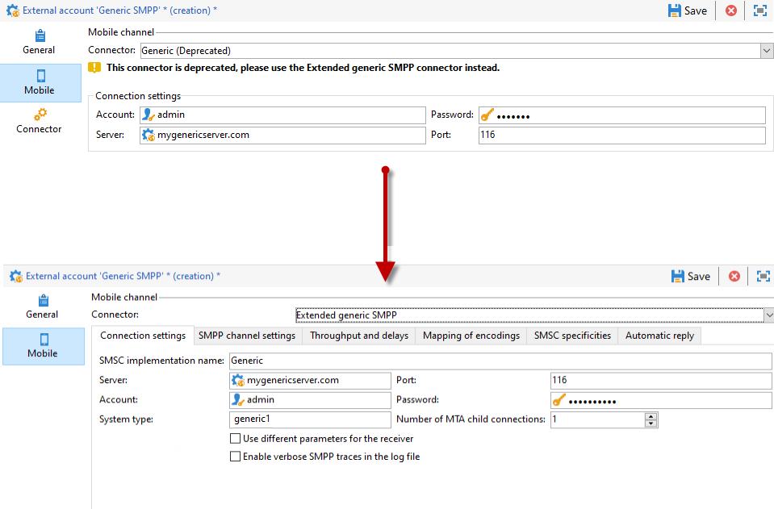
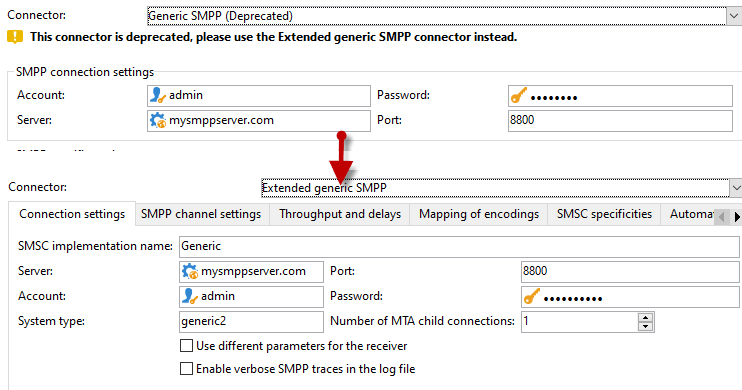

# Migrate unsupported SMS connector to the Extended Generic SMPP connector{#unsupported-connector-migration}

As of release 20.2, legacy connectors are deprecated. This document will help you migrate connectors that are still running on the old system to the recommended SMPP connector.

>[!CAUTION]
>
>This migration is not mandatory but recommended by Adobe and will ensure you are running on the latest supported version of the software.

## About SMS connectors {#about-sms-connectors}

The following connectors are deprecated as of release 20.2:

* **[!UICONTROL Generic SMPP]** (SMPP version 3.4 supporting binary mode)
* **[!UICONTROL Sybase365]** (SAP SMS 365)
* **[!UICONTROL CLX Communications]**
* **[!UICONTROL Tele2]**
* **[!UICONTROL O2]**
* **[!UICONTROL iOS]**

Deprecated capabilities are still available and supported, but they will not be further enhanced. We recommend using the **[!UICONTROL Extended generic SMPP]** connector.

For more information on deprecated and removed features, refer to this [page](deprecated-features.md).

Old SMS connectors are using the Java SMS connector that overloads the web process. Migrating to the new **[!UICONTROL Extended Generic SMPP]** connector will move this load to the MTA which can support it.

## Migrating to the Extended Generic SMPP connector {#migrating-extended-generic-smpp}

>[!CAUTION]
>
>Even if you can transpose the parameters, configuring the **[!UICONTROL Extended Generic SMPP]** connector requires you to talk with your provider who will give you the information needed to fill in the rest of the parameters. For more on this, refer to this [page](sms-protocol.md).

First, you will need to create a new **[!UICONTROL Extended Generic SMPP]** external account and then you might be able to transpose some of the parameters. You can find the detailed steps in this [page](sms-channel.md#creating-an-smpp-external-account).

You now need to fill in the parameters from the **[!UICONTROL Mobile]** tab of your newly created **[!UICONTROL Extended Generic SMPP]** external account depending on your previous connector.

### From the Generic connector {#from-generic-connector}

When choosing the **[!UICONTROL Generic]** connector, you should have a custom JavaScript connector which will adapt to each situation.

If you know that this connector is already using the SMPP protocol then you can migrate to the **[!UICONTROL Extended Generic SMPP]** connector. If not, check with your provider if they support the SMPP protocol and set up a new connector with the help of a consultant.

From your **[!UICONTROL Generic]** connector, you can transpose to your newly created **[!UICONTROL Extended SMPP]** account:

In the **[!UICONTROL Connection Settings]** tab:

* **[!UICONTROL Account]**
* **[!UICONTROL Password]**
* **[!UICONTROL Server]**
* **[!UICONTROL Port]**

### From the Generic SMPP connector {#from-generic-smpp-connector}

From your Generic SMPP connector, you can transpose to your newly created Extended SMPP account:

In the Connection Settings tab:

Account
Password
Server
Port
System Type
In the SMPP Channel Settings tab:

Source number
Source NPI
Destination NPI
Source TON
Destination TON
In the Mapping of Encoding tab:

Outbound SMS coding
In the SMSC specifities tab:

Coding when sending corresponds to ID Format in MT acknowledgement
Coding when receiving corresponds to ID Format in the SR

### From the Sybase365 connector {#from-sybase}

From your Sybase365 connector, you can transpose to your newly created Extended SMPP account:

In the Connection Settings tab:
Account
Password
Server
Port
System Type
From CLX connector
clx
From your CLX connector, you can transpose to your newly created Extended SMPP account:
In the Connection Settings tab:

Account
Password
Server
Port
System Type
In the SMPP Channel Settings tab:

Source number
In the SMSC specifities tab:

Coding when sending corresponds to ID Format in MT acknowledgement
Coding when receiving corresponds to ID Format in the SR

### From the Tele2 connector {#from-tele2}

From your Tele2 connector, you can transpose to your newly created Extended SMPP account:
In the Connection Settings tab:

Account
Password
Server
Port
System Type
In the SMPP Channel Settings tab:

Source number
Source NPI
Destination NPI
Source TON
Destination TON
In the Mapping of Encoding tab:

Outbound SMS coding

### From the O2 connector {#from-O2}

From your O2 connector, you can transpose to your newly created Extended SMPP account:

In the Connection Settings tab:

Account
Password
Server
Port
System Type
In the SMPP Channel Settings tab:

Source number
Source NPI
Destination NPI
Source TON
Destination TON