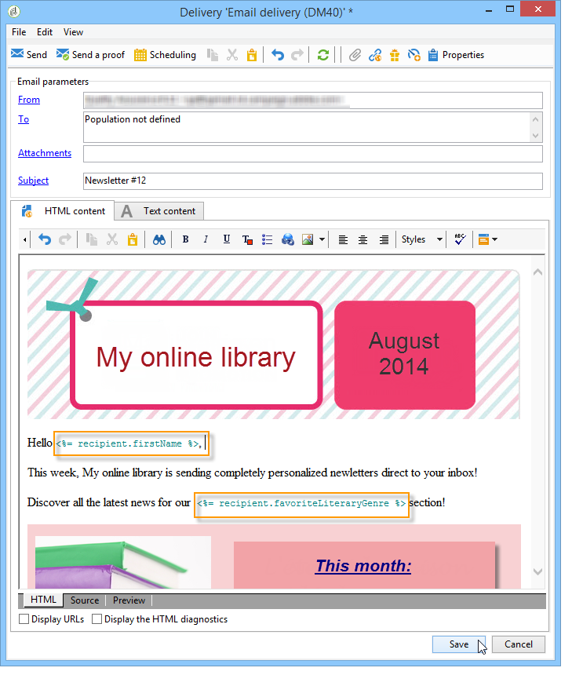
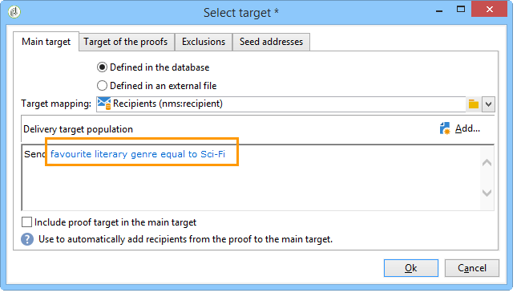
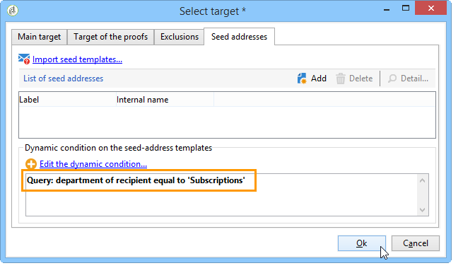
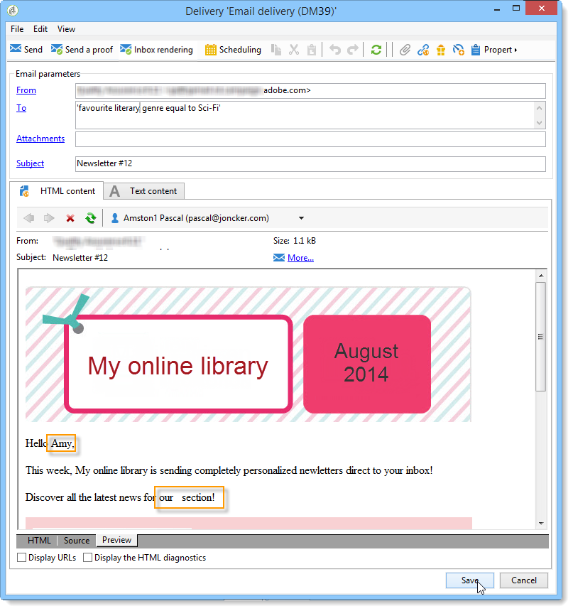
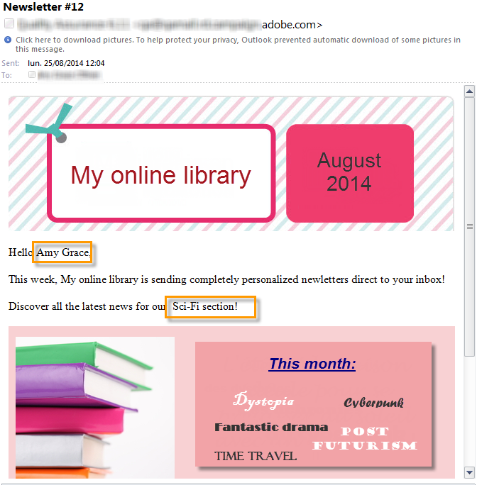

# Use case: configuring the field substitution{#use-case-configuring-the-field-substitution}

Random field substitution lets you attribute a value from the recipient list to the seed addresses that are empty when the user uses this value in a delivery (example: name, city, etc.).

This substitution lets you save time when creating the delivery: instead of manually adding the desired value to the seed addresses, the substitution randomly recovers this value in the list of recipients targeted by the delivery and applies it to the seed addresses.

## Context {#context}

In this use case, the site **My online library** would like to send a discount to its clients, based on their favorite literary genre.

The delivery manager has integrated a personalization field linked with favorite genre into his email. He would like to use some seed addresses. These seed addresses have the personalization field in their table but no value is saved there.

To use the random field substitution you must have:

* a delivery with one or several personalization fields,
* seed addresses whose **data schema** is modified according to the personalization fields used in the delivery.

## Creating a delivery {#step-1---creating-a-delivery}

The steps for creating a delivery are detailed in the [Creating an email delivery](creating-an-email-delivery.md) section.

In this example, the delivery manager has created the newsletter.


## Editing the seed addresses data schema {#editing-the-seed-addresses-data-schema}

The instructions on how to modify a data schema are detailed in the section.

In this example, the seed addresses data schema takes a value created from the recipients data schema:

```
 <attribute label="Favorite literary genre" length="80" name="favoriteLiteraryGenre"
               type="string" userEnum="favoriteLiteraryGenre"/>
```

This enumeration lets the user specify the favorite literary genre of their clients.

For this data schema modification to be viewable in the seed addresses **Input form**, you must update it. Refer to the [Updating the input form](use-case--selecting-seed-addresses-on-criteria.md#updating-the-input-form) section.

## Configuring personalization {#configuring-personalization}

1. Open a delivery.

   In this example, the delivery has two personalization fields: the recipient's **first name** and the recipient's **favorite literary genre**.

   

1. Configure your delivery list and your seed addresses. Refer to [Identifying target populations](steps-defining-the-target-population.md).

   In this example, the user selects users whose **favorite literary genre** is Sci-Fi as the main target population.

   

   The user adds seed addresses to the delivery.

   

   >[!NOTE]
   >
   >For more information on the **[!UICONTROL Edit the dynamic condition...]** link, refer to [Use case: selecting seed addresses on criteria](use-case--selecting-seed-addresses-on-criteria.md).

1. Click the **[!UICONTROL Preview]** tab then select a seed address to test the personalization.

   

   You can see that one of the personalization fields is empty. As the seed address does not have data for this field, the HTML content preview cannot display a value.

   Random substitution of fields is carried out **at the time of delivery**.

1. Click the **[!UICONTROL Send]** button.
1. Analyze your delivery then **confirm delivery**.

   The seed addresses receive the delivery in their inbox.

   Field personalization is effective.

   
