# Use case: creating content management{#use-case-creating-content-management}

To create content management in Adobe Campaign, the following steps are necessary:

* [Step 1 - Analyzing the content to be produced](#step-1---analyzing-the-content-to-be-produced),
* [Step 2 - Creating the data schema](#step-2---creating-the-data-schema),
* [Step 3 - Creating the input form](#step-3---creating-the-input-form),
* [Step 4 - Creating the construction template](#step-4---creating-the-construction-template),
* [Step 5 - Creating the publication template](#step-5---creating-the-publication-template),
* [Step 6 - Creating contents](#step-6---creating-contents).

## Step 1 - Analyzing the content to be produced {#step-1---analyzing-the-content-to-be-produced}

Before you start, you need to carry out a precise analysis of the content to be produced: identify the elements to display, study the constraints linked to them, define a type for each element, etc. You also need to differentiate static elements and variable ones.

For instance, to create a newsletter in HTML with the following type of content:

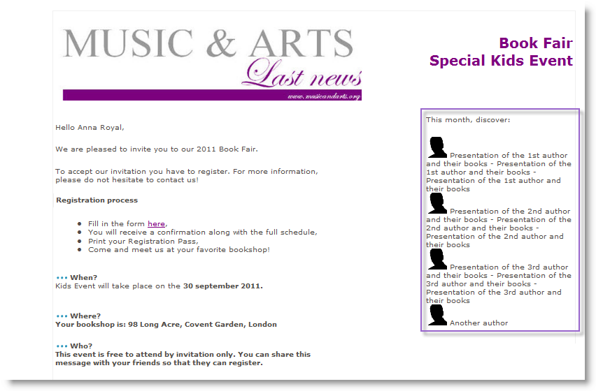

This newsletter contains three types of elements:

1. Variable elements, whose content is entered or selected by the user via an input form during delivery creation. 

   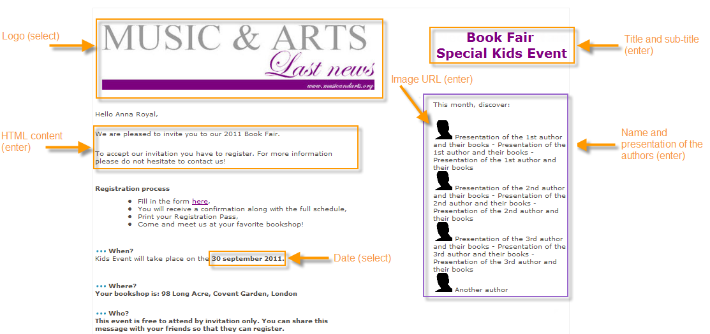

1. Personalization fields which are entered dynamically based on the information saved in the database (the recipient's first and last name in this case).

   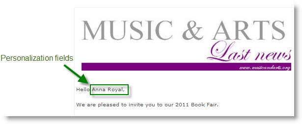

1. Static elements, which are the same for all newsletters.

   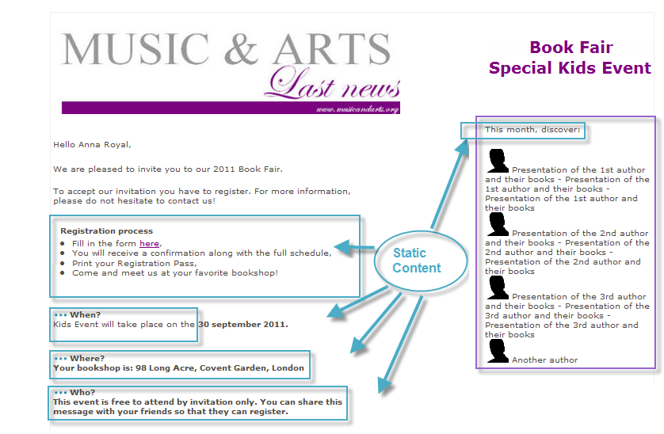

The various elements of this newsletter are put together based on the rules defined in a JavaScript template which references all the elements to be inserted and conceptualizes their layout.

These elements are created via a dedicated schema which specifies the following elements for each content: name, label, type, size, as well as any other information relevant to its processing in Adobe Campaign.

## Step 2 - Creating the data schema {#step-2---creating-the-data-schema}

A data schema is an XML document associated with content. It describes the XML structure of the data in this content.

>[!NOTE]
>
>For more on creating and configuring data schemas in Adobe Campaign, please refer to [this section](../../configuration/using/about-schema-edition.md).
>
>Configuration elements specific to content management are detailed in [Data schemas](../../delivery/using/data-schemas.md).

To create a data schema, apply the following steps:

1. Open the Adobe Campaign Explorer and select the **[!UICONTROL Administration > Configuration > Data schemas]** node.

   Click the **[!UICONTROL New]** icon located above the list of data schemas.

1. Select the **[!UICONTROL Create a schema]** option for content management, then click **[!UICONTROL Next]**.

   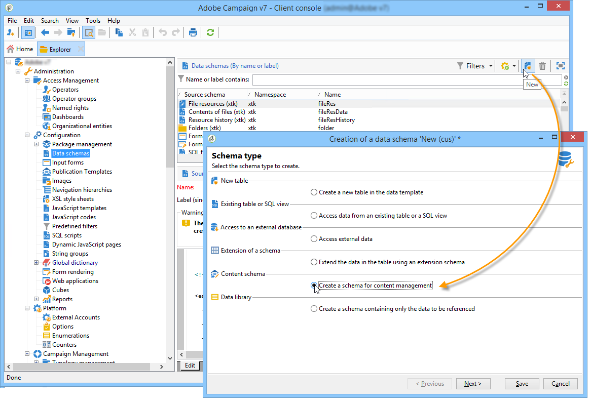

1. Enter the name and label of the schema in the appropriate fields. You can add a description and link a specific image if necessary.

   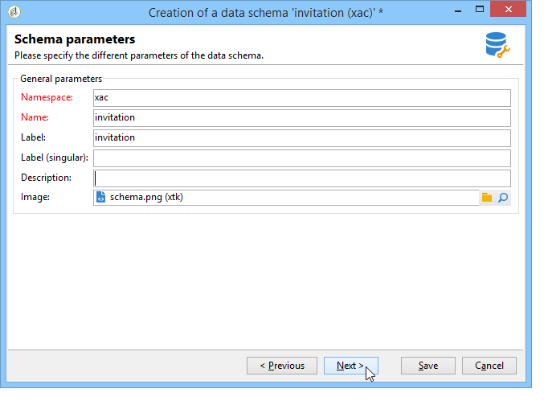

   Click **[!UICONTROL Next]** to validate.

1. Enter the content of the schema in the **[!UICONTROL Edit schema]** window.

   Use the **[!UICONTROL Insert]** button to create the schema content.

   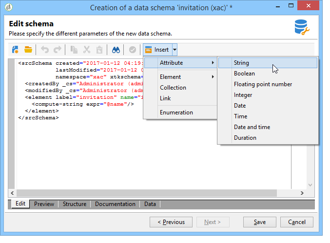

   For more on this, refer to [Editing schemas](../../delivery/using/data-schemas.md#editing-schemas).

   For each element referenced in the content, you need to select a matching type.

   In this example the identified contents, their format and their type are:

  <table> 
 <thead> 
  <tr> 
   <th> <strong>Content</strong> <br /> </th> 
   <th> <strong>Format</strong> <br /> </th> 
   <th> <strong>Type</strong> <br /> </th> 
   <th> <strong>Label</strong> <br /> </th> 
  </tr> 
 </thead> 
 <tbody> 
  <tr> 
   <td> Title<br /> </td> 
   <td> Attribute<br /> </td> 
   <td> String<br /> </td> 
   <td> Title<br /> </td> 
  </tr> 
  <tr> 
   <td> Sub-title<br /> </td> 
   <td> Attribute<br /> </td> 
   <td> String<br /> </td> 
   <td> Name<br /> </td> 
  </tr> 
  <tr> 
   <td> Event date<br /> </td> 
   <td> Attribute<br /> </td> 
   <td> Date<br /> </td> 
   <td> Date<br /> </td> 
  </tr> 
  <tr> 
   <td> Introduction paragraph<br /> </td> 
   <td> Element<br /> </td> 
   <td> HTML<br /> </td> 
   <td> Overview<br /> </td> 
  </tr> 
  <tr> 
   <td> Photo of the author<br /> </td> 
   <td> Attribute<br /> </td> 
   <td> String<br /> </td> 
   <td> URL<br /> </td> 
  </tr> 
  <tr> 
   <td> Author<br /> </td> 
   <td> Element<br /> </td> 
   <td> Memo<br /> </td> 
   <td> Author<br /> </td> 
  </tr> 
  <tr> 
   <td> Header logo (stored in Adobe Campaign public resources)<br /> </td> 
   <td> Attribute<br /> </td> 
   <td> Link<br /> </td> 
   <td> Image<br /> </td> 
  </tr> 
 </tbody> 
</table>

   The schema will contain the following information:

   ```
   <element label="Invitation" name="invitation" template="ncm:content" xmlChildren="true">
       <compute-string expr="@name"/>
       <attribute label="Title" length="40" name="title" type="string"/>
       <element label="Presentation" name="presentation" type="html"/>
       <attribute label="Date" name="date" type="date"/>
       <attribute label="Name" length="10" name="name" type="string"/>
       <attribute label="URL" name="url" type="string"/>
       <element label="Author" name="author" type="memo"/>
       <element label="Image" name="image" target="xtk:fileRes" type="link"/>
     </element>
   ```

1. Click **[!UICONTROL Save]** to create the data schema.

## Step 3 - Creating the input form {#step-3---creating-the-input-form}

The input form lets you edit a content instance via an input interface from the Adobe Campaign client console.

The description of a form is a structured XML document that observes the grammar of the "xtk:form" form schema.

>[!NOTE]
>
>For more on creating and configuring forms in Adobe Campaign, refer to [this section](../../configuration/using/identifying-a-form.md). 
>
>Configuration elements specific to content management are detailed in [Input forms](../../delivery/using/input-forms.md).

To create an input form for content management, apply the following steps:

1. Open the Adobe Campaign Explorer and select the **[!UICONTROL Administration > Configuration > Input forms]** node.

   Click the **[!UICONTROL New]** icon above the list of forms.

1. Enter the name of the form and the label linked to the form, then select the **[!UICONTROL Content management]** type.

   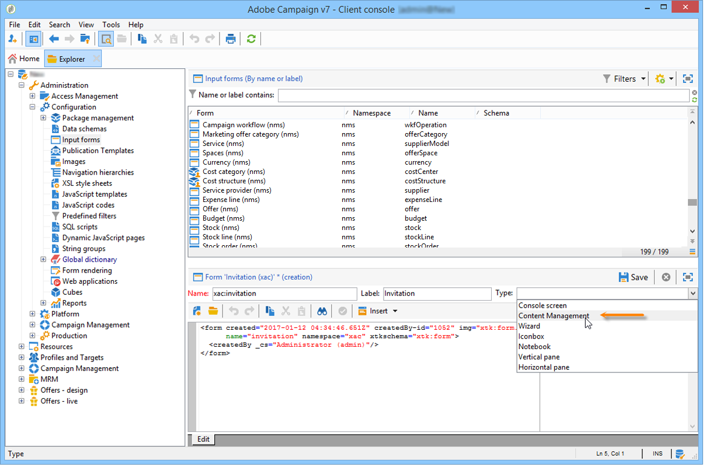

   >[!NOTE]
   >
   >To enable both elements to match up automatically, we recommend using the same name as for the linked data schema. Use the **[!UICONTROL Insert]** button above the input zone to add fields from the schema linked to the form.

   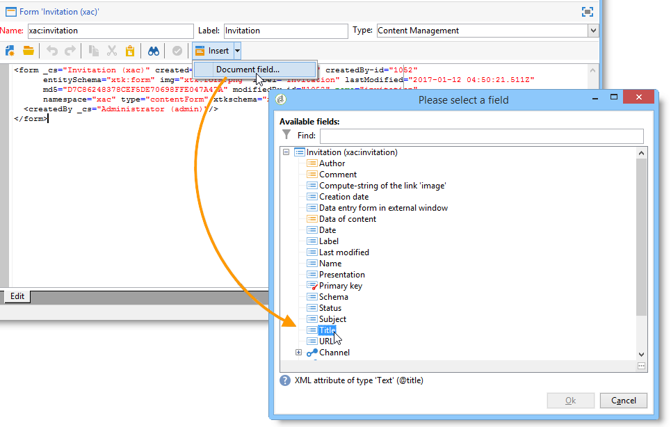

1. In the middle section of the editor, specify the fields you want to display in the input form.

   In this example, we will have the following type of information:

   ```
    <input xpath="@title"/>
     <input xpath="@date"/>
     <input xpath="presentation"/>
     <input xpath="@name"/>
     <input xpath="@url"/>
     <input xpath="author"/>
     <input img="nl:sryimage.png" newEntityFormChoice="true" xpath="image">
       <sysFilter>
         <condition expr="@isImage = true"/>
       </sysFilter>
     </input>
   ```

   The **[!UICONTROL Preview]** tab lets you check the rendering of the form while you are editing it:

   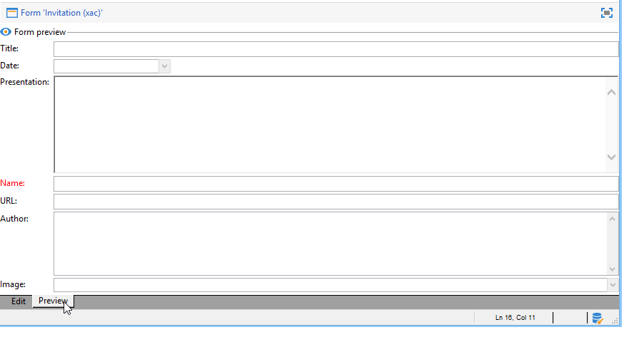

1. Click **[!UICONTROL Save]** to create the input form.

## Step 4 - Creating the construction template {#step-4---creating-the-construction-template}

The XSLT language lets you transform an XML document into another output document. This transformation is described in XML in a document called a stylesheet.

In this example, we want to use a JavaScript template to define the data construction and layout mode in the generated document.

>[!NOTE]
>
>Constraints linked to document building (JavaScript or XSL template) are detailed in [Formatting](../../delivery/using/formatting.md).

To use a JavaScript template in Adobe Campaign, apply the following steps:

1. Open the Adobe Campaign Explorer and select the **[!UICONTROL Administration > Configuration > JavaScript Templates]** node.

   Click the **[!UICONTROL New]** icon above the list of templates.

1. Enter a template name and select the schema which you have created for content management.
1. Import the set content which you want to display in the message.

   Add the variable elements while respecting the syntax detailed in [JavaScript templates](../../delivery/using/formatting.md#javascript-templates).

   To display the content shown in our example, the JavaScript template must contain the following elements:

   ```
   <html>
   <% eval(xtk.javascript.load("xac:perso").data); %>
   <head>
     <title>Invitation to an exceptional dedication session</title>
   </head>
   <body link="#0E59AE" vlink="#0E59AE" alink="#0E59AE" style="background-color:white;">
       <table width="546" border="0" align="center" cellpadding="0" cellspacing="0" style="border-left: solid 1px gray;border-top: solid 1px gray;border-right: solid 1px gray;">
         <tr>
           <td colspan="3">
             <%= generateImgTag(content.@["image-id"]) %>
           </td>
         </tr>
       </table>
       <table width="546" border="0" align="center" cellpadding="0" cellspacing="0" style="border-left: solid 1px gray;border-right: solid 1px gray;">
         <tr>
           <td>
             <table border="0" cellspacing="0" cellpadding="5">
               <tr>
                 <td width="10"> </td>
                 <td style="padding-top:2em; padding-bottom:2em;" width="730" align="middle">
                   <b>
                     <font style="font-family:Verdana, Arial, Helvetica, sans-serif; font-size:14px; color:#800080;">
                       <span style="FONT-VARIANT: small-caps"><%= content.@title %> - <%= content.@name %></span>
                     </font>
                   </b>
                 </td>
                 <td width="10"> </td>
               </tr>
               <tr>
                 <td width="10"> </td>
                 <td style="padding-top:1em; padding-bottom:1em;" width="730">
                   <font style="font-family:Verdana, Arial, Helvetica, sans-serif; font-size:11px; color:#666666;">
                     Hello <%= perso('recipient.firstName') %> <%= perso('recipient.lastName') %>,
                     <p>
                       <%= content.presentation %>
                     </p>               
                     <center>
                       <b><%= formatDate(content.@date, "%2D %Bl %4Y") %></b> come to our Book Fair and meet our favorite authors and illustrators.<br>
                       <br>
                       <a href="https://www.site.web.com/registration" target="_blank"><b>REGISTER</b></a>
                     </center>
                   </font>
                 </td>
                 <td width="10"> </td>
               </tr>
               <tr>
                 <td width="10"> </td>
                 <td style="padding-top:1em; padding-bottom:1em;" width="730">
                   <font style="font-family:Verdana, Arial, Helvetica, sans-serif; font-size:11px; color:#666666;">
                    " width="70" height="70">
                     <b><%= content.author %></b>, will be signing their book between 2
   and 5:30PM.
                   </font>
                 </td>
                 <td width="10"> </td>
               </tr>            
                   <tr>
                 <td width="10"> </td>
                 <td width="730">
                   <font style="font-family:Verdana, Arial, Helvetica, sans-serif; font-size:11px; color:#666666;">                  
                 </td>
                 <td width="10"> </td>
               </tr>           
               <tr>
                 <td width="10"> </td>
                 <td>
                   <font style="font-family:Verdana, Arial, Helvetica, sans-serif; font-size:11px; color:#666666;">
                     <center>
                       <p>
                         <a href="https://www.site.web.com/program" target="_blank"><span style="FONT-VARIANT: small-caps"><b>Program</b></span></a>
                          | 
                         <a href="https://www.site.web.com/information" target="_blank"><span style="FONT-VARIANT: small-caps"><b>Useful information</b></span></a>
                          | 
                       <a href="https://www.site.web.com/registration" target="_blank"><span style="FONT-VARIANT: small-caps"><b>Register</b></span></a></p>
                       </center>
                     </font>
                   </td>
                   <td width="10"> </td>
                 </tr>
               </table>
               <br>
             </td>
           </tr>
         </table>
   </body>
   </html>
   ```

   Calling up a function at the start of a template lets you set up a call to personalization data taken from the Adobe Campaign database (in this case: recipient.firstName and recipient.lastName), so that it can be interpreted when used in a delivery. For more on this, refer to [Including a JavaScript template](../../delivery/using/formatting.md#including-a-javascript-template).

   In this example, the function will contain the following code:

   ```
   function perso(strPerso)
   {
     var strStart = '<' + '%' + '=';
     var strEnd = '%' + '>';
     return strStart + strPerso + strEnd;
   }
     function bloc(strPerso)
   {
     var strStart = '<' + '%' + '@ include view="';
     var strEnd = '" %' + '>';
     return strStart + strPerso + strEnd;
   }
   ```

   In order for the JavaScript template to be valid, this function must be created beforehand from the **[!UICONTROL JavaScript codes]** node in the tree structure, as below:

   

## Step 5 - Creating the publication template {#step-5---creating-the-publication-template}

The next step involves creating a content publication template to link up the schema, the form, and the content construction template. This publication template can have several output formats.

>[!NOTE]
>
>For more on content publication templates, refer to [Publication templates](../../delivery/using/publication-templates.md).

In this example, the steps are as follows:

1. Create a new publication template via the **[!UICONTROL Administration > Configuration > Publication templates]** node.
1. Enter a name and a label, and select the schema and form to be used.
1. Then enter the name of the template and choose the rendering mode you want to apply. Here, we have a **[!UICONTROL JavaScript]** type rendering based on the template created above.

   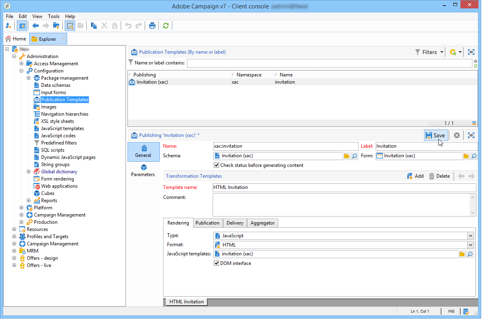

   >[!NOTE]
   >
   >The **[!UICONTROL DOM interface]** option is checked by default and this means that this document will not be accessible if you use the E4X syntax. The DOM interface must be used when this option is checked and is the recommended syntax.  
   >
   >You can still use the E4X syntax. If so, make sure to uncheck this option.

   Use the **[!UICONTROL Add]** button to create other transformation templates.

1. Click **[!UICONTROL Save]** to create the publication template.

## Step 6 - Creating contents {#step-6---creating-contents}

You may now create content based on this publication template.

>[!NOTE]
>
>For more on creating contents, refer to [Using a content template](../../delivery/using/using-a-content-template.md).

### Creating content in the delivery wizard {#creating-content-in-the-delivery-wizard}

To create content directly in the deliveries, apply the following steps:

1. Start by referencing the publication template via the **[!UICONTROL Advanced]** tab of the delivery properties.

   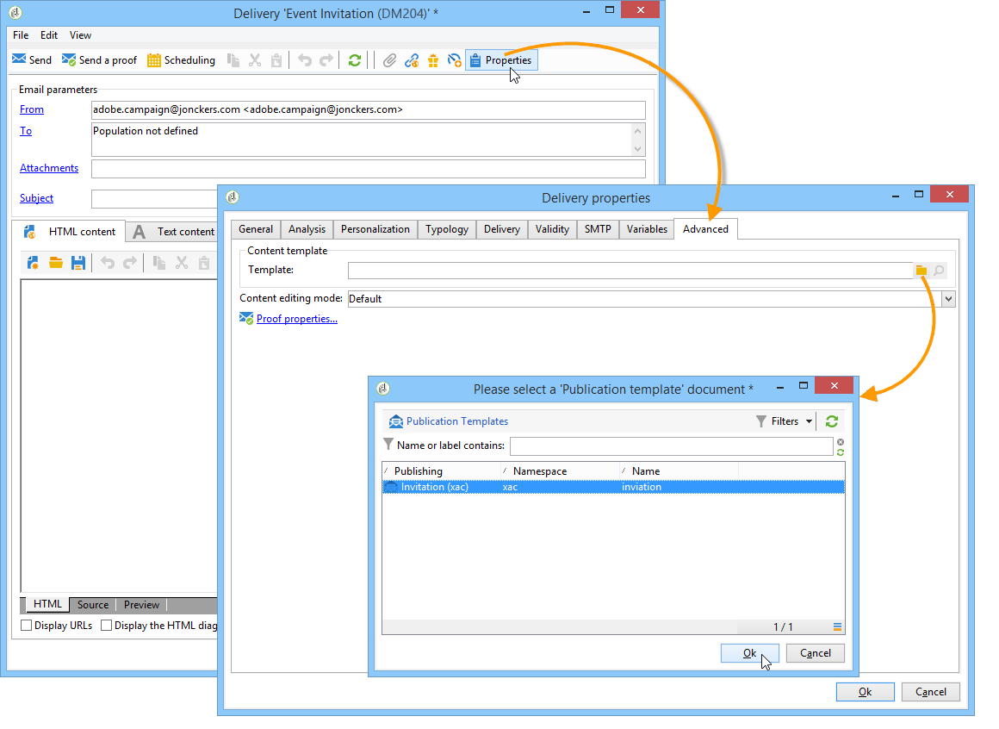

   An additional tab is added to the delivery wizard in order to define the content via the content management form.

1. Enter the variable information of your newsletter.

   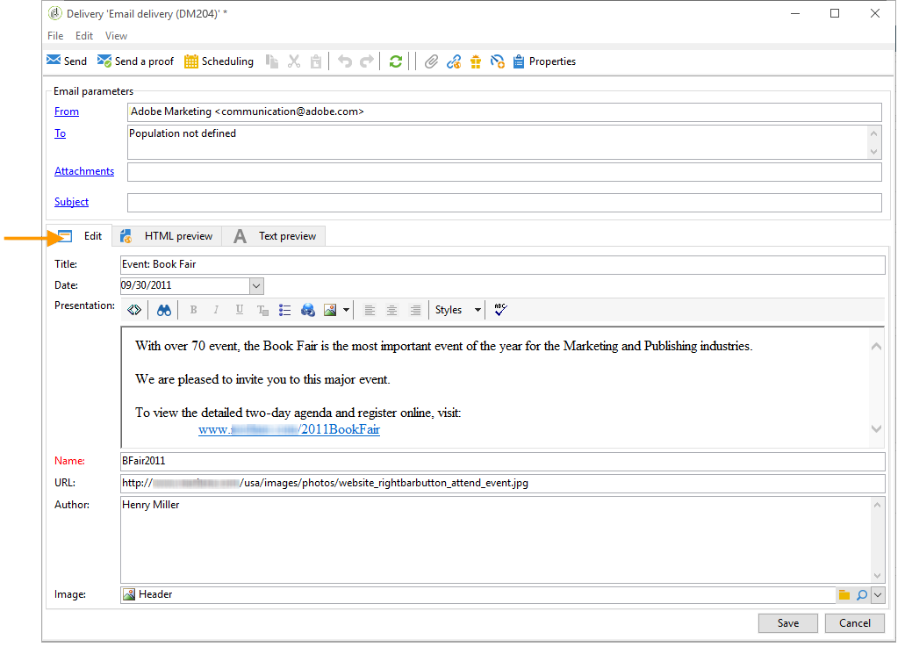

1. Click the **[!UICONTROL HTML preview]** tab to view the rendering. You need to select a recipient to test personalization.

   
