# Use case: selecting seed addresses on criteria{#use-case-selecting-seed-addresses-on-criteria}

In the framework of a delivery or a campaign, the **[!UICONTROL Edit the dynamic condition...]** link lets you choose seed addresses based on specific selection criteria.

In this use case, the site **My online library** would like to personalize its newsletters according to its clients' literary tastes.

In conjunction with the purchasing department, the user in charge of deliveries has created a newsletter for subscribers that have purchased police novels.

To share the final result of their collaboration with them, the delivery manager decides to add his colleagues from the purchasing department to the delivery as seed addresses. Using a dynamic condition lets you save time on configuring and updating addresses.

To use the dynamic condition, you must have:

* a delivery ready to be sent,
* seed addresses that have a common value. This value can be a field that already exists in Adobe Campaign. In this example, the seed addresses share the "Purchasing" value in the "Department" field, which is not present in the application by default.

## Step 1 - Creating a delivery {#step-1---creating-a-delivery}

The steps for creating a delivery are detailed in the [Creating an email delivery](creating-an-email-delivery.md) section.

In this example, the delivery manager has created the newsletter and selected the recipients.

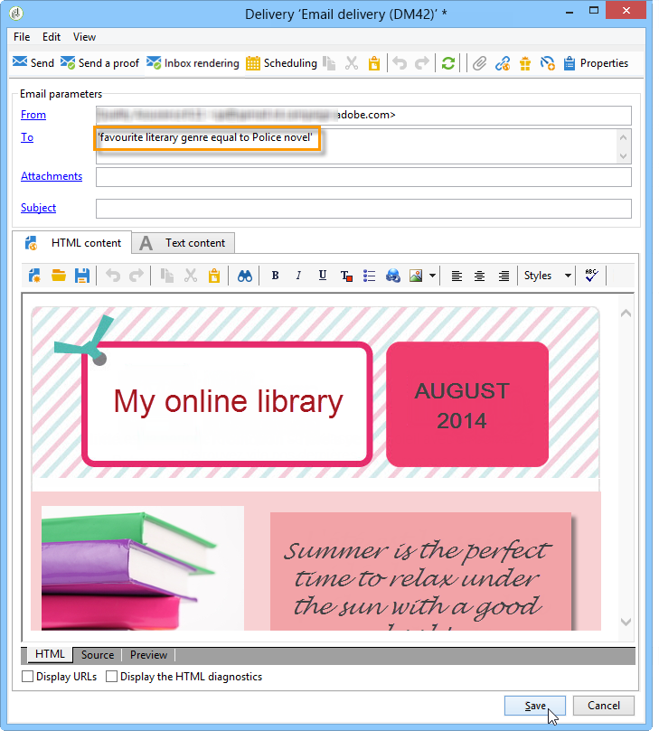

## Step 2 - Creating a common value {#step-2---creating-a-common-value}

To create a common value like the one in our example (Purchasing department), you must first extend the **data schema** of your seed addresses and edit the associated input form.

### Extending the data schema {#extending-the-data-schema}

For further details on schema extensions, refer to the [Configuration guide](../../configuration/using/data-schemas.md).

1. In the **[!UICONTROL Administration > Configuration > Data schemas]** node, click the **[!UICONTROL New]** icon.
1. In the **[!UICONTROL Creation of a data schema]** window, select the **[!UICONTROL Extension of a schema]** option and click **[!UICONTROL Next]**.

   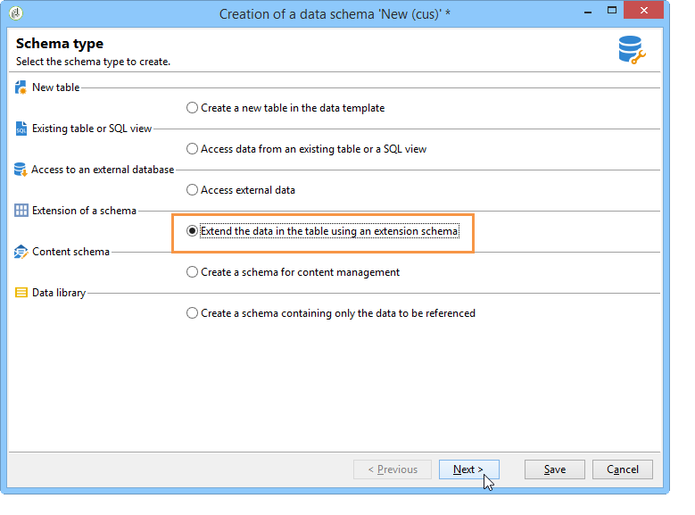

1. Select the **[!UICONTROL Seed addresses]** source schema, enter **doc** as the **[!UICONTROL Namespace]** and click **[!UICONTROL Ok]**.

   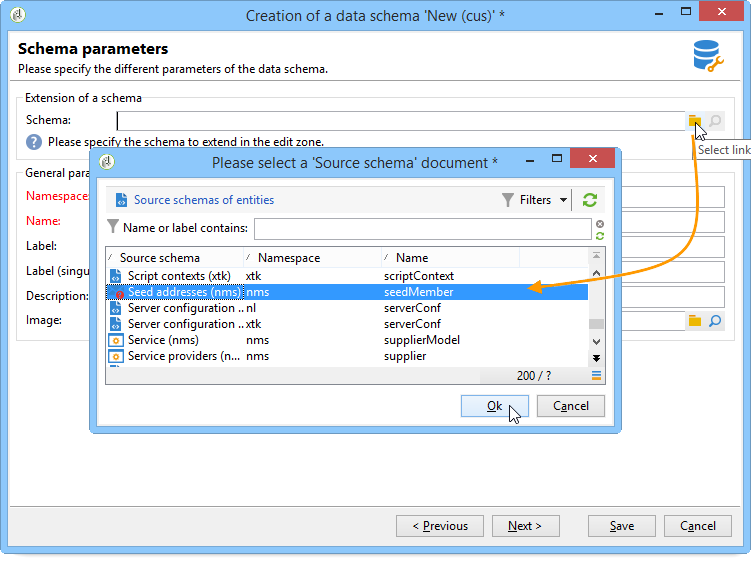

1. Click **[!UICONTROL Save]**.
1. In the schema editing window, copy the lines below and paste them in the area indicated in the screenshot.

   ```
     <element name="common">
       <element label="Recipient" name="custom_nms_recipient">
         <attribute label="Department" length="80" name="workField" template="nms:recipient:recipient/@company"
                    type="string" userEnum="workField"/>
       </element>
     </element>
   ```

   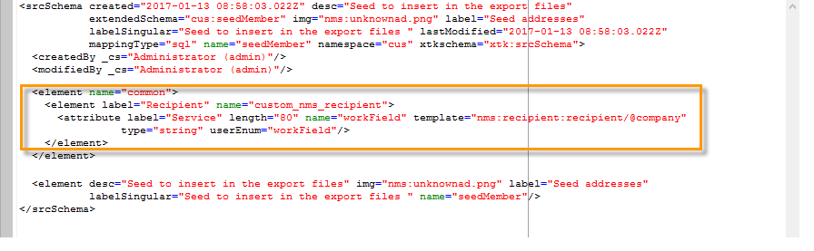

   Then copy the following lines and paste them under the **[!UICONTROL Seed to insert in the export files]** element.

   ```
       <element aggregate="doc:seedMember:common">
     </element>
   ```

   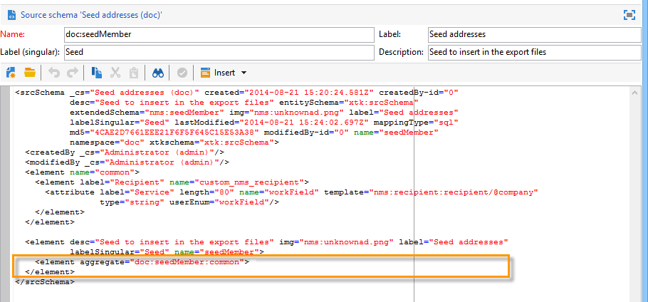

   In this case, you are specifying that a new enumeration named **[!UICONTROL Department]** has been created in the seed address table, and it is based on the standard **[!UICONTROL @company]** enumeration template (labeled under the name **Company** in the seed address form).

1. Click **[!UICONTROL Save]**.
1. In the **[!UICONTROL Tools > Advanced]** menu, select the **[!UICONTROL Update database structure]** option.

   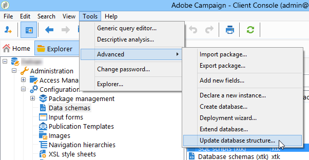

1. When the update wizard is displayed, click the **[!UICONTROL Next]** button to access the Edit tables window: changes carried out in the seed address data schema require a structure update.

   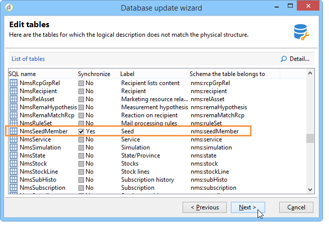

1. Follow the wizard until you come to the page to run the update. Click the **[!UICONTROL Start]** button.

   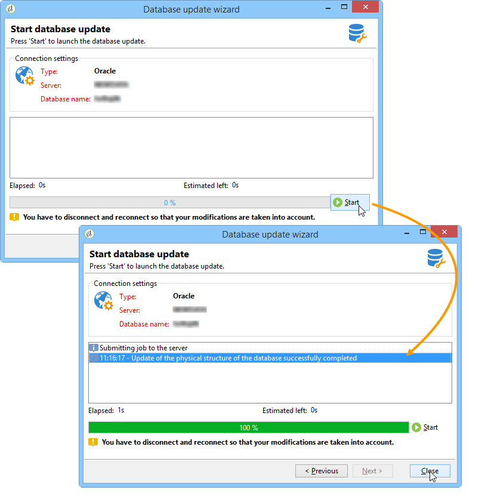

   Once the update has finished, you can close the wizard.

1. Disconnect then reconnect to Adobe Campaign. The changes made in the seed address data schema are now effective. In order for them to be visible from the seed address screen, you must update the associated **[!UICONTROL Input form]**. Refer to the [Updating the input form](#updating-the-input-form) section.

#### Extending the data schema from a linked table {#extending-the-data-schema-from-a-linked-table}

The seed addresses data schema can use values from a table linked to the recipient data schema - Recipient (nms).

For example, the user would like to integrate the **[!UICONTROL Internet Extension]** found in the **[!UICONTROL Country]** table that is linked to the recipients schema.

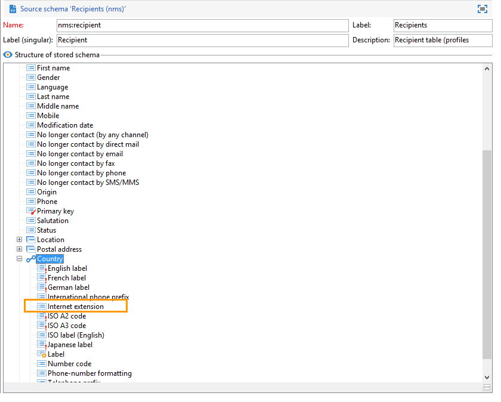

They therefore must extend the seed addresses data schema as detailed in the section. However, the lines of code to integrate at **step 4** are as follows:

```
<element name="country">
      <attribute label="Internet Extension" length="2" name="iana" type="string"/>
      <attribute label="Country ISO" length="2" name="countryIsoA2" type="string"/>
    </element>
```

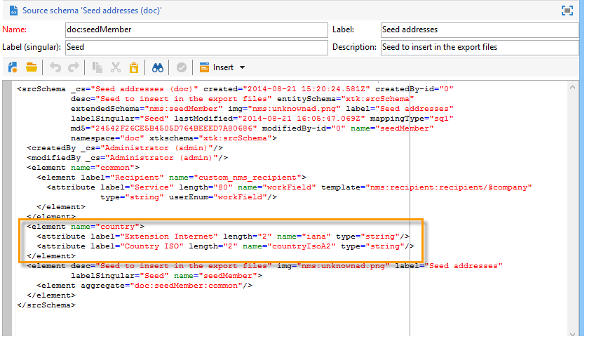

They indicate:

* that the user wants to create a new element named **[!UICONTROL Internet Extension]**,
* that this element comes from the **[!UICONTROL Country]** table.

>[!CAUTION]
>
>In the linked table name, you must specify the **xpath-dst** of said linked table.
>
>This can be found in the **[!UICONTROL Country]** element in the recipients table.

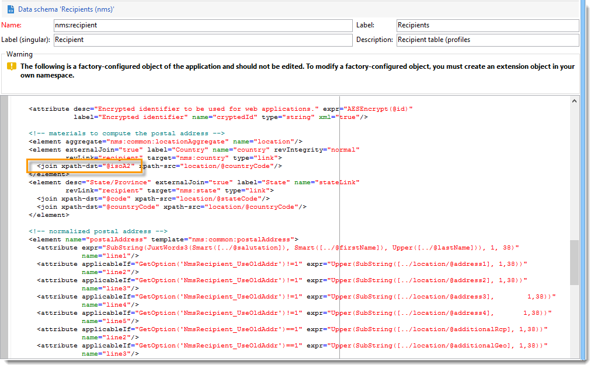

The user can then follow from **step 5** of the section, and update the **[!UICONTROL Input form]** of the seed addresses.

Refer to the [Updating the input form](#updating-the-input-form) section.

#### Updating the input form {#updating-the-input-form}

1. In the **[!UICONTROL Administration > Configuration > Input forms]** node, find the seed addresses input form.

   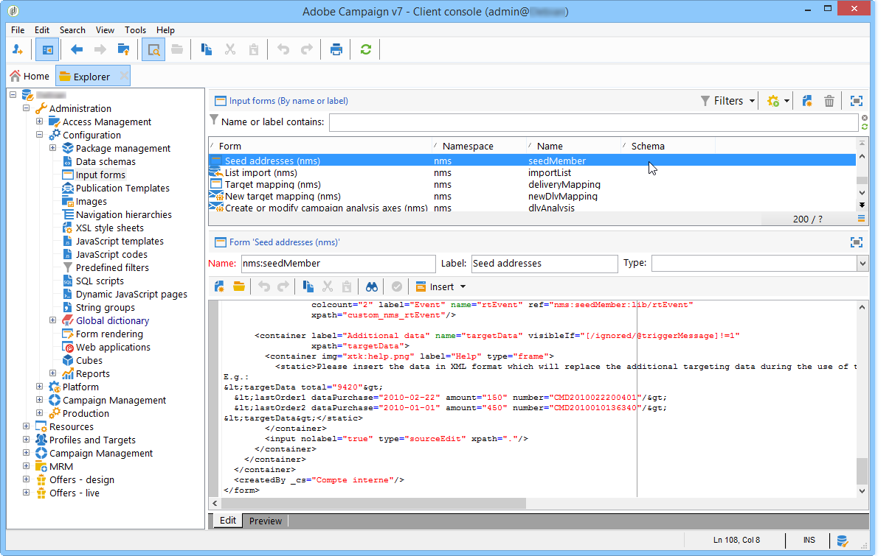

1. Edit the form and insert the following line in the **[!UICONTROL Recipient]** container.

   ```
   <input xpath="@workField"/>
   ```

   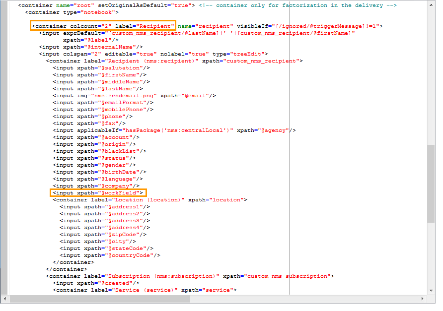

1. Save your changes.
1. Open a seed address. The **[!UICONTROL Department]** field appears in the **[!UICONTROL Recipient]** table.

   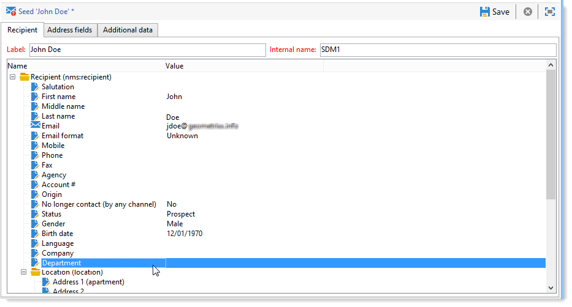

1. Edit the seed addresses that you want to use for the delivery and enter **Purchasing** as the value in the **[!UICONTROL Department]** field.

## Step 3 - Defining the condition {#step-3---defining-the-condition}

You can now specify the dynamic condition of the seed addresses for the delivery. To do this:

1. Open a delivery.

   

1. Click the **[!UICONTROL To]** link then the **[!UICONTROL Seed addresses]** tab to access the **[!UICONTROL Edit the dynamic condition...]** link. 

   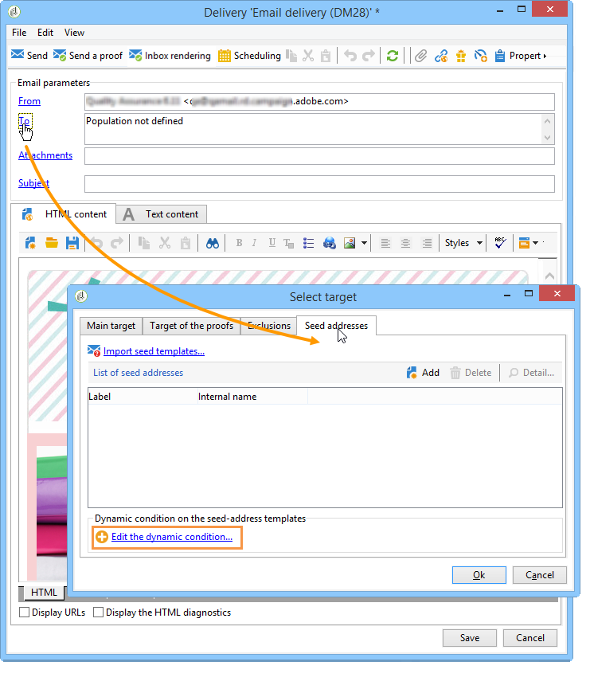

1. Select the expression that lets you choose the seed addresses you want. Here the user selects the **[!UICONTROL Department (@workField)]** expression.

   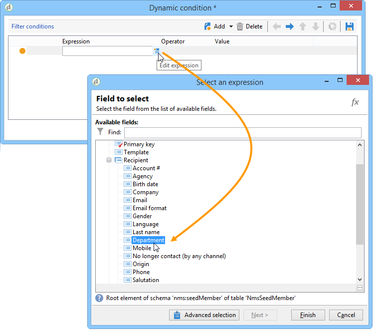

1. Select the value you would like. In this example the user selects the **Purchasing** department from the drop-down list of values.

   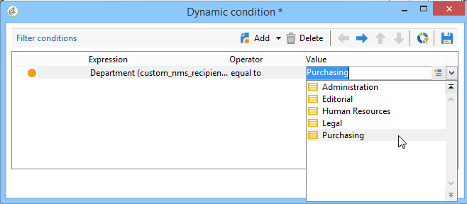

   >[!NOTE]
   >
   >The schema extension created earlier comes from the **recipient** schema. The values displayed on the screen above come from an enumeration of the **recipient** schema.

1. Click **[!UICONTROL Ok]**.

   The query is displayed in the **[!UICONTROL Select target]** window.

   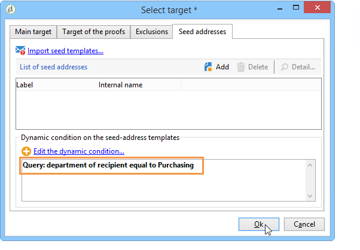

1. Click **[!UICONTROL Ok]** to approve the query.
1. Analyze your delivery then click on the **[!UICONTROL Delivery]** tab to access the delivery logs.

   The seed addresses of the purchasing department are displayed as pending delivery, just like those of the recipients or other seed addresses.

   

1. Click the **[!UICONTROL Send]** button to start the delivery.

   The members of the purchasing department make up part of your seed addresses that will receive the delivery in their email inbox.

   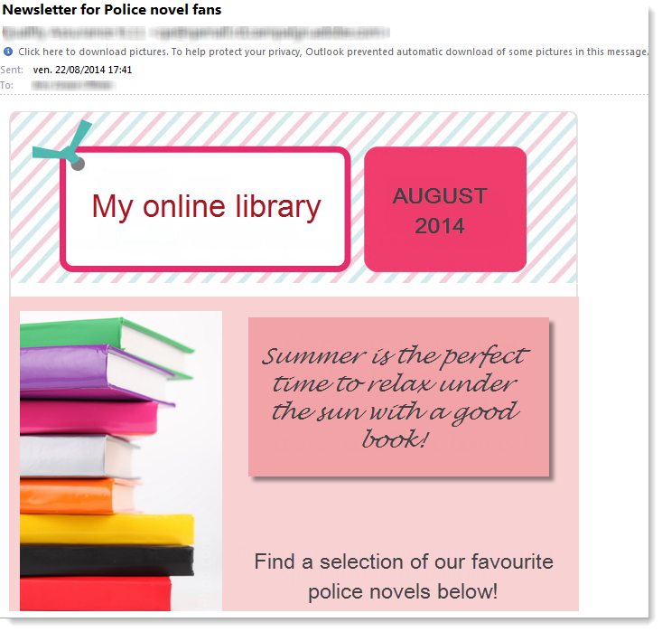
