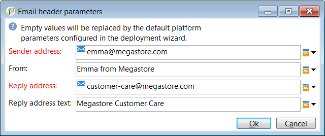
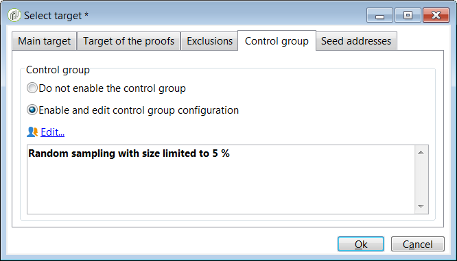

# Use templates {#use-templates}

Delivery templates allow for increased efficiency by providing ready-made scenarios for most common types of activities. With templates, marketers can deploy new campaigns with minimal customization in a shorter amount of time.

Learn more about delivery templates in [this section](../../delivery/using/creating-a-delivery-template.md).

## Get started with delivery templates {#gs-templates}

A [delivery template](../../delivery/using/creating-a-delivery-template.md) enables you to define once a set of technical and functional properties that suit your needs and that can be reused for future deliveries. You can then save time and standardize deliveries when needed.

When you manage several brands in Adobe Campaign, Adobe recommends having one sub-domain per brand. For example, a bank can have several sub-domains corresponding to each of its regional agencies. If a bank owns the bluebank.com domain, its sub-domains can be @ny.bluebank.com, @ma.bluebank.com, @ca.bluebank.com, etc. Having one delivery template per sub-domain enables you to always use the right pre-configured parameters for each of your brand, which avoids errors and saves you time.

**Tip**:  To avoid configuration errors in Campaign Standard, we recommend that you duplicate a native template and alter its properties rather than create a new template.

## Configure addresses

* The sender's address is mandatory to allow an email to be sent.

* Some ISPs (Internet Service Providers) check the validity of the sender address before accepting messages. 

* A badly formed address may result in it being rejected by the receiving server. You must make sure a correct address is given.

* The address must explicitly identify the sender. The domain must be owned by and registered to the sender.

* Adobe recommends creating email accounts that correspond to the addresses specified for deliveries and replies. Check with your messaging system administrator.

To configure addresses in Campaign interface, follow the steps below:

1. In the [delivery template](../../delivery/using/creating-a-delivery-template.md), click the **[!UICONTROL From]** link. In the **[!UICONTROL Email header parameters]** window, fill in the following fields:

    

1. In the **[!UICONTROL Sender address]** field, make sure the address domain is the same as the sub-domain that you delegated to Adobe. You can change the part preceding the '@' but not the domain address.

1. In the **[!UICONTROL From]** field, use a name that is easily identifiable by the recipients, such as your brand's name, to increase the opening rate of your deliveries. To further improve the recipient's experience, you can add a person's name, for example "Emma from Megastore".

1. In the **[!UICONTROL Reply address text]** fiels, the sender's address is used by default for replies. However, Adobe recommends using an existing real address such as your brand's customer care. In this case, if a recipient sends a reply, the customer care will be able to handle it.

### Set up a control group

Once the delivery is sent, you can compare the behavior of the excluded recipients with the recipients who did receive the delivery. You can then measure the efficiency of your campaigns. Learn more about control groups [this section](../../campaign/using/marketing-campaign-deliveries.md#defining-a-control-group).

To set up a control group, click the **[!UICONTROL To]** link. In the **[!UICONTROL Select target]** window, select the **[!UICONTROL Control group]** tab. You can extract a portion of the target, for example a 5% random sample.

   

## Use typologies to apply filters or control rules

A typology contains checking rules that are applied during the analysis phase, before sending any message.

In the **[!UICONTROL Typology]** tab of the template's properties, change the default typology according to your needs.

For example, to better control the outbound traffic, you can define which IP addresses can be used by defining one affinity per sub-domain and creating one typology per affinity. The affinities are defined in the instance's configuration file. Contact your Adobe Campaign administrator.

For more on typologies, refer to [this section](../../campaign/using/about-campaign-typologies.md).
