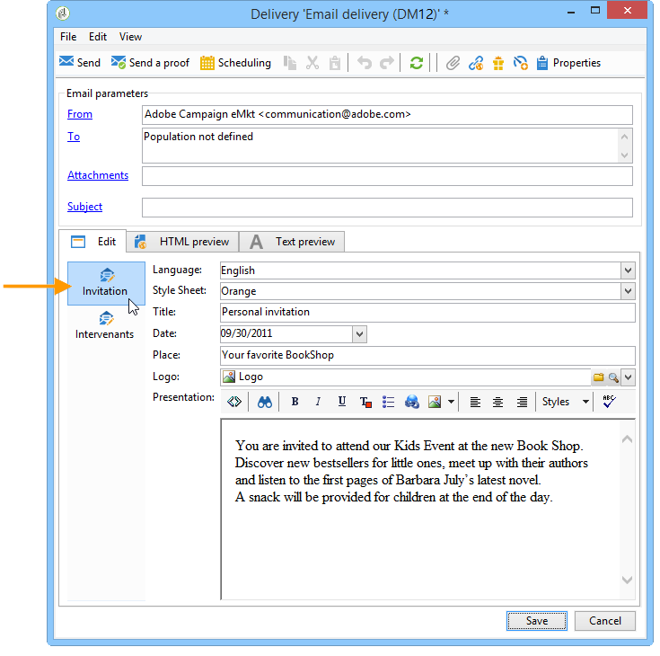
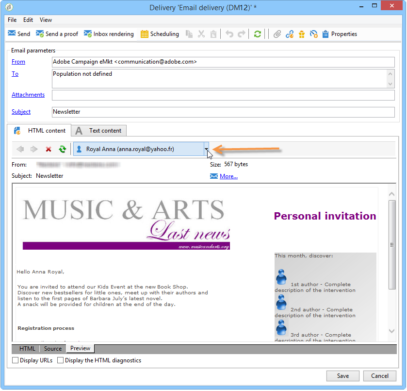
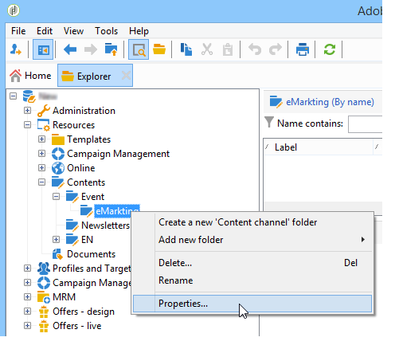
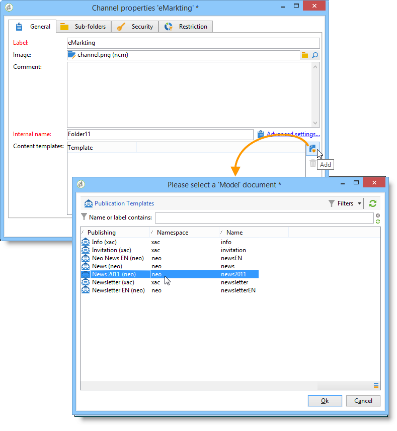
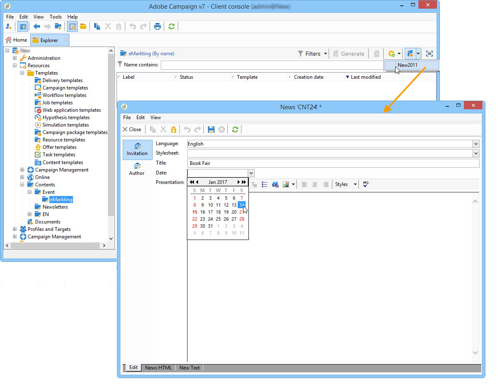
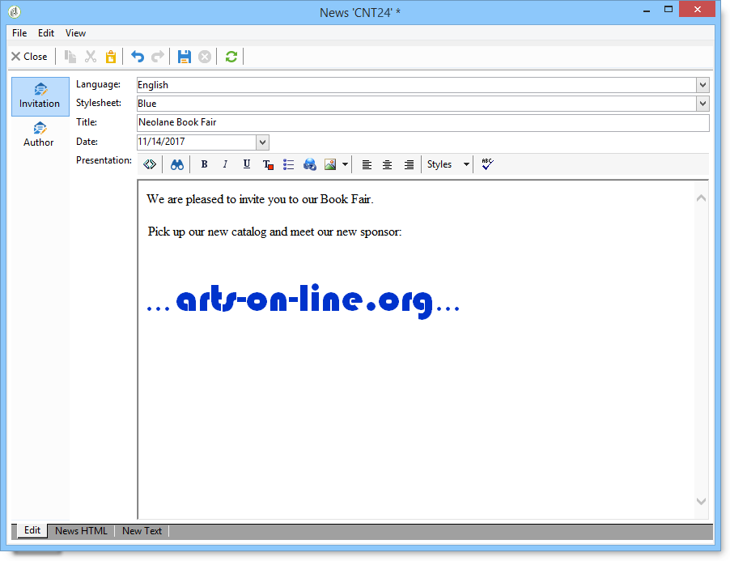
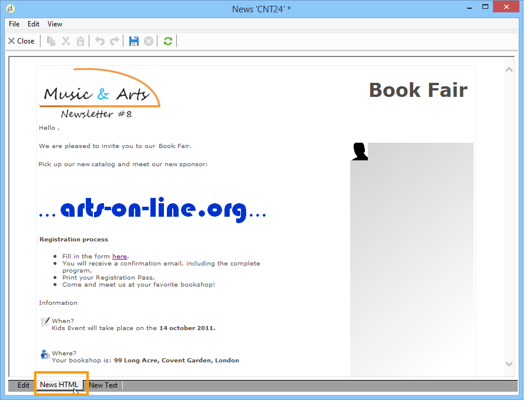
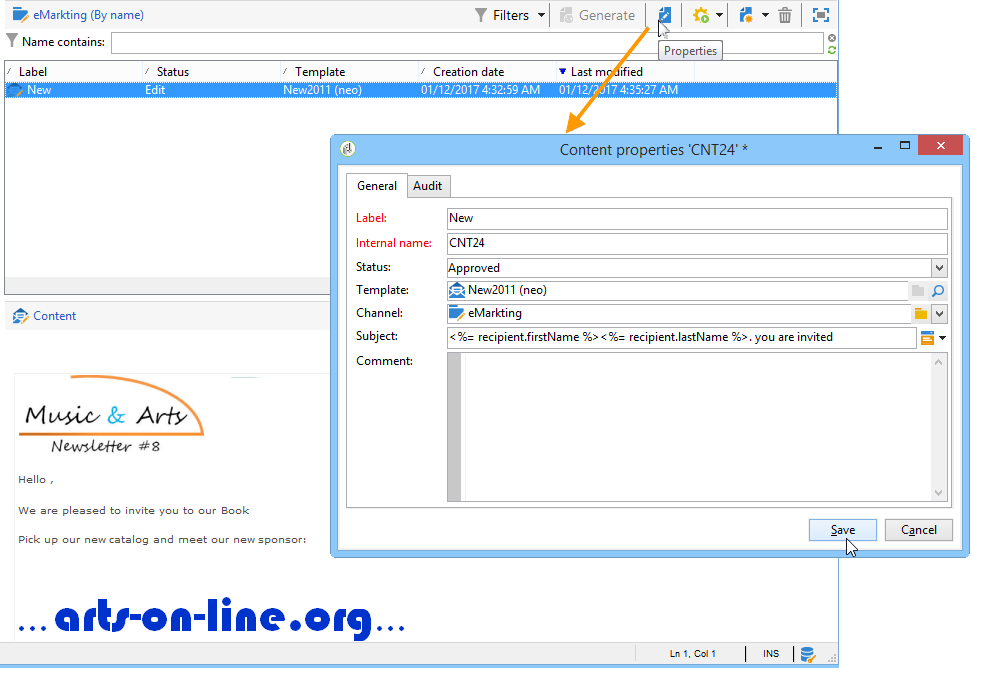
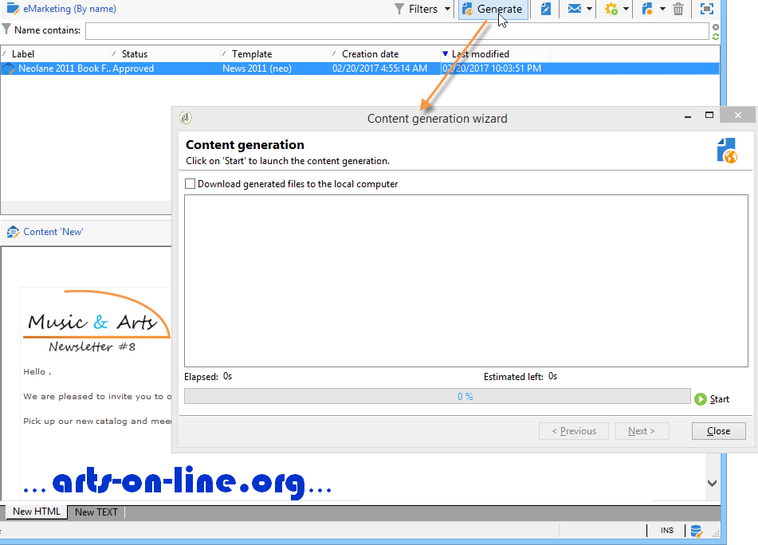
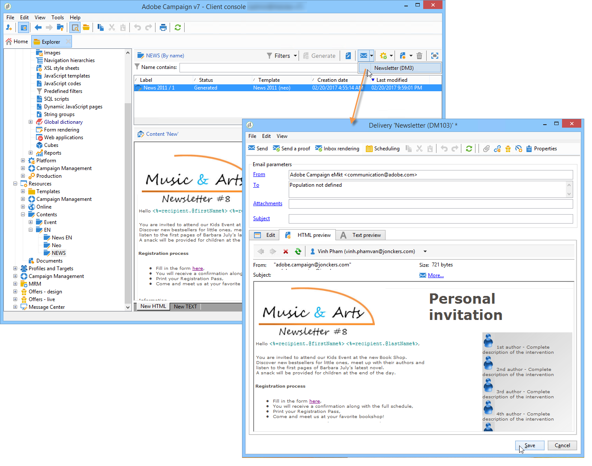

# Using a content template{#using-a-content-template}

## About content templates {#about-content-templates}

Content templates can be referenced and used in deliveries directly. Refer to [Creating a delivery via content management](#creating-a-delivery-via-content-management)

They can also be used to create content instances. Once they have been created, these instances are ready to be delivered (refer to [Delivering a content instance](#delivering-a-content-instance)) or exported (refer to [Creating a content instance](#creating-a-content-instance)).

## Creating a delivery via content management {#creating-a-delivery-via-content-management}

You can reference a content template in a delivery in view of using input fields to enter content. An additional tab is added to the delivery wizard for defining delivery content. 

The layout will be applied automatically based on the selected settings. To view it, click the **[!UICONTROL HTML preview]** (or **[!UICONTROL Text preview]** ) and select a recipient to test personalization elements.

For more on this, refer to the full implementation example: [Creating content in the delivery wizard](use-case--creating-content-management.md#creating-content-in-the-delivery-wizard).

## Creating a content instance {#creating-a-content-instance}

You can create contents directly in the Adobe Campaign tree to be used in workflows, exported, or injected straight into new deliveries.

Apply the following steps:

1. Select the **[!UICONTROL Resources > Contents]** node of the tree, right-click and choose **[!UICONTROL Properties]**.

   

1. Select the publication templates that will be active for this folder. 

   

1. You can now create new content using the **[!UICONTROL New]** button above the content list.

   

1. Enter the fields in the form.

   

1. Then click the **[!UICONTROL HTML preview]** tab to view the rendering. Here, the personalization fields taken from the database aren't entered.

   

1. Once it is created, the content is added to the list of available contents. Click the **[!UICONTROL Properties]** link to change its label, status, or view its history.

   

1. If necessary, once the content is approved it can be generated using the appropriate button on the toolbar.

   

   >[!NOTE]
   >
   >You can authorize the generation of non-approved contents. To do this, change the relevant option in the publication template. For more on this, refer to [Creating and configuring the template](publication-templates.md#creating-and-configuring-the-template).

   The HTML and Text contents are generated by default in the **publishing** folder of the Adobe Campaign instance. You can change the publication folder thanks to the **NcmPublishingDir** option.

## Delivering a content instance {#delivering-a-content-instance}

To create a content instance and deliver it, a delivery template needs to be linked to the publication template used to generate this content. For more on this, refer to [Delivery](publication-templates.md#delivery).

Moreover, the content storage folder must be dedicated to contents taken from this publication template (when a content folder enables you to generate several types of content, deliveries can't be created automatically).

To create the delivery automatically based on the selected content, click the **[!UICONTROL Delivery]** icon and choose the template.

Text and HTML contents are entered automatically.
