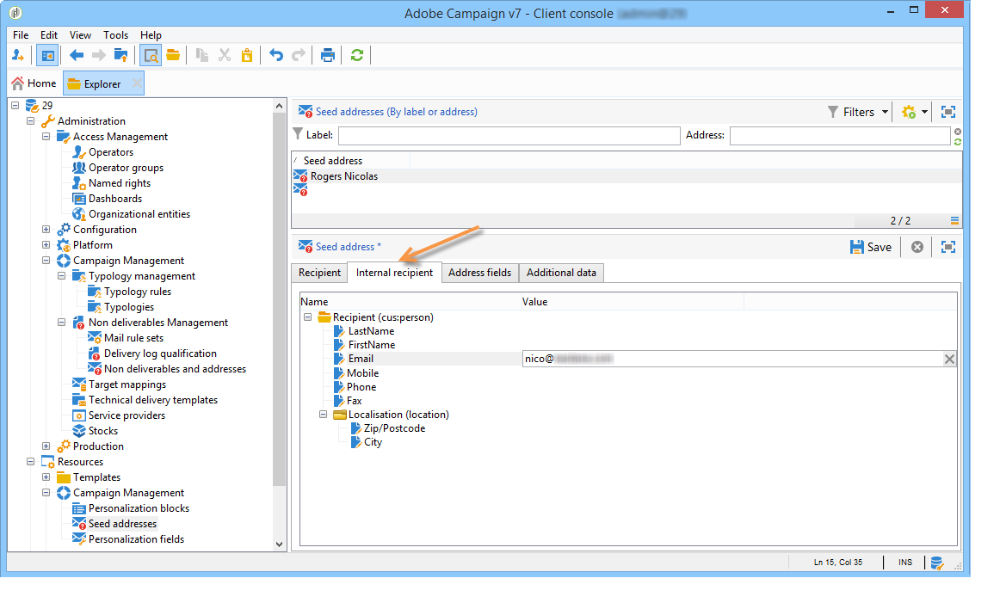
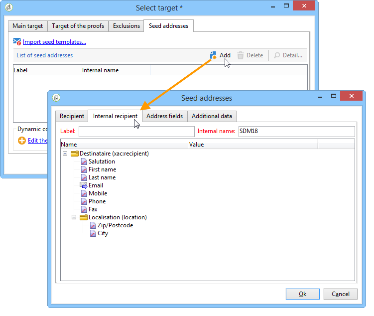

# Use an external recipient table{#using-an-external-recipient-table}

 

If the delivery table is an external table, you will need to make additional configurations. The **[!UICONTROL nms:seedmember]** schema must be extended. A tab is added to the seed addresses to define the adequate fields, as shown below:

In this case, to add seed addresses to the delivery, enter the adequate fields directly in the matching tab, or import the address templates:

The **nms:seedMember** schema extension is [this section](../../configuration/using/seed-addresses.md).
