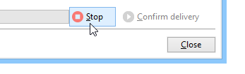
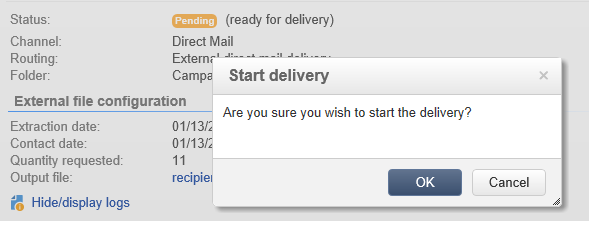

# Validating{#validating}

The execution of the delivery can be scheduled (in the calendar or a workflow) or launched manually.

To launch a delivery, edit it and click the **[!UICONTROL Send]** button. Select **[!UICONTROL Deliver as soon as possible]**.

Click **[!UICONTROL Next]** and then **[!UICONTROL Analyze]** to launch the delivery analysis.

The output file is then generated. Its content depends on the selected output columns (refer to [Extraction file](../../delivery/using/defining-the-direct-mail-content.md#extraction-file)).

>[!NOTE]
>
>The analysis phase is detailed in [Analyzing the delivery](../../delivery/using/key-steps-when-creating-a-delivery.md#analyzing-the-delivery).

You can stop this job at any time by clicking **[!UICONTROL Stop]**.

During the analysis phase, the file is generated but information concerning recipients (i.e. delivery logs) is not updated. You can therefore cancel this job without running any risks.

Check the result of the analysis and the content of the output file before clicking **[!UICONTROL Confirm delivery]**. A confirmation message lets you launch the delivery.

The send confirmation starts the data extraction in the specified file.

You can then close the wizard and look at the delivery logs via the **[!UICONTROL Delivery]** tab, accessible via the delivery details.

You can configure the delivery logs retrieval mode from the **[!UICONTROL Analysis]** tab of the delivery properties.

There are two modes:

* **[!UICONTROL Messages are considered sent after validation]** (default mode): in this function mode, all broadlogs are updated when the operator confirms the send (their status passes from 'Pending delivery' to 'Sent') and the delivery is automatically set to **[!UICONTROL Finished]**.
* **[!UICONTROL A file of results determines the messages that are sent and those that have failed]** : this mode allows you to update the broadlogs via an external file sent by the service provider. In this case, a workflow to process this information needs to be used in order to update the broadlog status.

  >[!NOTE]
  >
  >In this case, the delivery's status also needs to be changed to **[!UICONTROL Finished]** by the user as soon as the broadlogs are updated.
