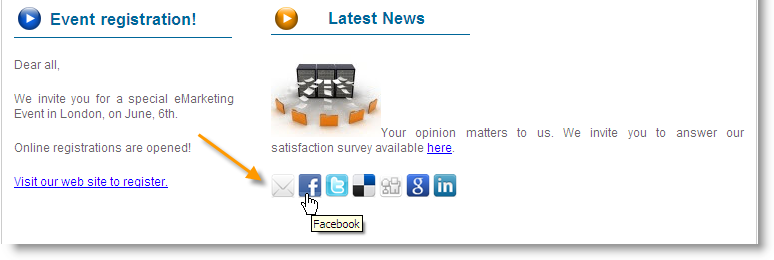
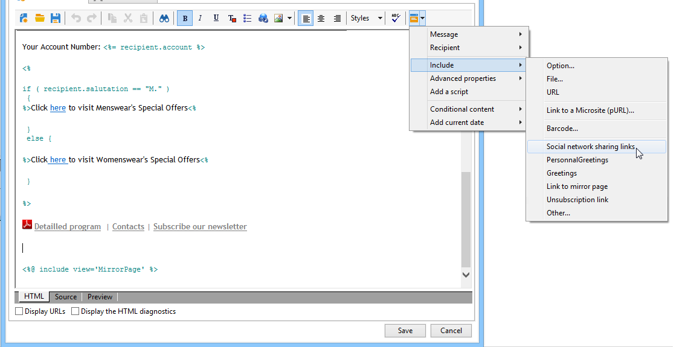
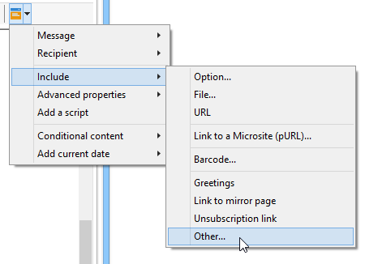
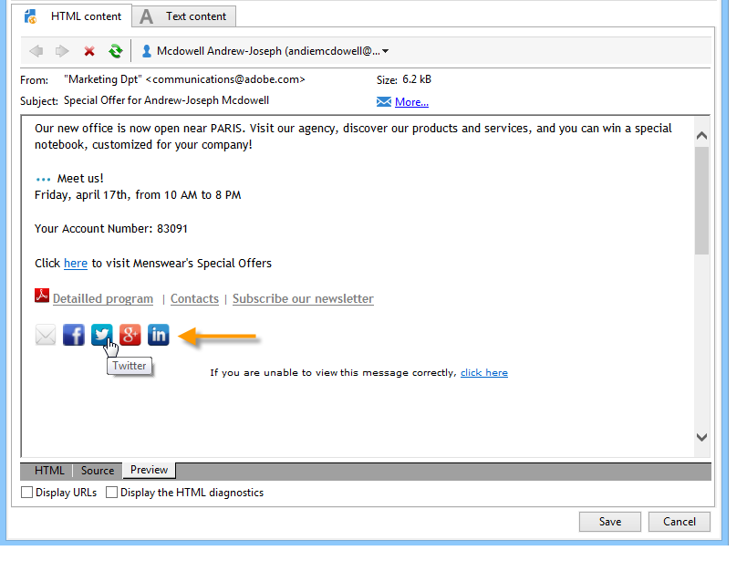
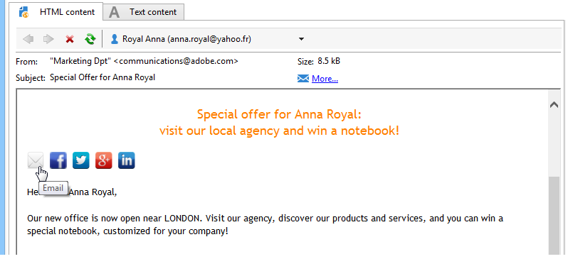
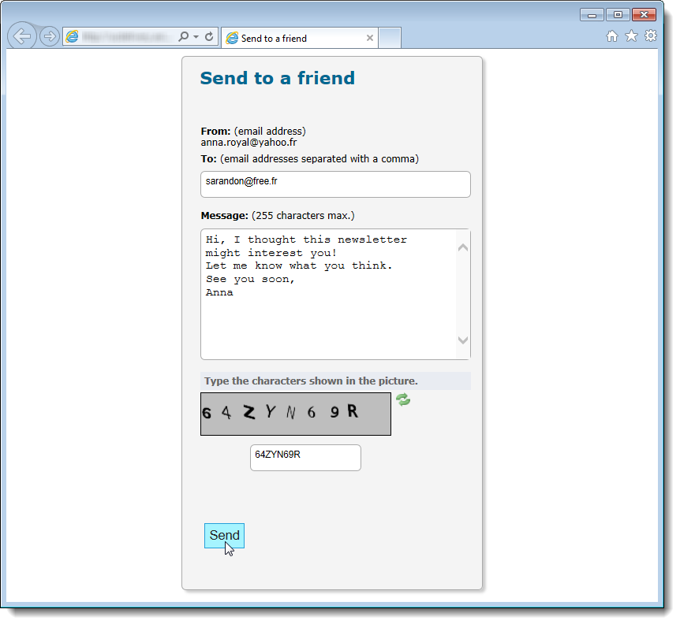
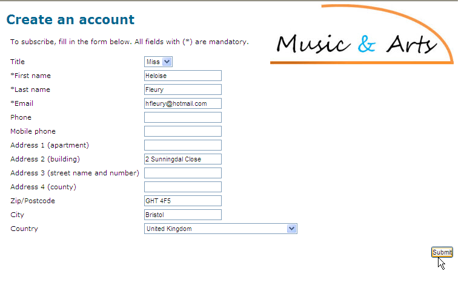
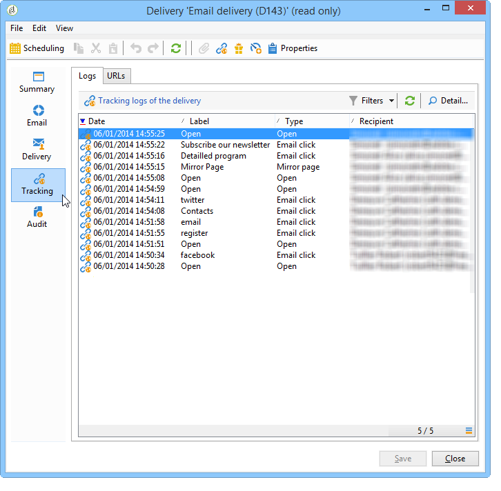
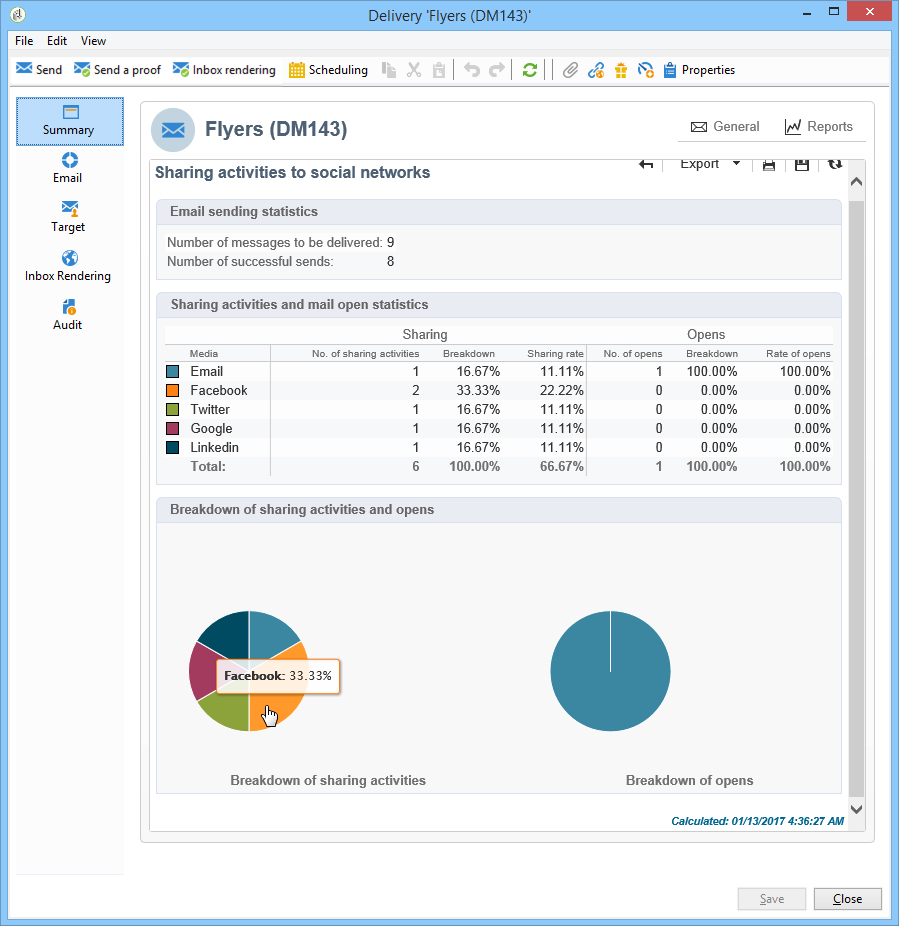

# Viral and social marketing{#viral-and-social-marketing}

## About viral marketing {#about-viral-marketing}

Adobe Campaign lets you set up tools to encourage viral marketing.

This lets delivery recipients or website visitors share information with their network: from adding a link to their Facebook or Twitter profile to sending a message to a friend.

>[!CAUTION]
>
>In order for added links to function properly, the matching mirror page must be available. To do this, include the link to the mirror page in the delivery.

## Social networks: sharing a link {#social-networks--sharing-a-link}

To enable delivery recipients to share the content of messages with members of their network, you need to include the matching personalization block.

>[!NOTE]
>
>By default, this link is not offered in the list of blocks. You can access it by clicking **[!UICONTROL Other...]**, and selecting the **[!UICONTROL Social network sharing links]** block.

Rendering will be as follows:

When the recipient clicks the icon of one of the social networks displayed, they are automatically redirected to their account and can share the message content via a link. This lets the members of their network access the communication.

>[!NOTE]
>
>This personalization block contains all links (for message sending and sharing with all social networks). It can be altered to meet your needs. However, configuration is reserved for advanced users. To edit the matching personalization block, go to the **[!UICONTROL Resources > Campaign management > Personalization blocks]** node of the Adobe Campaign tree.

## Viral marketing: forward to a friend {#viral-marketing--forward-to-a-friend}

A viral service allows referral-type actions to be carried out: these actions enable you to forward a message to a friend. The profile of the referee(s) is stored temporarily in the database (in a dedicated table). Forwarded messages include a link for the referee to subscribe: if they do, they will be added to the Adobe Campaign database.

Message forwarding is based on the same principles as social network links.

Apply the following stages:

1. Add the **[!UICONTROL Social network sharing links]** personalization block into the body of the original message.
1. The message recipient can click the **[!UICONTROL Email]** icon to send this message to one or more friends. 

   

   A referral form enables you to enter the email addresses of referees. 

   

   The message is sent to them when the main recipient clicks the **[!UICONTROL Next]** button.

   >[!NOTE]
   >
   >The content of this message can be personalized to meet your needs. It is created based on the **[!UICONTROL Transfer of original message]** template, which is stored in the **[!UICONTROL Administration > Campaign management > Technical delivery templates]** node.
   >
   >It is also possible to change the message forward form made available to the referrer To do this, you need to change the **Viral form** Web application stored in the **[!UICONTROL Resources > Online > Web applications]** node.

1. In the forwarded message, a link lets the referee save their profile in the database. An entry form is provided for this purpose. 

   

   >[!NOTE]
   >
   >This configuration can be adapted. To do this, you need to modify the **Recipient subscription** Web application stored in the **[!UICONTROL Resources > Online > Web applications]** node.
   >
   >For more information on Web applications, refer to [this section](../../web/using/about-web-applications.md).

   Once they validate, a confirmation message is sent to them: they will only be registered for good once they activate the link in the confirmation message. This message is created based on the **[!UICONTROL Registration confirmation]** template, which is stored in the **[!UICONTROL Administration > Campaign management > Technical delivery templates]** node.

   The referee is added to the **Recipients** folder of the database and is subscribed (by default) to the **Newsletter** information service.

## Tracking social network sharing {#tracking-social-network-sharing}

Sharing and access to shared information is tracked. This information collected by Adobe Campaign is accessible in two places:

* in the **[!UICONTROL Tracking]** tab of the delivery (or individually for each recipient):

  

* in a dedicated **[!UICONTROL Sharing to social networks]** report:

  
