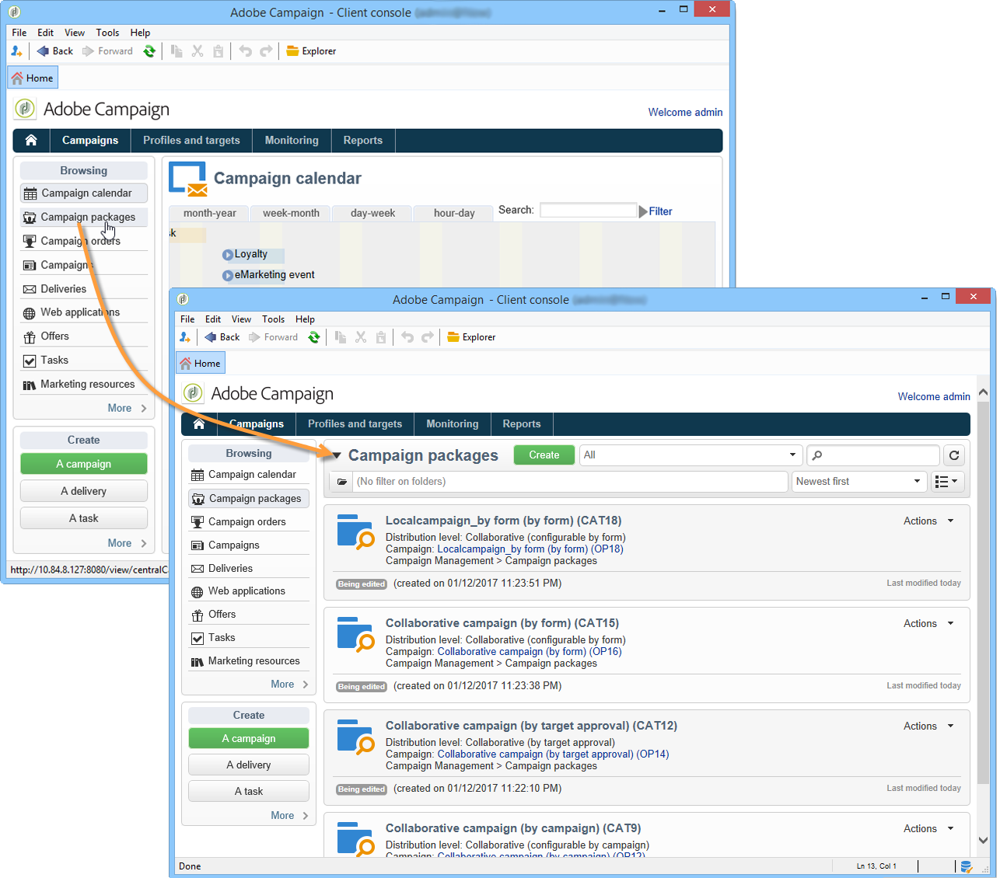
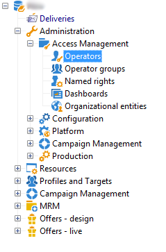
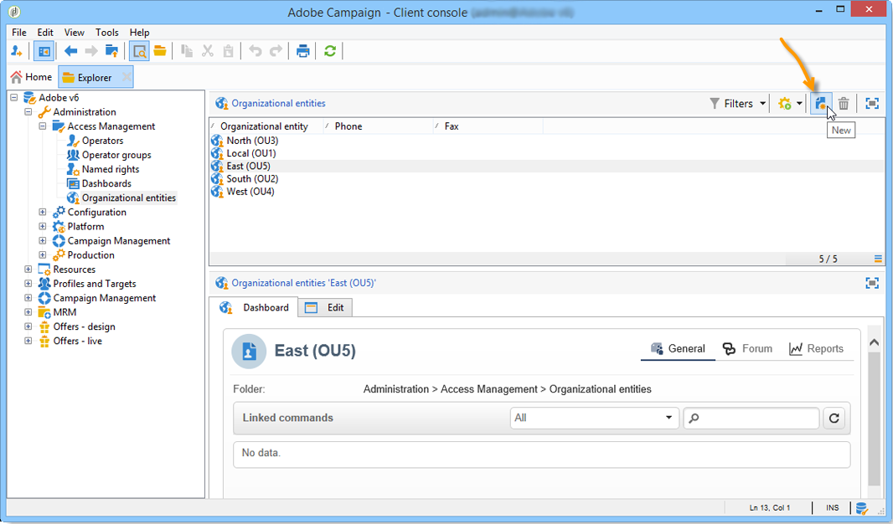

# Get started with distributed marketing{#about-distributed-marketing}

Adobe Campaign offers a **Distributed Marketing** application for implementing cooperative campaigns between central entities (headquarters, marketing departments, etc.) and local entities (sales points, regional agencies, etc.). This cooperation is based on a shared workspace known as the **[!UICONTROL list of campaign packages]**, where centrally created campaign templates and instances are offered to local entities.

The central entity provides campaigns that local entities may use. Campaigns are materialized by packages representing either local or collaborative campaigns. To use a campaign, the local entity must order it and the order must be approved.

>[!CAUTION]
>
>The Distributed Marketing module is a **Campaign** option. Please check your license agreement.

## Terminology {#terminology}

* **Central entities**

   Central entities are made up of marketing operators in charge of specifying communications and assisting local entities in executing their marketing campaign.

   The distributed marketing module allows the central entity to:

   * set up marketing campaign packages for local entities,
   * increase local entities' degree of autonomy regarding their choice in customer/prospect communication, targeting, content, etc.
   * manage and control costs, 
   * handle a network of agencies.

* **Local entities**

   Local entities can be agencies, stores or groups of specific local operators (country or regional managers, brand managers, etc.).

   Distributed Marketing allows local entities to have more autonomy while optimizing execution costs.

* **Localization**

   Localization is the capacity for a local entity to modify the target and content of a campaign. The possible level of localization depends on the type of campaign and its implementation.

* **List of campaign packages**

   The list of campaign packages contains the campaigns available to local entities.

* **Campaign package**

   Template (or campaign instance) created by a central entity and made available to a set of local entities.

* **Local campaign**

   A local campaign is an instance created from a template referenced in the list of **[!UICONTROL campaign packages]** with a **specific execution schedule**. Its aim is to meet a local communication need using a campaign template that was set up and configured by the central entity.

   The local entity's degree of autonomy depends on the implementation used.

   Refer to [Creating a local campaign](creating-a-local-campaign.md).

* **Collaborative campaign**

   A collaborative campaign is a campaign whose **execution schedule is defined** by the central entity, which the local entity may use. The content remains the same for each local entity but costs are shared. To take part, local entities subscribe to the collaborative campaign.

   * **[!UICONTROL Collaborative campaign (by form)]**: recommended for campaigns involving up to 300 local entities. The local entity can enter predefined parameters for targeting and content personalization in a web form. The form can be an Adobe Campaign form or an external form (extranet client). A functional administrator can define and configure the form based on a form template defined by the integrator. To order the campaign, the local entity just needs web access.
   * **[!UICONTROL Collaborative campaign (by campaign)]**: recommended for campaigns aimed at dozens of local entities. This type of campaign creates child campaigns for each local entity. Once the **[!UICONTROL collaborative campaign (by campaign)]** is approved by the central entity, the campaign is made available to the local entity, who can modify it. Execution is automatically synched between parent and child campaigns. The local entity must have access to an instance to order a campaign and participate in it.
   * **[!UICONTROL Collaborative campaign (by target approval)]**: recommended for campaigns aimed at several thousand local entities. Local entity receives a contact list that has been predefined by the central entity. The local entity decides whether or not to keep certain contacts based on the campaign content, via a web form. Local entities are deduced from the list of selected contacts. To participate in the campaign, the local entity just needs web access.
   * **[!UICONTROL Collaborative campaign (simple)]**: this mode ensures compatibility with the specific execution processes of previous versions.

   Refer to [Creating a collaborative campaign](creating-a-collaborative-campaign.md).

**Ordering campaign packages**

   If a local entity registers for a campaign this is made into an order which regroups all information relative to the campaign localization.

## Workspace {#workspace}

The list of campaign packages can be accessed from the **Campaigns** tab: click the **[!UICONTROL Campaign packages]** link.

This window allows all local operators to view the campaigns available for their local agency.

In the case of central agencies, this window displays all packages available in the list of campaign packages and offers additional links for editing the list.

## Operators and entities {#operators-and-entities}

Start by specifying the central and local entity operators via the **[!UICONTROL Access management]** folder.

### Operators {#operators}

You need to create central and local operators.

Central operators must belong to the **[!UICONTROL Central management]** operator group or have the **[!UICONTROL CENTRAL]** named right.

Local operators must belong to the **[!UICONTROL Local management]** operator group or have the **[!UICONTROL LOCAL]** named right. They must also be linked to their local entity.

### Organizational entities {#organizational-entities}

To create an organizational entity, click the **[!UICONTROL Administration > Access management > Organizational entities]** node and click the **[!UICONTROL New]** icon above the list of entities.

Each organizational entity contains identification information (label, internal name, contact information, etc.) and groups involved in the order approval process. These are defined in the **[!UICONTROL Notifications and approvals]** section found in the **[!UICONTROL General]** tab.

* Define a package notification group: operators in this group will receive a notification each time a new package is added to the list of campaign packages and each time a campaign becomes available.
* Select the group of reviewers in charge of approving orders, i.e. those in charge of approving campaigns ordered by the local entity.
* Finally, select the group of reviewers in charge of approving the local campaign (target, content, budget, etc.). This group may be added to when ordering a campaign, depending on the template.

>[!NOTE]
>
>The approval process is presented in the [Approval process](creating-a-local-campaign.md#approval-process) section.

## Implementation {#implementation}

Distributed Marketing campaigns are created and published by the central entity. They may be used by both local and central entities as needed.

The implementation procedure depends on the type of campaign package used and the local entity delegation levels.

### Integrator tasks {#integrator-side}

1. Create local entities.
1. Link recipients with the operators that manage local entities.

   

1. Specify rights and browsing rules for local entities
1. Specify the set of fields necessary for campaign localization:

    * target definition and maximum size,
    * content definition,
    * execution schedule (contact date and extraction date), **for local operators only**,
    * extension of order schema with all necessary additional fields.

1. Create a web form (Adobe or extranet) that allows you to display localization parameters, evaluate the target and budget, as well as preview the content and approve the order.

   For **collaborative campaigns (by target approval)**, create the table where the approvals for each local entity will be saved.

### Functional administrator tasks {#functional-administrator-side}

These steps must be carried out when creating each campaign.

1. Update the form with the fields used for campaign localization.
1. Create an instance from an appropriate campaign template (collaborative campaign) or duplicate the campaign template (local campaign).
1. Configure the campaign with the localization fields and the form reference.
1. Publish the campaign.

### Local operator tasks {#local-operator-side}

These steps must be carried out for each campaign.

1. Once you receive notification of the campaign package's availability, specify the campaign's location (optional).
1. Evaluate the target, the budget, etc.
1. Preview campaign content.
1. Order the campaign.
