# Creating a local campaign{#creating-a-local-campaign}

A local campaign is an instance created from a template referenced in the list of **[!UICONTROL campaign packages]** with a **specific execution schedule**. Its aim is to meet a local communication need using a campaign template that was set up and configured by the central entity. The main stages for implementing a local operation are as follows:

**For the central entity**

1. Creating a local campaign template.
1. Creating a campaign package from a template.
1. Publishing a campaign package.
1. Approving orders.

**For the local entity**

1. Ordering the campaign.
1. Executing campaigns.

## Creating a local campaign template {#creating-a-local-campaign-template}

To create a campaign package, you must first create the **campaign template** via the **[!UICONTROL Resources > Templates]** node.

To create a new local template, duplicate the default **[!UICONTROL Local campaign (opLocal)]** template.

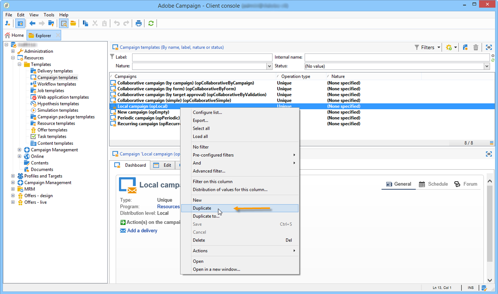

Name your campaign template and complete the available fields.

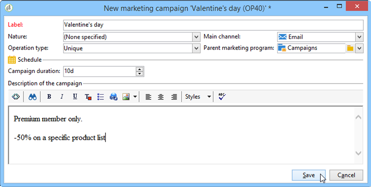

In the campaign window, click the **[!UICONTROL Edit]** tab, then click the **[!UICONTROL Advanced campaign settings...]** link. 

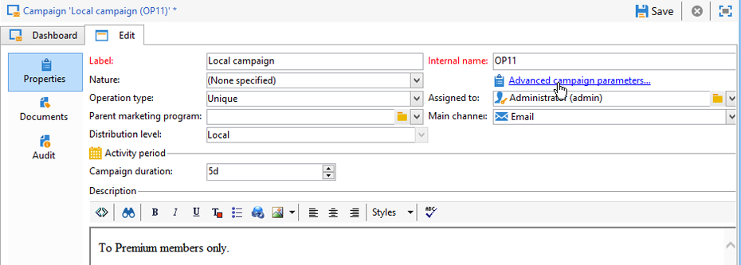

### Web interface {#web-interface}

In the **Distributed marketing** tab, you can choose the type of Web interface and specify the default values and parameters to be entered when a local entity places an order.

The web interface corresponds to a form to be filled in by the local entity when ordering the campaign.

Select the type of web interface to be applied to the campaigns created from the template:

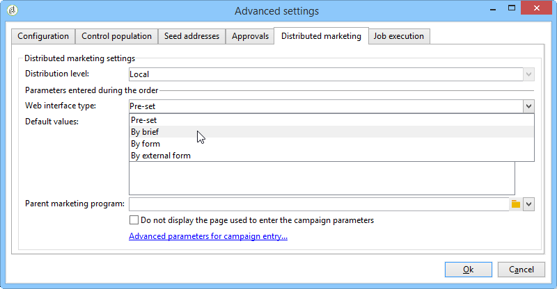

There are four types of web interfaces available:

* **[!UICONTROL By brief]** : local entity must provide a description whereby it describes the campaign configurations. Once the order has been approved, the central entity configures and executes the campaign as a whole.

  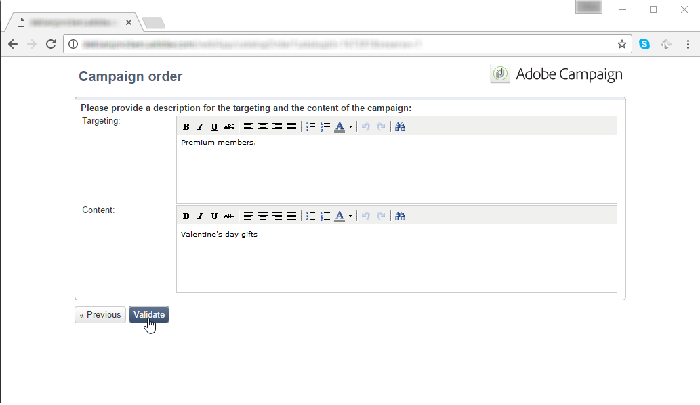

* **[!UICONTROL By form]** : local entity has access to a web form where, depending on the template used, they can edit the content, the target, its maximum size, as well as creation and extraction dates using personalization fields. Local entity can evaluate the target and preview content from this web form.

  

  The form offered is specified in a web application that must be selected in a drop-down list from the **[!UICONTROL web Interface]** field in the template's **[!UICONTROL Advanced campaign settings...]** link. Refer to [Creating a local campaign (by form)](examples.md#creating-a-local-campaign--by-form-).

  >[!NOTE]
  >
  >The web application used in this example is an example. You must create a specific web app to be able to use a form. Refer to [API](../../configuration/using/about-web-services.md).

  

* **[!UICONTROL By external form]** : local entity has access to campaign parameters in its extranet (not Adobe Campaign). These parameters are identical to those of a **local campaign (by form)**.
* **[!UICONTROL Pre-set]** : local entity orders campaign using the default form, without localizing it.

  

### Default values {#default-values}

Select the **[!UICONTROL Default values]** to be completed by local entities. For example:

* contact and extraction dates,
* target characteristics (age segment, etc.).

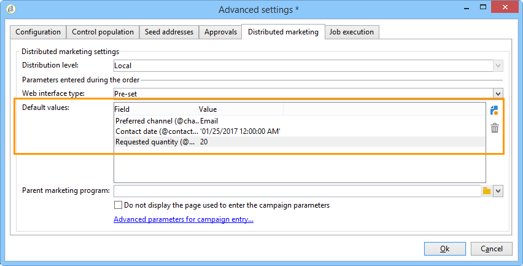

Complete the **[!UICONTROL Parent marketing program]** and **[!UICONTROL Charge]** fields.

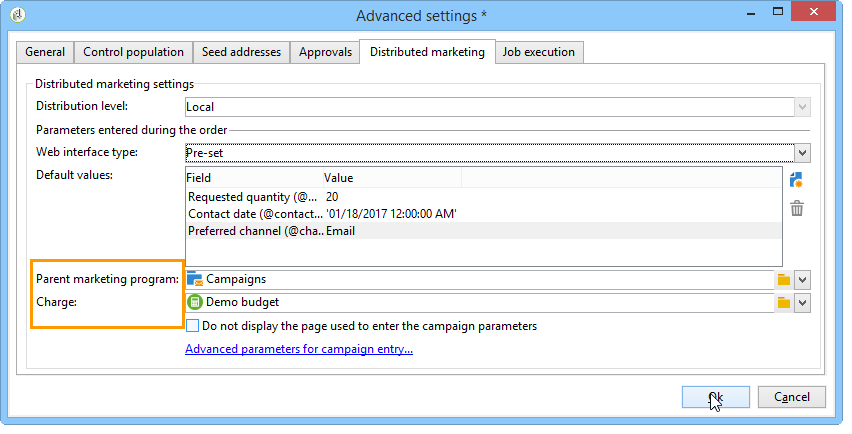

### Approvals {#approvals}

From the **[!UICONTROL Advanced parameters for campaign entry]** link, you can specify the maximum number of reviewers.

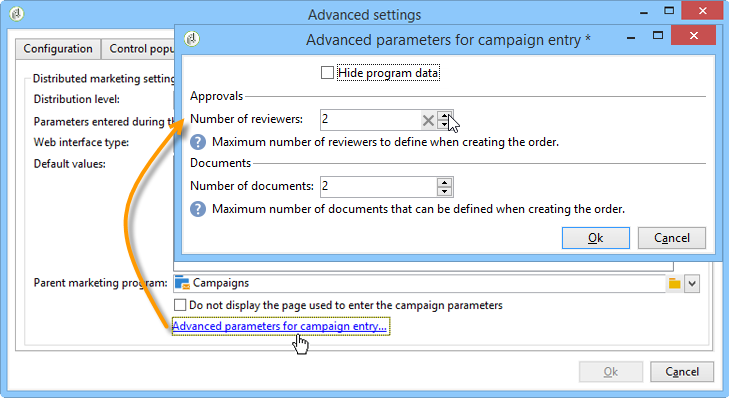

Reviewers will be entered by the local entity when ordering the campaign.

If you do not wish to name reviewers for a campaign, enter 0.

### Documents {#documents}

You can allow local entity operators to link documents (text files, spreadsheets, images, campaign descriptions, etc.) to the local campaign when creating the order. The **[!UICONTROL Advanced parameters for campaign entry...]** link lets you restrict the number of documents. To do this, simply enter the maximum number allowed in the **[!UICONTROL Number of documents]** field.

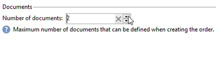

When ordering a campaign package, the form suggests linking as many documents as indicated in the corresponding field in the template.

If you do not wish to display a document upload field, enter **[!UICONTROL 0]** in the **[!UICONTROL Number of documents]** field.

>[!NOTE]
>
>The **[!UICONTROL Advanced parameters for campaign entry]** can be deactivated by checking **[!UICONTROL Do not display the page used to enter the campaign parameters]**.

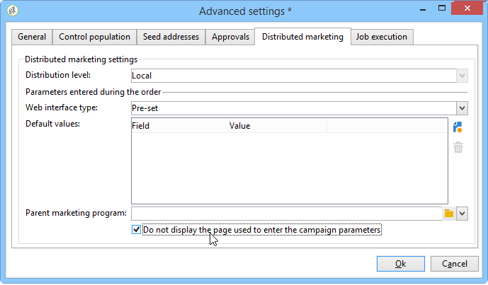

### Workflow {#workflow}

In the **[!UICONTROL Targeting and workflows]** tab, create the campaign workflow that collects the **[!UICONTROL Default values]** specified in the **[!UICONTROL Advanced campaign settings...]** and creates the deliveries.

Double click the **[!UICONTROL Query]** activity to configure it according to the specified **[!UICONTROL Default values]**.

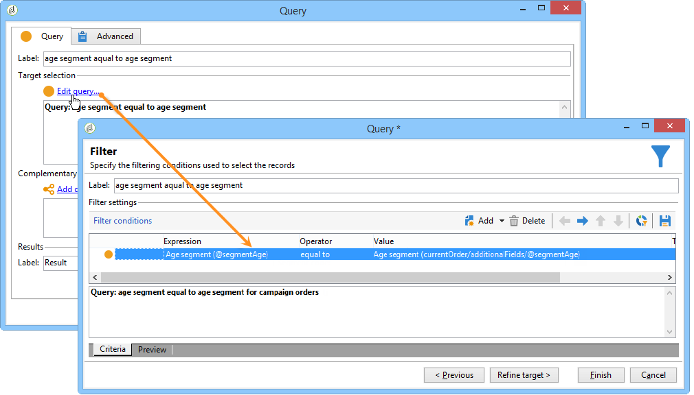

### Delivery {#delivery}

In the **[!UICONTROL Audit]** tab, click the **[!UICONTROL Detail...]** icon to view the **[!UICONTROL Scheduling]** for the selected delivery.

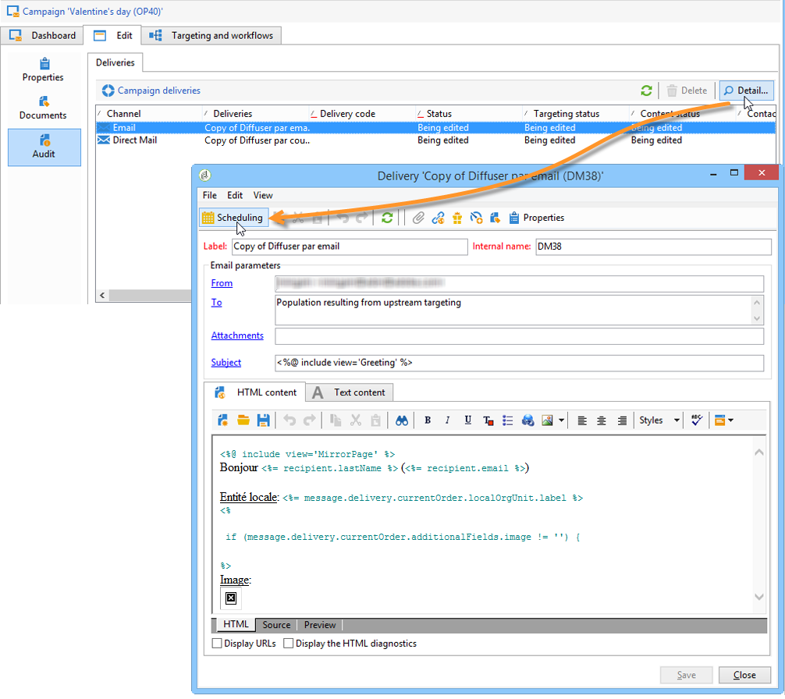

The **[!UICONTROL Scheduling]** icon lets you configure the delivery's contact and execution date.

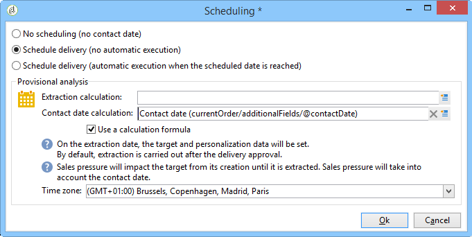

If necessary, configure the maximum size of the delivery:

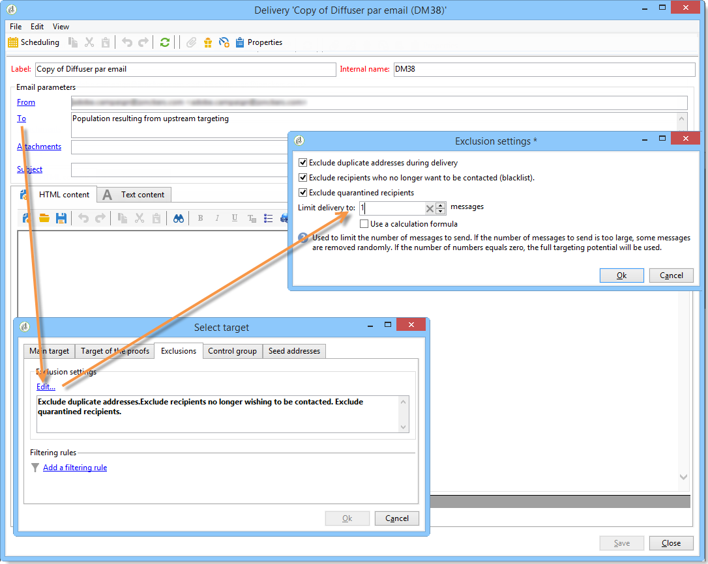

Locate your delivery's HTML. For example, in **[!UICONTROL Delivery > Current order > Additional fields]**, use the **[!UICONTROL Age segment]** field to locate the delivery according to the age of the target.

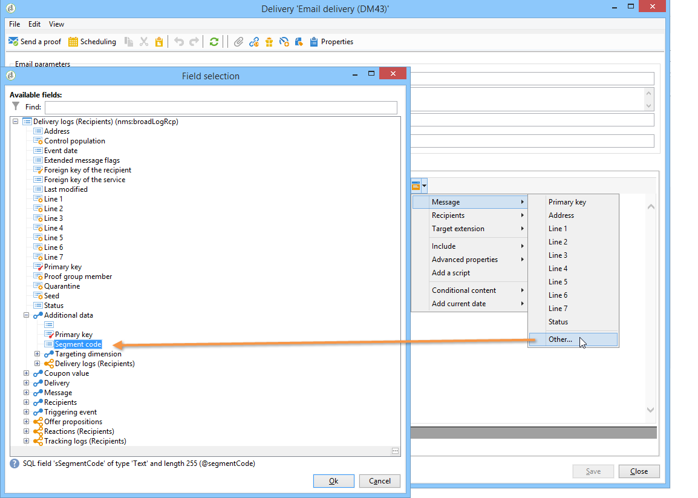

Save your campaign template. You can now use it from the **[!UICONTROL Campaign packages]** view in the **[!UICONTROL Campaigns]** tab, by clicking the **[!UICONTROL Create]** button.

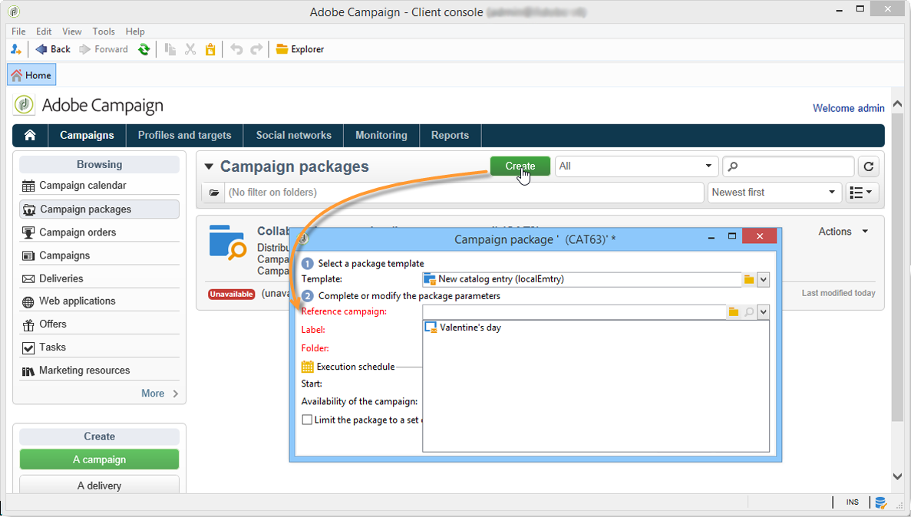

>[!NOTE]
>
>Campaign templates and their general configuration are detailed in [Campaign templates](../../campaign/using/marketing-campaign-templates.md#campaign-templates).

## Creating the campaign package {#creating-the-campaign-package}

For the campaign template to become available to local entities, it needs to be added to the list. To do this, the central agency needs to create a new package.

Apply the following steps:

1. In the **[!UICONTROL Navigation]** section on the **Campaigns** page, click the **[!UICONTROL Campaign packages]** link.
1. Click the **[!UICONTROL Create]** button.

   

1. The section above the window lets you select the [previously](#creating-a-local-campaign-template) specified campaign package template.

   By default, the **[!UICONTROL New local campaign package (localEmpty)]** template is used for local campaigns.

1. Specify the label, folder and execution schedule for the campaign package.

### Dates {#dates}

The start and end dates define the campaign's visibility period in the list of campaign packages.

The availability date is the date on which the campaign will become available for local entities (to order).

>[!CAUTION]
>
>If a local entity does not reserve the campaign before the deadline, it will not be able to use it.

This information is found in the notification message sent to local agencies, as shown below:

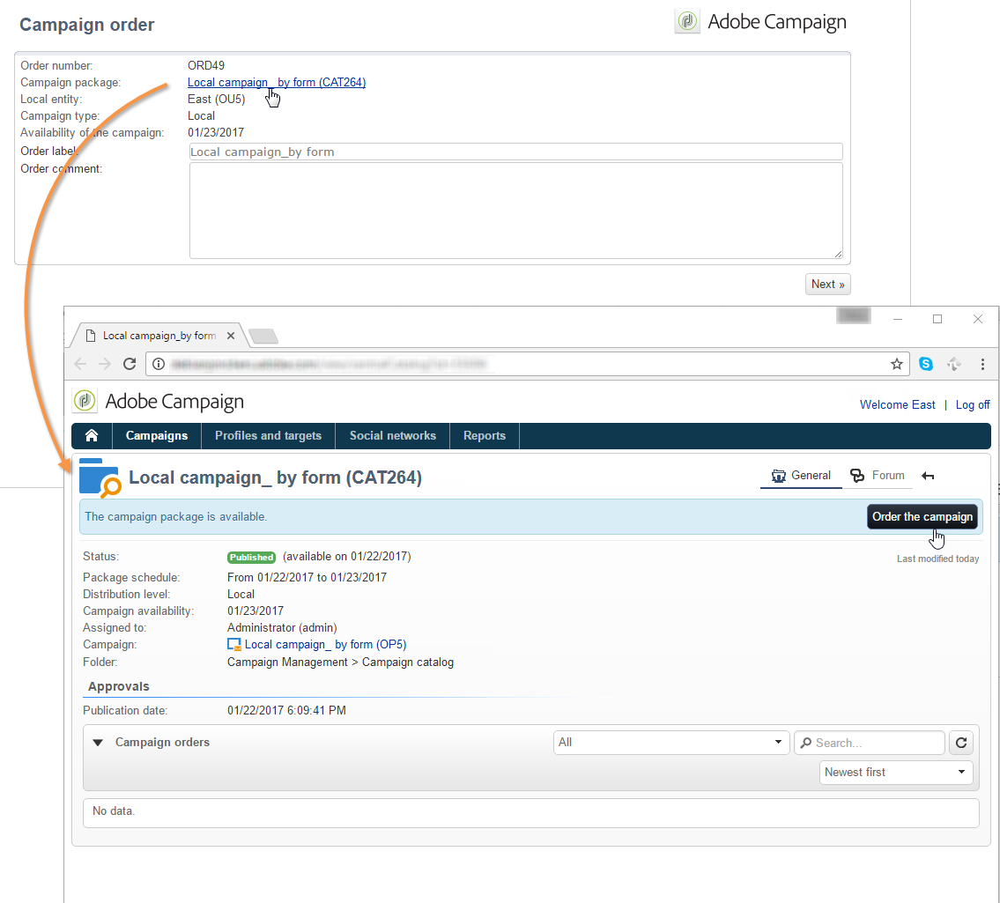

### Audience {#audience}

For a local campaign, the central entity can specify the local entities involved by checking the **[!UICONTROL Limit the package to a set of local entities]**.

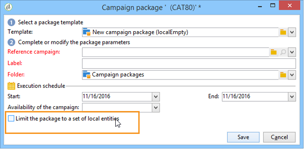

### Additional settings {#additional-settings}

Once the package is saved, the central entity can edit it from the **[!UICONTROL Edit]** tab.

From the **[!UICONTROL General]** tab, the central entity can:

* configure the campaign package reviewer(s) from the **[!UICONTROL Approval parameters...]** link,
* review the execution schedule,
* add or delete local entities.

>[!NOTE]
>
>By default, each entity can order a **local campaign** only once.
>   
>Check the **[!UICONTROL Enable multiple creation]** option to allow several local campaigns to be created from the campaign package.

### Notifications {#notifications}

When a campaign becomes available or when the registration deadline is reached, a message is sent to the operators of the local notification group. For more on this, refer to [Organizational entities](about-distributed-marketing.md#organizational-entities).

## Ordering a campaign {#ordering-a-campaign}

Campaign packages become accessible to local entities once they are approved and their implementation period has started. Local entities receive an email letting them know that a new campaign package is available (as soon as its availability date is reached).

>[!NOTE]
>
>If some local entities were specified when creating the campaign package, they will be the only ones to receive a notification. If no local entity was specified, all local entities will receive a notification.

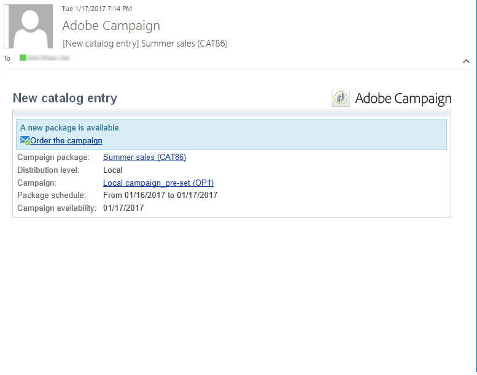

To use a campaign offered by the central entity, the local entity must order it.

To order a campaign:

1. Click **[!UICONTROL Order campaign]** in the notification message, or the corresponding button in Adobe Campaign.

   Enter your ID and password to order the campaign. The interface is made up of a set of pages defined in a web application.

   >[!NOTE]
   >
   >Web applications are detailed in [this section](../../web/using/about-web-applications.md).

1. Enter the necessary information in the first page (order label and comment) and click **[!UICONTROL Next]**.

   

1. Complete the available parameters and approve the order.

1. A notification is sent to the manager of the organizational entity to which the local entity belongs, to approve this order.

   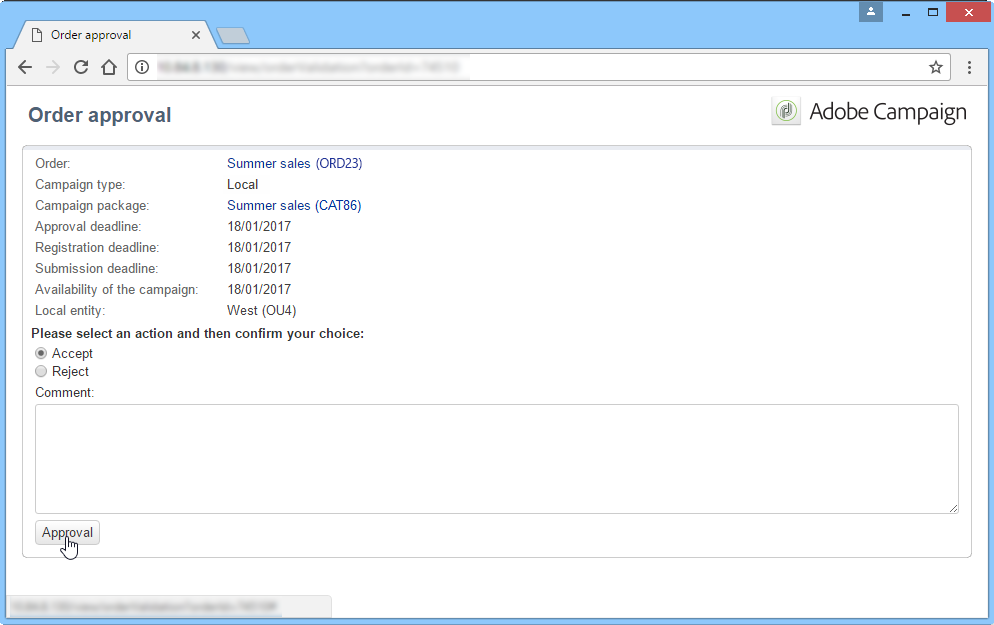

1. The information is returned to the local and central entities. While local entities can only view their own orders, the central entity can view all orders by any local entity, as shown below:

   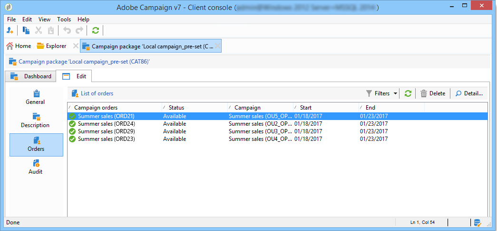

   Operators can display order details:

   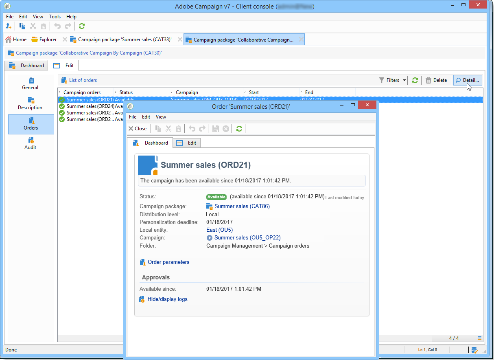

   The **[!UICONTROL Edit]** tab contains information entered by the local entity when ordering the campaign.

   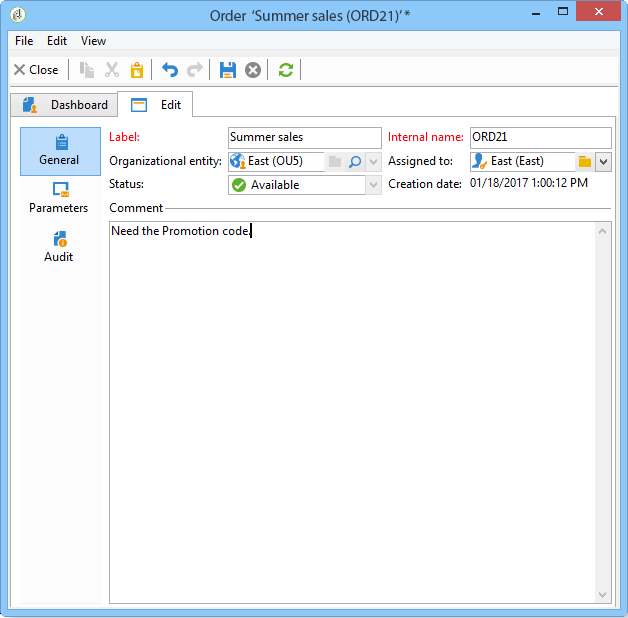

1. The order must be approved by the central entity to be finalized. 

   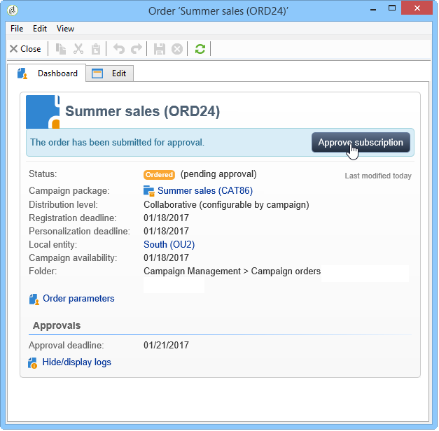

   For more on this, refer to the [Approval process](#approval-process) section.

1. The local operator is then notified that the campaign is available: campaign availability can be found in the list of campaign packages within the **Campaigns** tab. The campaign can then be used. For more on this, refer to [Accessing campaigns](accessing-campaigns.md).

   The **[!UICONTROL Start targeting with order approval]** option lets the local entity run the campaign as soon as the order has been approved.

   

## Approving an order {#approving-an-order}

To confirm a campaign order, the central entity must approve it.

The **[!UICONTROL Campaign orders]** overview, accessed via the **Campaigns** tab lets you view the status of campaign orders and approve them.

>[!NOTE]
>
>Local entities can make changes to the order until it is approved.

### Approval process {#approval-process}

#### Email notification {#email-notification}

When a campaign is ordered by a local entity, its reviewers are notified by email, as shown below:

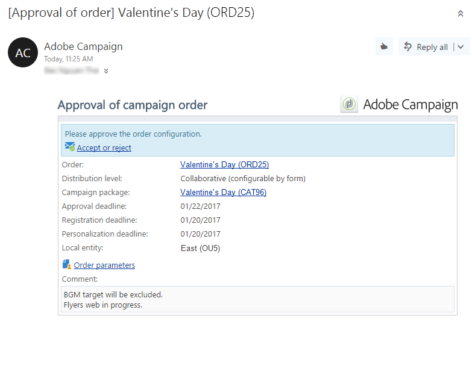

>[!NOTE]
>
>Selecting reviewers is presented in the [Reviewers](#reviewers) section. They can accept or reject the order.

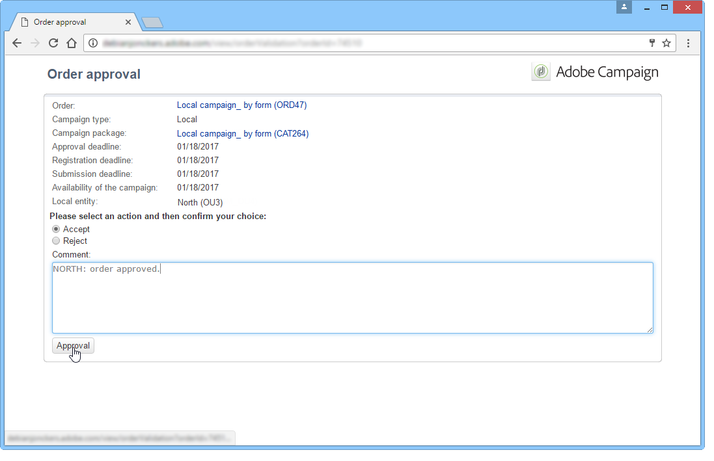

#### Approving via the Adobe Campaign console {#approving-via-the-adobe-campaign-console}

The order may also be approved via the console, in the campaign order overview. To approve an order, select it and click **[!UICONTROL Approve the order]**.

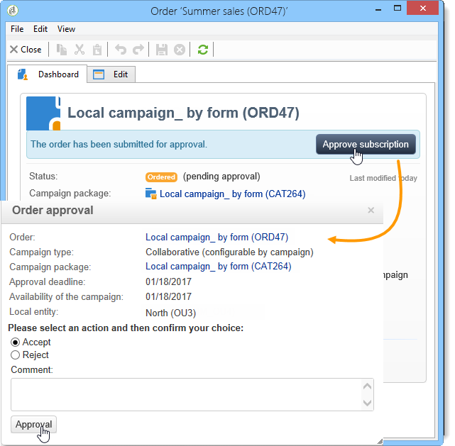

>[!NOTE]
>
>The campaign can still be edited and reconfigured up until the campaign availability date. Local entities can also reject the campaign by clicking the **[!UICONTROL Cancel]** button.

#### Creating a campaign {#creating-a-campaign}

Once a campaign order is approved, it may be configured and executed by the local entity. 

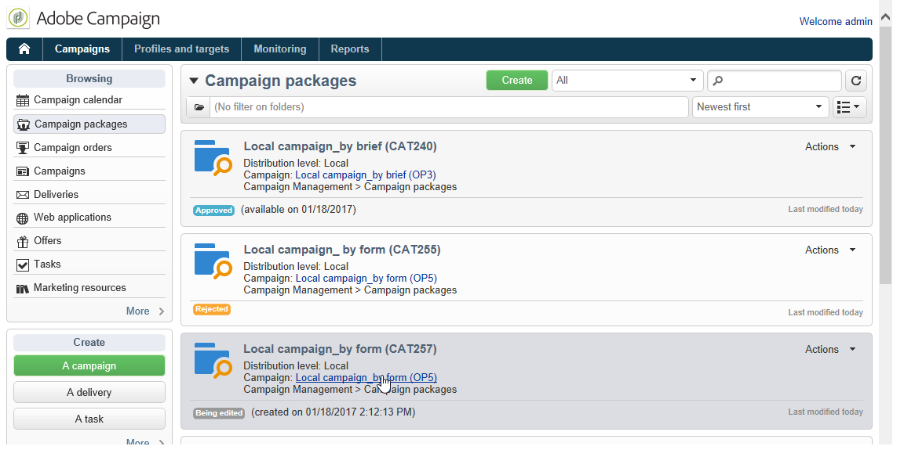

For more on this, refer to [Accessing campaigns](accessing-campaigns.md).

### Rejecting an approval {#rejecting-an-approval}

The operator in charge of approval can reject an order or campaign package. 

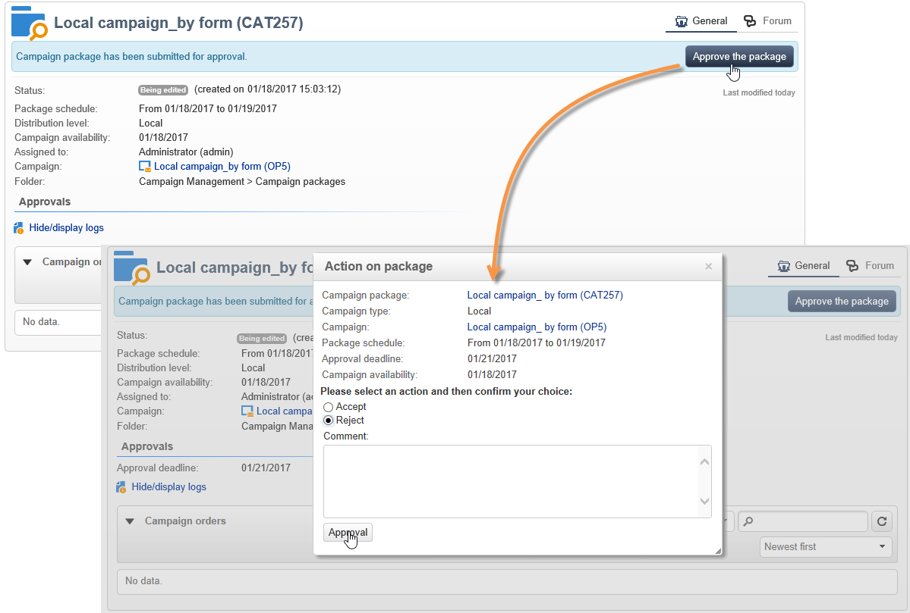

If the reviewer rejects an order, the relevant notification is automatically sent to the local entities concerned: it displays the comment entered by the operator that rejected the approval.

Information is displayed on the list of campaign packages page or on the campaign order page. If they have access to the Adobe Campaign console, local entities are informed of this rejection.

They can view the related comment in the campaign package's **[!UICONTROL Edit]** tab.

### Reviewers {#reviewers}

Every time an approval is required, reviewers are notified by email.

For each local entity, reviewers are selected for campaign order approval and campaign approval. For more information on selecting local reviewers, refer to [Organizational entities](about-distributed-marketing.md#organizational-entities).

>[!NOTE]
>
>For this selection to be possible, order approval must not yet be effective.

### Canceling an order {#canceling-an-order}

The central agency can cancel an order using the **[!UICONTROL Delete]** button, located on the order dashboard.

This cancels the campaign in the **[!UICONTROL Campaign orders]** view.
