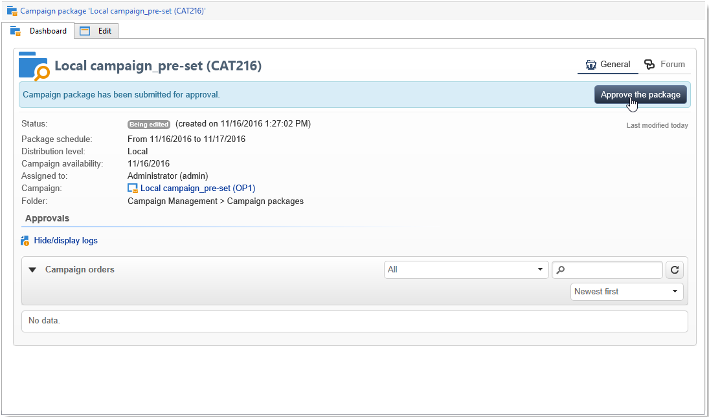
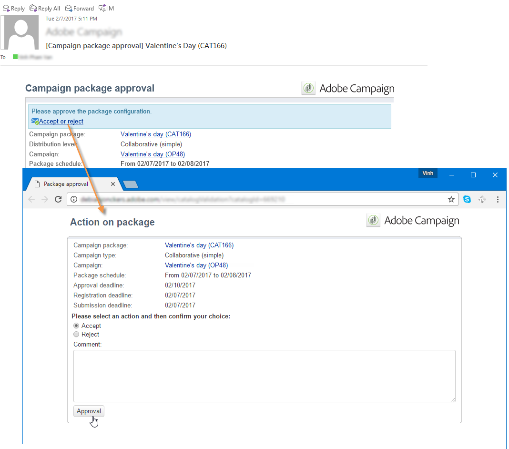
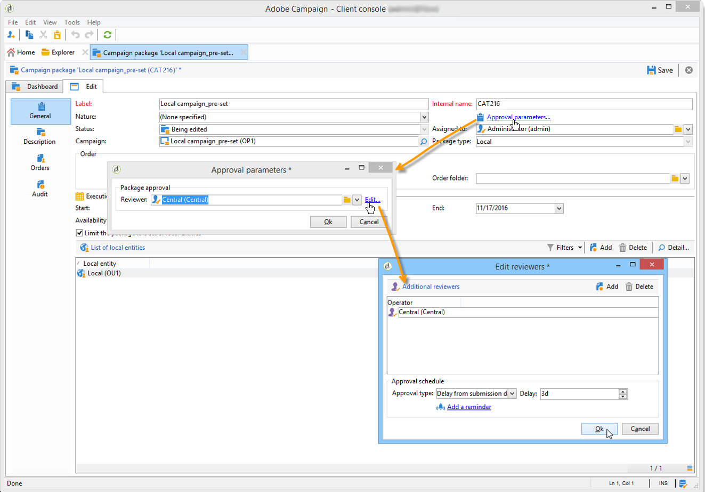
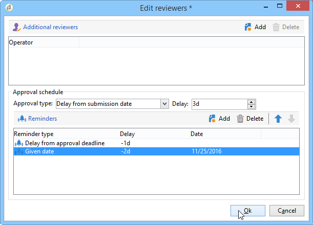
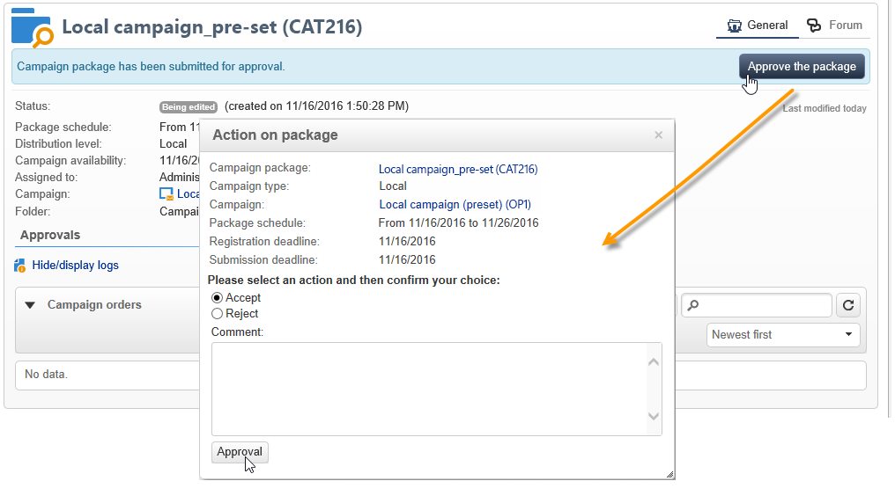

# Publishing the campaign package{#publishing-the-campaign-package}

Central entity operators publish campaigns they wish to offer to local entities in the **[!UICONTROL list of campaign packages]**.

Before they can be published in the campaign package list, the campaign packages have to be approved by the central entity. To do this, you can specify a reviewer or group of reviewers via the **[!UICONTROL Approval parameters]** link in the campaign package.

## Assigning a reviewer {#assigning-a-reviewer}

To select the reviewer, click the **[!UICONTROL Approval parameters]** link from the campaign package and choose the relevant reviewer from the drop-down list.

You may then begin the approval process by clicking **[!UICONTROL Submit for approval]**. 

A notification message is then sent to the reviewer to confirm the availability of this campaign package. The message contains a link to accept or reject the approval via web access.

>[!NOTE]
>
>At the organizational entity level, you may also specify reviewers to approve orders. For more on this, refer to [Organizational entities](about-distributed-marketing.md#organizational-entities).

## Adding other reviewers {#adding-other-reviewers}

You can add other reviewers from the **[!UICONTROL Edit...]** link, found in the campaign package's **[!UICONTROL Approval parameters...]** tab. 

## Approval periods {#approval-periods}

By default, reviewers are given three days from the submission date to process the approval.

Within the edit reviewers window, you can also set reminders to send one or multiple messages if a campaign package has not been approved. To do this, click the **[!UICONTROL Add reminder]** link, then the **[!UICONTROL Add]** button.

Reminders can be sent out either on a given date and/or **x** days after the submission date. The type of reminder can be configured in the first column of the table of reminders. In the example below, the reviewers will receive a reminder message on the on the 29/01/2014, i.e. two days before the date selected in the **[!UICONTROL Date]** column, and a second reminder one day before the end of the approval period, i.e. two days after the submission for approval date.

Once it is defined and the package has been submitted for approval, the execution schedule is displayed in the **[!UICONTROL Audit]** tab. It shows the processing deadline calculated based on previous configuration, as well as the dates of all configured reminders.

## Approving via the Adobe Campaign console {#approving-via-the-adobe-campaign-console}

If no reviewer has been specified or if none of the notified operators have approved the package, the **[!UICONTROL Approve the package]** button lets you proceed directly to the approval from the campaign package **[!UICONTROL Dashboard]** or from the packages overview.

After approval, the campaign is published, added to the list and, as soon as its availability date is reached, local entities may use it. If the local entities were specified when creating the campaign, a message is sent to the operators in the notification group to let them know that the campaign is available. If no entity was specified beforehand, the campaign is available to all local entities, by default. For more on this, refer to [Organizational entities](about-distributed-marketing.md#organizational-entities).
