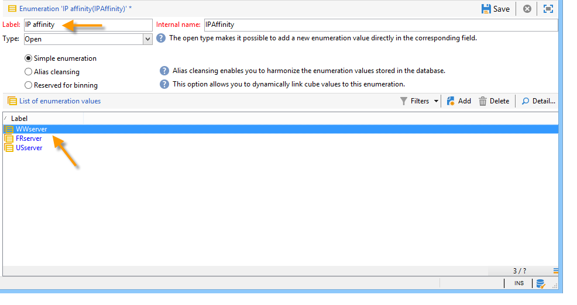
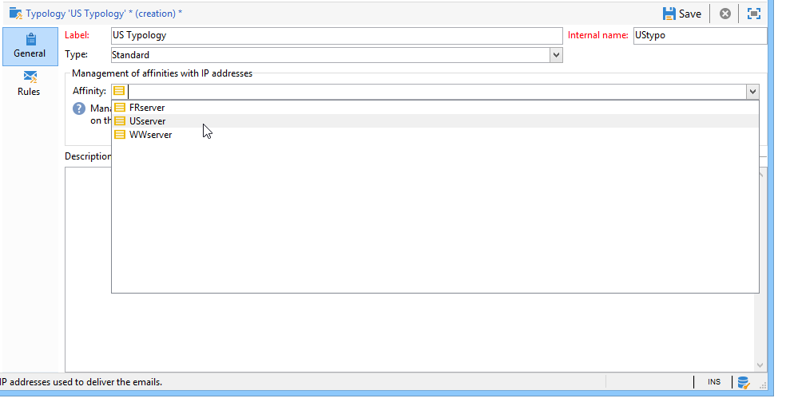

# Configure delivery settings {#delivery-settings}

The delivery parameters must be configured in the **serverConf.xml** folder.

* **DNS configuration**: specify the delivery domain and the IP addresses (or host) of the DNS servers used to respond to MX-type DNS queries made by the MTA module from the **`<dnsconfig>`** onwards.

  >[!NOTE]
  >
  >The **nameServers** parameter is essential for an installation in Windows. For an installation in Linux, it must be left empty.

  ```
  <dnsConfig localDomain="domain.com" nameServers="192.0.0.1,192.0.0.2"/>
  ```

You can also carry out the following configurations depending on your needs and settings: configure a [SMTP relay](#smtp-relay), adapt the number of [MTA child processes](#mta-child-processes), [Manage outbound SMTP traffic](#managing-outbound-smtp-traffic-with-affinities).

## SMTP relay {#smtp-relay}

The MTA module acts as a native mail transfer agent for SMTP broadcast (port 25).

It is, however, possible to replace it by a relay server if your security policy requires it. In that case, the global throughput will be the relay one (provided that the relay server throughput is inferior to the Adobe Campaign one).

In this case, these parameters are set by configuring the SMTP server in the **`<relay>`** section. You must specify the IP address (or host) of the SMTP server used to transfer mail and its associated port (25 by default).

```
<relay address="192.0.0.3" port="25"/>
```

>[!IMPORTANT]
>
>This operating mode implies serious limitations on deliveries, as it can greatly reduce the throughput because of the relay server intrinsic performances (latency, bandwith...). Moreover, the capacity to qualify synchronous delivery errors (detected by analyzing SMTP traffic) will be limited, and the sending will not be possible if the relay server is not available.

## MTA child processes {#mta-child-processes}

It is possible to control the number of child processes (maxSpareServers by default 2) in order to optimize broadcast performance according to the CPU power of the servers and the available network resources. This configuration is to be made in the **`<master>`** section of MTA configuration on each individual computer.

```
<master dataBasePoolPeriodSec="30" dataBaseRetryDelaySec="60" maxSpareServers="2" minSpareServers="0" startSpareServers="0">
```

Also refer to [Email sending optimization](../../installation/using/email-deliverability.md#email-sending-optimization).

## Manage outbound SMTP traffic with affinities {#managing-outbound-smtp-traffic-with-affinities}

>[!IMPORTANT]
>
>The affinity configuration needs to be consistent from one server to another. We recommend that you contact Adobe for affinity configuration, as configuration changes should be replicated on all application servers running the MTA.

You can improve outbound SMTP traffic through affinities with IP addresses.

To do this, apply the following steps:

1. Enter the affinities in the **`<ipaffinity>`** section of the **serverConf.xml** file.

   One affinity can have several different names: to separate them, use the **;** character.

   Example:

   ```
    IPAffinity name="mid.Server;WWserver;local.Server">
             <IP address="XX.XXX.XX.XX" heloHost="myserver.us.campaign.net" publicId="123" excludeDomains="neo.*" weight="5"/
   ```

   To view the relevant parameters, refer to the **serverConf.xml** file.

1. To enable affinity selection in the drop-down lists, you need to add the affinity name(s) in the **IPAffinity** enumeration.

   

   >[!NOTE]
   >
   >Enumerations are detailed in [this document](../../platform/using/managing-enumerations.md).

   You can then select the affinity to be used, as shown below for typologies:

   

   >[!NOTE]
   >
   >You can also refer to [Delivery server configuration](../../installation/using/email-deliverability.md#delivery-server-configuration).

**Related topics**
* [Technical email configurations](email-deliverability.md)
* [Using MX servers with Campaign](using-mx-servers.md)
* [Configure email BCC](email-archiving.md)
